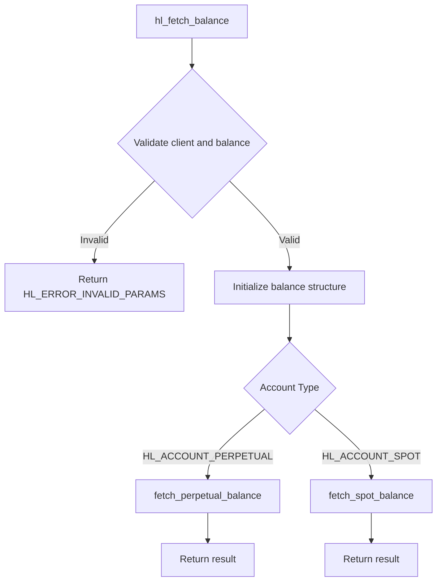
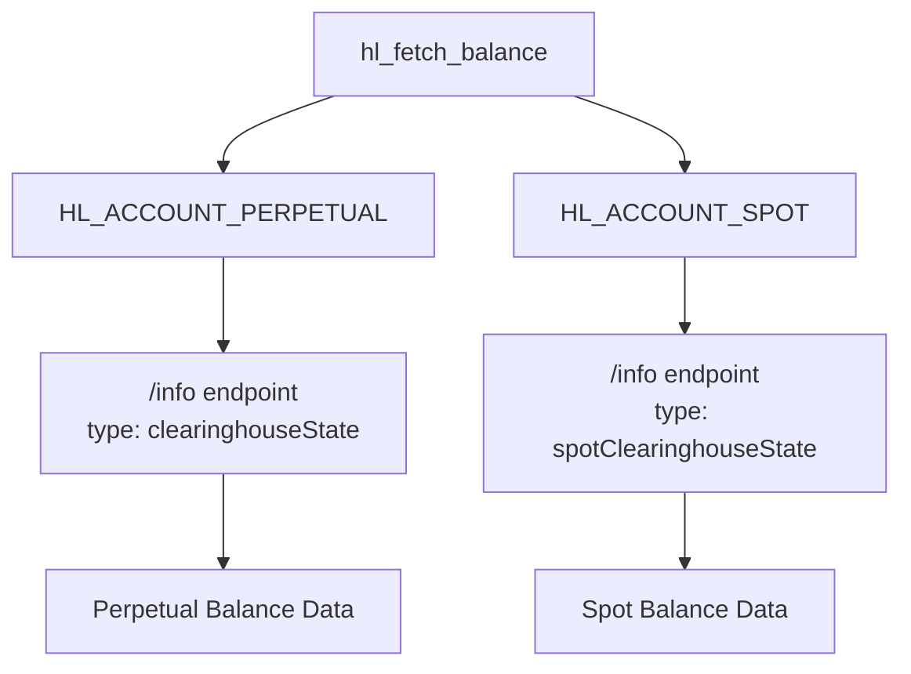
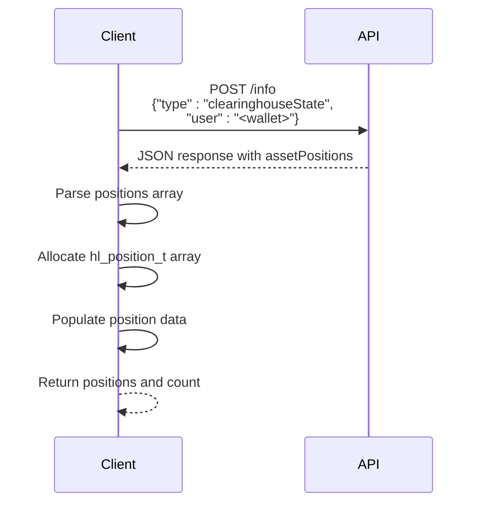
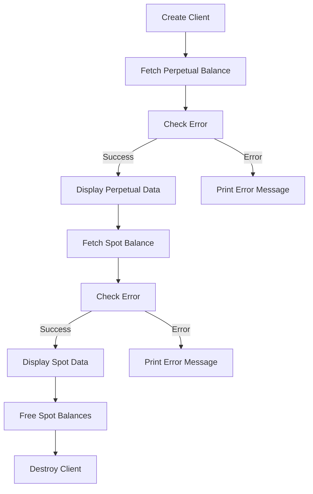

# Account Information API

<cite>
**Referenced Files in This Document**   
- [account.c](file://src/account.c)
- [hl_account.h](file://include/hl_account.h)
- [hl_types.h](file://include/hl_types.h)
- [hl_internal.h](file://include/hl_internal.h)
- [hyperliquid.h](file://include/hyperliquid.h)
- [simple_balance.c](file://examples/simple_balance.c)
- [client.c](file://src/client.c)
- [transfers.c](file://src/transfers.c)
- [trades.c](file://src/trades.c)
- [orders.c](file://src/orders.c)
</cite>

## Table of Contents
1. [Introduction](#introduction)
2. [Core Balance API](#core-balance-api)
3. [Account Types and Endpoints](#account-types-and-endpoints)
4. [Balance Data Structure](#balance-data-structure)
5. [Related Account Functions](#related-account-functions)
6. [Example Usage](#example-usage)
7. [Error Handling](#error-handling)
8. [Thread Safety](#thread-safety)
9. [Memory Management](#memory-management)
10. [Conclusion](#conclusion)

## Introduction
The Account Information API provides functions to retrieve user account data from the Hyperliquid exchange. This document focuses on the `hl_fetch_balance()` function and related account information retrieval functions, detailing their parameters, behavior, data structures, and usage patterns. The API supports both perpetual and spot trading accounts, with distinct data models and retrieval mechanisms for each account type.

## Core Balance API

The primary function for retrieving account balance information is `hl_fetch_balance()`, which serves as a dispatcher to account-type-specific implementations.



**Diagram sources**
- [account.c](file://src/account.c#L249-L261)

**Section sources**
- [account.c](file://src/account.c#L249-L261)
- [hl_account.h](file://include/hl_account.h#L134-L138)

### Function Parameters
The `hl_fetch_balance()` function accepts three parameters:

- `client`: Pointer to the `hl_client_t` instance containing authentication and connection information
- `type`: Account type enumeration specifying whether to fetch perpetual or spot balance
- `balance`: Pointer to an `hl_balance_t` structure where the result will be stored

The function first validates that both `client` and `balance` parameters are non-null, returning `HL_ERROR_INVALID_PARAMS` if either is null. It then initializes the balance structure by zeroing its memory before delegating to the appropriate account-type-specific function.

## Account Types and Endpoints

The API distinguishes between two account types through the `hl_account_type_t` enumeration:

```c
typedef enum {
    HL_ACCOUNT_PERPETUAL,    /**< Perpetual/swap account */
    HL_ACCOUNT_SPOT          /**< Spot account */
} hl_account_type_t;
```

**Section sources**
- [hl_account.h](file://include/hl_account.h#L52-L72)

### Perpetual Account
When `HL_ACCOUNT_PERPETUAL` is specified, the function calls `fetch_perpetual_balance()`, which:
- Uses the endpoint `/info` with a request body containing `{"type":"clearinghouseState","user":"<wallet>"}` 
- Retrieves margin-based trading data including account value, margin usage, and notional positions
- Populates perpetual-specific fields in the balance structure

### Spot Account
When `HL_ACCOUNT_SPOT` is specified, the function calls `fetch_spot_balance()`, which:
- Uses the endpoint `/info` with a request body containing `{"type":"spotClearinghouseState","user":"<wallet>"}`
- Retrieves wallet-based spot balances for various cryptocurrencies
- Allocates and populates an array of `hl_spot_balance_t` structures



**Diagram sources**
- [account.c](file://src/account.c#L30-L144)
- [account.c](file://src/account.c#L149-L244)

## Balance Data Structure

The `hl_balance_t` structure contains fields for both perpetual and spot account data, with appropriate fields populated based on the account type.

```c
typedef struct {
    hl_account_type_t type;  /**< Account type */
    
    // Perpetual account fields
    double account_value;    /**< Total account value in USDC */
    double total_margin_used;/**< Total margin used */
    double total_ntl_pos;    /**< Total notional position value */
    double total_raw_usd;    /**< Total raw USD */
    double withdrawable;     /**< Withdrawable amount */
    
    // Cross margin summary
    double cross_account_value;
    double cross_margin_used;
    double cross_maintenance_margin_used;
    
    // Spot balances (only if type == SPOT)
    hl_spot_balance_t* spot_balances;
    size_t spot_balance_count;
    
    uint64_t timestamp;      /**< Response timestamp */
} hl_balance_t;
```

**Section sources**
- [hl_account.h](file://include/hl_account.h#L52-L72)

### Spot Balance Structure
For spot accounts, the `hl_spot_balance_t` structure provides detailed information about individual cryptocurrency balances:

```c
typedef struct {
    char coin[32];           /**< Coin symbol (e.g., "USDC", "BTC") */
    double total;            /**< Total balance */
    double hold;             /**< Amount on hold (in open orders) */
    double available;        /**< Available balance (total - hold) */
} hl_spot_balance_t;
```

The `available` field is calculated as `total - hold`, representing the amount that can be immediately traded or withdrawn.

## Related Account Functions

The API provides several related functions for retrieving additional account information.

### Position Retrieval
The `hl_fetch_positions()` function retrieves all open perpetual positions:



**Diagram sources**
- [account.c](file://src/account.c#L450-L540)
- [hl_account.h](file://include/hl_account.h#L162-L166)

### Trade History
The `hl_fetch_my_trades()` function retrieves the user's trade history:

```c
hl_error_t hl_fetch_my_trades(hl_client_t* client,
                             const char* symbol,
                             const char* since,
                             uint32_t limit,
                             hl_trades_t* trades);
```

This function uses the `userFills` endpoint to retrieve trade data, parsing the JSON response into an array of `hl_trade_t` structures.

**Section sources**
- [trades.c](file://src/trades.c#L17-L99)
- [hyperliquid.h](file://include/hyperliquid.h#L471-L475)

### Deposit and Withdrawal History
The API includes stub functions for retrieving deposit and withdrawal history:

```c
hl_error_t hl_fetch_deposits(hl_client_t* client,
                            const char* currency,
                            const char* since,
                            uint32_t limit,
                            hl_transfers_t* deposits);

hl_error_t hl_fetch_withdrawals(hl_client_t* client,
                               const char* currency,
                               const char* since,
                               uint32_t limit,
                               hl_transfers_t* withdrawals);
```

These functions are currently implemented as stubs that return empty results, with comments indicating they require wallet integration for full functionality.

**Section sources**
- [transfers.c](file://src/transfers.c#L36-L82)
- [hyperliquid.h](file://include/hyperliquid.h#L584-L604)

### Order History
The API provides functions to retrieve both open and closed orders:

```c
hl_error_t hl_fetch_open_orders(hl_client_t* client,
                               const char* symbol,
                               const char* since,
                               uint32_t limit,
                               hl_orders_t* orders);

hl_error_t hl_fetch_closed_orders(hl_client_t* client,
                                 const char* symbol,
                                 const char* since,
                                 uint32_t limit,
                                 hl_orders_t* orders);
```

Open orders are retrieved using the `frontendOpenOrders` endpoint, while closed orders are filtered from the `historicalOrders` endpoint.

**Section sources**
- [orders.c](file://src/orders.c#L18-L219)
- [hyperliquid.h](file://include/hyperliquid.h#L421-L441)

## Example Usage

The `simple_balance.c` example demonstrates how to use the balance API:



**Diagram sources**
- [simple_balance.c](file://examples/simple_balance.c#L0-L87)

The example shows proper error handling, memory management, and cleanup procedures, including calling `hl_free_spot_balances()` to free the dynamically allocated spot balances array and `hl_client_destroy()` to clean up client resources.

**Section sources**
- [simple_balance.c](file://examples/simple_balance.c#L0-L87)

## Error Handling

The balance API implements comprehensive error handling for various failure scenarios:

### Input Validation
The `hl_fetch_balance()` function validates its parameters and returns `HL_ERROR_INVALID_PARAMS` if either `client` or `balance` is null.

### Network and API Errors
The underlying functions handle various error conditions:
- `HL_ERROR_NETWORK`: For HTTP communication failures
- `HL_ERROR_API`: When the API returns a non-200 status code
- `HL_ERROR_PARSE`: When JSON parsing fails
- `HL_ERROR_MEMORY`: When memory allocation fails

The functions follow a consistent pattern of cleaning up resources (freeing response data) before returning errors to prevent memory leaks.

**Section sources**
- [account.c](file://src/account.c#L30-L244)

## Thread Safety

The API ensures thread safety through the use of a mutex in the client structure:

```c
typedef struct hl_client {
    // ... other fields
    pthread_mutex_t mutex;    /**< Client mutex for thread safety */
    // ... other fields
} hl_client_t;
```

The mutex is initialized during client creation and destroyed during client cleanup. While the balance functions themselves don't explicitly lock the mutex in the provided code, the HTTP client operations they use are expected to be thread-safe, leveraging the client's internal synchronization mechanisms.

**Section sources**
- [client.c](file://src/client.c#L34-L87)
- [client.c](file://src/client.c#L89-L107)

## Memory Management

The API follows consistent memory management patterns:

### Initialization
The `hl_fetch_balance()` function initializes the balance structure by zeroing its memory:
```c
memset(balance, 0, sizeof(hl_balance_t));
```

### Dynamic Allocation
For spot balances, the function allocates memory using `calloc()`:
```c
hl_spot_balance_t* spot_balances = calloc(count, sizeof(hl_spot_balance_t));
```

### Memory Cleanup
The API provides dedicated functions to free allocated memory:
- `hl_free_spot_balances()` frees the spot balances array
- `hl_client_destroy()` cleans up client resources including the HTTP client and mutex

The client creation function also securely zeros the private key memory before freeing it to prevent sensitive data exposure.

**Section sources**
- [account.c](file://src/account.c#L149-L244)
- [account.c](file://src/account.c#L266-L271)
- [client.c](file://src/client.c#L34-L107)

## Conclusion
The Account Information API provides a comprehensive interface for retrieving user account data from the Hyperliquid exchange. The `hl_fetch_balance()` function serves as the entry point for balance retrieval, dispatching to account-type-specific implementations for perpetual and spot accounts. The API follows consistent patterns for error handling, memory management, and thread safety, providing reliable access to account information. Related functions extend this capability to positions, trade history, and order history, creating a complete suite of account information tools for developers.