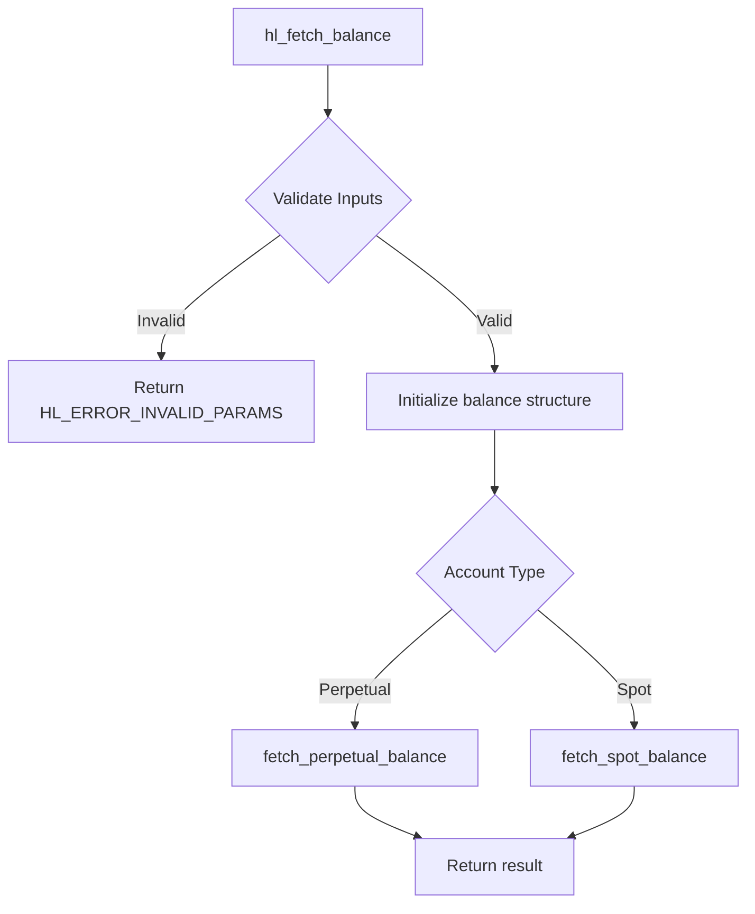
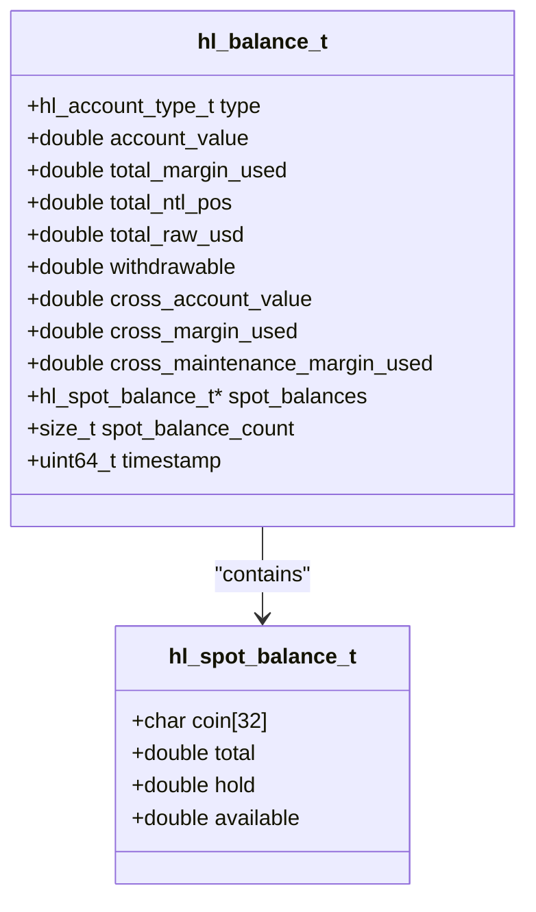
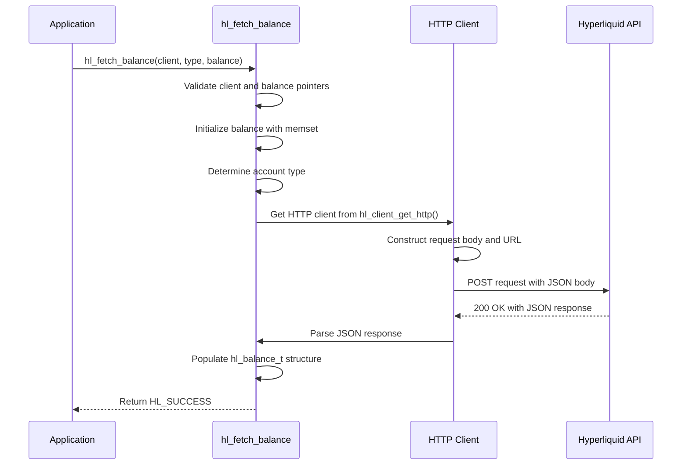
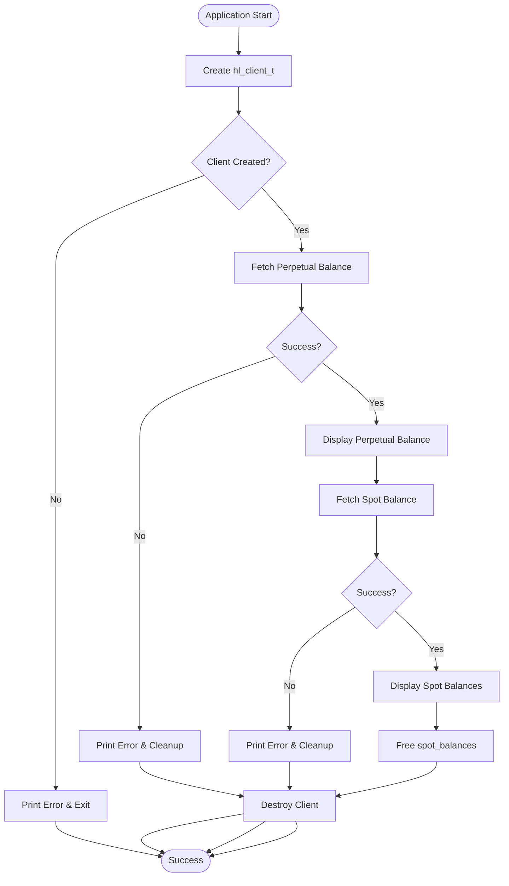
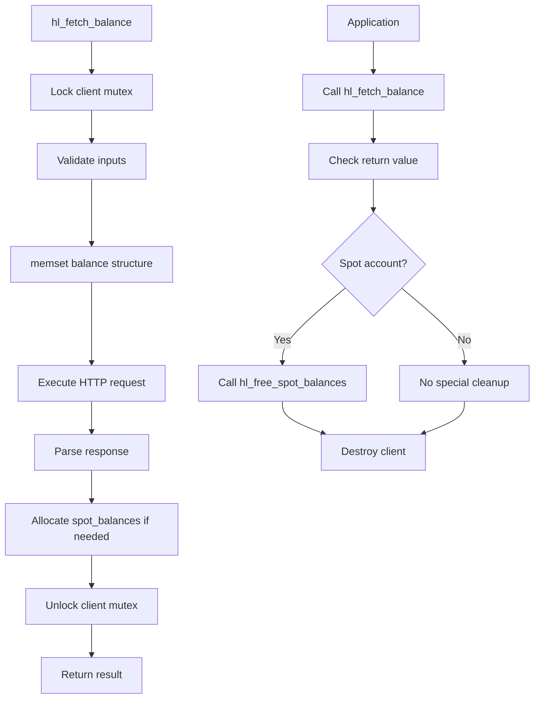

# Balance Retrieval API

<cite>
**Referenced Files in This Document**   
- [account.c](file://src/account.c)
- [hl_account.h](file://include/hl_account.h)
- [simple_balance.c](file://examples/simple_balance.c)
- [client.c](file://src/client.c)
- [client.h](file://include/hl_client.h)
- [http/client.c](file://src/http/client.c)
- [hl_http.h](file://include/hl_http.h)
</cite>

## Table of Contents
1. [Introduction](#introduction)
2. [Function Overview](#function-overview)
3. [Parameters and Return Values](#parameters-and-return-values)
4. [Balance Structure Details](#balance-structure-details)
5. [Implementation Flow](#implementation-flow)
6. [Example Usage](#example-usage)
7. [Error Handling](#error-handling)
8. [Thread Safety and Memory Management](#thread-safety-and-memory-management)
9. [HTTP Communication Pattern](#http-communication-pattern)
10. [Conclusion](#conclusion)

## Introduction
The `hl_fetch_balance()` function is a core API endpoint in the Hyperliquid C SDK for retrieving account balance information. It supports both perpetual and spot trading accounts, providing comprehensive balance data through a unified interface. This document details the function's implementation, usage patterns, error handling, and integration with the underlying HTTP client.

**Section sources**
- [account.c](file://src/account.c#L249-L261)
- [hl_account.h](file://include/hl_account.h#L134-L138)

## Function Overview
The `hl_fetch_balance()` function serves as the primary interface for retrieving account balance information from the Hyperliquid exchange. It acts as a dispatcher that routes requests to specialized internal functions based on the account type specified in the parameters. The function provides a clean, unified API for accessing both perpetual and spot account balances while handling the underlying complexity of different response formats and data structures.



**Diagram sources**
- [account.c](file://src/account.c#L249-L261)
- [account.c](file://src/account.c#L30-L144)
- [account.c](file://src/account.c#L149-L244)

**Section sources**
- [account.c](file://src/account.c#L249-L261)

## Parameters and Return Values
The `hl_fetch_balance()` function accepts three parameters:

- `client` (`hl_client_t*`): Pointer to the initialized Hyperliquid client instance containing authentication and connection information
- `type` (`hl_account_type_t`): Enum specifying the account type (HL_ACCOUNT_PERPETUAL or HL_ACCOUNT_SPOT)
- `balance` (`hl_balance_t*`): Pointer to the balance structure where results will be stored

The function returns an `hl_error_t` enum value indicating the success or failure of the operation. Possible return values include:
- `HL_SUCCESS`: Operation completed successfully
- `HL_ERROR_INVALID_PARAMS`: Invalid input parameters (null pointers)
- `HL_ERROR_NETWORK`: Network communication failure
- `HL_ERROR_API`: API returned non-200 status code
- `HL_ERROR_PARSE`: JSON response parsing failed
- `HL_ERROR_MEMORY`: Memory allocation failure

**Section sources**
- [hl_account.h](file://include/hl_account.h#L134-L138)
- [account.c](file://src/account.c#L249-L261)

## Balance Structure Details
The `hl_balance_t` structure contains comprehensive balance information with fields specific to the account type. For perpetual accounts, it includes margin-related metrics, while spot accounts contain coin-specific balances.



**Diagram sources**
- [hl_account.h](file://include/hl_account.h#L52-L72)
- [hl_account.h](file://include/hl_account.h#L42-L47)

**Section sources**
- [hl_account.h](file://include/hl_account.h#L52-L72)
- [hl_account.h](file://include/hl_account.h#L42-L47)

## Implementation Flow
The implementation follows a consistent pattern for both account types, with specialized functions handling the specific details of each account type. The flow begins with input validation, followed by HTTP request construction, execution, and response parsing.



**Diagram sources**
- [account.c](file://src/account.c#L30-L144)
- [account.c](file://src/account.c#L149-L244)
- [client.c](file://src/client.c#L189-L191)
- [http/client.c](file://src/http/client.c#L120-L167)

**Section sources**
- [account.c](file://src/account.c#L30-L271)
- [client.c](file://src/client.c#L189-L191)
- [http/client.c](file://src/http/client.c#L120-L167)

## Example Usage
The simple_balance.c example demonstrates proper usage of the hl_fetch_balance() function for both account types. The example shows error handling, resource management, and typical usage patterns.



**Diagram sources**
- [simple_balance.c](file://examples/simple_balance.c#L1-L87)

**Section sources**
- [simple_balance.c](file://examples/simple_balance.c#L1-L87)

## Error Handling
The function implements comprehensive error handling for various failure scenarios:

- **Null input validation**: Checks for null client and balance pointers, returning `HL_ERROR_INVALID_PARAMS`
- **Network failures**: Handles CURL communication errors, returning `HL_ERROR_NETWORK`
- **API errors**: Detects non-200 HTTP status codes, returning `HL_ERROR_API`
- **JSON parsing errors**: Validates JSON response structure, returning `HL_ERROR_PARSE`
- **Memory allocation**: For spot balances, checks calloc() success, returning `HL_ERROR_MEMORY`

The error handling strategy ensures that the function fails gracefully and provides meaningful error codes to the caller for appropriate recovery actions.

**Section sources**
- [account.c](file://src/account.c#L249-L261)
- [account.c](file://src/account.c#L30-L144)
- [account.c](file://src/account.c#L149-L244)
- [http/client.c](file://src/http/client.c#L120-L167)

## Thread Safety and Memory Management
The `hl_fetch_balance()` function ensures thread safety through the client's internal mutex mechanism. The function initializes the output balance structure using `memset()` to ensure all fields are properly zeroed before population, preventing undefined behavior from uninitialized memory.

For spot accounts, the function allocates memory for the `spot_balances` array using `calloc()`. This memory must be freed by the caller using the `hl_free_spot_balances()` function to prevent memory leaks. The perpetual account fields are automatically managed within the balance structure and do not require explicit freeing.



**Diagram sources**
- [account.c](file://src/account.c#L249-L261)
- [account.c](file://src/account.c#L149-L244)
- [account.c](file://src/account.c#L266-L271)

**Section sources**
- [account.c](file://src/account.c#L249-L261)
- [account.c](file://src/account.c#L266-L271)

## HTTP Communication Pattern
The function uses a consistent HTTP POST pattern to communicate with the Hyperliquid API. Both perpetual and spot balance requests use the same endpoint (`/info`) but with different request body types.

For perpetual accounts:
```json
{"type":"clearinghouseState","user":"WALLET_ADDRESS"}
```

For spot accounts:
```json
{"type":"spotClearinghouseState","user":"WALLET_ADDRESS"}
```

The request uses application/json content type and requires the wallet address, which is obtained from the client using `hl_client_get_wallet_address_old()`. The base URL is determined by the client's testnet setting, pointing to either the production or testnet API endpoint.

**Section sources**
- [account.c](file://src/account.c#L30-L144)
- [account.c](file://src/account.c#L149-L244)
- [account.c](file://src/account.c#L21-L25)

## Conclusion
The `hl_fetch_balance()` function provides a robust and efficient interface for retrieving account balance information from the Hyperliquid exchange. Its design separates concerns between account types while maintaining a consistent API, handles errors comprehensively, and manages memory appropriately. The function's integration with the HTTP client and JSON parsing infrastructure demonstrates a well-structured approach to API communication in C.