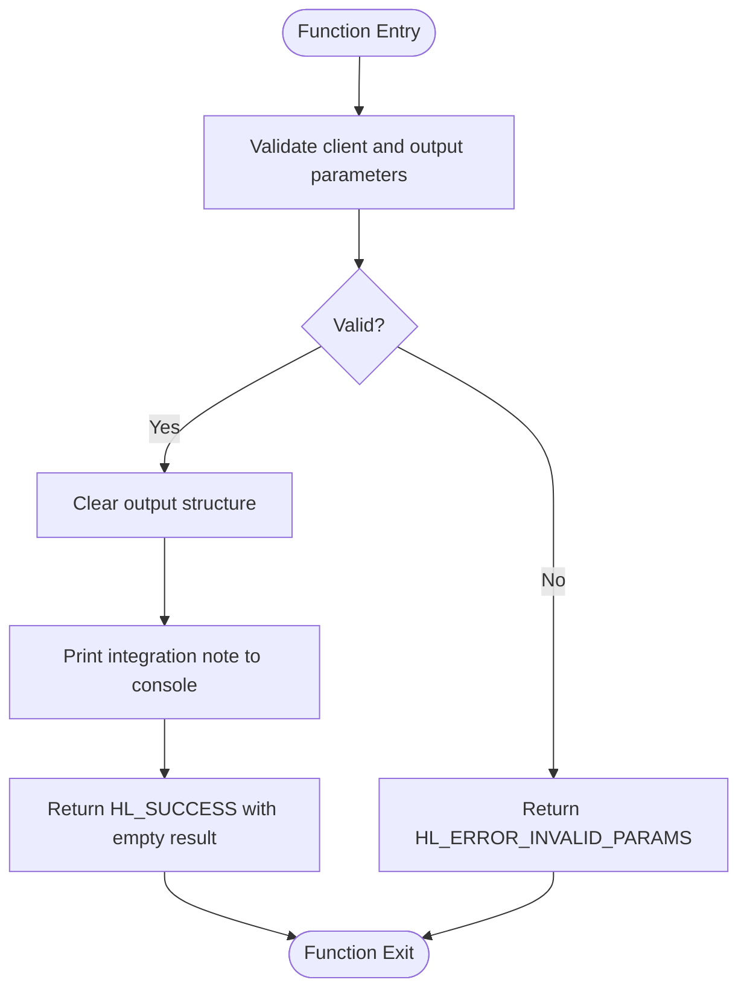
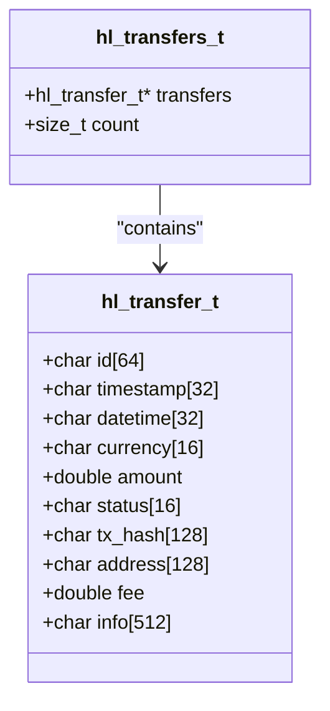

# Deposit and Withdrawal History API

<cite>
**Referenced Files in This Document**   
- [src/transfers.c](file://src/transfers.c)
- [include/hl_account.h](file://include/hl_account.h)
- [include/hyperliquid.h](file://include/hyperliquid.h)
- [README.md](file://README.md)
</cite>

## Table of Contents
1. [Introduction](#introduction)
2. [Core Functions Overview](#core-functions-overview)
3. [Shared Parameters](#shared-parameters)
4. [Response Structure](#response-structure)
5. [Planned Functionality](#planned-functionality)
6. [Error Handling](#error-handling)
7. [Thread Safety and Memory Management](#thread-safety-and-memory-management)

## Introduction
The `hl_fetch_deposits()` and `hl_fetch_withdrawals()` functions are designed to retrieve deposit and withdrawal transaction histories from the Hyperliquid exchange. As documented in the README.md, these functions are currently stub implementations and do not yet provide actual blockchain or wallet integration. This document details their interface, expected behavior, and future implementation roadmap based on patterns observed in the existing codebase.

**Section sources**
- [README.md](file://README.md#L0-L737)

## Core Functions Overview
The `hl_fetch_deposits()` and `hl_fetch_withdrawals()` functions serve as the primary interface for retrieving deposit and withdrawal records respectively. Both functions follow the same signature and return pattern, returning an `hl_error_t` status code and populating an output structure with transfer data.

Currently, both functions are stub implementations that return empty results with a success status. They include console output indicating that wallet integration is required but not yet implemented. The functions validate input parameters and initialize the output structure to zero before returning.

**Diagram sources**
- [src/transfers.c](file://src/transfers.c#L36-L55)
- [src/transfers.c](file://src/transfers.c#L63-L82)

**Section sources**
- [src/transfers.c](file://src/transfers.c#L36-L82)

## Shared Parameters
Both functions share the same parameter structure, enabling consistent usage patterns across the API:

- `client` (`hl_client_t*`): Pointer to the initialized client instance containing authentication and connection details
- `currency` (`const char*`): Optional filter for a specific currency (e.g., "USDC", "ETH"); NULL returns all currencies
- `since` (`const char*`): Optional timestamp filter in ISO format to return only transfers after the specified time; NULL returns recent transfers
- `limit` (`uint32_t`): Maximum number of transfer records to return; 0 indicates no limit
- `output` (`hl_transfers_t*`): Pointer to the output structure that will be populated with transfer data

The parameter design follows the same pattern as other historical data functions in the codebase, such as `hl_fetch_ledger()` and `hl_fetch_my_trades()`, providing a consistent API experience.

**Section sources**
- [include/hyperliquid.h](file://include/hyperliquid.h#L539-L559)
- [src/transfers.c](file://src/transfers.c#L36-L82)

## Response Structure
The transfer history functions populate an `hl_transfers_t` structure containing an array of `hl_transfer_t` records. Each `hl_transfer_t` structure contains the following fields:

- `id` (`char[64]`): Unique transfer identifier
- `timestamp` (`char[32]`): Unix timestamp of the transfer
- `datetime` (`char[32]`): ISO 8601 formatted datetime string
- `currency` (`char[16]`): Currency code (e.g., "USDC", "BTC")
- `amount` (`double`): Transfer amount (positive for deposits, negative for withdrawals)
- `status` (`char[16]`): Transfer status (e.g., "completed", "pending", "failed")
- `tx_hash` (`char[128]`): Blockchain transaction hash
- `address` (`char[128]`): Source (withdrawals) or destination (deposits) blockchain address
- `fee` (`double`): Network fee charged for the transfer
- `info` (`char[512]`): Raw exchange data or additional transfer information

The `hl_transfers_t` structure contains a pointer to an array of `hl_transfer_t` records and a count of the number of transfers returned.

**Diagram sources**
- [src/transfers.c](file://src/transfers.c#L10-L28)

**Section sources**
- [src/transfers.c](file://src/transfers.c#L10-L28)

## Planned Functionality
Future implementations of these functions are expected to integrate with blockchain explorers and wallet APIs to retrieve actual deposit and withdrawal records. Based on the existing patterns in the codebase, the implementation will likely:

1. Construct a JSON request with the filtering parameters (currency, since, limit)
2. Use the HTTP client to send a POST request to the appropriate Hyperliquid API endpoint
3. Parse the JSON response using cJSON
4. Allocate memory for the dynamic array of transfers
5. Populate the `hl_transfers_t` structure with parsed data
6. Return appropriate error codes for network, API, or parsing failures

The implementation will follow the same error handling and memory management patterns as other account API functions like `hl_fetch_balance()` and `hl_fetch_positions()`.

**Section sources**
- [src/transfers.c](file://src/transfers.c#L36-L82)
- [src/account.c](file://src/account.c#L246-L297)

## Error Handling
The functions follow the standard error handling conventions of the Hyperliquid C SDK. They return `hl_error_t` status codes with the following relevant values:

- `HL_SUCCESS`: Operation completed successfully (including cases with empty results)
- `HL_ERROR_INVALID_PARAMS`: Invalid parameters (null client or output pointer)
- Other error codes may be added in future implementations for network, API, or parsing errors

The functions perform basic parameter validation and return `HL_ERROR_INVALID_PARAMS` if the client or output pointer is null. Otherwise, they return `HL_SUCCESS` with an empty result set, which is a valid response indicating no transfers were found.

This error handling pattern is consistent with other functions in the codebase, such as `hl_fetch_balance()` and `hl_fetch_positions()`.

**Section sources**
- [include/hyperliquid.h](file://include/hyperliquid.h#L44-L71)
- [src/transfers.c](file://src/transfers.c#L36-L82)

## Thread Safety and Memory Management
The transfer history functions are designed to be thread-safe through the use of a client mutex. When implemented, they will lock the client mutex during HTTP operations to prevent race conditions in multi-threaded environments.

Memory management follows the pattern established in other collection-returning functions. The caller is responsible for managing the memory of the `hl_transfers_t` structure. A dedicated `hl_free_transfers()` function is provided to free the dynamically allocated array of transfers when no longer needed.

The memory allocation strategy uses `calloc()` or `malloc()` to allocate the array of `hl_transfer_t` structures based on the number of records in the response, with the count field indicating the actual number of transfers returned.

**Section sources**
- [src/transfers.c](file://src/transfers.c#L87-L94)
- [src/client.c](file://src/client.c#L23-L193)