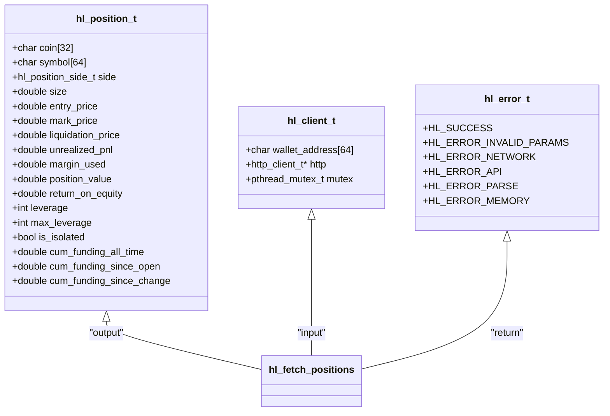
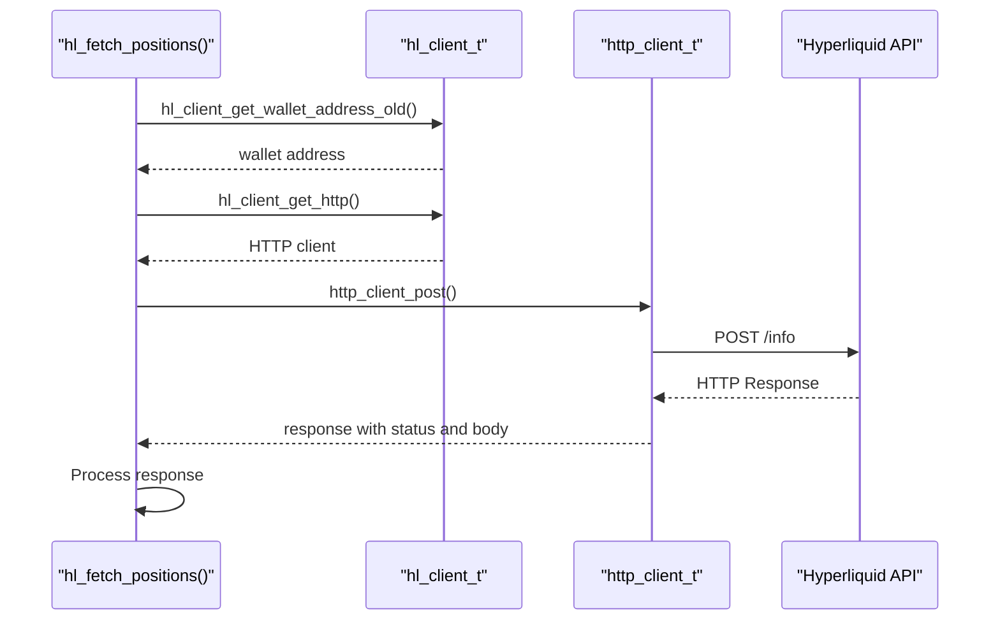
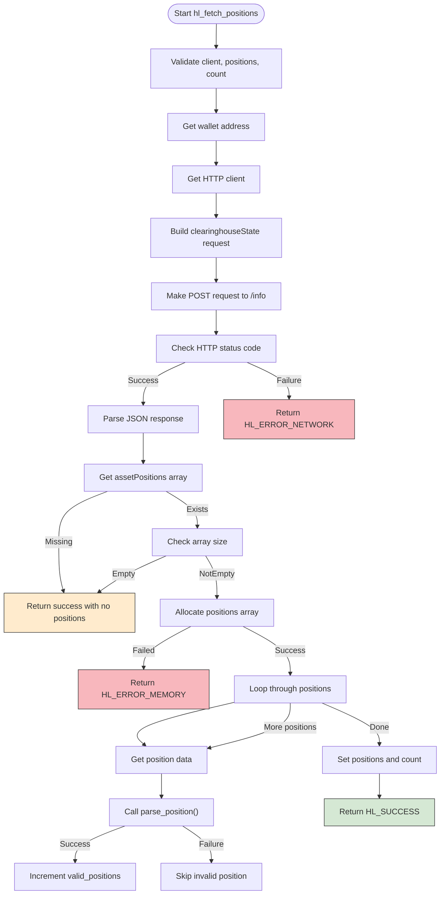

# Position Management API

<cite>
**Referenced Files in This Document**   
- [hl_account.h](file://include/hl_account.h)
- [account.c](file://src/account.c)
- [hl_client.h](file://include/hl_client.h)
- [hl_internal.h](file://include/hl_internal.h)
- [hl_http.h](file://include/hl_http.h)
- [client.c](file://src/client.c)
- [http/client.c](file://src/http/client.c)
</cite>

## Table of Contents
1. [Introduction](#introduction)
2. [Function Signature and Parameters](#function-signature-and-parameters)
3. [Request Construction and Execution](#request-construction-and-execution)
4. [Response Parsing and Position Processing](#response-parsing-and-position-processing)
5. [Memory Management and Error Handling](#memory-management-and-error-handling)
6. [Robustness and Partial Data Handling](#robustness-and-partial-data-handling)
7. [Thread Safety and Integration](#thread-safety-and-integration)
8. [Conclusion](#conclusion)

## Introduction
The `hl_fetch_positions()` function is a core component of the Hyperliquid C SDK, responsible for retrieving current trading positions from the Hyperliquid exchange. This function provides a reliable interface for accessing position data including symbol, size, entry price, leverage, and profit/loss metrics. The implementation demonstrates robust error handling, memory management, and integration with the underlying HTTP client layer. The function is designed to handle various edge cases gracefully, ensuring that partial or incomplete data does not prevent successful retrieval of available position information.

**Section sources**
- [hl_account.h](file://include/hl_account.h#L162-L166)
- [account.c](file://src/account.c#L450-L540)

## Function Signature and Parameters
The `hl_fetch_positions()` function has the following signature: `hl_error_t hl_fetch_positions(hl_client_t* client, hl_position_t** positions, size_t* count)`. It accepts three parameters: a client instance, a pointer to a positions array, and a pointer to a count variable. The `client` parameter is a pointer to an `hl_client_t` structure that contains the wallet address and HTTP client connection. The `positions` parameter is a double pointer that will be populated with an array of position data upon successful execution. The `count` parameter is a pointer to a size_t variable that will receive the number of valid positions retrieved. The function returns an `hl_error_t` enum value indicating success or the specific type of error encountered.

The `hl_position_t` structure contains comprehensive position information including the coin symbol, market symbol, position side (long or short), position size, entry price, mark price, liquidation price, unrealized P&L, margin used, position value, return on equity, leverage settings, and cumulative funding data. This structure provides a complete representation of a trading position on the Hyperliquid exchange.



**Diagram sources**
- [hl_account.h](file://include/hl_account.h#L85-L108)
- [hl_client.h](file://include/hl_client.h#L20-L20)
- [hyperliquid.h](file://include/hyperliquid.h#L67-L75)

**Section sources**
- [hl_account.h](file://include/hl_account.h#L85-L108)
- [hl_account.h](file://include/hl_account.h#L162-L166)

## Request Construction and Execution
The `hl_fetch_positions()` function constructs a request to the Hyperliquid exchange by first validating the input parameters and retrieving the wallet address from the client instance. It uses the `hl_client_get_wallet_address_old()` function to obtain the wallet address, which is then included in the request body. The request is formatted as a JSON object with type "clearinghouseState" and the user's wallet address. The base URL for the request is determined by the client's testnet setting, using either the production or testnet API endpoint.

The function retrieves the HTTP client from the client structure using `hl_client_get_http()` and constructs the full URL by appending "/info" to the base URL. It then executes a POST request using the `http_client_post()` function, passing the JSON request body with appropriate content-type headers. The HTTP client implementation uses libcurl for network operations, handling connection management, SSL verification, and response processing. The request execution includes comprehensive error checking for network failures, HTTP status codes, and response validation.



**Diagram sources**
- [account.c](file://src/account.c#L450-L540)
- [client.c](file://src/client.c#L189-L191)
- [http/client.c](file://src/http/client.c#L150-L185)

**Section sources**
- [account.c](file://src/account.c#L450-L540)
- [client.c](file://src/client.c#L189-L191)
- [http/client.c](file://src/http/client.c#L150-L185)

## Response Parsing and Position Processing
After receiving the response from the Hyperliquid API, the `hl_fetch_positions()` function parses the JSON data to extract position information. The response is first validated for HTTP status code 200 and then parsed using cJSON. The function specifically looks for the "assetPositions" array in the response, which contains the position data. If this array is missing or empty, the function returns successfully with no positions rather than an error, treating this as a valid state.

The function allocates memory for the positions array using calloc, with the size determined by the number of positions in the response. Each position in the assetPositions array is processed by the `parse_position()` helper function, which extracts individual position fields from the JSON data. The parsing process handles various data types, converting string representations to numeric values when necessary. The function maintains a count of valid positions, incrementing only when a position is successfully parsed, allowing it to skip invalid entries without failing the entire operation.



**Diagram sources**
- [account.c](file://src/account.c#L450-L540)
- [account.c](file://src/account.c#L276-L397)

**Section sources**
- [account.c](file://src/account.c#L450-L540)
- [account.c](file://src/account.c#L276-L397)

## Memory Management and Error Handling
The `hl_fetch_positions()` function implements comprehensive error handling and memory management to ensure robust operation. It validates all input parameters at the beginning of execution, returning `HL_ERROR_INVALID_PARAMS` if any required parameter is null. The function handles various error conditions including network failures, API errors, JSON parsing errors, and memory allocation failures, each with appropriate error codes. Network errors are indicated by `HL_ERROR_NETWORK`, API errors by `HL_ERROR_API`, parsing issues by `HL_ERROR_PARSE`, and memory allocation problems by `HL_ERROR_MEMORY`.

Memory allocation for the positions array is performed using calloc, which initializes the memory to zero. The function immediately checks for allocation failure and returns `HL_ERROR_MEMORY` if calloc returns null. The allocated memory is only assigned to the output parameter after all positions have been successfully processed, preventing the caller from receiving a partially initialized array. The function properly cleans up resources by freeing the JSON object and HTTP response before returning, preventing memory leaks in error conditions.

The error handling strategy follows a fail-fast approach for critical errors while allowing graceful degradation for non-critical issues. For example, invalid individual positions are skipped rather than causing the entire function to fail, ensuring that valid position data is still returned even if some positions cannot be parsed. This approach maximizes the availability of trading information to the application.

**Section sources**
- [account.c](file://src/account.c#L450-L540)
- [http/client.c](file://src/http/client.c#L200-L215)

## Robustness and Partial Data Handling
The `hl_fetch_positions()` function demonstrates robust handling of partial and incomplete data, ensuring reliable operation in various scenarios. When no positions exist for the account, the function returns successfully with a null positions pointer and zero count, rather than treating this as an error condition. This design choice recognizes that having no open positions is a valid state in trading operations.

The function implements resilient parsing by continuing to process remaining positions even when individual position data is malformed or incomplete. The `parse_position()` helper function returns an error code for each position, but the main function only increments the valid position counter when parsing succeeds. This allows the function to skip invalid entries while still returning all valid position data. The parsing logic handles both string and numeric representations of numeric values, accommodating potential variations in the API response format.

The function's robustness extends to network and API reliability, with proper handling of HTTP status codes and network timeouts. It distinguishes between client errors (invalid parameters), network issues, API errors, and data parsing problems, providing specific error codes that help callers diagnose issues. The use of calloc for memory allocation ensures that the positions array is properly initialized, reducing the risk of undefined behavior with uninitialized memory.

**Section sources**
- [account.c](file://src/account.c#L450-L540)
- [account.c](file://src/account.c#L276-L397)

## Thread Safety and Integration
The `hl_fetch_positions()` function operates within a thread-safe architecture provided by the Hyperliquid C SDK. The client structure contains a pthread mutex that can be used to synchronize access to shared resources, although the function itself does not directly use the mutex. The HTTP client layer is designed to be thread-safe, with libcurl handles properly managed to prevent race conditions during network operations.

The function integrates with the broader SDK architecture through well-defined interfaces and data structures. It uses internal accessor functions like `hl_client_get_wallet_address_old()` and `hl_client_get_http()` to retrieve required information from the client structure, maintaining encapsulation and allowing for future implementation changes without affecting the public API. The function follows the SDK's error handling conventions, returning standardized error codes that are consistent across all API functions.

The integration with the HTTP layer is seamless, with the function using the same HTTP client instance that may be shared across multiple API calls. This allows for connection reuse and efficient resource management. The function's design supports asynchronous operation patterns, as it does not block on user input or external events beyond the HTTP request itself. The clear separation of concerns between request construction, network communication, response parsing, and memory management makes the function maintainable and testable.

```mermaid
graph TB
subgraph "Application Layer"
A[hl_fetch_positions()]
end
subgraph "Client Layer"
B[hl_client_t]
C[hl_position_t]
end
subgraph "HTTP Layer"
D[http_client_t]
E[libcurl]
end
subgraph "Exchange API"
F[Hyperliquid REST API]
end
A --> B
A --> C
A --> D
D --> E
E --> F
style A fill:#4d79ff,stroke:#333
style B fill:#7f8c8d,stroke:#333
style C fill:#7f8c8d,stroke:#333
style D fill:#7f8c8d,stroke:#333
style E fill:#7f8c8d,stroke:#333
style F fill:#27ae60,stroke:#333
```

**Diagram sources**
- [client.c](file://src/client.c#L189-L191)
- [http/client.c](file://src/http/client.c#L50-L85)
- [hl_client.h](file://include/hl_client.h#L20-L20)

**Section sources**
- [client.c](file://src/client.c#L189-L191)
- [http/client.c](file://src/http/client.c#L50-L85)

## Conclusion
The `hl_fetch_positions()` function provides a reliable and robust interface for retrieving trading positions from the Hyperliquid exchange. Its implementation demonstrates careful attention to error handling, memory management, and data parsing, ensuring that applications can depend on consistent behavior even in edge cases. The function's design allows it to handle partial data gracefully, returning available position information even when some data elements are missing or malformed.

The integration with the SDK's HTTP client layer and adherence to thread-safe practices make this function suitable for use in multi-threaded trading applications. The comprehensive error reporting system enables callers to diagnose and respond appropriately to various failure modes. Overall, the function represents a well-engineered component of the Hyperliquid C SDK, providing essential functionality for position management in algorithmic trading systems.