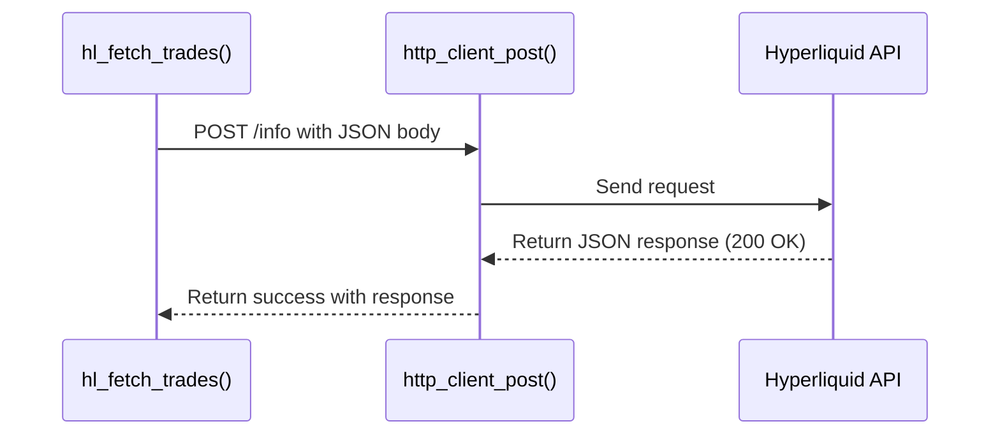
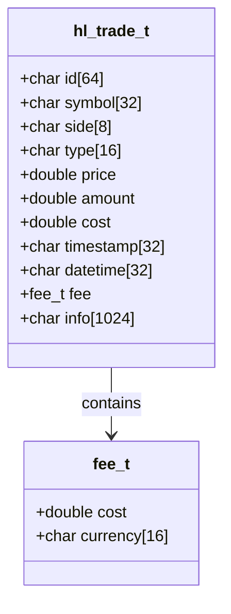

# Trade History API

<cite>
**Referenced Files in This Document**   
- [src/trades.c](file://src/trades.c#L104-L191)
- [include/hyperliquid.h](file://include/hyperliquid.h#L489-L493)
- [include/hl_types.h](file://include/hl_types.h#L14-L14)
- [src/trades.c](file://src/trades.c#L196-L272)
- [include/hl_client.h](file://include/hl_client.h#L13-L13)
- [src/http/client.c](file://src/http/client.c#L120-L167)
- [include/hl_http.h](file://include/hl_http.h#L97-L97)
- [src/client.c](file://src/client.c#L23-L23)
</cite>

## Table of Contents
1. [Introduction](#introduction)
2. [Function Parameters](#function-parameters)
3. [Request Construction and Transmission](#request-construction-and-transmission)
4. [Response Parsing and Trade Processing](#response-parsing-and-trade-processing)
5. [Trade Data Structure](#trade-data-structure)
6. [Memory Management](#memory-management)
7. [Error Handling](#error-handling)
8. [Thread Safety](#thread-safety)
9. [Example Usage](#example-usage)

## Introduction
The `hl_fetch_trades()` function retrieves historical public trade data for a specified trading symbol from the Hyperliquid exchange. It is designed to fetch recent trades via a POST request to the `/info` endpoint using the `recentTrades` API method. This function is part of the Hyperliquid C SDK and supports integration into trading applications requiring access to market activity data. The implementation ensures robust error handling, memory safety, and thread-safe operation through client-level mutex protection.

**Section sources**
- [src/trades.c](file://src/trades.c#L104-L191)

## Function Parameters
The `hl_fetch_trades()` function accepts five parameters:

- **client** (`hl_client_t*`): Pointer to the initialized Hyperliquid client instance. Must not be NULL.
- **symbol** (`const char*`): Trading symbol (e.g., "BTC") for which to retrieve trades. Must not be NULL.
- **since** (`const char*`): Optional timestamp filter to retrieve trades after a specific time. Currently unused in the implementation.
- **limit** (`uint32_t`): Maximum number of trades to retrieve. If set to 0, no limit is applied.
- **trades** (`hl_trades_t*`): Output structure where retrieved trades will be stored. Must not be NULL.

All input parameters are validated at the beginning of the function. If any required parameter is invalid, the function returns `HL_ERROR_INVALID_PARAMS`.

**Section sources**
- [src/trades.c](file://src/trades.c#L104-L191)

## Request Construction and Transmission
The function constructs a JSON request body targeting the `recentTrades` endpoint. The request includes the trading symbol and an optional limit on the number of results:

- If `limit > 0`, the request includes the limit: `{"type":"recentTrades","coin":"SYMBOL","limit":N}`
- Otherwise, it omits the limit: `{"type":"recentTrades","coin":"SYMBOL"}`

This request is sent via a POST call to the `/info` endpoint using the internal HTTP client (`http_client_post`). The function uses the `http_client_post` method from the HTTP module, which handles the underlying cURL operations, including request setup, header management, and response handling.

On network failure or non-200 HTTP status, the function returns `HL_ERROR_NETWORK` after cleaning up the response object.



**Diagram sources**
- [src/trades.c](file://src/trades.c#L104-L191)
- [src/http/client.c](file://src/http/client.c#L120-L167)

**Section sources**
- [src/trades.c](file://src/trades.c#L104-L191)
- [src/http/client.c](file://src/http/client.c#L120-L167)

## Response Parsing and Trade Processing
Upon successful HTTP response, the function parses the response body using `cJSON_Parse`. The expected response is a JSON array of trade objects. If parsing fails or the result is not an array, the function returns `HL_ERROR_JSON`.

If the array is empty, the function returns `HL_SUCCESS` with zero trades. Otherwise, it allocates memory for the output `hl_trades_t` structure using `calloc`, with one `hl_trade_t` entry per array element.

Each trade in the JSON array is processed using the `parse_trade_from_json()` helper function. Valid trades are copied into the output array, and the symbol is explicitly set if not present in the JSON. The total count of successfully parsed trades is stored in `trades->count`.

**Section sources**
- [src/trades.c](file://src/trades.c#L104-L191)

## Trade Data Structure
The `hl_trade_t` structure represents a single trade and includes the following fields:

- **id** (`char[64]`): Unique identifier of the trade (from `hash` field).
- **symbol** (`char[32]`): Trading symbol (from `coin` field).
- **side** (`char[8]`): Trade direction: "buy" (for "B") or "sell" (for "A" or "Sell").
- **type** (`char[16]`): Order type, currently hardcoded to "limit".
- **price** (`double`): Trade execution price.
- **amount** (`double`): Quantity traded.
- **cost** (`double`): Calculated as `price * amount`.
- **timestamp** (`char[32]`): Unix timestamp in string format.
- **datetime** (`char[32]`): ISO 8601 datetime (currently same as timestamp).
- **fee** (`struct { cost, currency }`): Fee information (not populated in this function).

The `parse_trade_from_json()` function maps Hyperliquid's API fields (`coin`, `side`, `px`, `sz`, `time`, `hash`) to these structure members, supporting both string and numeric JSON values.



**Diagram sources**
- [include/hl_types.h](file://include/hl_types.h#L14-L14)
- [src/trades.c](file://src/trades.c#L196-L272)

**Section sources**
- [include/hl_types.h](file://include/hl_types.h#L14-L14)
- [src/trades.c](file://src/trades.c#L196-L272)

## Memory Management
The function uses `calloc` to allocate memory for the array of `hl_trade_t` structures. This ensures zero-initialization and prevents uninitialized memory access. If allocation fails, the function returns `HL_ERROR_MEMORY` after cleaning up prior resources (JSON and HTTP response).

All allocated memory is owned by the output `trades` structure. Users must call `hl_free_trades()` to release this memory when no longer needed. The function ensures that all intermediate resources (e.g., JSON object, HTTP response) are properly freed on both success and error paths to prevent memory leaks.

**Section sources**
- [src/trades.c](file://src/trades.c#L104-L191)

## Error Handling
The function implements comprehensive error handling with the following conditions:

- `HL_ERROR_INVALID_PARAMS`: Returned if `client`, `symbol`, or `trades` is NULL.
- `HL_ERROR_NETWORK`: Returned on HTTP request failure or non-200 status.
- `HL_ERROR_JSON`: Returned if JSON parsing fails or response is not an array.
- `HL_ERROR_MEMORY`: Returned if memory allocation for trades fails.
- `HL_SUCCESS`: Returned on successful retrieval and parsing, including when no trades are found.

Each error path ensures proper cleanup of allocated resources (response, JSON) before returning.

**Section sources**
- [src/trades.c](file://src/trades.c#L104-L191)

## Thread Safety
The `hl_fetch_trades()` function is thread-safe due to the use of a mutex within the `hl_client_t` structure. The HTTP client operations are protected by a `pthread_mutex_t` to prevent concurrent access issues. Although the mutex is not directly visible in the `hl_fetch_trades()` implementation, it is used internally by the HTTP client during the `http_client_post` call, ensuring safe concurrent usage across multiple threads.

**Section sources**
- [src/client.c](file://src/client.c#L23-L23)

## Example Usage
A typical usage pattern involves initializing the client, calling `hl_fetch_trades()`, and processing the results:

```c
hl_client_t* client = hl_client_create(wallet, key, true);
hl_trades_t trades;
hl_error_t err = hl_fetch_trades(client, "BTC", NULL, 10, &trades);
if (err == HL_SUCCESS) {
    for (size_t i = 0; i < trades.count; i++) {
        printf("Trade %zu: %s %s @ %.2f\n", 
               i, trades.trades[i].side, 
               trades.trades[i].symbol, 
               trades.trades[i].price);
    }
    hl_free_trades(&trades);
}
hl_client_destroy(client);
```

**Section sources**
- [examples/simple_trade.c](file://examples/simple_trade.c#L0-L165)