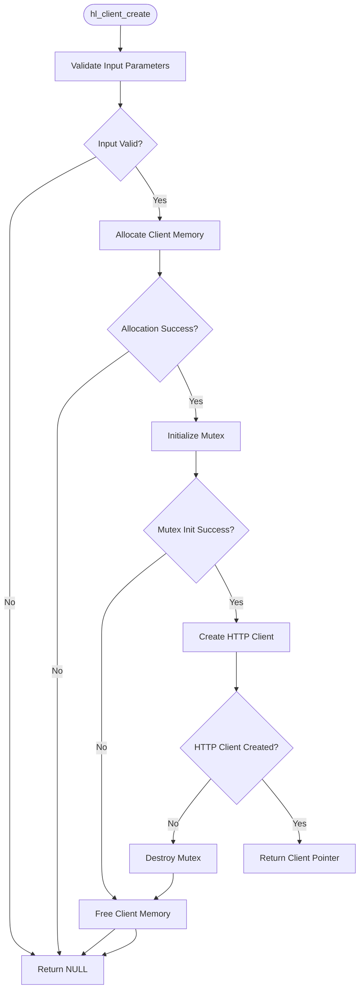
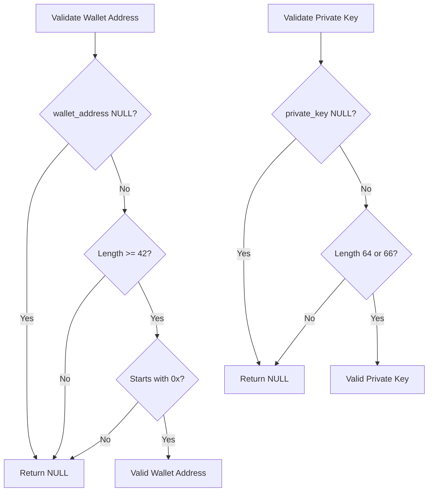
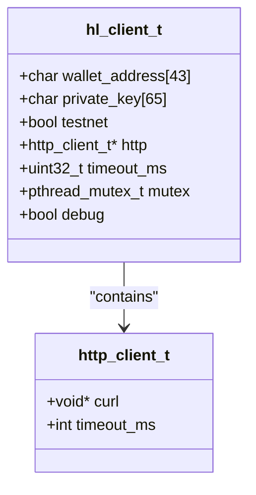
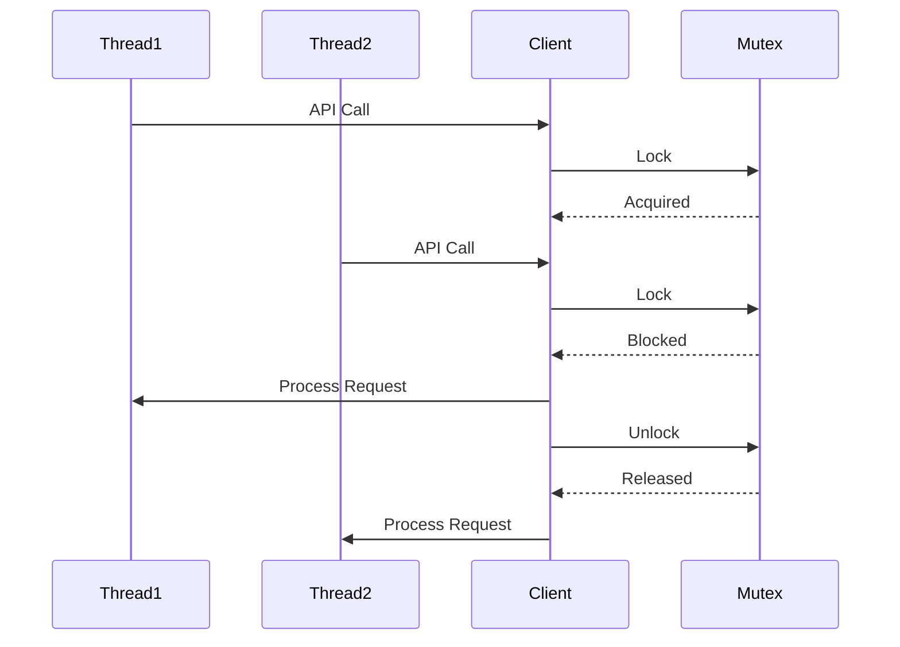
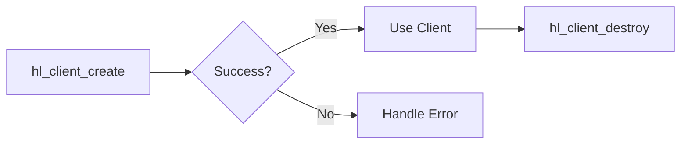

# Client Management API

<cite>
**Referenced Files in This Document**   
- [src/client.c](file://src/client.c)
- [include/hyperliquid.h](file://include/hyperliquid.h)
- [include/hl_http.h](file://include/hl_http.h)
- [src/http/client.c](file://src/http/client.c)
</cite>

## Table of Contents
1. [Introduction](#introduction)
2. [Client Creation and Lifecycle](#client-creation-and-lifecycle)
3. [Parameter Validation](#parameter-validation)
4. [Memory and Resource Management](#memory-and-resource-management)
5. [Thread Safety](#thread-safety)
6. [Configuration Options](#configuration-options)
7. [Usage Example](#usage-example)
8. [Error Handling](#error-handling)
9. [Opaque Pointer Pattern](#opaque-pointer-pattern)
10. [Conclusion](#conclusion)

## Introduction
The Hyperliquid C library provides a comprehensive client management API for interacting with the Hyperliquid DEX. This document focuses on the `hl_client_create()` function and related client management operations, detailing their implementation, usage, and internal mechanics. The client handle serves as the central interface for all trading and market data operations, encapsulating authentication credentials, HTTP connectivity, and thread safety mechanisms.

## Client Creation and Lifecycle

The `hl_client_create()` function is the primary entry point for creating a client instance that enables interaction with the Hyperliquid exchange. This function allocates and initializes a client structure that maintains state across API calls.



**Diagram sources**
- [src/client.c](file://src/client.c#L34-L87)

**Section sources**
- [src/client.c](file://src/client.c#L34-L87)
- [include/hyperliquid.h](file://include/hyperliquid.h#L220-L222)

## Parameter Validation

The `hl_client_create()` function performs rigorous validation of input parameters to ensure the integrity and security of the client instance. This validation occurs before any resource allocation to prevent memory leaks.

### Wallet Address Validation
The wallet address must conform to the Ethereum address format:
- Must not be NULL
- Must be at least 42 characters long (including "0x" prefix)
- Must start with "0x" prefix

### Private Key Validation
The private key undergoes length validation to ensure cryptographic integrity:
- Must not be NULL
- Must be either 64 characters (raw hex) or 66 characters (with "0x" prefix)
- The function automatically strips the "0x" prefix if present



**Diagram sources**
- [src/client.c](file://src/client.c#L34-L87)

**Section sources**
- [src/client.c](file://src/client.c#L34-L87)

## Memory and Resource Management

The client creation process involves careful memory management and resource allocation to ensure proper initialization and cleanup.

### Memory Allocation
The client structure is allocated using `calloc()` to ensure zero-initialization of all fields:
- Single allocation of `sizeof(hl_client_t)` bytes
- Zero-initialized memory to prevent garbage data
- Returns NULL on allocation failure

### Resource Cleanup on Failure
The function implements a fail-safe pattern that properly cleans up partially allocated resources:
- If mutex initialization fails, allocated memory is freed
- If HTTP client creation fails, mutex is destroyed and memory is freed
- All cleanup paths ensure no resource leaks



**Diagram sources**
- [src/client.c](file://src/client.c#L34-L87)
- [include/hl_http.h](file://include/hl_http.h#L15-L18)

**Section sources**
- [src/client.c](file://src/client.c#L34-L87)
- [src/http/client.c](file://src/http/client.c#L38-L69)

## Thread Safety

The client implementation provides thread safety through mutex protection of shared resources.

### Mutex Initialization
The client structure includes a pthread mutex that is initialized during creation:
- Mutex initialized with default attributes
- Protects access to shared client state
- Ensures thread-safe operations across multiple API calls

### Thread Safety Guarantees
The mutex provides the following guarantees:
- Exclusive access to client state during critical operations
- Prevention of race conditions in multi-threaded environments
- Safe concurrent access from multiple threads



**Diagram sources**
- [src/client.c](file://src/client.c#L34-L87)

**Section sources**
- [src/client.c](file://src/client.c#L34-L87)

## Configuration Options

The client supports several configuration options that can be modified after creation.

### Timeout Configuration
The default timeout is set to 30,000 milliseconds (30 seconds) but can be modified:
- Configurable via `hl_set_timeout()` function
- Applies to all subsequent HTTP requests
- Prevents indefinite blocking on network operations

### Debug Mode
A global debug flag is available (currently a placeholder):
- Controlled by `hl_set_debug()` function
- Intended for verbose logging and troubleshooting
- Currently not fully implemented

**Section sources**
- [src/client.c](file://src/client.c#L89-L107)

## Usage Example

The following example demonstrates proper client instantiation and cleanup:

```c
// Create client with wallet address, private key, and testnet flag
hl_client_t *client = hl_client_create("0xYourWalletAddress", "yourprivatekey", true);
if (!client) {
    fprintf(stderr, "Failed to create client\n");
    return -1;
}

// Use the client for API operations
// ... perform trading or market data operations ...

// Properly destroy the client to free resources
hl_client_destroy(client);
```

The client lifecycle follows these steps:
1. Create client with valid credentials
2. Check for NULL return value indicating failure
3. Use client for API operations
4. Destroy client when no longer needed



**Diagram sources**
- [src/client.c](file://src/client.c#L34-L87)
- [src/client.c](file://src/client.c#L89-L107)

**Section sources**
- [src/client.c](file://src/client.c#L34-L107)

## Error Handling

The `hl_client_create()` function employs a comprehensive error handling strategy with multiple failure points:

### Error Conditions
The function returns NULL under the following conditions:
- Invalid input parameters (NULL pointers)
- Wallet address format validation failure
- Private key format validation failure
- Memory allocation failure
- Mutex initialization failure
- HTTP client creation failure

### Error Propagation
Each failure point triggers appropriate cleanup:
- Memory allocation failure: Return NULL immediately
- Mutex initialization failure: Free allocated memory
- HTTP client creation failure: Destroy mutex and free memory

**Section sources**
- [src/client.c](file://src/client.c#L34-L87)

## Opaque Pointer Pattern

The client implementation uses the opaque pointer pattern to encapsulate internal state.

### Structure Definition
The `hl_client_t` is defined as a typedef to a struct:
- Opaque to users of the API
- Implementation details hidden in source files
- Prevents direct access to internal fields

### Accessor Functions
Internal state is accessed through dedicated functions:
- `hl_client_get_wallet_address()` - Retrieve wallet address
- `hl_client_get_private_key()` - Retrieve private key
- `hl_client_get_http()` - Access HTTP client
- `hl_client_get_mutex()` - Access mutex for locking

This pattern provides:
- Encapsulation of implementation details
- ABI stability across versions
- Controlled access to internal state
- Enhanced security by preventing direct manipulation

**Section sources**
- [src/client.c](file://src/client.c#L177-L195)

## Conclusion
The `hl_client_create()` function provides a robust mechanism for creating and managing client instances in the Hyperliquid C library. It implements comprehensive validation, careful resource management, and thread safety to ensure reliable operation in production environments. The opaque pointer pattern enhances security and maintainability, while the structured error handling prevents resource leaks. Proper usage of the client lifecycle functions ensures efficient resource utilization and prevents memory leaks in applications.