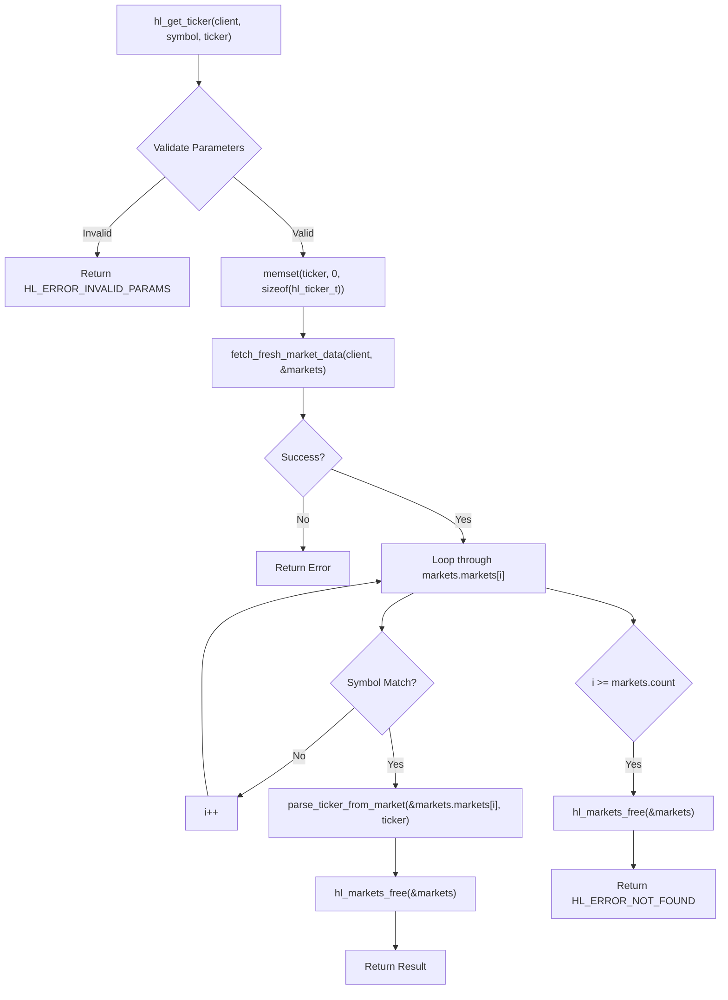
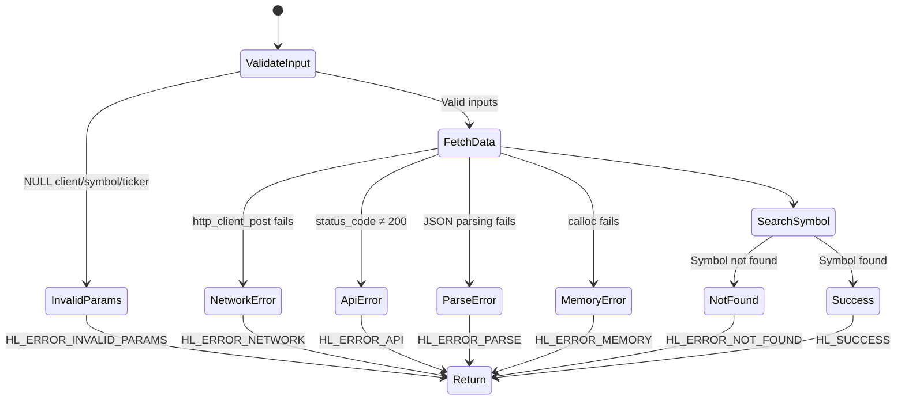
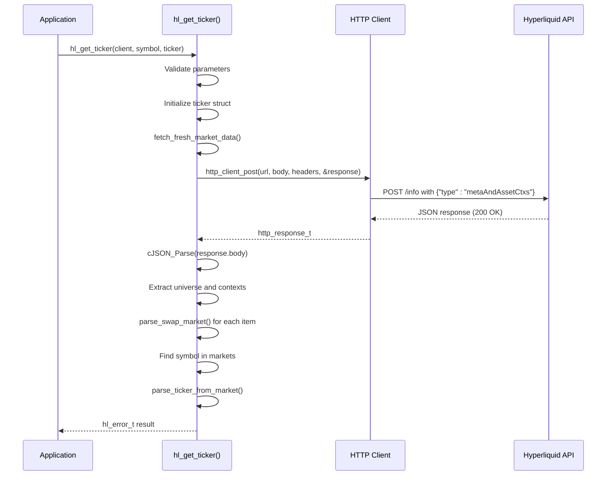

# Market Data API

<cite>
**Referenced Files in This Document**   
- [ticker.c](file://src/ticker.c)
- [hl_ticker.h](file://include/hl_ticker.h)
- [hl_markets.h](file://include/hl_markets.h)
- [hl_types.h](file://include/hl_types.h)
- [hyperliquid.h](file://include/hyperliquid.h)
- [simple_ticker.c](file://examples/simple_ticker.c)
- [ohlcv.c](file://src/ohlcv.c)
- [orderbook.c](file://src/orderbook.c)
</cite>

## Table of Contents
1. [Introduction](#introduction)
2. [Core Function: hl_get_ticker()](#core-function-hl_get_ticker)
3. [Ticker Data Structure](#ticker-data-structure)
4. [Internal Workflow](#internal-workflow)
5. [Error Handling](#error-handling)
6. [Related Market Data Functions](#related-market-data-functions)
7. [Example Usage](#example-usage)
8. [HTTP Request and JSON Parsing Strategy](#http-request-and-json-parsing-strategy)
9. [Thread Safety](#thread-safety)
10. [Performance Considerations](#performance-considerations)

## Introduction
This document provides comprehensive API documentation for market data retrieval functions in the Hyperliquid C SDK, with a primary focus on `hl_get_ticker()`. The documentation covers function parameters, return values, internal workflows, error handling, and performance characteristics. It also details related functions for retrieving order book and OHLCV data, along with their respective data structures and usage patterns.

## Core Function: hl_get_ticker()
The `hl_get_ticker()` function retrieves current market data for a specified trading symbol. It serves as the primary interface for obtaining real-time ticker information from the Hyperliquid exchange.

**Function Signature**
```c
hl_error_t hl_get_ticker(hl_client_t *client, const char *symbol, hl_ticker_t *ticker);
```

**Parameters**
- `client`: Pointer to an initialized `hl_client_t` instance. Must not be NULL.
- `symbol`: Trading symbol string (e.g., "BTC/USDC:USDC"). Must not be NULL.
- `ticker`: Pointer to an `hl_ticker_t` structure where the result will be stored. Must not be NULL.

**Return Value**
Returns an `hl_error_t` enum value indicating success or failure:
- `HL_SUCCESS`: Ticker data retrieved successfully
- `HL_ERROR_INVALID_PARAMS`: Invalid input parameters (NULL pointers)
- `HL_ERROR_NOT_FOUND`: Symbol not found in available markets
- `HL_ERROR_NETWORK`: Network communication failure
- `HL_ERROR_API`: API returned non-200 status code
- `HL_ERROR_PARSE`: JSON parsing failure
- `HL_ERROR_MEMORY`: Memory allocation failure

**Section sources**
- [ticker.c](file://src/ticker.c#L188-L213)
- [hyperliquid.h](file://include/hyperliquid.h#L368-L370)

## Ticker Data Structure
The `hl_ticker_t` structure contains comprehensive market data for a trading pair, including price, volume, and derivative-specific metrics.

```c
typedef struct {
    char symbol[64];             /**< Symbol */
    double last_price;           /**< Last trade price */
    double bid;                  /**< Best bid */
    double ask;                  /**< Best ask */
    double close;                /**< Close price */
    double previous_close;       /**< Previous day close price */
    double high_24h;             /**< 24h high */
    double low_24h;              /**< 24h low */
    double volume_24h;           /**< 24h volume */
    double quote_volume;         /**< 24h quote volume */
    double change_24h;           /**< 24h price change (%) */
    uint64_t timestamp;          /**< Timestamp (ms) */
    char datetime[32];           /**< ISO 8601 datetime string */

    // Additional data for perpetuals
    double mark_price;           /**< Mark price */
    double oracle_price;         /**< Oracle price */
    double funding_rate;         /**< Current funding rate */
    double open_interest;        /**< Open interest */
} hl_ticker_t;
```

**Section sources**
- [hl_ticker.h](file://include/hl_ticker.h#L26-L48)
- [hyperliquid.h](file://include/hyperliquid.h#L168-L188)

## Internal Workflow
The `hl_get_ticker()` function follows a multi-step process to retrieve and populate ticker data:



**Diagram sources**
- [ticker.c](file://src/ticker.c#L188-L213)
- [ticker.c](file://src/ticker.c#L95-L183)
- [ticker.c](file://src/ticker.c#L47-L90)

**Section sources**
- [ticker.c](file://src/ticker.c#L188-L213)

### Data Population Process
When a matching symbol is found in the markets list, the `parse_ticker_from_market()` function extracts data from the `hl_market_t` structure and populates the `hl_ticker_t` structure:

- **Symbol**: Copied directly from `market->symbol`
- **Prices**: `last_price` and `close` set to `market->mark_price`
- **Bid/Ask**: Calculated as `mark_price ± (mark_price * 0.0001)` (0.01% spread)
- **Volume**: `volume_24h` and `quote_volume` set to `market->day_volume`
- **Timestamp**: Current time in milliseconds
- **Derivative Data**: `mark_price`, `oracle_price`, `funding_rate`, and `open_interest` copied directly

**Section sources**
- [ticker.c](file://src/ticker.c#L47-L90)

## Error Handling
The API implements comprehensive error handling for various failure scenarios:



**Diagram sources**
- [ticker.c](file://src/ticker.c#L188-L213)
- [ticker.c](file://src/ticker.c#L95-L183)

**Section sources**
- [ticker.c](file://src/ticker.c#L188-L213)

## Related Market Data Functions
The SDK provides additional functions for retrieving different types of market data:

### hl_get_orderbook()
Retrieves the order book for a specified symbol and depth.

**Function Signature**
```c
hl_error_t hl_get_orderbook(hl_client_t* client, const char* symbol, uint32_t depth, hl_orderbook_t* book);
```

**Return Structure (hl_orderbook_t)**
```c
typedef struct {
    char symbol[32];             /**< Symbol */
    hl_book_level_t *bids;       /**< Bid levels (sorted high to low) */
    size_t bids_count;           /**< Number of bid levels */
    hl_book_level_t *asks;       /**< Ask levels (sorted low to high) */
    size_t asks_count;           /**< Number of ask levels */
    uint64_t timestamp_ms;       /**< Snapshot timestamp */
} hl_orderbook_t;
```

**Section sources**
- [orderbook.c](file://src/orderbook.c#L315-L317)
- [hyperliquid.h](file://include/hyperliquid.h#L381-L384)

### hl_get_ohlcv()
Retrieves OHLCV (Open, High, Low, Close, Volume) candlestick data.

**Return Structure (hl_ohlcv_t)**
```c
typedef struct {
    uint64_t timestamp;    /**< Candle open timestamp (milliseconds) */
    double open;           /**< Open price */
    double high;           /**< High price */
    double low;            /**< Low price */
    double close;          /**< Close price */
    double volume;         /**< Trading volume */
} hl_ohlcv_t;
```

**Section sources**
- [hl_ohlcv.h](file://include/hl_ohlcv.h#L25-L32)

## Example Usage
The following example demonstrates how to retrieve ticker data using the `hl_get_ticker()` function:

```c
// Example from simple_ticker.c
hl_client_t* client = hl_client_new();
hl_ticker_t ticker = {0};

hl_error_t err = hl_get_ticker(client, "BTC/USDC:USDC", &ticker);
if (err == HL_SUCCESS) {
    printf("Symbol: %s\n", ticker.symbol);
    printf("Last Price: %.2f\n", ticker.last_price);
    printf("Mark Price: %.2f\n", ticker.mark_price);
    printf("24h Volume: %.2f\n", ticker.volume_24h);
} else {
    printf("Error: %d\n", err);
}

hl_client_free(client);
```

**Section sources**
- [simple_ticker.c](file://examples/simple_ticker.c)

## HTTP Request and JSON Parsing Strategy
The market data retrieval system uses a consistent HTTP and JSON processing pattern:



**Diagram sources**
- [ticker.c](file://src/ticker.c#L95-L183)
- [ticker.c](file://src/ticker.c#L47-L90)

**Section sources**
- [ticker.c](file://src/ticker.c#L95-L183)

## Thread Safety
All market data retrieval functions are thread-safe due to client-level mutex protection:

- The `hl_client_t` structure contains a mutex that protects HTTP operations
- Concurrent calls to `hl_get_ticker()`, `hl_get_orderbook()`, and `hl_get_ohlcv()` from multiple threads are safe
- The mutex ensures that only one HTTP request is processed at a time per client instance
- Data structures returned to the caller are thread-local and do not require external synchronization

**Section sources**
- [client.c](file://src/client.c)
- [ticker.c](file://src/ticker.c)

## Performance Considerations
When making frequent market data calls, consider the following performance implications:

```mermaid
flowchart LR
A[Frequent hl_get_ticker Calls] --> B{Performance Impact}
B --> C[Network Overhead]
B --> D[API Rate Limits]
B --> E[Memory Allocation]
B --> F[JSON Parsing]
C --> G[Multiple HTTP round trips]
D --> H[Potential API throttling]
E --> I[Calls to calloc() and free()]
F --> J[cJSON_Parse() overhead]
G --> K[Recommendation: Cache results]
H --> K
I --> K
J --> K
K --> L[Batch requests when possible]
K --> M[Implement local caching]
K --> N[Use appropriate refresh intervals]
```

**Diagram sources**
- [ticker.c](file://src/ticker.c#L95-L183)
- [ticker.c](file://src/ticker.c#L188-L213)

**Section sources**
- [ticker.c](file://src/ticker.c)