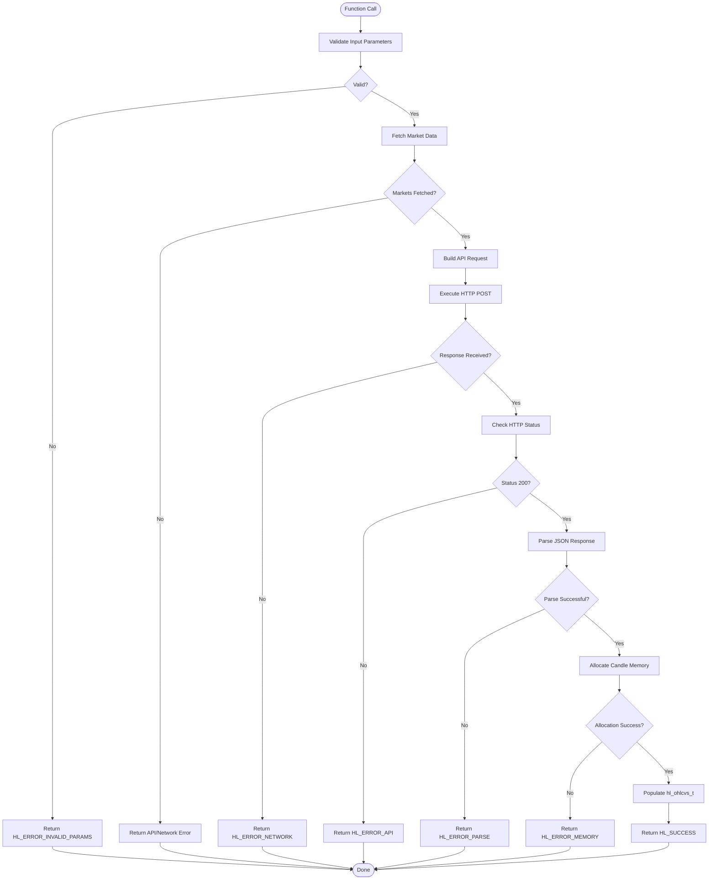
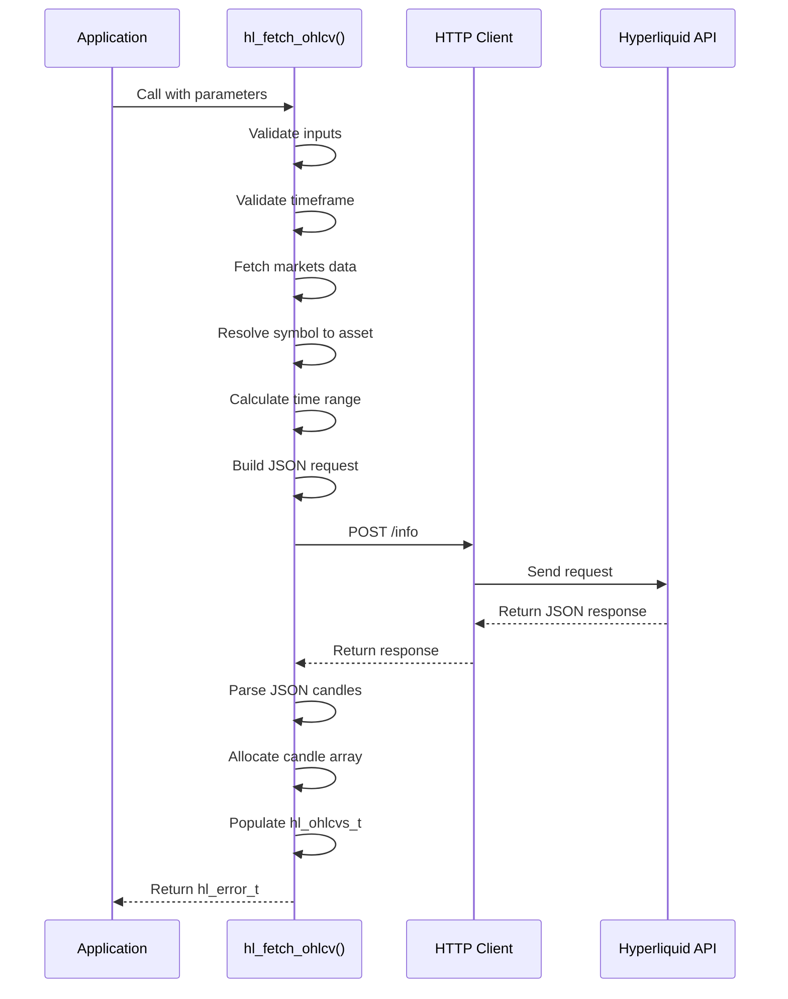
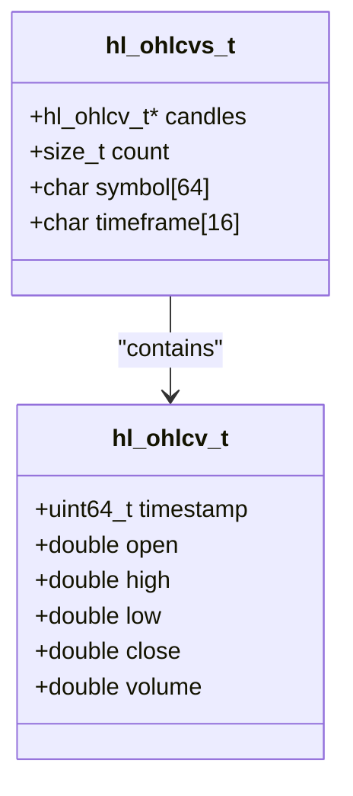

# OHLCV Candles API

<cite>
**Referenced Files in This Document**   
- [hl_ohlcv.h](file://include/hl_ohlcv.h)
- [ohlcv.c](file://src/ohlcv.c)
- [simple_ohlcv.c](file://examples/simple_ohlcv.c)
- [hl_client.h](file://include/hl_client.h)
- [hl_http.h](file://include/hl_http.h)
- [hl_markets.h](file://include/hl_markets.h)
- [hl_exchange.h](file://include/hl_exchange.h)
</cite>

## Table of Contents
1. [Introduction](#introduction)
2. [Function Signature and Parameters](#function-signature-and-parameters)
3. [Return Type and Error Handling](#return-type-and-error-handling)
4. [Internal Processing Flow](#internal-processing-flow)
5. [Data Structures](#data-structures)
6. [Usage Example](#usage-example)
7. [Thread Safety](#thread-safety)
8. [Performance Considerations](#performance-considerations)
9. [Time and Data Integrity Guidance](#time-and-data-integrity-guidance)
10. [Supported Timeframes](#supported-timeframes)

## Introduction
The `hl_fetch_ohlcv()` function provides access to historical OHLCV (Open, High, Low, Close, Volume) candlestick data from the Hyperliquid exchange. This API is essential for technical analysis, algorithmic trading strategies, and market research. The function retrieves candlestick data based on specified parameters and returns structured data suitable for processing and analysis. It supports both spot and swap markets and integrates with the broader Hyperliquid C SDK for unified trading operations.

**Section sources**
- [hl_ohlcv.h](file://include/hl_ohlcv.h#L60-L90)
- [simple_ohlcv.c](file://examples/simple_ohlcv.c#L1-L20)

## Function Signature and Parameters
The `hl_fetch_ohlcv()` function retrieves candlestick data with the following signature:

```c
hl_error_t hl_fetch_ohlcv(hl_client_t* client, const char* symbol, const char* timeframe,
                         uint64_t* since, uint32_t* limit, uint64_t* until,
                         hl_ohlcvs_t* ohlcvs);
```

### Parameters
- **client**: Pointer to the `hl_client_t` instance, which manages authentication and HTTP connections.
- **symbol**: Market identifier string (e.g., "BTC/USDC:USDC") specifying the trading pair.
- **timeframe**: String representing the candle interval (e.g., "1m", "5m", "1h"). Must match supported values.
- **since**: Optional pointer to a timestamp (in milliseconds) indicating the start time for data retrieval. If NULL, defaults to calculated start based on limit.
- **limit**: Optional pointer to the maximum number of candles to return. If NULL or zero, defaults to 24 hours of data.
- **until**: Optional pointer to a timestamp (in milliseconds) indicating the end time for data retrieval. If NULL, defaults to current time.
- **ohlcvs**: Output parameter that receives the fetched OHLCV data collection. Caller must free using `hl_ohlcvs_free()`.

**Section sources**
- [hl_ohlcv.h](file://include/hl_ohlcv.h#L60-L90)
- [ohlcv.c](file://src/ohlcv.c#L220-L230)

## Return Type and Error Handling
The function returns an `hl_error_t` enum value indicating the success or failure of the operation.

### Possible Return Values
| Error Code | Description |
|------------|-------------|
| `HL_SUCCESS` | Operation completed successfully |
| `HL_ERROR_INVALID_PARAMS` | Invalid input parameters (e.g., null client, invalid timeframe) |
| `HL_ERROR_NETWORK` | Network communication failure during HTTP request |
| `HL_ERROR_API` | API returned non-200 status code |
| `HL_ERROR_PARSE` | JSON response parsing failed |
| `HL_ERROR_MEMORY` | Memory allocation failure for candle array |
| `HL_ERROR_NOT_FOUND` | Market or asset not found for the given symbol |

Error messages can be converted to human-readable strings using `hl_error_string()`. All errors should be checked and handled appropriately in production code.



**Diagram sources**
- [ohlcv.c](file://src/ohlcv.c#L220-L400)
- [hl_http.h](file://include/hl_http.h#L80-L100)

**Section sources**
- [ohlcv.c](file://src/ohlcv.c#L220-L400)
- [hl_ohlcv.h](file://include/hl_ohlcv.h#L60-L90)

## Internal Processing Flow
The `hl_fetch_ohlcv()` function follows a structured process to retrieve and parse candlestick data:

1. **Parameter Validation**: Validates client, symbol, timeframe, and output structure.
2. **Timeframe Validation**: Confirms the requested timeframe is supported by Hyperliquid.
3. **Market Data Retrieval**: Fetches current market information using `hl_fetch_markets()` to determine asset type and ID.
4. **Asset Resolution**: Uses `hl_get_asset_id()` and `hl_get_market()` to resolve symbol to asset ID for spot markets or coin name for swaps.
5. **Timestamp Calculation**: Determines start and end times based on `since`, `until`, and `limit` parameters.
6. **Request Construction**: Builds a JSON payload with type "candleSnapshot" and appropriate parameters.
7. **HTTP Execution**: Sends POST request via the client's HTTP interface to the Hyperliquid API endpoint.
8. **Response Parsing**: Parses JSON array response and extracts candle data using `parse_ohlcv_candle()`.
9. **Data Population**: Populates the output `hl_ohlcvs_t` structure with candles and metadata.

The function handles both spot and swap markets differently in the request construction phase, using asset IDs for spot and coin names for swap markets.



**Diagram sources**
- [ohlcv.c](file://src/ohlcv.c#L220-L400)
- [hl_http.h](file://include/hl_http.h#L80-L100)

**Section sources**
- [ohlcv.c](file://src/ohlcv.c#L220-L400)

## Data Structures
The OHLCV functionality uses two primary data structures:

### hl_ohlcv_t
Represents a single candlestick with the following fields:
- `timestamp`: Opening time in milliseconds (UTC)
- `open`: Opening price
- `high`: Highest price during the period
- `low`: Lowest price during the period
- `close`: Closing price
- `volume`: Trading volume

### hl_ohlcvs_t
Represents a collection of candles with metadata:
- `candles`: Array of `hl_ohlcv_t` structures
- `count`: Number of candles in the array
- `symbol`: Trading symbol (e.g., "BTC/USDC:USDC")
- `timeframe`: Timeframe string (e.g., "1m", "1h")

Memory management is handled through `hl_ohlcvs_free()`, which deallocates the candles array and resets the structure.



**Diagram sources**
- [hl_ohlcv.h](file://include/hl_ohlcv.h#L25-L55)
- [ohlcv.c](file://src/ohlcv.c#L350-L370)

**Section sources**
- [hl_ohlcv.h](file://include/hl_ohlcv.h#L25-L55)

## Usage Example
The `simple_ohlcv.c` example demonstrates proper usage of the OHLCV API:

```c
// Create client
hl_client_t* client = hl_client_create(wallet, key, true);

// Fetch OHLCV data
hl_ohlcvs_t ohlcvs = {0};
hl_error_t err = hl_fetch_ohlcv(client, "BTC/USDC:USDC", "1m", NULL, NULL, NULL, &ohlcvs);

if (err == HL_SUCCESS && ohlcvs.count > 0) {
    // Process candles
    for (size_t i = 0; i < ohlcvs.count; i++) {
        const hl_ohlcv_t* candle = hl_ohlcvs_get_candle(&ohlcvs, i);
        printf("Time: %llu, O: %.2f, C: %.2f\n",
               (unsigned long long)candle->timestamp,
               candle->open, candle->close);
    }
    
    // Analyze latest candle
    const hl_ohlcv_t* latest = hl_ohlcvs_get_latest(&ohlcvs);
    
    // Calculate indicators
    double* sma = calloc(ohlcvs.count, sizeof(double));
    hl_ohlcvs_calculate_sma(&ohlcvs, 5, true, sma);
    
    // Cleanup
    free(sma);
}

hl_ohlcvs_free(&ohlcvs);
hl_client_destroy(client);
```

The example also demonstrates time-range filtering by specifying `since` and `until` timestamps, and includes error handling and resource cleanup.

**Section sources**
- [simple_ohlcv.c](file://examples/simple_ohlcv.c#L50-L190)

## Thread Safety
The `hl_fetch_ohlcv()` function is thread-safe when used with a properly initialized `hl_client_t` instance. The underlying HTTP client and request execution are synchronized through the client's internal mutex mechanism. Multiple threads can safely call `hl_fetch_ohlcv()` concurrently using the same client instance, as the function does not modify shared state beyond the HTTP request/response cycle. However, applications should ensure that the client remains valid for the duration of all concurrent calls.

**Section sources**
- [hl_client.h](file://include/hl_client.h#L50-L120)
- [hl_http.h](file://include/hl_http.h#L40-L60)

## Performance Considerations
When retrieving OHLCV data, consider the following performance guidelines:

- **Bulk Retrieval**: The API supports retrieving up to several thousand candles in a single request. For large datasets, use appropriate `limit` values rather than multiple small requests.
- **Polling Intervals**: Avoid excessive polling. For 1-minute candles, polling every 5-10 seconds is sufficient. For longer timeframes, reduce frequency accordingly.
- **Memory Management**: Large candle arrays consume significant memory. Always call `hl_ohlcvs_free()` after use to prevent leaks.
- **Caching**: Consider implementing application-level caching for frequently accessed data to reduce API calls.
- **Network Efficiency**: The JSON response is compact, but many requests can accumulate bandwidth. Batch requests when possible.

**Section sources**
- [ohlcv.c](file://src/ohlcv.c#L220-L400)
- [simple_ohlcv.c](file://examples/simple_ohlcv.c#L1-L20)

## Time and Data Integrity Guidance
### Timezone Interpretation
All timestamps are in UTC and expressed in milliseconds since Unix epoch. No timezone conversion is performed by the API. Applications should handle timezone display as needed.

### Incomplete Candles
The most recent candle in the dataset may be incomplete if the current time falls within that timeframe. For example, a "1h" candle at 14:30 will only contain data from 14:00 to 14:30. Applications performing technical analysis should account for this partial data.

### Data Availability
Historical data availability depends on the market and timeframe. Testnet environments may have limited or no historical OHLCV data. Mainnet provides complete historical data for supported timeframes.

**Section sources**
- [simple_ohlcv.c](file://examples/simple_ohlcv.c#L1-L20)
- [ohlcv.c](file://src/ohlcv.c#L220-L400)

## Supported Timeframes
The following timeframe strings are supported by the `hl_fetch_ohlcv()` function:

| Constant | String Value | Duration |
|--------|--------------|----------|
| `HL_TIMEFRAME_1M` | "1m" | 1 minute |
| `HL_TIMEFRAME_3M` | "3m" | 3 minutes |
| `HL_TIMEFRAME_5M` | "5m" | 5 minutes |
| `HL_TIMEFRAME_15M` | "15m" | 15 minutes |
| `HL_TIMEFRAME_30M` | "30m" | 30 minutes |
| `HL_TIMEFRAME_1H` | "1h" | 1 hour |
| `HL_TIMEFRAME_2H` | "2h" | 2 hours |
| `HL_TIMEFRAME_4H` | "4h" | 4 hours |
| `HL_TIMEFRAME_8H` | "8h" | 8 hours |
| `HL_TIMEFRAME_12H` | "12h" | 12 hours |
| `HL_TIMEFRAME_1D` | "1d" | 1 day |
| `HL_TIMEFRAME_3D` | "3d" | 3 days |
| `HL_TIMEFRAME_1W` | "1w" | 1 week |
| `HL_TIMEFRAME_1M_MONTH` | "1M" | 1 month |

The function validates timeframe strings against this list and returns `HL_ERROR_INVALID_PARAMS` for unsupported values.

**Section sources**
- [hl_ohlcv.h](file://include/hl_ohlcv.h#L35-L55)
- [ohlcv.c](file://src/ohlcv.c#L100-L130)