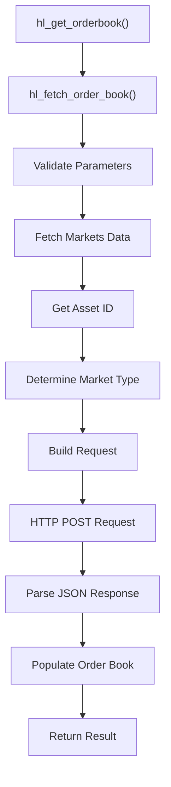
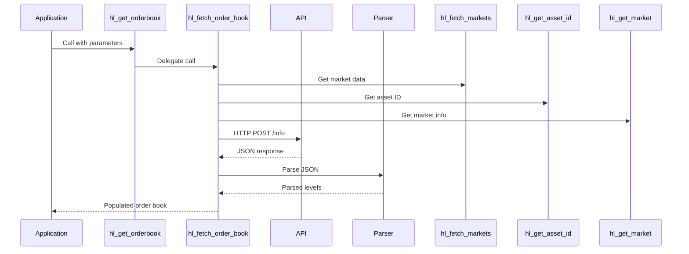
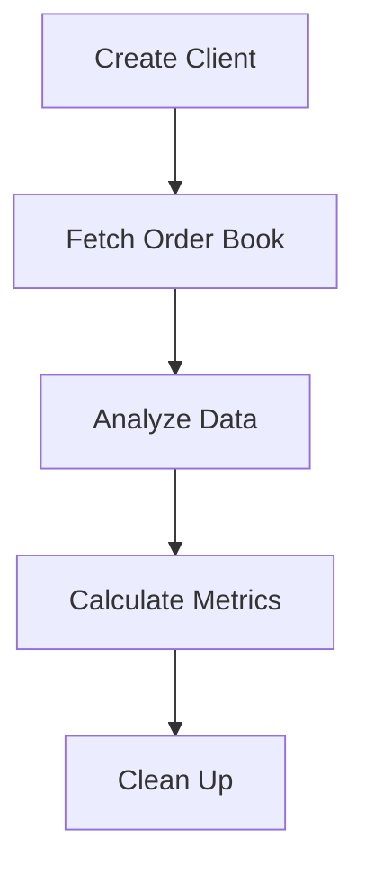

# Order Book API

<cite>
**Referenced Files in This Document**   
- [orderbook.c](file://src/orderbook.c)
- [hl_orderbook.h](file://include/hl_orderbook.h)
- [hyperliquid.h](file://include/hyperliquid.h)
- [simple_orderbook.c](file://examples/simple_orderbook.c)
- [markets.c](file://src/markets.c)
- [client.c](file://src/client.c)
- [hl_http.h](file://include/hl_http.h)
</cite>

## Table of Contents
1. [Introduction](#introduction)
2. [Function Signature](#function-signature)
3. [Parameter Details](#parameter-details)
4. [Return Value](#return-value)
5. [Implementation Flow](#implementation-flow)
6. [Order Book Structure](#order-book-structure)
7. [Error Handling](#error-handling)
8. [Thread Safety](#thread-safety)
9. [Memory Management](#memory-management)
10. [Usage Examples](#usage-examples)
11. [Performance and Rate Limiting](#performance-and-rate-limiting)
12. [Conclusion](#conclusion)

## Introduction

The `hl_get_orderbook()` function provides access to real-time Level 2 order book data from the Hyperliquid exchange. This API enables traders and algorithms to retrieve bid and ask price levels with corresponding quantities for any trading symbol. The order book data is essential for market analysis, trading strategy development, and execution algorithms that require visibility into market depth and liquidity.

The function serves as a legacy wrapper for the more descriptive `hl_fetch_order_book()` implementation, maintaining backward compatibility while providing a clean interface for retrieving order book snapshots. The API handles all aspects of the request lifecycle, including market information lookup, HTTP communication, JSON parsing, and data structure population.

**Section sources**
- [orderbook.c](file://src/orderbook.c#L315-L317)
- [hyperliquid.h](file://include/hyperliquid.h#L381-L384)

## Function Signature

The `hl_get_orderbook()` function has the following signature:

```c
hl_error_t hl_get_orderbook(hl_client_t* client, const char* symbol, uint32_t depth, hl_orderbook_t* book)
```

This function retrieves an order book snapshot for a specified trading symbol. It delegates to the internal `hl_fetch_order_book()` function which performs the actual implementation. The function is designed to be simple and intuitive, requiring only four parameters to retrieve comprehensive market depth data.



**Diagram sources**
- [orderbook.c](file://src/orderbook.c#L315-L317)
- [orderbook.c](file://src/orderbook.c#L102-L215)

**Section sources**
- [orderbook.c](file://src/orderbook.c#L315-L317)
- [orderbook.c](file://src/orderbook.c#L102-L215)

## Parameter Details

### client
The `client` parameter is a pointer to an initialized `hl_client_t` structure that contains the connection context and authentication information. This client must be created using `hl_client_create()` before calling `hl_get_orderbook()`. The client manages the HTTP connection, authentication state, and configuration settings such as timeout and testnet/mainnet selection.

### symbol
The `symbol` parameter is a string representing the trading pair for which to retrieve the order book. The symbol follows the format "BASE/QUOTE:SETTLEMENT" (e.g., "BTC/USDC:USDC"). The function uses this symbol to look up the corresponding market information, including the asset ID and market type (swap or spot). Invalid or unsupported symbols will result in an error.

### depth
The `depth` parameter specifies the number of price levels to retrieve from the order book. A value of 0 indicates that all available levels should be returned. The actual number of levels returned may be limited by server-side constraints, typically up to 100 levels. This parameter allows clients to control the amount of data transferred and processed based on their specific needs.

### book
The `book` parameter is a pointer to an `hl_orderbook_t` structure that will be populated with the retrieved order book data. The caller is responsible for allocating this structure before the function call. The function will populate the structure with bid and ask levels, symbol information, and timestamp. After use, the caller must free the allocated memory using `hl_free_orderbook()`.

**Section sources**
- [orderbook.c](file://src/orderbook.c#L102-L215)
- [hl_orderbook.h](file://include/hl_orderbook.h#L46-L46)

## Return Value

The function returns a value of type `hl_error_t`, which is an enumeration indicating the success or failure of the operation. The possible return values include:

- `HL_SUCCESS`: The order book was successfully retrieved and parsed
- `HL_ERROR_INVALID_PARAMS`: Invalid parameters were provided (null pointers)
- `HL_ERROR_NETWORK`: Network communication failed
- `HL_ERROR_API`: API returned an error response
- `HL_ERROR_PARSE`: JSON response could not be parsed
- `HL_ERROR_MEMORY`: Memory allocation failed
- `HL_ERROR_NOT_FOUND`: Symbol not found in available markets

The return value provides clear feedback on the outcome of the operation, allowing callers to implement appropriate error handling and recovery strategies.

**Section sources**
- [hyperliquid.h](file://include/hyperliquid.h#L197-L204)
- [orderbook.c](file://src/orderbook.c#L102-L215)

## Implementation Flow

The `hl_get_orderbook()` function implements a comprehensive workflow to retrieve and process order book data. The implementation begins by validating all input parameters to ensure they are not null. It then proceeds through several key steps to obtain the requested data.

First, the function fetches the complete list of available markets using `hl_fetch_markets()`. This information is necessary to determine the asset ID and market type for the requested symbol. The markets data is used to look up the specific market information through `hl_get_market()` and to obtain the asset ID via `hl_get_asset_id()`.

Next, the function constructs an HTTP request to the `/info` endpoint of the Hyperliquid API. The request body is formatted as JSON with a type of "l2Book" and includes either the coin name (for swap markets) or asset ID (for spot markets). The base URL is determined by the client's testnet setting.

The HTTP request is sent using `http_client_post()`, and the response is validated for success. The JSON response is parsed using cJSON library functions, extracting the levels array which contains the bid and ask data. The parsed data is then organized into the output `hl_orderbook_t` structure, with bids sorted from highest to lowest price and asks from lowest to highest.



**Diagram sources**
- [orderbook.c](file://src/orderbook.c#L102-L215)
- [markets.c](file://src/markets.c#L389-L411)
- [hl_http.h](file://include/hl_http.h#L97-L97)

**Section sources**
- [orderbook.c](file://src/orderbook.c#L102-L215)
- [markets.c](file://src/markets.c#L389-L411)
- [hl_http.h](file://include/hl_http.h#L97-L97)

## Order Book Structure

The `hl_orderbook_t` structure contains the complete order book data with separate arrays for bids and asks. The structure includes:

- `symbol`: The trading symbol for which the order book was retrieved
- `bids`: Array of bid levels sorted from highest to lowest price
- `bids_count`: Number of bid levels in the array
- `asks`: Array of ask levels sorted from lowest to highest price
- `asks_count`: Number of ask levels in the array
- `timestamp_ms`: Timestamp of the order book snapshot in milliseconds

Each level in the bids and asks arrays is represented by an `hl_book_level_t` structure containing the price and quantity. The sorting ensures that the best bid (highest price) is at index 0 of the bids array, and the best ask (lowest price) is at index 0 of the asks array.

The structure is designed to provide efficient access to market depth information while maintaining a clear and intuitive organization of the data.

**Section sources**
- [hyperliquid.h](file://include/hyperliquid.h#L197-L204)
- [orderbook.c](file://src/orderbook.c#L30-L50)

## Error Handling

The function implements comprehensive error handling throughout its execution path. Errors are propagated from lower-level functions and translated into appropriate `hl_error_t` codes. The error handling covers several categories:

- **Parameter validation**: Checks for null pointers in client, symbol, and book parameters
- **Network errors**: Handles connection failures, timeouts, and HTTP communication issues
- **API errors**: Processes non-200 HTTP status codes from the server
- **Parsing errors**: Manages malformed JSON responses or missing required fields
- **Market data errors**: Handles cases where the requested symbol is not found

Each error condition is handled with appropriate cleanup of allocated resources to prevent memory leaks. For example, if an error occurs after markets data has been fetched, the function ensures that `hl_markets_free()` is called before returning the error.

**Section sources**
- [orderbook.c](file://src/orderbook.c#L102-L215)
- [hyperliquid.h](file://include/hyperliquid.h#L197-L204)

## Thread Safety

The `hl_get_orderbook()` function is thread-safe when used with a properly initialized client. The thread safety is achieved through the use of a mutex within the `hl_client_t` structure. Although the specific mutex operations (`pthread_mutex_lock` and `pthread_mutex_unlock`) are not directly visible in the orderbook.c file, they are implemented in the client management code.

The client's mutex protects shared resources such as the HTTP connection and internal state, ensuring that concurrent calls from multiple threads do not interfere with each other. This allows multiple threads to safely retrieve order book data simultaneously, making the API suitable for high-frequency trading applications and multi-threaded strategies.

**Section sources**
- [client.c](file://src/client.c#L34-L87)
- [orderbook.c](file://src/orderbook.c#L102-L215)

## Memory Management

Proper memory management is critical when using the `hl_get_orderbook()` function. The caller is responsible for ensuring that the `hl_orderbook_t` structure is properly allocated before the function call. The function itself allocates memory for the bids and asks arrays using `calloc()`.

After the order book data is no longer needed, the caller must free the allocated memory by calling `hl_free_orderbook()`. This function safely deallocates the memory for the bids and asks arrays and resets the structure fields. Failure to call `hl_free_orderbook()` will result in memory leaks.

The memory management design follows a clear pattern: allocation occurs within the fetch function, and deallocation is the responsibility of the caller, providing a predictable and manageable memory lifecycle.

**Section sources**
- [orderbook.c](file://src/orderbook.c#L220-L235)
- [orderbook.c](file://src/orderbook.c#L102-L215)

## Usage Examples

The `simple_orderbook.c` example demonstrates typical usage patterns for the order book API. The example shows how to create a client, fetch order books for multiple symbols, analyze market depth, and calculate key metrics such as bid-ask spread and volume.

Key usage patterns include:
- Creating a client with wallet address and private key
- Fetching order books with different depth levels
- Analyzing bid and ask levels
- Calculating spread and market depth
- Comparing liquidity across different symbols
- Properly cleaning up resources

The example also demonstrates utility functions like `hl_orderbook_get_best_bid()`, `hl_orderbook_get_best_ask()`, and `hl_orderbook_get_spread()` that simplify common order book analyses.



**Diagram sources**
- [simple_orderbook.c](file://examples/simple_orderbook.c#L1-L195)

**Section sources**
- [simple_orderbook.c](file://examples/simple_orderbook.c#L1-L195)

## Performance and Rate Limiting

When using the `hl_get_orderbook()` function, it's important to consider performance implications and rate limiting. The function involves network communication, JSON parsing, and memory allocation, making it relatively expensive compared to local operations.

To avoid rate limiting by the exchange API, applications should implement appropriate polling intervals. The exact rate limits are not specified in the code but are typically enforced by the server. Applications should monitor for `HL_ERROR_API` responses which may indicate rate limiting.

For high-frequency applications, consider:
- Caching order book data when appropriate
- Using longer polling intervals for less volatile symbols
- Implementing exponential backoff for error recovery
- Batch processing when multiple symbols are needed

The depth parameter can also be used to control bandwidth usage, with smaller depth values reducing data transfer and processing time.

**Section sources**
- [orderbook.c](file://src/orderbook.c#L102-L215)
- [simple_orderbook.c](file://examples/simple_orderbook.c#L1-L195)

## Conclusion

The `hl_get_orderbook()` function provides a robust and efficient interface for retrieving Level 2 order book data from the Hyperliquid exchange. The API abstracts the complexities of HTTP communication, JSON parsing, and data organization, providing a simple function call to access comprehensive market depth information.

Key features include parameter validation, comprehensive error handling, thread safety, and clear memory management responsibilities. The function integrates seamlessly with other components of the Hyperliquid C SDK, leveraging shared client state and utility functions.

Developers can use this API to build sophisticated trading algorithms, market analysis tools, and risk management systems that require real-time visibility into market liquidity and order flow. By following the usage patterns demonstrated in the examples and adhering to best practices for error handling and resource management, applications can reliably access order book data for trading and analysis purposes.