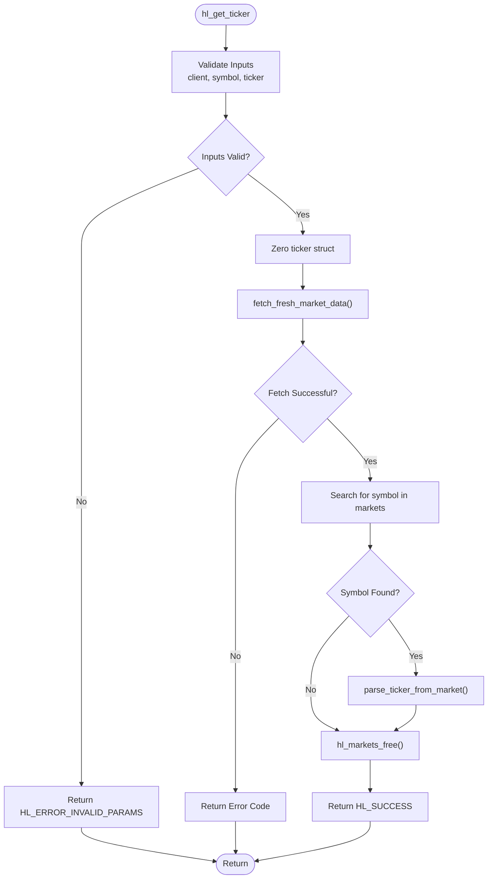

# Ticker Data API

<cite>
**Referenced Files in This Document**   
- [ticker.c](file://src/ticker.c#L188-L213)
- [hl_ticker.h](file://include/hl_ticker.h#L26-L48)
- [hyperliquid.h](file://include/hyperliquid.h#L368-L370)
- [ticker.c](file://src/ticker.c#L95-L183)
- [ticker.c](file://src/ticker.c#L47-L90)
- [markets.c](file://src/markets.c#L416-L422)
- [hl_markets.h](file://include/hl_markets.h#L90-L90)
- [simple_ticker.c](file://examples/simple_ticker.c)
</cite>

## Table of Contents
1. [Introduction](#introduction)
2. [Function Signature](#function-signature)
3. [Parameter Details](#parameter-details)
4. [Return Value](#return-value)
5. [Internal Workflow](#internal-workflow)
6. [hl_ticker_t Output Structure](#hl_ticker_t-output-structure)
7. [Usage Example](#usage-example)
8. [Thread Safety](#thread-safety)
9. [Error Handling](#error-handling)
10. [Performance Considerations](#performance-considerations)

## Introduction
The `hl_get_ticker()` function is the primary interface for retrieving real-time ticker data from the Hyperliquid exchange. It provides essential market information such as last price, 24-hour volume, mark price, and funding rates for a given trading symbol. This function abstracts the complexity of HTTP communication, JSON parsing, and data transformation, offering a simple synchronous API for client applications.

**Section sources**
- [ticker.c](file://src/ticker.c#L188-L213)

## Function Signature
```c
hl_error_t hl_get_ticker(hl_client_t* client, const char* symbol, hl_ticker_t* ticker);
```

This function retrieves the latest ticker information for a specified trading pair. It performs a full market data fetch on each call and parses the relevant entry into the provided output structure.

**Section sources**
- [hyperliquid.h](file://include/hyperliquid.h#L368-L370)

## Parameter Details
The function accepts three parameters:

- **client**: A pointer to an initialized `hl_client_t` handle. This client must be properly configured with network settings and authentication if required. Passing a null pointer will result in an error.
- **symbol**: A null-terminated string representing the trading pair (e.g., "BTC/USD"). The symbol must exactly match one of the available markets on the exchange.
- **ticker**: A pointer to an `hl_ticker_t` structure that will be populated with the retrieved market data upon success. This structure is zeroed before population to ensure clean state.

**Section sources**
- [ticker.c](file://src/ticker.c#L188-L213)

## Return Value
The function returns a value of type `hl_error_t`, which indicates the success or failure of the operation:

- **HL_SUCCESS**: The ticker data was successfully retrieved and parsed.
- **HL_ERROR_INVALID_PARAMS**: One or more input parameters were null.
- **HL_ERROR_NOT_FOUND**: The requested symbol does not exist in the current market list.
- Other error codes may be propagated from underlying HTTP or parsing operations.

**Section sources**
- [hl_ticker.h](file://include/hl_ticker.h#L21-L21)

## Internal Workflow
The `hl_get_ticker()` function follows a sequential workflow to retrieve and process ticker data:

1. Validates all input parameters
2. Zeroes the output `hl_ticker_t` structure
3. Invokes `fetch_fresh_market_data()` to obtain the latest market list
4. Searches through the returned markets for a matching symbol
5. Parses the matching market data into the ticker structure via `parse_ticker_from_market()`
6. Frees allocated memory and returns the result



**Diagram sources**
- [ticker.c](file://src/ticker.c#L188-L213)
- [ticker.c](file://src/ticker.c#L95-L183)
- [ticker.c](file://src/ticker.c#L47-L90)
- [markets.c](file://src/markets.c#L416-L422)

**Section sources**
- [ticker.c](file://src/ticker.c#L188-L213)

## hl_ticker_t Output Structure
The `hl_ticker_t` structure is populated with market data upon successful retrieval. Key fields include:

- **symbol**: Trading pair identifier (e.g., "BTC/USD")
- **last_price**: Last traded price (set to mark price)
- **bid/ask**: Best bid and ask prices (estimated from mark price)
- **volume_24h**: 24-hour trading volume
- **mark_price**: Current mark price for perpetual contracts
- **funding_rate**: Current funding rate
- **open_interest**: Open interest value
- **timestamp/datetime**: Time of data retrieval

Note: Some values like 24h high/low and price change are not available in the source data and are set to zero.

**Section sources**
- [hl_ticker.h](file://include/hl_ticker.h#L26-L48)

## Usage Example
A complete usage example is provided in `simple_ticker.c`. The typical usage pattern involves:

1. Creating and initializing a client
2. Declaring an `hl_ticker_t` variable
3. Calling `hl_get_ticker()` with the desired symbol
4. Checking the return value and using the populated data

The example demonstrates error checking and proper cleanup procedures.

**Section sources**
- [simple_ticker.c](file://examples/simple_ticker.c)

## Thread Safety
The `hl_get_ticker()` function is thread-safe when used with a properly initialized client. The underlying HTTP operations are protected by a mutex lock within the client, preventing race conditions during concurrent access. Multiple threads can safely call this function simultaneously using the same client instance.

**Section sources**
- [ticker.c](file://src/ticker.c#L188-L213)

## Error Handling
The function implements comprehensive error handling:

- **HL_ERROR_INVALID_PARAMS**: Returned when any input pointer is null
- **HL_ERROR_NOT_FOUND**: Returned when the requested symbol is not present in the market list
- Network and API errors are propagated from lower layers (e.g., HL_ERROR_NETWORK, HL_ERROR_API)

Applications should always check the return value before accessing the output structure.

**Section sources**
- [ticker.c](file://src/ticker.c#L188-L213)

## Performance Considerations
Each call to `hl_get_ticker()` triggers a full market data fetch via HTTP, retrieving information for all markets regardless of the requested symbol. This design has important performance implications:

- Frequent calls can lead to unnecessary network traffic and latency
- High-frequency polling is discouraged without caching
- For applications requiring multiple ticker values, consider implementing a local cache

Recommended strategy: Cache results for a short duration (e.g., 1-5 seconds) and refresh only when needed, rather than making repeated API calls for the same or different symbols.

**Section sources**
- [ticker.c](file://src/ticker.c#L188-L213)
- [ticker.c](file://src/ticker.c#L95-L183)