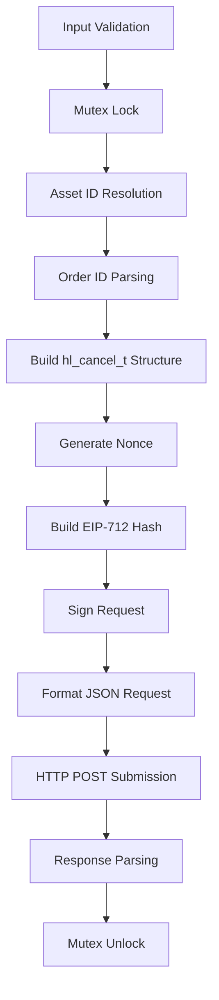
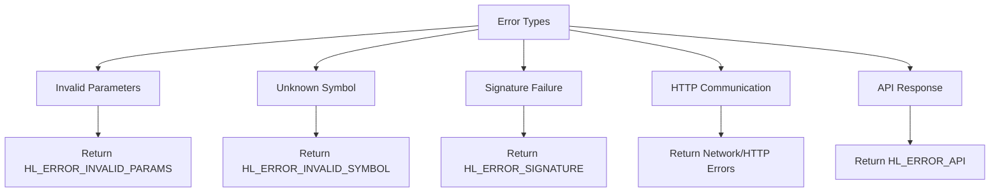
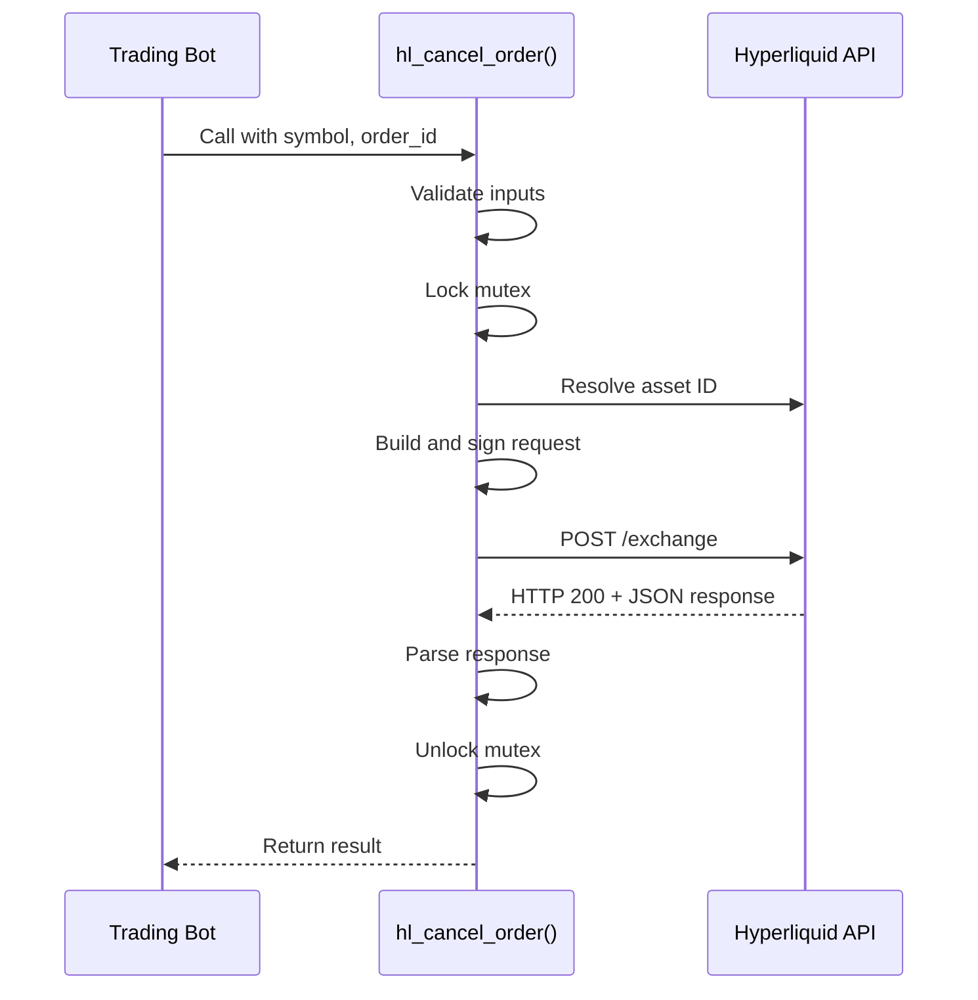
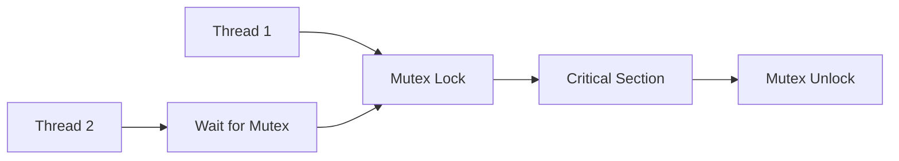

# Order Cancellation

<cite>
**Referenced Files in This Document**   
- [trading_api.c](file://src/trading_api.c)
- [hyperliquid.h](file://include/hyperliquid.h)
- [hl_msgpack.h](file://include/hl_msgpack.h)
- [eip712.c](file://src/crypto/eip712.c)
- [client.c](file://src/http/client.c)
- [trading_bot.c](file://examples/trading_bot.c)
</cite>

## Table of Contents
1. [Introduction](#introduction)
2. [Function Parameters](#function-parameters)
3. [Internal Workflow](#internal-workflow)
4. [Error Handling](#error-handling)
5. [Code Example](#code-example)
6. [Thread Safety](#thread-safety)
7. [Common Pitfalls](#common-pitfalls)
8. [Best Practices](#best-practices)

## Introduction
The `hl_cancel_order()` function is a core component of the Hyperliquid C SDK, responsible for canceling active orders on the Hyperliquid exchange. It provides a thread-safe, secure, and reliable interface for order cancellation by handling input validation, cryptographic signing, HTTP communication, and response parsing. This function plays a critical role in trading strategies where timely order management is essential.

**Section sources**
- [trading_api.c](file://src/trading_api.c#L225-L338)
- [hyperliquid.h](file://include/hyperliquid.h#L244-L247)

## Function Parameters
The `hl_cancel_order()` function accepts four parameters that define the cancellation request and capture its outcome:

- **client (hl_client_t\*)**: A pointer to the initialized client instance containing authentication credentials, network configuration, and state management components required for API communication.
- **symbol (const char\*)**: The trading symbol (e.g., "BTC/USDC:USDC") associated with the order to be canceled, used to resolve the corresponding asset ID.
- **order_id (const char\*)**: The unique identifier of the order to cancel, provided as a string and parsed into a 64-bit unsigned integer for the API request.
- **result (hl_cancel_result_t\*)**: A pointer to a structure that will be populated with the cancellation outcome, including success status and error messages if applicable.

**Section sources**
- [hyperliquid.h](file://include/hyperliquid.h#L244-L247)
- [hyperliquid.h](file://include/hyperliquid.h#L150-L153)

## Internal Workflow
The `hl_cancel_order()` function executes a well-defined sequence of operations to securely cancel an order on the Hyperliquid exchange:

**Diagram sources**
- [trading_api.c](file://src/trading_api.c#L225-L338)

**Section sources**
- [trading_api.c](file://src/trading_api.c#L225-L338)

### Step-by-Step Execution
1. **Input Validation**: The function first validates all input parameters to ensure they are not null pointers.
2. **Mutex Locking**: Thread safety is ensured by acquiring a mutex before accessing shared client resources.
3. **Asset ID Resolution**: The `get_asset_id()` function resolves the symbol to its corresponding numeric asset ID by querying market data.
4. **Order ID Parsing**: The string order ID is converted to a 64-bit unsigned integer using `strtoull()`.
5. **Structure Construction**: A `hl_cancel_t` structure is built with the resolved asset ID and parsed order ID.
6. **Nonce Generation**: A timestamp in milliseconds is obtained to serve as the nonce for the request.
7. **Hash Generation**: The `hl_build_cancel_hash()` function creates the EIP-712 connection ID hash using the cancel action, nonce, and other parameters.
8. **Request Signing**: The hash is signed using the client's private key via `eip712_sign_agent()`, producing a 65-byte signature.
9. **JSON Formatting**: The request payload is constructed as a JSON string containing the action, nonce, signature components (r, s, v), and null vault address.
10. **HTTP Submission**: The JSON payload is sent via POST request to the appropriate exchange endpoint (testnet or mainnet).
11. **Response Parsing**: The HTTP response is examined for status code 200 and presence of '"status":"ok"' in the body.
12. **Result Assignment**: The `result->cancelled` field is set to true if cancellation was successful, otherwise an error message is recorded.
13. **Mutex Unlocking**: The mutex is released to allow other threads to access the client.

## Error Handling
The function implements comprehensive error handling across multiple failure scenarios:

**Diagram sources**
- [trading_api.c](file://src/trading_api.c#L225-L338)

**Section sources**
- [trading_api.c](file://src/trading_api.c#L225-L338)

### Specific Error Conditions
- **Invalid Parameters**: Returns `HL_ERROR_INVALID_PARAMS` when any input pointer is null or client state is invalid.
- **Unknown Symbol**: Returns `HL_ERROR_INVALID_SYMBOL` when the symbol cannot be resolved to an asset ID (except for SOL which has special handling).
- **Signature Failure**: Returns `HL_ERROR_SIGNATURE` when either hash generation or cryptographic signing fails.
- **HTTP Communication**: Maps libcurl errors to appropriate `hl_error_t` codes using `lv3_to_hl_error()`.
- **API Response**: Returns `HL_ERROR_API` when the response body does not contain '"status":"ok"' despite successful HTTP transmission.

## Code Example
The following example from the trading bot demonstrates practical usage of `hl_cancel_order()`:

**Diagram sources**
- [trading_bot.c](file://examples/trading_bot.c#L290-L310)
- [trading_api.c](file://src/trading_api.c#L225-L338)

**Section sources**
- [trading_bot.c](file://examples/trading_bot.c#L290-L310)

## Thread Safety
The `hl_cancel_order()` function ensures thread safety through mutex protection of critical sections:

**Diagram sources**
- [trading_api.c](file://src/trading_api.c#L225-L338)

**Section sources**
- [trading_api.c](file://src/trading_api.c#L225-L338)

The function acquires the client's mutex at the beginning of execution and releases it before returning, preventing race conditions when multiple threads access the same client instance. This guarantees that cryptographic operations, HTTP requests, and shared state modifications occur atomically.

## Common Pitfalls
Developers should be aware of several common issues when using `hl_cancel_order()`:

- **Attempting to cancel filled or already-cancelled orders**: The Hyperliquid API will reject such requests, returning an error response.
- **Using malformed order IDs**: String order IDs must represent valid 64-bit unsigned integers; otherwise, `strtoull()` parsing may produce unexpected results.
- **Invalid symbol names**: Symbols must match exactly with those available on the exchange; case sensitivity and formatting matter.
- **Network connectivity issues**: Intermittent network problems can cause HTTP request failures even with valid parameters.
- **Clock drift**: Significant time differences between client and server may affect nonce validation, though this is mitigated by using current timestamps.

**Section sources**
- [trading_api.c](file://src/trading_api.c#L225-L338)

## Best Practices
To ensure reliable order cancellation, follow these best practices:

- **Verify order status before cancellation**: Use `hl_fetch_order()` or `hl_fetch_open_orders()` to confirm the order is still active before attempting cancellation.
- **Handle asynchronous responses appropriately**: The function returns immediately after receiving the HTTP response; subsequent order status changes should be monitored through WebSocket updates or periodic polling.
- **Implement retry logic with exponential backoff**: For transient network errors, implement retries with increasing delays to avoid overwhelming the API.
- **Monitor cancellation results**: Always check the `result->cancelled` flag and error message to confirm the outcome of the cancellation attempt.
- **Use proper memory management**: Ensure all allocated resources are properly freed, especially when handling multiple cancellation requests.
- **Validate inputs thoroughly**: Perform client-side validation of symbols and order IDs before calling the function to catch errors early.

**Section sources**
- [trading_api.c](file://src/trading_api.c#L225-L338)
- [trading_bot.c](file://examples/trading_bot.c#L290-L310)