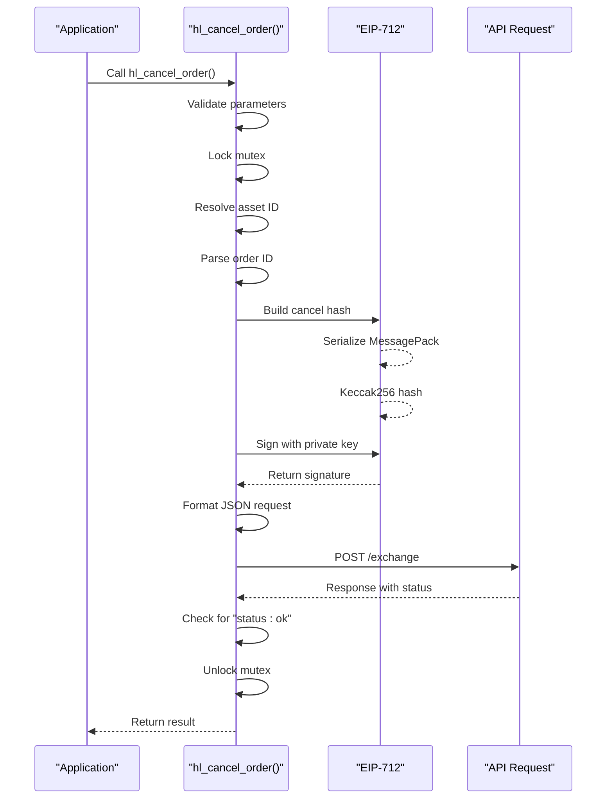
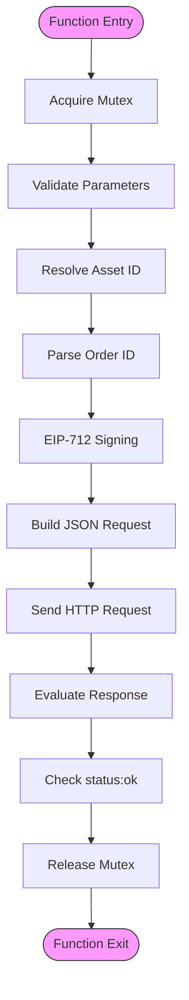

# Order Management

<cite>
**Referenced Files in This Document**   
- [trading_api.c](file://src/trading_api.c)
- [hyperliquid.h](file://include/hyperliquid.h)
- [hl_msgpack.h](file://include/hl_msgpack.h)
- [eip712.c](file://src/crypto/eip712.c)
- [serialize.c](file://src/msgpack/serialize.c)
- [hl_markets.h](file://include/hl_markets.h)
- [markets.c](file://src/markets.c)
- [trading_bot.c](file://examples/trading_bot.c)
</cite>

## Table of Contents
1. [Introduction](#introduction)
2. [hl_cancel_order Function](#hl_cancel_order-function)
3. [hl_modify_order Function](#hl_modify_order-function)
4. [Error Handling and Thread Safety](#error-handling-and-thread-safety)
5. [Usage Patterns and Best Practices](#usage-patterns-and-best-practices)
6. [Common Pitfalls](#common-pitfalls)

## Introduction
This document provides detailed technical documentation for the order management functions `hl_cancel_order()` and `hl_modify_order()` in the Hyperliquid C SDK. These functions enable traders to manage open orders on the Hyperliquid decentralized exchange, with robust error handling, cryptographic security, and thread-safe operations.

**Section sources**
- [hyperliquid.h](file://include/hyperliquid.h#L289-L292)
- [hyperliquid.h](file://include/hyperliquid.h#L312-L315)

## hl_cancel_order Function

The `hl_cancel_order()` function allows users to cancel an existing order on the Hyperliquid exchange. It requires four parameters:
- `client`: The authenticated client instance
- `symbol`: The trading symbol (e.g., "BTC/USDC:USDC")
- `order_id`: The string representation of the order ID to cancel
- `result`: Pointer to a `hl_cancel_result_t` structure that will contain the outcome

The function returns an `hl_error_t` enum value indicating success or failure.

### Internal Workflow

The cancellation process follows a secure, thread-safe workflow:

1. **Parameter Validation**: Checks for null pointers in client, symbol, order_id, and result parameters
2. **Thread Safety**: Acquires a mutex lock to prevent race conditions during critical operations
3. **Asset ID Resolution**: 
   - Constructs a full symbol (e.g., "BTC" → "BTC/USDC:USDC")
   - Fetches market data via `hl_fetch_markets()`
   - Resolves the asset ID using `hl_get_asset_id()`
4. **Order ID Parsing**: Converts the string order_id to a 64-bit unsigned integer using `strtoull()`
5. **Cancellation Structure**: Constructs a `hl_cancel_t` structure containing the asset ID and order ID
6. **EIP-712 Signing Process**:
   - Generates a connection ID hash using `hl_build_cancel_hash()`
   - Signs the hash with the user's private key via `eip712_sign_agent()`
   - Converts the binary signature to hexadecimal format
7. **Request Construction**: Formats a JSON request containing the action, nonce, signature, and vault address
8. **API Communication**: Sends a POST request to the exchange endpoint
9. **Response Evaluation**: Success is determined by checking for `"status":"ok"` in the response body



**Diagram sources**
- [trading_api.c](file://src/trading_api.c#L225-L338)
- [serialize.c](file://src/msgpack/serialize.c#L221-L232)
- [eip712.c](file://src/crypto/eip712.c#L260-L295)

**Section sources**
- [trading_api.c](file://src/trading_api.c#L225-L338)
- [hl_msgpack.h](file://include/hl_msgpack.h#L112-L116)
- [eip712.c](file://src/crypto/eip712.c#L260-L295)

## hl_modify_order Function

The `hl_modify_order()` function enables modification of existing orders on the Hyperliquid exchange. Unlike `hl_cancel_order()`, this function returns an `int` rather than an `hl_error_t`, and requires the original order ID as a `uint64_t` parameter.

### Function Signature
```c
int hl_modify_order(hl_client_t *client,
                    uint64_t order_id,
                    const hl_order_request_t *new_order,
                    hl_order_result_t *result);
```

### Inferred Behavior

While the implementation is not directly visible in the provided codebase, the behavior can be inferred from the function signature and context:

1. The function likely implements an atomic cancel-and-replace operation
2. It uses the existing order ID to identify the order to be modified
3. It places a new order with the parameters specified in `new_order`
4. The operation maintains thread safety through mutex protection
5. It returns detailed order information in the `result` structure

The modification process would follow a similar security workflow as order placement and cancellation, including EIP-712 signing and proper nonce management.

**Section sources**
- [hyperliquid.h](file://include/hyperliquid.h#L312-L315)

## Error Handling and Thread Safety

Both order management functions implement comprehensive error handling and thread safety mechanisms.

### Error Types

The system handles several error categories:

- **Invalid Parameters**: Returns `HL_ERROR_INVALID_PARAMS` for null pointers
- **Invalid Symbol**: Returns `HL_ERROR_INVALID_SYMBOL` for unrecognized symbols
- **Signature Failures**: Returns `HL_ERROR_SIGNATURE` for signing issues
- **API Communication**: Returns `HL_ERROR_API` for HTTP failures or invalid responses
- **Network Issues**: Returns `HL_ERROR_NETWORK` for connectivity problems

### Thread Safety

Both functions ensure thread safety through:

1. **Mutex Protection**: Critical sections are protected by a pthread mutex
2. **Atomic Operations**: The entire cancellation/modification process is atomic
3. **Resource Management**: Proper cleanup of allocated resources even on error

The mutex is acquired at the beginning of the critical section and released before returning, ensuring that no two threads can simultaneously perform order modifications on the same client.



**Diagram sources**
- [trading_api.c](file://src/trading_api.c#L225-L338)
- [markets.c](file://src/markets.c#L389-L411)
- [eip712.c](file://src/crypto/eip712.c#L260-L295)

**Section sources**
- [trading_api.c](file://src/trading_api.c#L225-L338)
- [hl_markets.h](file://include/hl_markets.h#L83-L83)
- [markets.c](file://src/markets.c#L427-L457)

## Usage Patterns and Best Practices

### Cancellation Example

Based on the `trading_bot.c` example, a typical cancellation pattern:

```c
hl_cancel_result_t result = {0};
hl_error_t err = hl_cancel_order(client, "BTC/USDC:USDC", "12345", &result);

if (err == HL_SUCCESS && result.cancelled) {
    printf("Order cancelled successfully\n");
} else {
    printf("Cancellation failed: %s\n", result.error);
}
```

### Best Practices

1. **Always Check Results**: Verify both the return code and result structure
2. **Handle Asynchronous Responses**: Be prepared for delayed confirmation
3. **Use Proper Symbol Format**: Ensure symbols match the expected format (e.g., "BTC/USDC:USDC")
4. **Manage Memory**: Free any allocated strings in result structures
5. **Implement Retry Logic**: For transient network errors
6. **Validate Order Status**: Check if the order is still cancellable before attempting

**Section sources**
- [trading_bot.c](file://examples/trading_bot.c#L250-L270)

## Common Pitfalls

### Attempting to Cancel Filled Orders

Users often attempt to cancel orders that have already been filled. The API will reject such requests with an appropriate error message. Always check the order status before cancellation:

```c
// Check order status first
hl_order_t order;
if (hl_fetch_order(client, order_id, symbol, &order) == HL_SUCCESS) {
    if (order.status == HL_ORDER_STATUS_FILLED) {
        printf("Cannot cancel filled order\n");
        return;
    }
}
```

### Using Incorrect Order IDs

Ensure the order ID is provided as a string and represents a valid numeric value. Invalid order IDs will result in parsing errors or API rejection.

### Invalid Symbol Format

The system expects specific symbol formats. Using incorrect formats (e.g., "BTC" instead of "BTC/USDC:USDC") will result in `HL_ERROR_INVALID_SYMBOL`.

### Thread Safety Violations

Avoid calling order management functions from multiple threads without proper synchronization, as this could lead to nonce conflicts or signature errors.

**Section sources**
- [trading_bot.c](file://examples/trading_bot.c#L250-L270)
- [trading_api.c](file://src/trading_api.c#L225-L338)