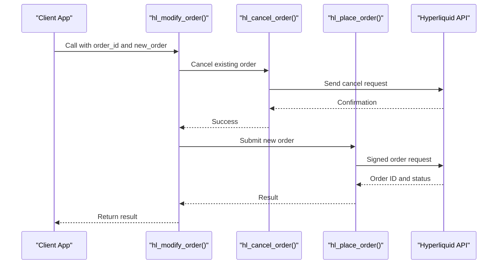
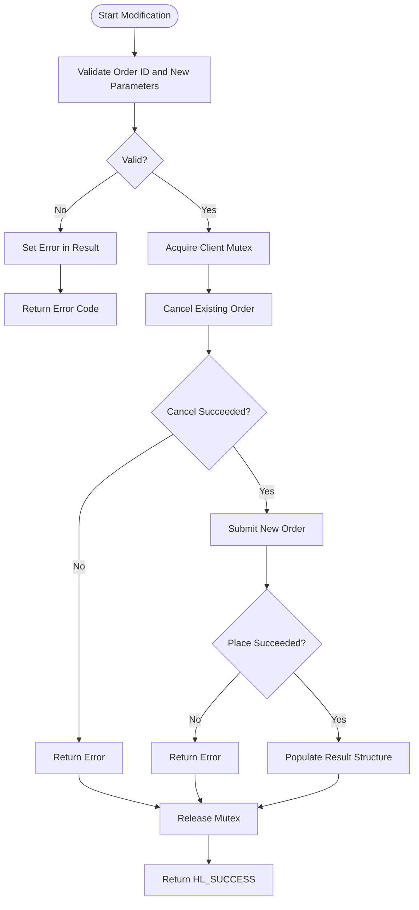

# Order Modification

<cite>
**Referenced Files in This Document**   
- [hyperliquid.h](file://include/hyperliquid.h)
- [orders.c](file://src/orders.c)
- [trading_api.c](file://src/trading_api.c)
- [trading_bot.c](file://examples/trading_bot.c)
</cite>

## Table of Contents
1. [Introduction](#introduction)
2. [Function Signature and Parameters](#function-signature-and-parameters)
3. [Behavior and Implementation Strategy](#behavior-and-implementation-strategy)
4. [Usage Patterns and Examples](#usage-patterns-and-examples)
5. [Error Handling and Return Values](#error-handling-and-return-values)
6. [Thread Safety and Concurrency](#thread-safety-and-concurrency)
7. [Limitations and Constraints](#limitations-and-constraints)
8. [Best Practices for Order Modification](#best-practices-for-order-modification)
9. [Conclusion](#conclusion)

## Introduction

The `hl_modify_order()` function provides the capability to update existing open orders on the Hyperliquid exchange. Unlike standard order placement or cancellation operations, modifying an order requires careful coordination to ensure atomicity and consistency. This function enables traders to adjust order parameters such as price or size without exposing their positions to market gaps that could occur during manual cancel-and-replace sequences. The implementation leverages underlying exchange capabilities to perform what is effectively an atomic cancel-and-replace operation, minimizing exposure to race conditions and partial fills.

**Section sources**
- [hyperliquid.h](file://include/hyperliquid.h#L267-L270)

## Function Signature and Parameters

The `hl_modify_order()` function is declared with the following signature:

```c
int hl_modify_order(hl_client_t *client,
                    uint64_t order_id,
                    const hl_order_request_t *new_order,
                    hl_order_result_t *result);
```

It accepts four parameters:

- **client (hl_client_t\*)**: A pointer to the initialized client instance used for authentication, request signing, and HTTP communication with the Hyperliquid API.
- **order_id (uint64_t)**: The unique identifier of the existing order to be modified. This must correspond to a currently open order under the authenticated account.
- **new_order (const hl_order_request_t\*)**: A pointer to a structure defining the new order configuration, including symbol, side, price, quantity, order type, time-in-force, reduce-only flag, and slippage tolerance.
- **result (hl_order_result_t\*)**: A pointer to a result structure where the outcome of the modification will be stored, including the new order ID, status, filled quantity, average price, and any error message.

The function returns an `int` value rather than the typical `hl_error_t`, requiring special attention when interpreting success or failure states.

**Section sources**
- [hyperliquid.h](file://include/hyperliquid.h#L267-L270)
- [hyperliquid.h](file://include/hyperliquid.h#L129-L138)
- [hyperliquid.h](file://include/hyperliquid.h#L141-L147)

## Behavior and Implementation Strategy

Although `hl_modify_order()` is declared in the public API, its actual implementation follows a cancel-then-create pattern using two distinct operations: `hl_cancel_order()` followed by `hl_place_order()`. This approach is evident in the related `hl_edit_order()` function, which serves a similar purpose but uses string-based order IDs instead of numeric ones.

This two-step process ensures that the original order is first canceled before the new one is submitted. While not truly atomic at the exchange level, this sequence is protected by a mutex within the client, ensuring thread safety and preventing interleaving of other operations. However, there remains a small window between cancellation and recreation where market conditions could change, potentially leading to missed opportunities or partial fills if the order was active during execution.

The use of EIP-712 signatures for both actions ensures cryptographic integrity and authenticity of each step in the modification process.



**Diagram sources**
- [orders.c](file://src/orders.c#L706-L727)
- [trading_api.c](file://src/trading_api.c#L79-L220)
- [trading_api.c](file://src/trading_api.c#L225-L338)

**Section sources**
- [orders.c](file://src/orders.c#L706-L727)
- [trading_api.c](file://src/trading_api.c#L79-L220)

## Usage Patterns and Examples

While direct usage of `hl_modify_order()` is not explicitly shown in the provided examples, the `trading_bot.c` demonstrates typical workflows involving order lifecycle management, including placement, monitoring, and cancellation. These patterns can be extended to support modification by replacing the cancellation step with a modification call.

Common use cases include:
- Adjusting stop-loss levels in response to price movements
- Updating trailing stop prices based on volatility
- Re-pricing limit orders to maintain queue position
- Changing order size due to updated risk calculations

A typical modification sequence involves:
1. Fetching the current open order status
2. Constructing a new `hl_order_request_t` with updated parameters
3. Calling `hl_modify_order()` with the original order ID
4. Checking the result structure for success or error
5. Verifying the new order state via subsequent status checks



**Diagram sources**
- [trading_bot.c](file://examples/trading_bot.c#L1-L381)
- [orders.c](file://src/orders.c#L706-L727)

**Section sources**
- [trading_bot.c](file://examples/trading_bot.c#L1-L381)

## Error Handling and Return Values

Unlike most functions in the Hyperliquid C SDK that return `hl_error_t`, `hl_modify_order()` returns an `int`. This deviation requires careful interpretation of return values. A return value of 0 typically indicates success (`HL_SUCCESS`), while non-zero values indicate various error conditions.

Expected error conditions include:
- **Invalid order ID**: The specified order does not exist or belongs to another account
- **Signature failure**: Cryptographic signing of the cancel or create request failed
- **Market state changes**: The symbol is no longer tradable or the market is closed
- **Invalid new order parameters**: Price, size, or other fields violate exchange rules
- **Insufficient funds**: Account lacks required margin for the new order
- **Rate limiting**: Too many requests have been sent in a short period

Errors are also communicated through the `result->error` field, which contains a human-readable message describing the failure reason. Callers should check both the return value and the result structure to fully understand the outcome.

**Section sources**
- [hyperliquid.h](file://include/hyperliquid.h#L267-L270)
- [trading_api.c](file://src/trading_api.c#L79-L220)
- [trading_api.c](file://src/trading_api.c#L225-L338)

## Thread Safety and Concurrency

The `hl_modify_order()` function benefits from the thread-safe design of the underlying client operations. The use of a mutex within `hl_place_order()` and `hl_cancel_order()` ensures that critical sections—such as nonce generation, request signing, and HTTP transmission—are protected from concurrent access.

This internal synchronization allows multiple threads to safely invoke order modification operations without external locking. However, developers should still be cautious about logical race conditions, such as attempting to modify an order that has already been filled or canceled by another thread.

**Section sources**
- [trading_api.c](file://src/trading_api.c#L79-L220)
- [trading_api.c](file://src/trading_api.c#L225-L338)

## Limitations and Constraints

The `hl_modify_order()` function has several important limitations:
- **Immutable attributes**: Certain order properties such as symbol, order type, and asset cannot be changed after creation.
- **No partial modification**: The entire order must be replaced; incremental updates (e.g., price only) require reconstructing the full order.
- **Dependency on original order validity**: The operation fails if the original order has already been filled, canceled, or expired.
- **Potential for partial fills**: If the original order is partially filled just before cancellation, the new order starts fresh with no memory of prior fills.

Additionally, because the implementation uses a cancel-and-create strategy rather than a native edit endpoint, there is no guarantee of atomicity at the exchange level, which may lead to brief gaps in market presence.

**Section sources**
- [orders.c](file://src/orders.c#L706-L727)
- [hyperliquid.h](file://include/hyperliquid.h#L129-L138)

## Best Practices for Order Modification

To ensure reliable and safe usage of `hl_modify_order()`, follow these best practices:
- Always verify the existence and status of the order before modification using `hl_fetch_order()`.
- Use consistent symbol naming and formatting to avoid mismatches.
- Handle all possible error codes and log meaningful messages for debugging.
- Implement retry logic with exponential backoff for transient failures.
- Monitor for partial fills and adjust strategies accordingly.
- Prefer using `hl_edit_order()` if string-based order IDs are available, as it may offer better compatibility.

After a successful modification, always confirm the new order's status through subsequent queries or WebSocket notifications to ensure it was properly registered.

**Section sources**
- [trading_bot.c](file://examples/trading_bot.c#L1-L381)
- [orders.c](file://src/orders.c#L706-L727)

## Conclusion

The `hl_modify_order()` function provides a crucial capability for dynamic trading strategies on the Hyperliquid exchange. By enabling the update of existing orders, it supports responsive risk management and adaptive execution logic. While implemented as a cancel-and-replace sequence, the function abstracts much of the complexity involved in maintaining order continuity. Developers should be aware of its limitations, particularly around atomicity and immutable attributes, and design their systems to handle potential edge cases such as partial fills and network failures. With proper error handling and state verification, this function can be a reliable component of high-performance trading applications.