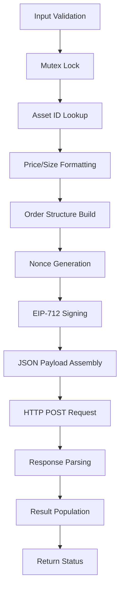

# Order Placement

<cite>
**Referenced Files in This Document**   
- [trading_api.c](file://src/trading_api.c)
- [hyperliquid.h](file://include/hyperliquid.h)
- [simple_trade.c](file://examples/simple_trade.c)
- [hl_http.h](file://include/hl_http.h)
- [hl_crypto_internal.h](file://include/hl_crypto_internal.h)
- [hl_msgpack.h](file://include/hl_msgpack.h)
- [client.c](file://src/client.c)
</cite>

## Table of Contents
1. [Introduction](#introduction)
2. [Function Parameters](#function-parameters)
3. [Execution Flow](#execution-flow)
4. [Usage Example](#usage-example)
5. [Error Handling](#error-handling)
6. [Performance Considerations](#performance-considerations)
7. [Memory Management](#memory-management)
8. [Conclusion](#conclusion)

## Introduction
The `hl_place_order()` function is the primary interface for submitting new orders to the Hyperliquid exchange. This function handles the complete order placement workflow including input validation, cryptographic signing, HTTP communication, and response parsing. It is designed to be thread-safe and production-ready, following the exchange's API specifications for order submission.

**Section sources**
- [trading_api.c](file://src/trading_api.c#L79-L220)
- [hyperliquid.h](file://include/hyperliquid.h#L276-L278)

## Function Parameters
The `hl_place_order()` function accepts three parameters that define the order request and capture the result:

### client (hl_client_t*)
Pointer to the initialized Hyperliquid client instance containing authentication credentials, network configuration, and internal state. The client must be created using `hl_client_create()` and contains the wallet address, private key, testnet flag, HTTP client, and mutex for thread safety.

### request (hl_order_request_t*)
Structure containing the order details:
- **symbol**: Trading symbol (e.g., "BTC", "ETH")
- **side**: Order side (HL_SIDE_BUY or HL_SIDE_SELL)
- **price**: Limit price (0 for market orders)
- **quantity**: Order quantity
- **order_type**: Order type (HL_ORDER_TYPE_LIMIT or HL_ORDER_TYPE_MARKET)
- **time_in_force**: Time in force (HL_TIF_GTC, HL_TIF_IOC, or HL_TIF_ALO)
- **reduce_only**: Reduce-only flag
- **slippage_bps**: Slippage in basis points (for market orders)

### result (hl_order_result_t*)
Output structure populated with the order result:
- **order_id**: Allocated string containing the order ID (caller must free)
- **status**: Order status (HL_ORDER_STATUS_OPEN, HL_ORDER_STATUS_FILLED, etc.)
- **filled_quantity**: Filled quantity
- **average_price**: Average fill price
- **error**: Error message buffer (256 bytes)

**Section sources**
- [hyperliquid.h](file://include/hyperliquid.h#L127-L145)

## Execution Flow
The `hl_place_order()` function follows a well-defined execution flow to ensure secure and reliable order submission:



**Diagram sources**
- [trading_api.c](file://src/trading_api.c#L79-L220)

### Input Validation
The function first validates that all input parameters are non-null. If any parameter is invalid, it returns `HL_ERROR_INVALID_PARAMS`. It then extracts the client components (wallet address, private key, testnet flag, HTTP client, and mutex) using accessor functions.

### Mutex Locking
For thread safety, the function locks the client's mutex before proceeding with the order placement process. This prevents race conditions when multiple threads attempt to place orders simultaneously.

### Asset ID Lookup
The function calls `get_asset_id()` to retrieve the numeric asset ID corresponding to the requested symbol. This function fetches market data from the exchange API and looks up the asset ID. If the symbol is unknown (and not SOL), it returns `HL_ERROR_INVALID_SYMBOL`.

### Price and Size Formatting
The order price and quantity are formatted as strings using `snprintf()` with the `%g` format specifier to ensure proper decimal representation without trailing zeros.

### Order Structure Construction
The function constructs an `hl_order_t` structure containing:
- **a**: Asset ID
- **b**: Buy flag (true for buy, false for sell)
- **p**: Price string
- **s**: Size string
- **r**: Reduce-only flag
- **limit**: Time-in-force configuration (Gtc for Good Till Cancel)

### Nonce Generation
The current timestamp in milliseconds is obtained using `get_timestamp_ms()` and used as the nonce for the order. This ensures each order has a unique identifier and prevents replay attacks.

### EIP-712 Signing
The function builds an action hash using `hl_build_order_hash()` and signs it using `eip712_sign_agent()`. The signature is generated according to the EIP-712 standard with the domain name "Exchange", chain ID 1337, and source "a" (mainnet) or "b" (testnet).

### JSON Payload Assembly
The function assembles a JSON payload containing:
- **action**: Order action with asset, side, price, size, and time-in-force
- **nonce**: Timestamp in milliseconds
- **signature**: R, S, and V components of the EIP-712 signature
- **vaultAddress**: null (not used)

### HTTP POST Request
The function constructs the exchange URL based on the testnet flag and makes a POST request to the `/exchange` endpoint using `http_client_post()`. The request includes the JSON payload and "Content-Type: application/json" header.

### Response Parsing
Upon receiving the response, the function parses the JSON body to extract the order ID. It uses `strstr()` to locate the `"oid":` string and `sscanf()` to parse the integer order ID. The order ID is then converted to a string and duplicated using `strdup()`.

**Section sources**
- [trading_api.c](file://src/trading_api.c#L79-L220)
- [hl_msgpack.h](file://include/hl_msgpack.h#L93-L98)
- [hl_crypto_internal.h](file://include/hl_crypto_internal.h#L83-L83)
- [hl_http.h](file://include/hl_http.h#L97-L97)

## Usage Example
The following example demonstrates how to use `hl_place_order()` to submit a limit order:

```c
// Create order request
hl_order_request_t order = {
    .symbol = "BTC",
    .side = HL_SIDE_BUY,
    .price = 95000.0,
    .quantity = 0.001,
    .order_type = HL_ORDER_TYPE_LIMIT,
    .time_in_force = HL_TIF_GTC,
    .reduce_only = false,
    .slippage_bps = 0
};

// Place order
hl_order_result_t result;
int ret = hl_place_order(client, &order, &result);

if (ret == HL_SUCCESS) {
    printf("Order placed successfully!\n");
    printf("Order ID: %s\n", result.order_id);
    printf("Status: %s\n", 
           result.status == HL_ORDER_STATUS_OPEN ? "OPEN" : "FILLED");
    
    // Free the order ID string
    if (result.order_id) {
        free(result.order_id);
    }
} else {
    fprintf(stderr, "Failed to place order: %s\n", hl_error_string(ret));
    if (strlen(result.error) > 0) {
        fprintf(stderr, "API Error: %s\n", result.error);
    }
}
```

**Section sources**
- [simple_trade.c](file://examples/simple_trade.c#L1-L165)

## Error Handling
The `hl_place_order()` function returns specific error codes to indicate different failure conditions:

### HL_ERROR_INVALID_PARAMS
Returned when:
- Any input parameter is NULL
- Client state is invalid (missing wallet, key, HTTP client, or mutex)

### HL_ERROR_INVALID_SYMBOL
Returned when:
- The requested symbol cannot be found in the market data
- The asset ID lookup fails (except for SOL which has special handling)

### HL_ERROR_SIGNATURE
Returned when:
- Building the order hash fails
- EIP-712 signing fails
- This typically indicates a cryptographic error

### HL_ERROR_API
Returned when:
- HTTP request fails (non-200 status code)
- Empty response from the exchange
- Failed to parse order ID from response
- This covers general API communication failures

**Section sources**
- [trading_api.c](file://src/trading_api.c#L79-L220)
- [hyperliquid.h](file://include/hyperliquid.h#L124-L136)

## Performance Considerations
The `hl_place_order()` function has several performance characteristics that should be considered in high-frequency trading scenarios:

### Blocking Nature
The function is synchronous and blocks until the HTTP request completes and the response is received. This can introduce latency in high-frequency trading applications where rapid order submission is required.

### Mutex Contention
The function uses a mutex to ensure thread safety during order placement. In multi-threaded applications, this can create a bottleneck when multiple threads attempt to place orders simultaneously, leading to contention and reduced throughput.

### Network Latency
The function makes an HTTP POST request to the exchange API, which introduces network latency. The actual round-trip time depends on the network conditions and the exchange server response time.

### Cryptographic Operations
The EIP-712 signing process involves multiple cryptographic operations (domain hash, struct hash, signing hash, ECDSA signature) which are computationally intensive and can impact performance when placing orders at high frequency.

**Section sources**
- [trading_api.c](file://src/trading_api.c#L79-L220)
- [client.c](file://src/client.c#L1-L197)

## Memory Management
Proper memory management is critical when using `hl_place_order()`:

### Order ID Allocation
The `order_id` field in the `hl_order_result_t` structure is allocated using `strdup()`. The caller is responsible for freeing this memory using `free()` when it is no longer needed to prevent memory leaks.

### Result Structure
The `hl_order_result_t` structure itself is not allocated by the function - it is provided by the caller. The caller is responsible for ensuring the structure remains valid for the duration of the function call.

### Error Message Buffer
The `error` field is a fixed-size buffer (256 bytes) within the result structure. No additional memory allocation is performed for error messages.

**Section sources**
- [trading_api.c](file://src/trading_api.c#L79-L220)
- [hyperliquid.h](file://include/hyperliquid.h#L139-L145)

## Conclusion
The `hl_place_order()` function provides a comprehensive interface for submitting orders to the Hyperliquid exchange. It handles all aspects of order placement including input validation, cryptographic signing, HTTP communication, and response parsing. The function is designed to be thread-safe and production-ready, making it suitable for both simple trading applications and high-frequency trading systems. Proper error handling and memory management are essential for reliable operation.