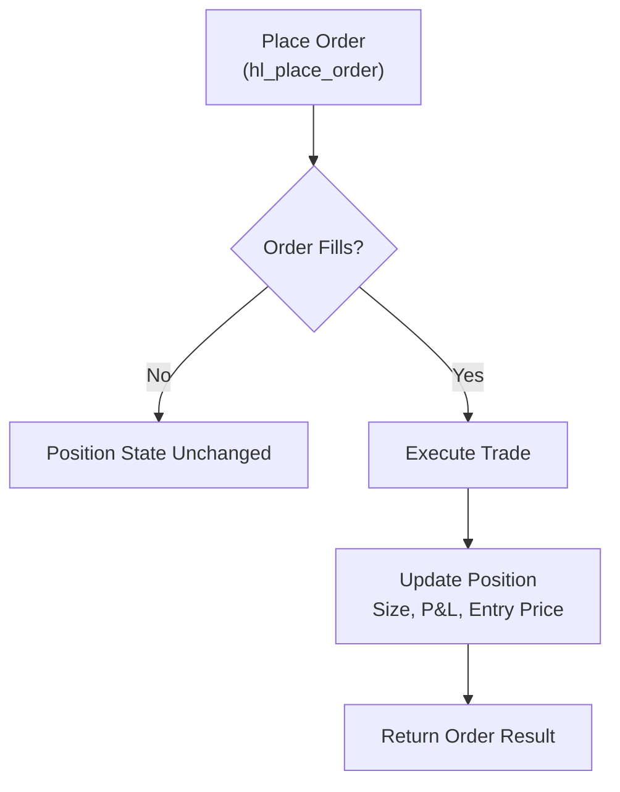
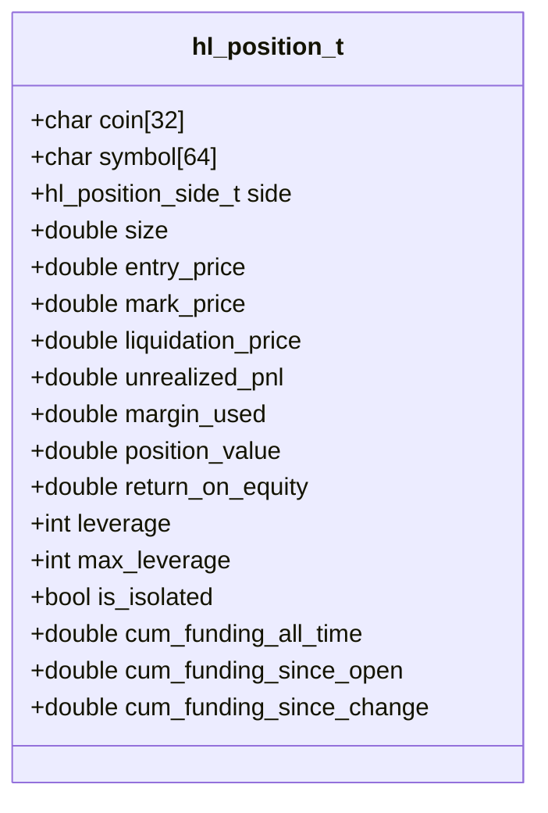
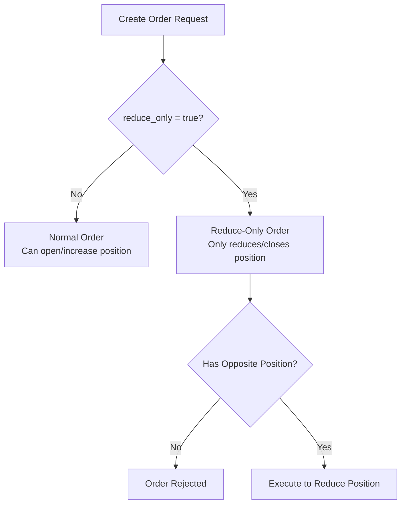
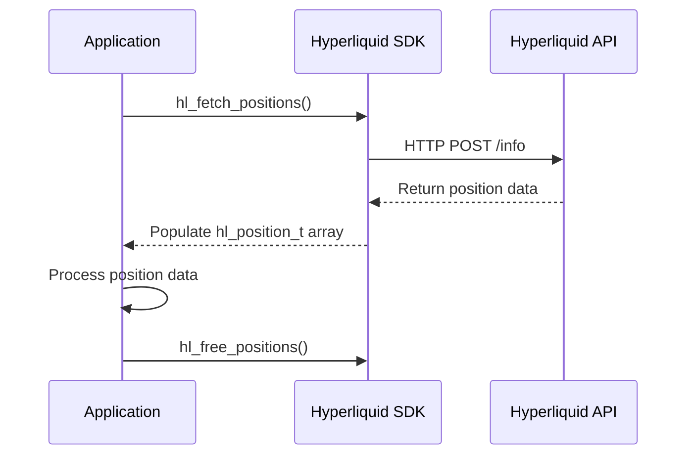

# Position Management

<cite>
**Referenced Files in This Document**   
- [hl_account.h](file://include/hl_account.h)
- [simple_positions.c](file://examples/simple_positions.c)
- [trading_api.c](file://src/trading_api.c)
- [leverage.c](file://src/leverage.c)
- [hyperliquid.h](file://include/hyperliquid.h)
</cite>

## Table of Contents
1. [Introduction](#introduction)
2. [Position Lifecycle and Trading Workflow](#position-lifecycle-and-trading-workflow)
3. [Position Data Structure](#position-data-structure)
4. [Fetching Position Data](#fetching-position-data)
5. [Position Modification via Order Placement](#position-modification-via-order-placement)
6. [Reduce-Only Orders](#reduce-only-orders)
7. [Leverage Management](#leverage-management)
8. [Calculating P&L](#calculating-pnl)
9. [Example Usage](#example-usage)
10. [Conclusion](#conclusion)

## Introduction

Position management in the Hyperliquid C SDK is performed indirectly through trading operations and account queries rather than direct modification endpoints. This document explains how developers can retrieve, interpret, and manage open positions using the available API functions. Positions are updated as a result of order execution, and their current state can be queried using dedicated account functions. The `hl_position_t` structure provides comprehensive details about each open position, including size, entry price, leverage, and unrealized P&L.

## Position Lifecycle and Trading Workflow

Positions are created, modified, and closed through the placement of orders via the `hl_place_order` function. There is no dedicated "modify position" endpoint; instead, position changes occur as a result of executing trades:

1. A new long position is opened by placing a buy order
2. A new short position is opened by placing a sell order
3. An existing position is reduced by placing an order on the opposite side
4. A position is fully closed by placing an opposite-side order with sufficient size

The system automatically updates position state after order execution. Developers should query positions before and after trading actions to verify the resulting position state.



**Diagram sources**
- [trading_api.c](file://src/trading_api.c#L79-L220)
- [account.c](file://src/account.c#L450-L540)

**Section sources**
- [trading_api.c](file://src/trading_api.c#L79-L220)
- [account.c](file://src/account.c#L450-L540)

## Position Data Structure

The `hl_position_t` structure contains comprehensive information about an open position:



**Diagram sources**
- [hl_account.h](file://include/hl_account.h#L85-L108)

**Section sources**
- [hl_account.h](file://include/hl_account.h#L85-L108)

## Fetching Position Data

The SDK provides two functions to retrieve position information:

- `hl_fetch_positions`: Retrieves all open positions
- `hl_fetch_position`: Retrieves a single position by symbol

Both functions require a valid client instance and return position data through output parameters. The caller is responsible for freeing the allocated memory using `hl_free_positions`.

```c
// Example usage pattern
hl_position_t* positions = NULL;
size_t count = 0;
hl_error_t err = hl_fetch_positions(client, &positions, &count);

// Process positions...
// Then free memory
if (positions) {
    hl_free_positions(positions, count);
}
```

**Section sources**
- [hl_account.h](file://include/hl_account.h#L162-L166)
- [hl_account.h](file://include/hl_account.h#L176-L180)
- [account.c](file://src/account.c#L545-L587)

## Position Modification via Order Placement

Since there is no direct position modification function, all position changes are achieved through order placement. To modify a position:

1. Query current position state using `hl_fetch_position`
2. Calculate desired trade size and price
3. Create an `hl_order_request_t` with appropriate parameters
4. Execute the order using `hl_place_order`
5. Verify the updated position state by querying again

For example, to reduce a long position, place a sell order. To increase a long position, place another buy order (which will adjust the average entry price accordingly).

**Section sources**
- [trading_api.c](file://src/trading_api.c#L79-L220)
- [hyperliquid.h](file://include/hyperliquid.h#L278-L280)

## Reduce-Only Orders

Reduce-only orders are a special type of order that can only decrease or close an existing position, never increase it. When the `reduce_only` flag is set to `true` in an `hl_order_request_t`, the order will:

- Only execute if it reduces the size of an existing position
- Be rejected if it would open a new position or increase an existing one
- Help prevent accidental position increases during risk management operations

This feature is particularly useful for implementing stop-loss orders or position reduction strategies.



**Diagram sources**
- [hyperliquid.h](file://include/hyperliquid.h#L129-L138)
- [trading_api.c](file://src/trading_api.c#L79-L220)

**Section sources**
- [hyperliquid.h](file://include/hyperliquid.h#L129-L138)

## Leverage Management

Leverage settings for positions are managed separately through the `hl_set_leverage` function. This function allows setting leverage for specific symbols or globally. Leverage affects the margin requirements and liquidation price of positions.

```c
hl_error_t result = hl_set_leverage(client, 10, "BTC/USDC:USDC");
if (result == HL_SUCCESS) {
    printf("Leverage set to 10x for BTC\n");
}
```

The current leverage and maximum allowable leverage are included in the `hl_position_t` structure, allowing applications to monitor and adjust leverage settings as needed.

**Section sources**
- [leverage.c](file://src/leverage.c#L14-L125)
- [hyperliquid.h](file://include/hyperliquid.h#L524-L526)

## Calculating P&L

The SDK provides the `unrealized_pnl` field in the `hl_position_t` structure, which represents the current profit or loss of the position based on the difference between entry price and current mark price. The P&L calculation takes into account:

- Position side (long or short)
- Position size
- Entry price
- Current mark price

Developers can use this value directly or implement custom P&L calculations based on the position data. The unrealized P&L is updated in real-time as market prices change.

**Section sources**
- [hl_account.h](file://include/hl_account.h#L85-L108)

## Example Usage

The `simple_positions.c` example demonstrates how to work with positions in practice. It shows:

- Creating a client instance
- Fetching all open positions
- Querying a specific position by symbol
- Displaying position details including P&L and leverage
- Proper memory management with `hl_free_positions`

This example serves as a template for implementing position management functionality in applications.



**Diagram sources**
- [simple_positions.c](file://examples/simple_positions.c#L0-L119)
- [account.c](file://src/account.c#L450-L540)

**Section sources**
- [simple_positions.c](file://examples/simple_positions.c#L0-L119)

## Conclusion

Position management in the Hyperliquid C SDK follows a trading-centric model where positions are modified through order execution rather than direct API calls. By combining order placement with position queries, developers can implement sophisticated position management strategies. The comprehensive `hl_position_t` structure provides all necessary data for monitoring position risk, calculating P&L, and making trading decisions. Always remember to query position state before and after trading actions to maintain accurate state tracking in your application.