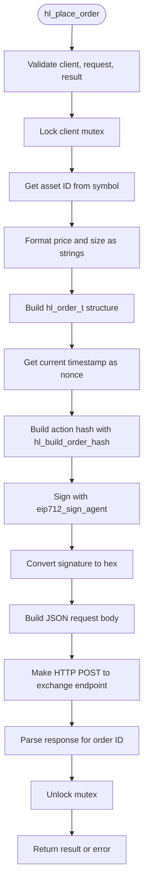
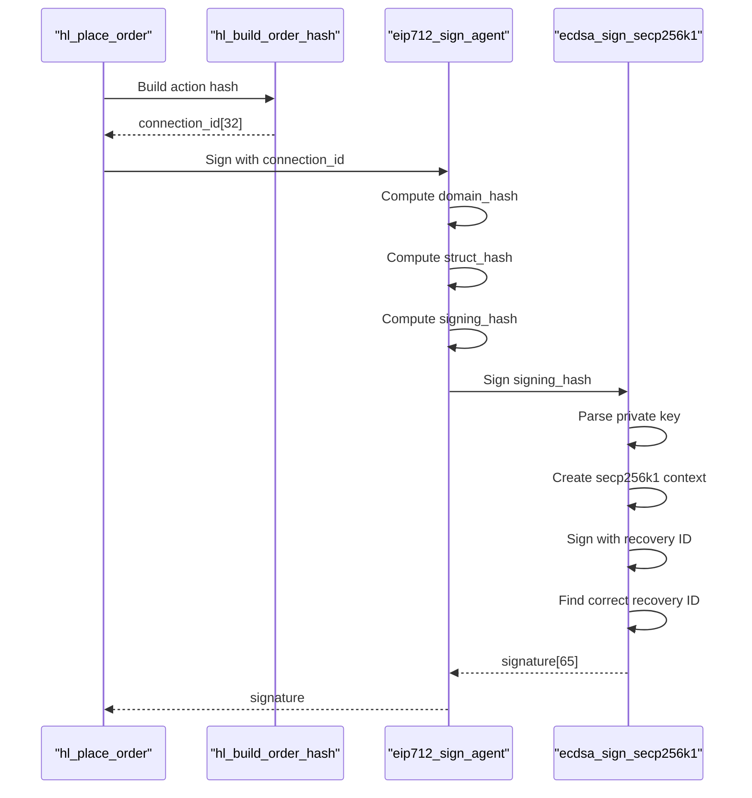
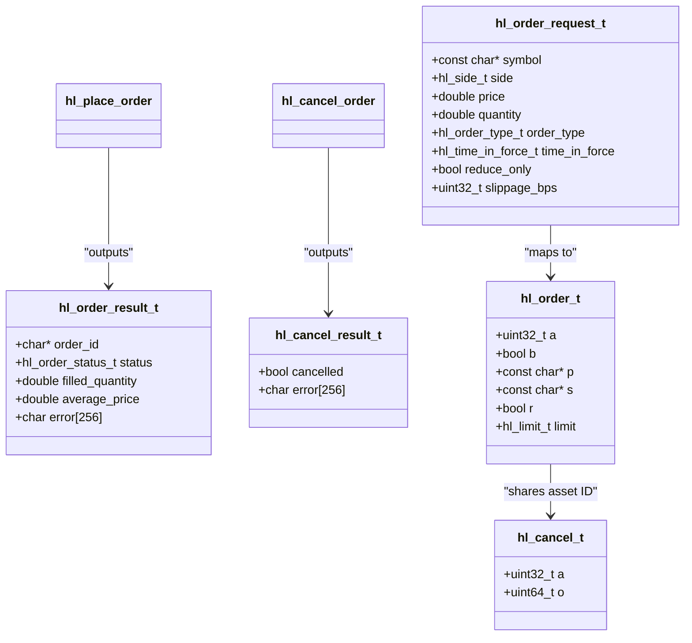
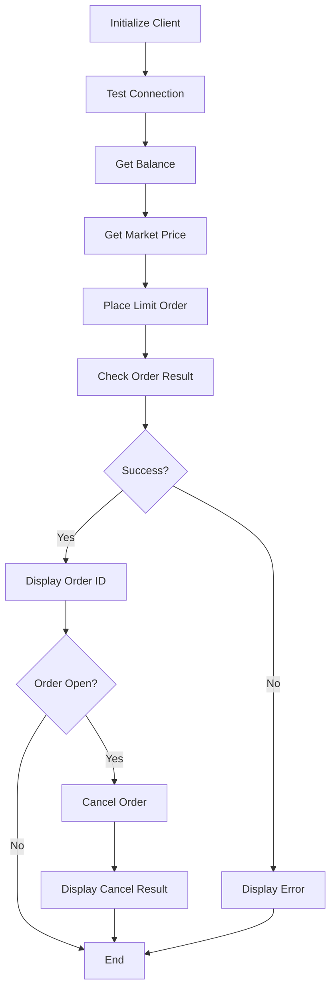

# Trading API

<cite>
**Referenced Files in This Document**   
- [trading_api.c](file://src/trading_api.c)
- [hyperliquid.h](file://include/hyperliquid.h)
- [eip712.c](file://src/crypto/eip712.c)
- [hl_crypto_internal.h](file://include/hl_crypto_internal.h)
- [hl_msgpack.h](file://include/hl_msgpack.h)
- [hl_markets.h](file://include/hl_markets.h)
- [simple_trade.c](file://examples/simple_trade.c)
</cite>

## Table of Contents
1. [Introduction](#introduction)
2. [Core Trading Functions](#core-trading-functions)
3. [Order Placement Process](#order-placement-process)
4. [EIP-712 Signing Mechanism](#eip-712-signing-mechanism)
5. [Error Handling](#error-handling)
6. [Thread Safety](#thread-safety)
7. [Related Functions](#related-functions)
8. [Code Example](#code-example)

## Introduction
This document provides comprehensive documentation for the trading functions in the Hyperliquid C SDK, with a primary focus on `hl_place_order()`. The API enables programmatic trading on the Hyperliquid DEX through secure, EIP-712 signed HTTP requests. The system supports order placement, cancellation, and modification with robust error handling and thread safety. All trading operations follow a consistent pattern of request validation, cryptographic signing, and RESTful communication with the exchange backend.

## Core Trading Functions

The trading API centers around three primary functions for order management: `hl_place_order()`, `hl_cancel_order()`, and `hl_modify_order()`. These functions provide a complete interface for managing positions on the Hyperliquid exchange. The `hl_place_order()` function serves as the entry point for all new orders, handling validation, signing, and submission in a single synchronous call.

**Section sources**
- [hyperliquid.h](file://include/hyperliquid.h#L276-L278)
- [hyperliquid.h](file://include/hyperliquid.h#L289-L292)
- [hyperliquid.h](file://include/hyperliquid.h#L312-L315)

## Order Placement Process

The `hl_place_order()` function executes a multi-step process to place an order on the Hyperliquid exchange. It accepts three parameters: a client handle (`hl_client_t*`), an order request structure (`hl_order_request_t*`), and an output result structure (`hl_order_result_t*`). The function returns an `hl_error_t` code indicating success or failure.

The process begins with parameter validation. If any of the three required parameters are null, the function returns `HL_ERROR_INVALID_PARAMS`. After validation, the function extracts essential client data including wallet address, private key, testnet flag, HTTP client, and mutex through accessor functions.

Order validation includes symbol lookup via `get_asset_id()`, which queries the markets API to resolve the asset ID for the requested symbol. If the symbol is not found (and is not SOL), the function returns `HL_ERROR_INVALID_SYMBOL`. Price and size values are formatted as strings using `snprintf()` with `%g` format specifier for optimal precision.

**Diagram sources**
- [trading_api.c](file://src/trading_api.c#L79-L220)

**Section sources**
- [trading_api.c](file://src/trading_api.c#L79-L220)
- [hl_msgpack.h](file://include/hl_msgpack.h#L27-L34)
- [hl_markets.h](file://include/hl_markets.h#L127-L136)

## EIP-712 Signing Mechanism

The Hyperliquid API uses EIP-712 typed message signing for authentication and integrity. The signing process begins with the creation of a connection ID hash using `hl_build_order_hash()`, which serializes the order data to MessagePack format and computes its Keccak-256 hash along with the nonce and grouping parameters.

The `eip712_sign_agent()` function orchestrates the EIP-712 signing process by computing three hashes: the domain separator hash, the agent struct hash, and the final signing hash. The domain hash incorporates the domain name ("Exchange"), chain ID (1337), and version. The agent struct hash combines the source (testnet "b" or mainnet "a") with the connection ID. These hashes are then combined with the EIP-191 prefix (0x1901) to create the final signing hash.

**Diagram sources**
- [eip712.c](file://src/crypto/eip712.c#L260-L295)
- [eip712.c](file://src/crypto/eip712.c#L182-L220)
- [eip712.c](file://src/crypto/eip712.c#L88-L180)

**Section sources**
- [eip712.c](file://src/crypto/eip712.c#L260-L295)
- [hl_crypto_internal.h](file://include/hl_crypto_internal.h#L83-L83)

## Error Handling

The trading API implements comprehensive error handling across multiple layers. Invalid parameters are detected immediately and return `HL_ERROR_INVALID_PARAMS`. Unknown symbols result in `HL_ERROR_INVALID_SYMBOL`, while signature generation failures return `HL_ERROR_SIGNATURE`. HTTP communication errors are mapped from `lv3_error_t` codes to appropriate `hl_error_t` values.

For `hl_place_order()`, specific error conditions include:
- `HL_ERROR_INVALID_PARAMS`: Null client, request, or result pointer
- `HL_ERROR_INVALID_SYMBOL`: Unrecognized trading symbol
- `HL_ERROR_SIGNATURE`: Failure to build order hash or sign the message
- `HL_ERROR_API`: HTTP request failure or invalid response
- `HL_ERROR_PARSE`: Failure to extract order ID from response

The result structure includes an error message buffer (`error[256]`) that provides human-readable details about the failure. This allows developers to diagnose issues without needing to parse error codes alone.

**Section sources**
- [trading_api.c](file://src/trading_api.c#L79-L220)
- [hyperliquid.h](file://include/hyperliquid.h#L139-L145)

## Thread Safety

All trading functions are thread-safe through the use of mutex locking. The `hl_place_order()` function locks the client's mutex at the beginning of execution and unlocks it before returning. This ensures that only one trading operation can execute at a time per client instance, preventing race conditions during the signing process and HTTP request.

The mutex is acquired after parameter validation but before any stateful operations such as asset ID lookup or nonce generation. It remains locked throughout the entire operation, including HTTP communication, to maintain consistency. This design prevents potential issues with nonce reuse or conflicting state modifications when multiple threads access the same client.

**Section sources**
- [trading_api.c](file://src/trading_api.c#L79-L220)
- [hl_internal.h](file://include/hl_internal.h#L114-L114)

## Related Functions

### Order Cancellation
The `hl_cancel_order()` function follows a similar pattern to `hl_place_order()` but uses a cancel action instead of an order action. It takes the client, symbol, order ID, and result structure as parameters. The function builds a `hl_cancel_t` structure containing the asset ID and order ID, then follows the same EIP-712 signing process before submitting the cancellation request.

### Order Modification
The `hl_modify_order()` function allows changing existing orders by canceling and replacing them atomically. It takes the client, existing order ID, new order parameters, and result structure. The function internally handles the cancel-and-replace sequence, returning the result of the new order placement.

**Diagram sources**
- [hyperliquid.h](file://include/hyperliquid.h#L127-L136)
- [hyperliquid.h](file://include/hyperliquid.h#L139-L145)
- [hyperliquid.h](file://include/hyperliquid.h#L148-L151)
- [hl_msgpack.h](file://include/hl_msgpack.h#L27-L34)
- [hl_msgpack.h](file://include/hl_msgpack.h#L48-L51)

**Section sources**
- [trading_api.c](file://src/trading_api.c#L225-L338)
- [hyperliquid.h](file://include/hyperliquid.h#L289-L292)
- [hyperliquid.h](file://include/hyperliquid.h#L312-L315)

## Code Example

The following example from `simple_trade.c` demonstrates the complete workflow for placing a limit order. It shows proper error handling, result checking, and resource management. The example includes connection testing, balance checking, market price retrieval, order placement, and optional cancellation if the order remains open.

**Diagram sources**
- [simple_trade.c](file://examples/simple_trade.c#L0-L165)

**Section sources**
- [simple_trade.c](file://examples/simple_trade.c#L0-L165)