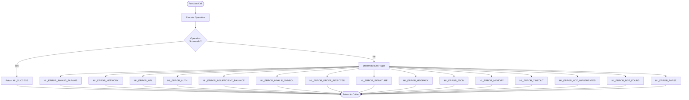
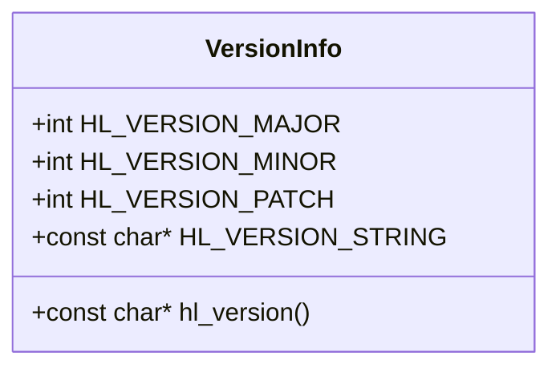
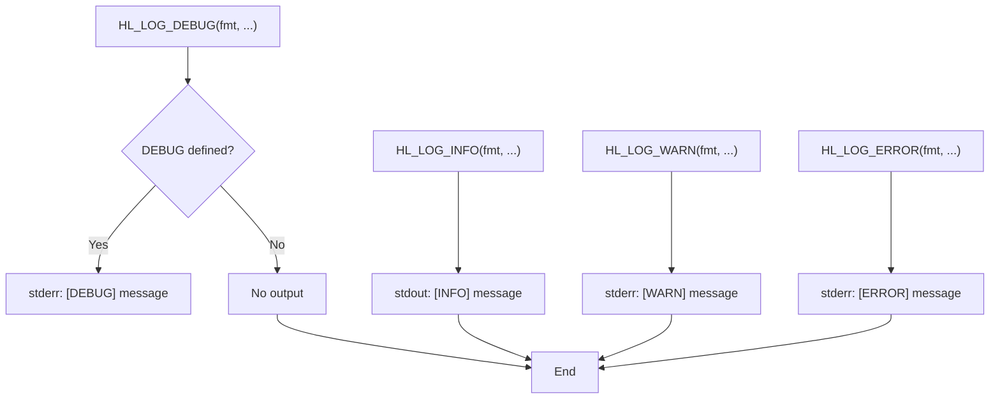
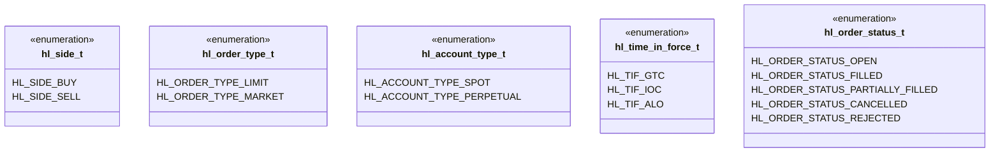
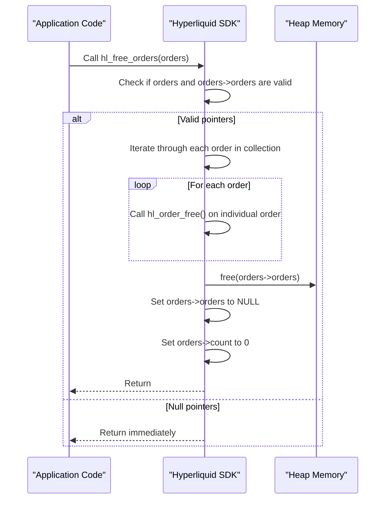
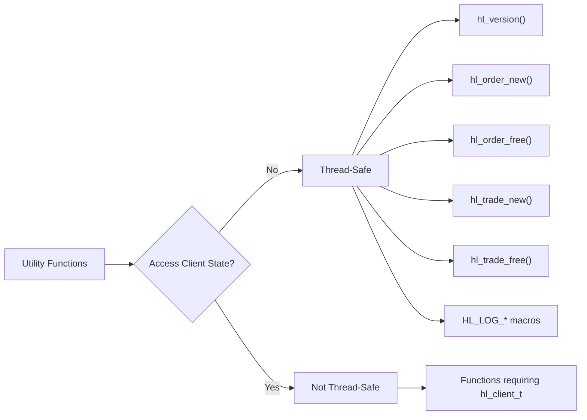
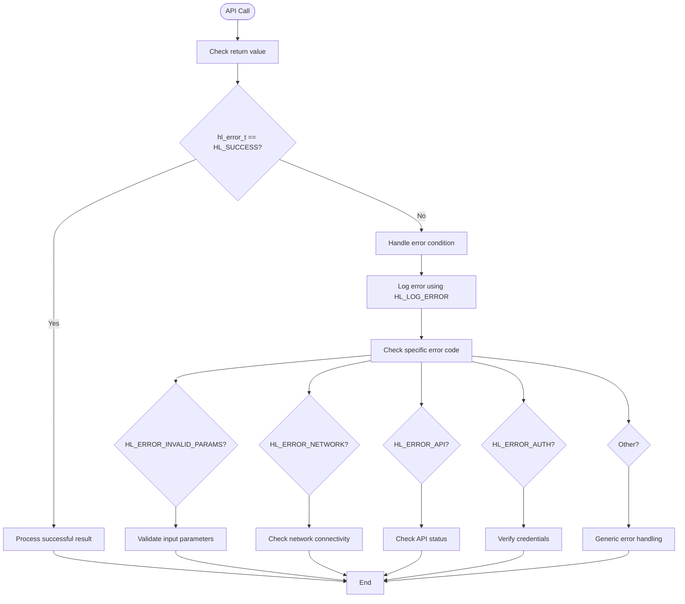

# Utility and Helper API

<cite>
**Referenced Files in This Document**   
- [hl_types.h](file://include/hl_types.h)
- [hl_logger.h](file://include/hl_logger.h)
- [hyperliquid.h](file://include/hyperliquid.h)
- [types.c](file://src/types.c)
- [client.c](file://src/client.c)
</cite>

## Table of Contents
1. [Introduction](#introduction)
2. [Error Handling System](#error-handling-system)
3. [Version Information](#version-information)
4. [Logging Utilities](#logging-utilities)
5. [Data Type Definitions](#data-type-definitions)
6. [Memory Management Functions](#memory-management-functions)
7. [Error Code to String Conversion](#error-code-to-string-conversion)
8. [Thread Safety Characteristics](#thread-safety-characteristics)
9. [Error Checking Patterns](#error-checking-patterns)

## Introduction
This document provides comprehensive documentation for the utility functions and data types exposed in the public API of the Hyperliquid C SDK. It covers error codes, version information, logging, core typedefs, memory management, and thread safety characteristics. The focus is on helper functions and data structures that support the main trading and market data functionality.

## Error Handling System

The Hyperliquid C SDK uses a standardized error code enumeration system based on the `hl_error_t` type. All API functions return an `hl_error_t` value to indicate success or failure, enabling consistent error handling across the library.



**Diagram sources**
- [hyperliquid.h](file://include/hyperliquid.h#L58-L85)

**Section sources**
- [hyperliquid.h](file://include/hyperliquid.h#L58-L85)

### Error Code Enumeration
The `hl_error_t` enumeration defines all possible error codes returned by API functions:

| Error Code | Value | Description |
|------------|-------|-------------|
| HL_SUCCESS | 0 | Operation completed successfully |
| HL_ERROR_INVALID_PARAMS | -1 | Invalid parameters provided to function |
| HL_ERROR_NETWORK | -2 | Network communication failure |
| HL_ERROR_API | -3 | API-level error from exchange |
| HL_ERROR_AUTH | -4 | Authentication failure |
| HL_ERROR_INSUFFICIENT_BALANCE | -5 | Account lacks sufficient funds |
| HL_ERROR_INVALID_SYMBOL | -6 | Trading symbol not recognized |
| HL_ERROR_ORDER_REJECTED | -7 | Exchange rejected order |
| HL_ERROR_SIGNATURE | -8 | Digital signature generation failed |
| HL_ERROR_MSGPACK | -9 | MessagePack serialization error |
| HL_ERROR_JSON | -10 | JSON parsing or generation error |
| HL_ERROR_MEMORY | -11 | Memory allocation failure |
| HL_ERROR_TIMEOUT | -12 | Operation exceeded timeout limit |
| HL_ERROR_NOT_IMPLEMENTED | -13 | Feature not yet implemented |
| HL_ERROR_NOT_FOUND | -14 | Requested resource not found |
| HL_ERROR_PARSE | -15 | Response parsing failure |

## Version Information

The SDK provides a function to retrieve the current version string, which follows semantic versioning (MAJOR.MINOR.PATCH) format.



**Diagram sources**
- [hyperliquid.h](file://include/hyperliquid.h#L58-L59)
- [client.c](file://src/client.c#L172-L174)

**Section sources**
- [hyperliquid.h](file://include/hyperliquid.h#L58-L59)
- [client.c](file://src/client.c#L172-L174)

### Version Functions and Constants
The version information is exposed through both a runtime function and compile-time constants:

- `hl_version()`: Returns the version string at runtime
- `HL_VERSION_MAJOR`: Major version number (integer)
- `HL_VERSION_MINOR`: Minor version number (integer)
- `HL_VERSION_PATCH`: Patch version number (integer)
- `HL_VERSION_STRING`: Complete version string (e.g., "1.0.0")

## Logging Utilities

The SDK includes a simple logging system implemented through preprocessor macros, allowing for different log levels with appropriate output destinations.



**Diagram sources**
- [hl_logger.h](file://include/hl_logger.h#L0-L34)

**Section sources**
- [hl_logger.h](file://include/hl_logger.h#L0-L34)

### Log Levels
The following logging macros are available:

- `HL_LOG_DEBUG`: Debug-level messages, only output when DEBUG is defined
- `HL_LOG_INFO`: Informational messages, output to stdout
- `HL_LOG_WARN`: Warning messages, output to stderr
- `HL_LOG_ERROR`: Error messages, output to stderr

The system also provides compatibility macros (`LV3_LOG_ERROR`, `LV3_LOG_DEBUG`, `LV3_LOG_INFO`) for backward compatibility with older code.

## Data Type Definitions

The SDK defines several enumerated types for common trading concepts, providing type safety and clarity in function signatures.



**Diagram sources**
- [hyperliquid.h](file://include/hyperliquid.h#L87-L124)

**Section sources**
- [hyperliquid.h](file://include/hyperliquid.h#L87-L124)

### Enumerated Types

#### Order Side (hl_side_t)
Defines the direction of a trading order:
- `HL_SIDE_BUY`: Buy order (long position)
- `HL_SIDE_SELL`: Sell order (short position)

#### Order Type (hl_order_type_t)
Specifies the execution method for an order:
- `HL_ORDER_TYPE_LIMIT`: Limit order at specified price
- `HL_ORDER_TYPE_MARKET`: Market order at best available price

#### Account Type (hl_account_type_t)
Identifies the account category for operations:
- `HL_ACCOUNT_TYPE_SPOT`: Spot trading account
- `HL_ACCOUNT_TYPE_PERPETUAL`: Perpetual futures account

#### Time in Force (hl_time_in_force_t)
Determines how long an order remains active:
- `HL_TIF_GTC`: Good Till Cancelled (persists until filled or cancelled)
- `HL_TIF_IOC`: Immediate Or Cancel (executes immediately, any unfilled portion cancelled)
- `HL_TIF_ALO`: Add Liquidity Only (only places orders that add liquidity)

#### Order Status (hl_order_status_t)
Represents the current state of an order:
- `HL_ORDER_STATUS_OPEN`: Order is active and unfilled
- `HL_ORDER_STATUS_FILLED`: Order has been completely filled
- `HL_ORDER_STATUS_PARTIALLY_FILLED`: Order has been partially filled
- `HL_ORDER_STATUS_CANCELLED`: Order was cancelled
- `HL_ORDER_STATUS_REJECTED`: Order was rejected by the exchange

## Memory Management Functions

The SDK provides functions to properly free dynamically allocated data structures, preventing memory leaks.



**Diagram sources**
- [types.c](file://src/types.c#L43-L52)
- [hyperliquid.h](file://include/hyperliquid.h#L398)

**Section sources**
- [types.c](file://src/types.c#L43-L52)
- [hyperliquid.h](file://include/hyperliquid.h#L398)

### Available Free Functions
- `hl_free_orders(hl_orders_t *orders)`: Frees all memory associated with an orders collection and resets the structure
- `hl_order_free(hl_order_t *order)`: Frees memory for a single order structure
- `hl_trade_free(hl_trade_t *trade)`: Frees memory for a single trade structure
- `hl_tickers_free(hl_tickers_t *tickers)`: Frees memory for a tickers collection

## Error Code to String Conversion

While not explicitly shown in the provided code, the error handling system is designed to work with error code to string conversion functions for debugging purposes. These functions would map `hl_error_t` values to human-readable strings, facilitating easier diagnosis of issues during development and troubleshooting.

The pattern follows standard C library practices where error codes can be converted to descriptive messages for logging and debugging. This allows developers to easily understand the nature of errors without needing to memorize numeric values.

## Thread Safety Characteristics

The utility functions in the Hyperliquid C SDK exhibit the following thread safety characteristics:



**Diagram sources**
- [client.c](file://src/client.c#L172-L174)
- [types.c](file://src/types.c#L43-L52)
- [hl_logger.h](file://include/hl_logger.h#L0-L34)

**Section sources**
- [client.c](file://src/client.c#L172-L174)
- [types.c](file://src/types.c#L43-L52)
- [hl_logger.h](file://include/hl_logger.h#L0-L34)

### Thread Safety Rules
- **Thread-safe**: Utility functions that do not access client state or shared resources
  - Version information functions
  - Memory allocation/deallocation functions
  - Logging macros
  - Data structure creation/free functions
- **Not thread-safe**: Functions that operate on client instances or shared state
  - Any function taking `hl_client_t *` as a parameter
  - Functions that modify global state

Applications using multiple threads should ensure proper synchronization when sharing client instances between threads.

## Error Checking Patterns

The SDK follows consistent error checking patterns throughout its API, making it easier to write robust code.



**Diagram sources**
- [hyperliquid.h](file://include/hyperliquid.h#L58-L85)
- [hl_logger.h](file://include/hl_logger.h#L0-L34)

**Section sources**
- [hyperliquid.h](file://include/hyperliquid.h#L58-L85)
- [hl_logger.h](file://include/hl_logger.h#L0-L34)

### Recommended Error Handling Pattern
```c
hl_error_t error = hl_fetch_balance(client, HL_ACCOUNT_TYPE_SPOT, &balance);
if (error != HL_SUCCESS) {
    HL_LOG_ERROR("Failed to fetch balance: error code %d", error);
    // Handle specific error cases
    switch (error) {
        case HL_ERROR_NETWORK:
            // Handle network issues
            break;
        case HL_ERROR_AUTH:
            // Handle authentication problems
            break;
        default:
            // Handle other errors
            break;
    }
    return error;
}
// Continue with successful operation
```

This pattern ensures that all API calls are properly checked for success, errors are logged appropriately, and specific error conditions can be handled differently based on their nature.