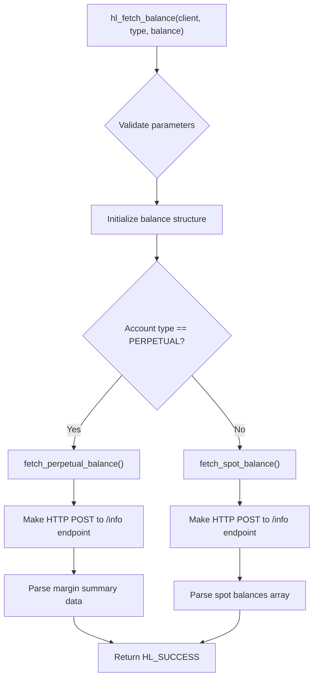
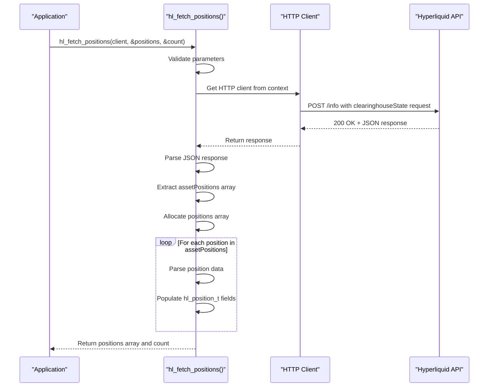
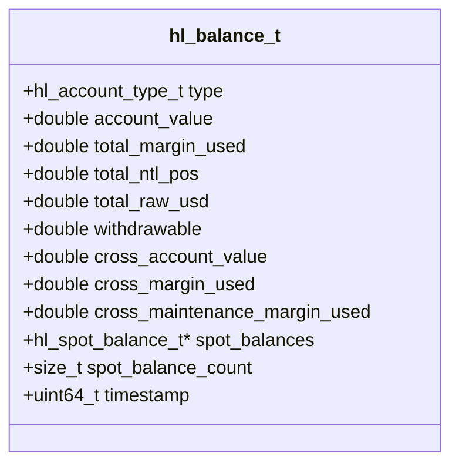
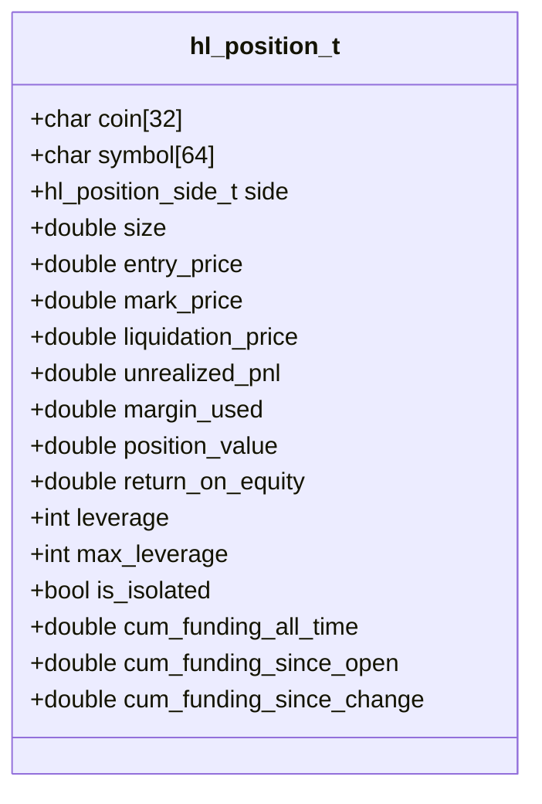
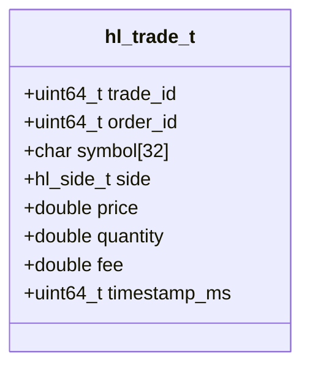

# Account Information

<cite>
**Referenced Files in This Document**   
- [account.c](file://src/account.c)
- [hl_account.h](file://include/hl_account.h)
- [hyperliquid.h](file://include/hyperliquid.h)
- [simple_balance.c](file://examples/simple_balance.c)
- [simple_positions.c](file://examples/simple_positions.c)
- [transfers.c](file://src/transfers.c)
- [client.c](file://src/client.c)
</cite>

## Table of Contents
1. [Introduction](#introduction)
2. [Balance Queries](#balance-queries)
3. [Position Tracking](#position-tracking)
4. [Trade History](#trade-history)
5. [Deposit and Withdrawal History](#deposit-and-withdrawal-history)
6. [Data Structures](#data-structures)
7. [Authentication and Security](#authentication-and-security)
8. [Error Handling](#error-handling)
9. [Usage Examples](#usage-examples)
10. [Memory Management](#memory-management)

## Introduction
This document provides comprehensive documentation for retrieving account information from the Hyperliquid exchange API using the C client library. It covers balance queries, position tracking, trade history, and deposit/withdrawal history endpoints. The documentation explains the structure of returned data, authentication requirements, error handling, and memory management considerations for sensitive information.

**Section sources**
- [hyperliquid.h](file://include/hyperliquid.h#L332-L335)
- [hl_account.h](file://include/hl_account.h#L134-L138)

## Balance Queries
The `hl_fetch_balance` function retrieves account balance information for either spot or perpetual accounts. It takes a client instance, account type, and a pointer to a `hl_balance_t` structure where the balance data will be stored. The function returns an `hl_error_t` value indicating success or failure.

For perpetual accounts, the balance includes margin summary data such as account value, total margin used, total notional position value, and withdrawable amount. For spot accounts, the balance includes an array of individual coin balances with total, hold, and available amounts.

The function internally routes to either `fetch_perpetual_balance` or `fetch_spot_balance` based on the specified account type, making separate HTTP requests to the exchange API to retrieve the relevant data.

**Diagram sources**
- [account.c](file://src/account.c#L249-L261)
- [account.c](file://src/account.c#L30-L144)
- [account.c](file://src/account.c#L149-L244)

**Section sources**
- [account.c](file://src/account.c#L249-L261)
- [hl_account.h](file://include/hl_account.h#L134-L138)

## Position Tracking
The `hl_fetch_positions` function retrieves all open positions for the authenticated account. It returns an array of `hl_position_t` structures through a double pointer parameter, along with a count of positions. Each position includes detailed information such as symbol, side, size, entry price, mark price, liquidation price, unrealized PnL, margin used, position value, return on equity, leverage information, and cumulative funding data.

The function makes a request to the exchange's info endpoint with a clearinghouse state query, then parses the assetPositions array from the response. For each position, it extracts data from the nested position object and populates the corresponding fields in the `hl_position_t` structure.

A convenience function `hl_fetch_position` is also available to retrieve a single position by symbol. This function internally calls `hl_fetch_positions` and searches for the position with the matching coin symbol.

**Diagram sources**
- [account.c](file://src/account.c#L450-L540)
- [account.c](file://src/account.c#L276-L397)
- [account.c](file://src/account.c#L545-L587)

**Section sources**
- [account.c](file://src/account.c#L450-L540)
- [hl_account.h](file://include/hl_account.h#L162-L166)

## Trade History
The `hl_get_trade_history` function retrieves trade history for a specific symbol. It takes a client instance, symbol string, and pointers to receive the array of trade records and count. The function returns an integer status code indicating success or failure.

Each trade record in the returned array contains details such as trade ID, order ID, symbol, side (buy/sell), price, quantity, fee, and timestamp in milliseconds. This information is useful for auditing trading activity, calculating performance metrics, and reconciling account statements.

The function is designed to handle large volumes of trade data, though the current implementation does not support pagination parameters to limit results or request specific time ranges.

**Section sources**
- [hyperliquid.h](file://include/hyperliquid.h#L332-L335)
- [hl_types.h](file://include/hl_types.h#L25-L25)

## Deposit and Withdrawal History
The `hl_fetch_deposits` and `hl_fetch_withdrawals` functions are designed to retrieve deposit and withdrawal history respectively. However, these functions are currently implemented as stubs that return empty results, as deposit and withdrawal history typically requires integration with wallet APIs or blockchain explorers beyond the basic exchange API scope.

Both functions accept parameters for currency filtering, timestamp filtering (since), limit, and a pointer to receive the transfers data. They validate input parameters and clear the output structure before returning success with no data.

A `hl_free_transfers` function is provided to properly free memory allocated for transfers arrays when this functionality is fully implemented.

**Section sources**
- [transfers.c](file://src/transfers.c#L36-L55)
- [transfers.c](file://src/transfers.c#L63-L82)
- [transfers.c](file://src/transfers.c#L87-L93)

## Data Structures
### Balance Structure
The `hl_balance_t` structure contains account balance information with fields that vary based on account type:

**Diagram sources**
- [hl_account.h](file://include/hl_account.h#L52-L72)

### Position Structure
The `hl_position_t` structure contains detailed position information:

**Diagram sources**
- [hl_account.h](file://include/hl_account.h#L85-L108)

### Trade Structure
The `hl_trade_t` structure contains individual trade record data:

**Diagram sources**
- [hyperliquid.h](file://include/hyperliquid.h#L156-L165)

## Authentication and Security
Account information endpoints require authentication using the client's wallet address and private key. The `hl_client_create` function initializes a client with these credentials, which are then used for EIP-712 signing of private API requests.

The private key is stored in memory and protected by a mutex to prevent concurrent access issues. When the client is destroyed with `hl_client_destroy`, the private key buffer is zeroed out before deallocation to prevent sensitive data from remaining in memory.

EIP-712 signing ensures that requests to private endpoints are cryptographically signed, providing proof of ownership of the wallet without exposing the private key to the exchange. This approach enhances security by allowing the exchange to verify request authenticity without storing or handling private keys.

**Section sources**
- [client.c](file://src/client.c#L34-L87)
- [client.c](file://src/client.c#L89-L107)

## Error Handling
All account information functions return error codes of type `hl_error_t` to indicate the result of operations. Common error codes include:
- `HL_SUCCESS`: Operation completed successfully
- `HL_ERROR_INVALID_PARAMS`: Invalid input parameters
- `HL_ERROR_NETWORK`: Network communication failure
- `HL_ERROR_API`: API returned an error response
- `HL_ERROR_PARSE`: Response parsing failed
- `HL_ERROR_MEMORY`: Memory allocation failed
- `HL_ERROR_NOT_FOUND`: Requested resource not found

The `hl_error_string` function converts error codes to human-readable strings for debugging and logging purposes. Applications should always check the return value of account information functions and handle errors appropriately, such as by retrying transient network errors or alerting users of authentication issues.

**Section sources**
- [client.c](file://src/client.c#L153-L170)
- [hl_ticker.h](file://include/hl_ticker.h#L21-L21)

## Usage Examples
The library provides example programs demonstrating common usage patterns for account information retrieval.

The `simple_balance.c` example shows how to create a client, fetch both perpetual and spot balances, display the results, and properly clean up resources. It demonstrates error checking after each operation and proper memory management for spot balances.

The `simple_positions.c` example demonstrates fetching all positions, displaying position details, retrieving a specific position by symbol, and fetching trading fees. It includes proper cleanup of the positions array using `hl_free_positions`.

These examples serve as templates for integrating account information functionality into applications, showing best practices for error handling and resource management.

**Section sources**
- [simple_balance.c](file://examples/simple_balance.c)
- [simple_positions.c](file://examples/simple_positions.c)

## Memory Management
Proper memory management is critical when working with account information functions that allocate memory for returned data structures.

The library provides dedicated functions to free allocated memory:
- `hl_free_spot_balances` for spot balance arrays
- `hl_free_positions` for position arrays
- `hl_free_transfers` for transfer history arrays

These functions should be called when the data is no longer needed to prevent memory leaks. The functions safely handle NULL pointers and zero out the pointer after freeing to prevent use-after-free issues.

When a client is destroyed with `hl_client_destroy`, all associated resources including HTTP clients and mutexes are properly cleaned up, and sensitive data like private keys are zeroed out before deallocation.

**Section sources**
- [account.c](file://src/account.c#L266-L271)
- [account.c](file://src/account.c#L592-L597)
- [transfers.c](file://src/transfers.c#L87-L93)