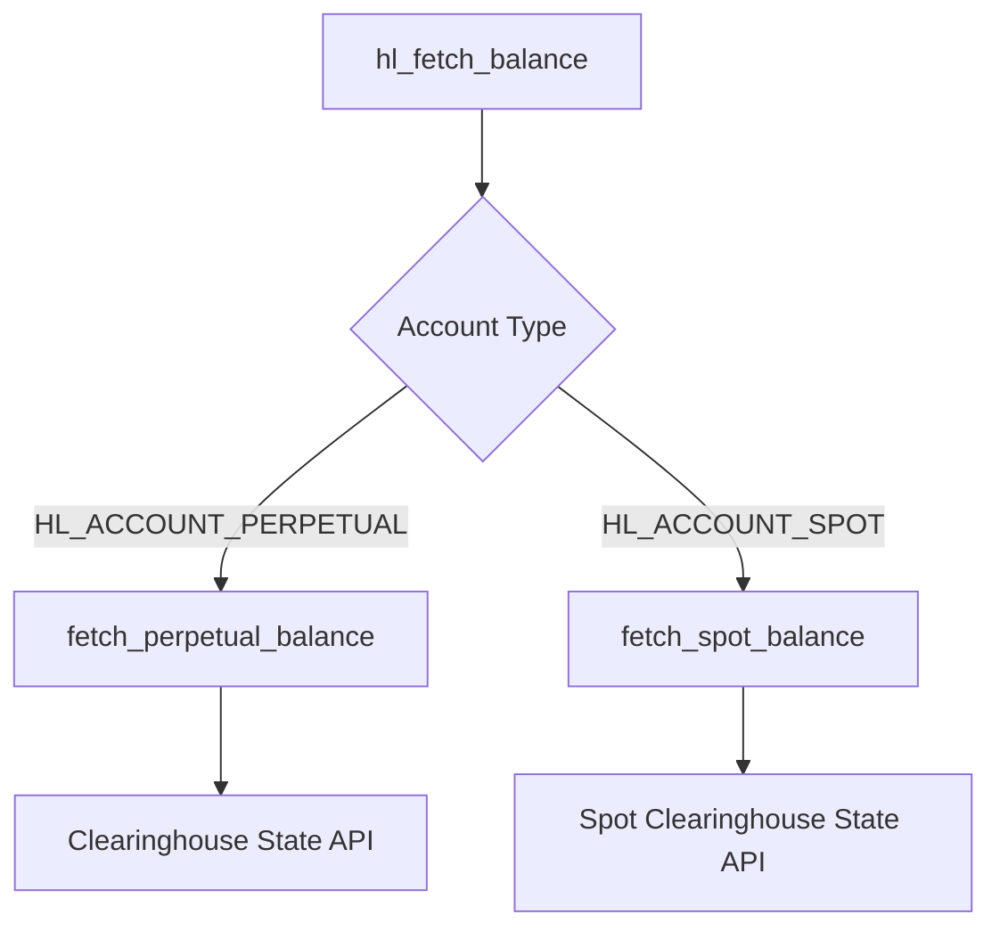
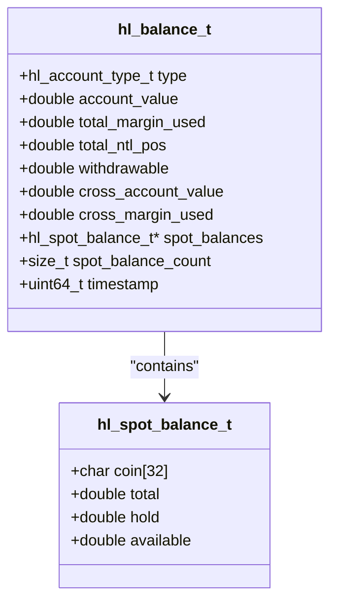
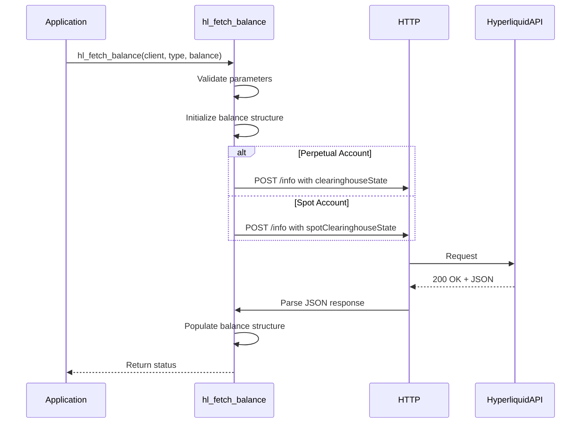
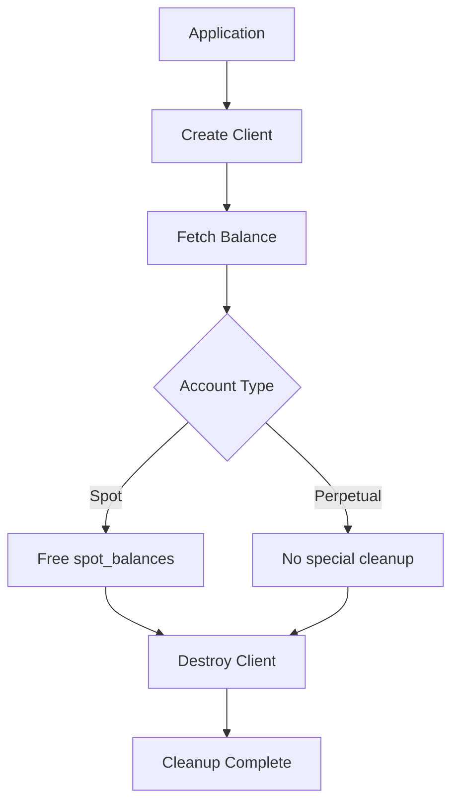

# Balance Retrieval

<cite>
**Referenced Files in This Document**   
- [hl_account.h](file://include/hl_account.h)
- [hl_client.h](file://include/hl_client.h)
- [hl_http.h](file://include/hl_http.h)
- [account.c](file://src/account.c)
- [client.c](file://src/client.c)
- [simple_balance.c](file://examples/simple_balance.c)
</cite>

## Table of Contents
1. [Introduction](#introduction)
2. [Account Type Distinction](#account-type-distinction)
3. [Balance Structure Definition](#balance-structure-definition)
4. [Function Implementation](#function-implementation)
5. [Usage Example](#usage-example)
6. [Error Handling](#error-handling)
7. [Thread Safety and Memory Management](#thread-safety-and-memory-management)
8. [Data Refresh Strategy](#data-refresh-strategy)

## Introduction
The Hyperliquid C SDK provides a robust mechanism for retrieving account balance information through the `hl_fetch_balance` function. This document details the implementation, usage, and best practices for balance retrieval across different account types. The functionality supports both perpetual and spot trading accounts, with distinct data structures and retrieval methods for each.

**Section sources**
- [hl_account.h](file://include/hl_account.h#L97-L146)
- [account.c](file://src/account.c#L249-L271)

## Account Type Distinction
The Hyperliquid SDK differentiates between two primary account types: perpetual and spot. These are defined by the `hl_account_type_t` enumeration:

- **HL_ACCOUNT_PERPETUAL**: Represents margin trading accounts for perpetual contracts
- **HL_ACCOUNT_SPOT**: Represents cash accounts for spot trading

The account type parameter in `hl_fetch_balance` determines which endpoint is queried and which data fields are populated in the response. Perpetual accounts return margin-based metrics like account value and margin utilization, while spot accounts return coin-specific balances with total and held amounts.

**Diagram sources**
- [hl_account.h](file://include/hl_account.h#L52-L72)
- [account.c](file://src/account.c#L30-L244)

**Section sources**
- [hl_account.h](file://include/hl_account.h#L38-L43)
- [account.c](file://src/account.c#L249-L261)

## Balance Structure Definition
The `hl_balance_t` structure contains different sets of fields depending on the account type. For perpetual accounts, the structure includes margin-based metrics:

- `account_value`: Total account value in USDC
- `total_margin_used`: Total margin currently utilized
- `total_ntl_pos`: Total notional position value
- `withdrawable`: Amount available for withdrawal
- `cross_account_value`: Cross margin account value
- `cross_margin_used`: Cross margin utilization

For spot accounts, the structure contains an array of `hl_spot_balance_t` entries, each with:
- `coin`: Coin symbol (e.g., "USDC", "BTC")
- `total`: Total balance of the coin
- `hold`: Amount currently on hold (in open orders)
- `available`: Calculated as total - hold

The structure also includes a timestamp field indicating when the balance data was generated.

**Diagram sources**
- [hl_account.h](file://include/hl_account.h#L52-L72)
- [hl_account.h](file://include/hl_account.h#L87-L95)

**Section sources**
- [hl_account.h](file://include/hl_account.h#L52-L72)

## Function Implementation
The `hl_fetch_balance` function serves as a dispatcher that routes requests to the appropriate implementation based on account type. It performs parameter validation and initializes the balance structure before making the API call. The function uses different HTTP endpoints for each account type:

- Perpetual: POST to `/info` with `{"type":"clearinghouseState"}`
- Spot: POST to `/info` with `{"type":"spotClearinghouseState"}`

Both implementations use the same base URL, which is determined by the client's testnet configuration. The response is parsed from JSON format into the corresponding C structure, with string-to-double conversion handled appropriately.

**Diagram sources**
- [account.c](file://src/account.c#L249-L261)
- [account.c](file://src/account.c#L30-L244)

**Section sources**
- [account.c](file://src/account.c#L249-L271)

## Usage Example
The `simple_balance.c` example demonstrates proper initialization and usage of the balance retrieval functionality. The process involves:

1. Creating a client instance with wallet and private key
2. Calling `hl_fetch_balance` with the desired account type
3. Checking the return status for errors
4. Accessing the populated balance data
5. Freeing allocated resources for spot balances
6. Destroying the client instance

For spot accounts, the caller must free the `spot_balances` array using `hl_free_spot_balances`. The example shows both perpetual and spot balance retrieval in sequence, with appropriate error handling at each step.

**Section sources**
- [simple_balance.c](file://examples/simple_balance.c#L1-L87)

## Error Handling
The balance retrieval system implements comprehensive error handling for various failure scenarios:

- **HL_ERROR_INVALID_PARAMS**: Invalid client pointer or null balance structure
- **HL_ERROR_NETWORK**: Network connectivity issues or HTTP request failure
- **HL_ERROR_API**: API returns non-200 status code
- **HL_ERROR_PARSE**: JSON parsing failure or missing required fields
- **HL_ERROR_MEMORY**: Memory allocation failure for spot balances

Applications should check the return value of `hl_fetch_balance` and use `hl_error_string()` to obtain a human-readable error message. Network errors may be transient and could benefit from retry logic with exponential backoff.

**Section sources**
- [account.c](file://src/account.c#L249-L261)
- [account.c](file://src/account.c#L30-L144)
- [account.c](file://src/account.c#L149-L244)

## Thread Safety and Memory Management
The `hl_fetch_balance` function is not inherently thread-safe due to shared client state. Applications using multiple threads should either:
- Use separate client instances per thread
- Implement external synchronization using mutexes
- Serialize access to the client

Memory management considerations:
- The caller is responsible for freeing spot balances using `hl_free_spot_balances`
- Perpetual balance fields are stored directly in the structure and do not require explicit freeing
- Client resources must be released with `hl_client_destroy`
- The balance structure itself is not dynamically allocated and should not be freed

**Diagram sources**
- [account.c](file://src/account.c#L266-L271)
- [client.c](file://src/client.c#L89-L107)

**Section sources**
- [hl_account.h](file://include/hl_account.h#L146-L146)
- [client.c](file://src/client.c#L89-L107)

## Data Refresh Strategy
Balance data should be refreshed based on application requirements and trading activity:

- **High-frequency trading**: Refresh every 1-2 seconds
- **Active trading**: Refresh every 5-10 seconds
- **Passive monitoring**: Refresh every 30-60 seconds
- **After order execution**: Immediate refresh to reflect balance changes
- **After position changes**: Immediate refresh to update margin metrics

The timestamp field in the balance structure allows applications to determine the age of the data and decide whether a refresh is needed. Applications should implement rate limiting to avoid exceeding API quotas, with a recommended minimum interval of 1 second between requests.

**Section sources**
- [hl_account.h](file://include/hl_account.h#L70)
- [account.c](file://src/account.c#L30-L244)