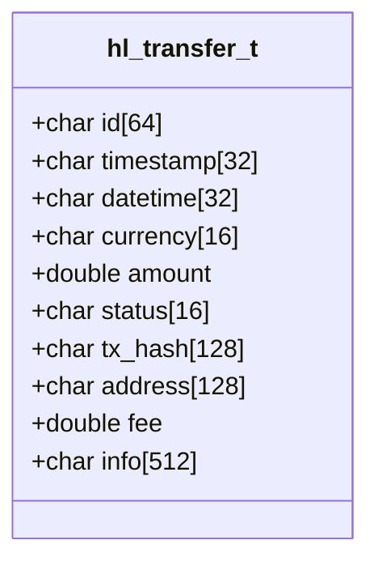
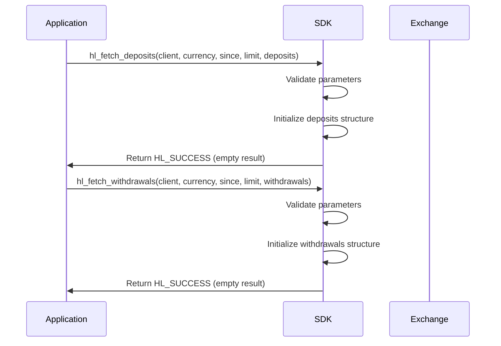
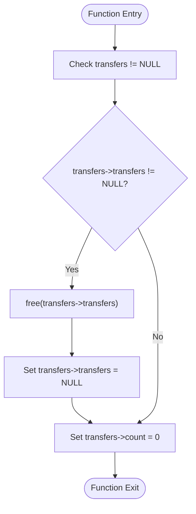

# Deposit and Withdrawal History

<cite>
**Referenced Files in This Document**   
- [transfers.c](file://src/transfers.c)
- [hyperliquid.h](file://include/hyperliquid.h)
- [hl_exchange.h](file://include/hl_exchange.h)
</cite>

## Table of Contents
1. [Introduction](#introduction)
2. [Transfer Data Structure](#transfer-data-structure)
3. [History Retrieval Functions](#history-retrieval-functions)
4. [Filtering Mechanism](#filtering-mechanism)
5. [Internal Implementation](#internal-implementation)
6. [Usage Examples](#usage-examples)
7. [Common Issues](#common-issues)
8. [Security and Memory Management](#security-and-memory-management)

## Introduction
This document provides comprehensive documentation for deposit and withdrawal history functionality in the Hyperliquid C SDK. The system is designed to track fund movements between user wallets and the exchange, enabling users to monitor account activity and reconcile transactions. The core functionality revolves around the `hl_get_transfer_history` interface (represented by `hl_fetch_deposits` and `hl_fetch_withdrawals` functions) and the `hl_transfer_t` data structure that encapsulates transfer details.

The current implementation acknowledges that deposit and withdrawal operations require wallet and blockchain integration beyond basic exchange API capabilities. As such, the functions serve as placeholders for future integration while maintaining the expected interface for client applications.

**Section sources**
- [transfers.c](file://src/transfers.c#L10-L93)
- [hyperliquid.h](file://include/hyperliquid.h#L584-L604)

## Transfer Data Structure
The `hl_transfer_t` structure defines the schema for individual deposit and withdrawal records, capturing essential transaction details in a standardized format.



**Diagram sources**
- [transfers.c](file://src/transfers.c#L10-L28)

**Section sources**
- [transfers.c](file://src/transfers.c#L10-L28)

### Field Definitions
- **id**: Unique transfer identifier assigned by the exchange
- **timestamp**: Unix timestamp in milliseconds as string
- **datetime**: ISO 8601 formatted date and time (YYYY-MM-DDTHH:MM:SSZ)
- **currency**: Currency code (e.g., "USD", "BTC", "ETH")
- **amount**: Transfer amount as double-precision floating point
- **status**: Transfer status ("pending", "completed", "failed", "canceled")
- **tx_hash**: Blockchain transaction hash for on-chain transfers
- **address**: Source (deposits) or destination (withdrawals) wallet address
- **fee**: Network or withdrawal fee charged by the exchange
- **info**: Raw JSON response from the exchange API for debugging

The structure is contained within a collection type `hl_transfers_t` that includes a pointer to an array of transfers and a count of entries, enabling efficient memory management for multiple transfer records.

## History Retrieval Functions
The Hyperliquid SDK provides two primary functions for accessing transfer history, both following a consistent interface pattern.



**Diagram sources**
- [transfers.c](file://src/transfers.c#L36-L82)

**Section sources**
- [transfers.c](file://src/transfers.c#L36-L82)
- [hyperliquid.h](file://include/hyperliquid.h#L584-L604)

### Function Signatures
- `hl_fetch_deposits(hl_client_t* client, const char* currency, const char* since, uint32_t limit, hl_transfers_t* deposits)`
- `hl_fetch_withdrawals(hl_client_t* client, const char* currency, const char* since, uint32_t limit, hl_transfers_t* withdrawals)`

Both functions accept identical parameters:
- **client**: Initialized Hyperliquid client instance
- **currency**: Optional currency filter (NULL for all currencies)
- **since**: Optional ISO 8601 datetime filter (NULL for recent transfers)
- **limit**: Maximum number of records to retrieve
- **output**: Pointer to `hl_transfers_t` structure for result storage

The functions return `HL_SUCCESS` on valid input, currently always returning an empty result set due to the stub implementation.

## Filtering Mechanism
The transfer history functions support two primary filtering dimensions to help users narrow down their search for specific transactions.

### Currency Filtering
The `currency` parameter allows users to filter transfers by specific currency codes. When NULL is provided, all currencies are included in the results. Valid currency codes must match the exchange's supported assets (e.g., "USD", "BTC", "ETH", "USDC").

### Time Range Filtering
The `since` parameter enables time-based filtering using ISO 8601 formatted datetime strings (e.g., "2023-12-01T00:00:00Z"). Transfers occurring at or after the specified timestamp are included in the results. When NULL is provided, the most recent transfers are returned according to the exchange's default behavior.

### Limit Parameter
The `limit` parameter controls the maximum number of transfer records returned, helping to manage memory usage and network bandwidth. The actual number of returned transfers may be less than the limit if insufficient matching records exist.

Currently, these filtering parameters are accepted but not actively applied due to the stub implementation, with the functions simply acknowledging the parameters and returning empty results.

**Section sources**
- [transfers.c](file://src/transfers.c#L36-L82)

## Internal Implementation
The current implementation of deposit and withdrawal history functions serves as a placeholder for future wallet integration.

### Current Stub Implementation
Both `hl_fetch_deposits` and `hl_fetch_withdrawals` functions follow the same pattern:
1. Validate input parameters (client and output structure)
2. Initialize the output structure by zeroing memory
3. Print a diagnostic message indicating the stub status
4. Return success with an empty result set

The functions correctly handle error cases such as NULL client or output parameters by returning `HL_ERROR_INVALID_PARAMS`.

### Required Integration
As noted in the code comments, proper implementation requires integration with:
- Wallet APIs for balance tracking
- Blockchain explorers for transaction verification
- Exchange-specific endpoints for transfer status monitoring

The exchange capabilities system (in `hl_exchange.h`) correctly advertises support for deposit and withdrawal history through the `fetch_deposits` and `fetch_withdrawals` capability flags, maintaining interface consistency despite the incomplete implementation.

**Section sources**
- [transfers.c](file://src/transfers.c#L36-L93)
- [hl_exchange.h](file://include/hl_exchange.h#L117-L118)

## Usage Examples
The following examples demonstrate how to use the transfer history functions in client applications.

### Basic Deposit History Retrieval
```c
hl_transfers_t deposits;
hl_error_t error = hl_fetch_deposits(client, NULL, NULL, 10, &deposits);
if (error == HL_SUCCESS) {
    printf("Retrieved %zu deposits\n", deposits.count);
    // Process deposits...
    hl_free_transfers(&deposits);
}
```

### Filtered Withdrawal History
```c
hl_transfers_t withdrawals;
hl_error_t error = hl_fetch_withdrawals(client, "USD", "2023-12-01T00:00:00Z", 25, &withdrawals);
if (error == HL_SUCCESS) {
    printf("Found %zu USD withdrawals\n", withdrawals.count);
    // Process withdrawals...
    hl_free_transfers(&withdrawals);
}
```

### Currency-Specific Balance Reconciliation
```c
// Check BTC withdrawal history to reconcile wallet balance
hl_transfers_t btc_withdrawals;
hl_error_t error = hl_fetch_withdrawals(client, "BTC", NULL, 100, &btc_withdrawals);
if (error == HL_SUCCESS) {
    double total_withdrawn = 0.0;
    for (size_t i = 0; i < btc_withdrawals.count; i++) {
        if (strcmp(btc_withdrawals.transfers[i].status, "completed") == 0) {
            total_withdrawn += btc_withdrawals.transfers[i].amount;
        }
    }
    printf("Total BTC withdrawn: %f\n", total_withdrawn);
    hl_free_transfers(&btc_withdrawals);
}
```

**Section sources**
- [transfers.c](file://src/transfers.c#L36-L82)

## Common Issues
Users may encounter several issues when working with the current transfer history implementation.

### Delayed Transaction Visibility
Due to the stub implementation, no transfer data is currently available through the API. In a complete implementation, users might experience delays in transaction visibility due to:
- Blockchain confirmation times
- Exchange processing queues
- Synchronization delays between systems

### Failed Withdrawals
The current implementation cannot report failed withdrawals. In a production system, common causes of withdrawal failures include:
- Insufficient balance (including fees)
- Invalid destination addresses
- Network congestion
- Security verification requirements
- Daily withdrawal limits

### Empty Result Sets
The functions currently return empty result sets with `HL_SUCCESS`. Applications should handle this gracefully by checking the `count` field of the `hl_transfers_t` structure and providing appropriate user feedback.

**Section sources**
- [transfers.c](file://src/transfers.c#L52-L53)
- [transfers.c](file://src/transfers.c#L79-L80)

## Security and Memory Management
Proper handling of transfer data and memory resources is critical for application security and stability.

### Secure Data Handling
Transfer records contain sensitive financial information that should be:
- Protected from unauthorized access
- Properly sanitized before display
- Securely erased when no longer needed
- Not logged in plaintext

### Memory Management
The SDK provides `hl_free_transfers()` to properly clean up dynamically allocated transfer arrays:



**Diagram sources**
- [transfers.c](file://src/transfers.c#L87-L93)

**Section sources**
- [transfers.c](file://src/transfers.c#L87-L93)

### Best Practices
1. Always call `hl_free_transfers()` after processing transfer data
2. Validate transfer amounts and currencies before processing
3. Verify transaction hashes against blockchain explorers when possible
4. Implement proper error handling for all transfer operations
5. Use secure storage for any cached transfer data

Failure to properly clean up transfer arrays can result in memory leaks, while improper handling of transfer data can lead to security vulnerabilities.