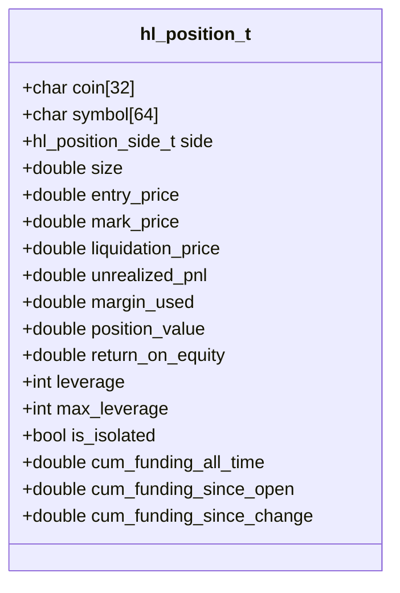
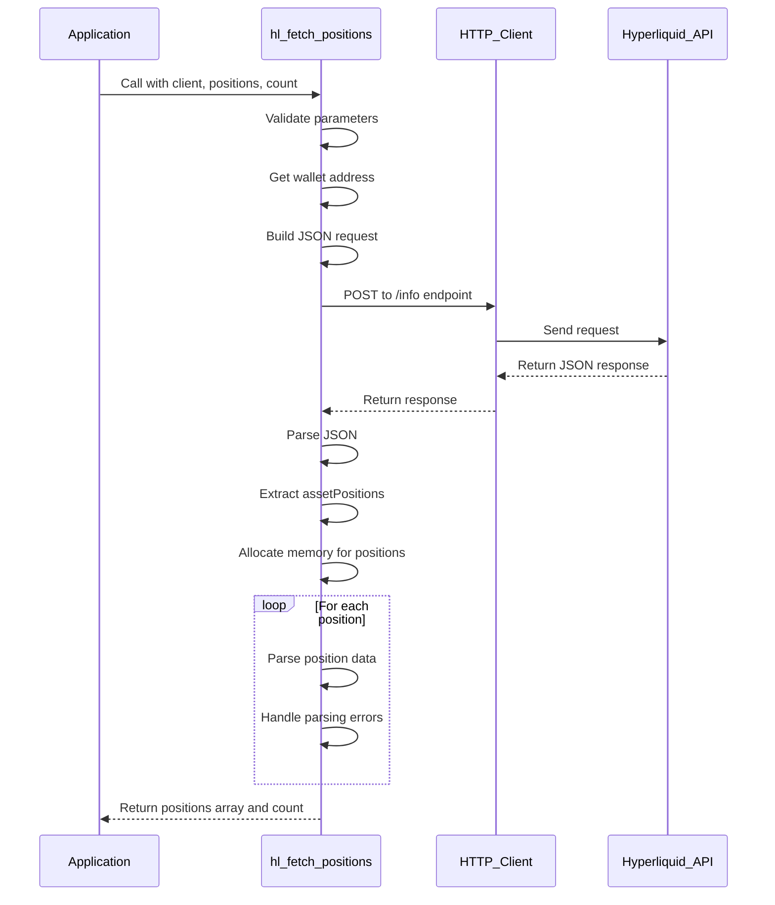
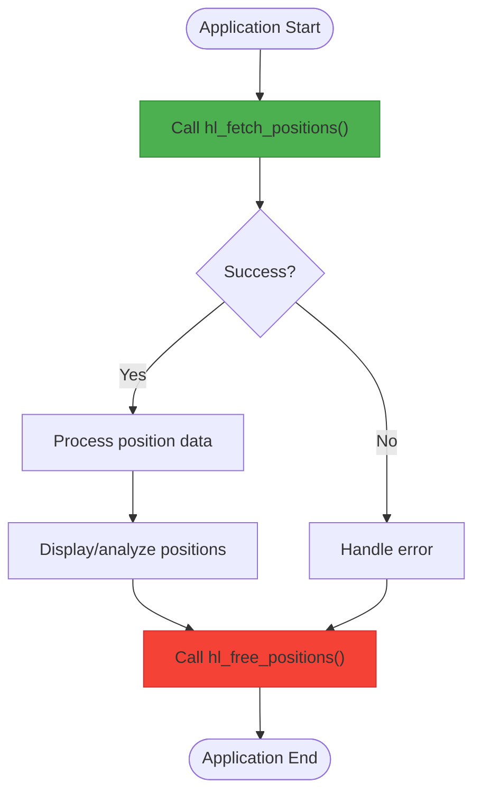

# Position Management

<cite>
**Referenced Files in This Document**   
- [simple_positions.c](file://examples/simple_positions.c)
- [hl_account.h](file://include/hl_account.h)
- [account.c](file://src/account.c)
- [hyperliquid.h](file://include/hyperliquid.h)
- [hl_client.h](file://include/hl_client.h)
</cite>

## Table of Contents
1. [Introduction](#introduction)
2. [Position Data Model](#position-data-model)
3. [Position Retrieval Process](#position-retrieval-process)
4. [Memory Management and Cleanup](#memory-management-and-cleanup)
5. [Error Handling and Edge Cases](#error-handling-and-edge-cases)
6. [Usage Patterns and Examples](#usage-patterns-and-examples)
7. [Performance Considerations](#performance-considerations)
8. [Security Implications](#security-implications)

## Introduction
This document provides comprehensive documentation for position tracking functionality in the Hyperliquid C SDK, focusing on the `hl_fetch_positions` function and related components. It explains the data model, retrieval process, memory management, error handling, and best practices for working with trading positions. The system enables users to monitor their open positions including key metrics like asset name, position size, entry price, unrealized PnL, and leverage.

## Position Data Model
The `hl_position_t` structure defines the comprehensive data model for representing trading positions in the Hyperliquid ecosystem. This model captures all essential position attributes needed for trading operations and risk management.

**Diagram sources**
- [hl_account.h](file://include/hl_account.h#L85-L108)

**Section sources**
- [hl_account.h](file://include/hl_account.h#L85-L108)

## Position Retrieval Process
The position retrieval process begins with the `hl_fetch_positions` function, which orchestrates the complete workflow from API request to data parsing. The process involves constructing a request to the clearinghouseState endpoint, making an HTTP POST request, and parsing the JSON response into structured position data.

The function first validates input parameters and retrieves the wallet address from the client. It then constructs a JSON request body with the clearinghouseState type and user wallet information. After making the HTTP request to the appropriate API endpoint (testnet or mainnet), it parses the response JSON to extract the assetPositions array.

When positions exist, the function dynamically allocates memory for the position array using `calloc`, ensuring proper initialization. It then iterates through each position in the response, parsing individual position data while handling potential parsing errors gracefully. Invalid positions are skipped while valid ones are included in the final result.

**Diagram sources**
- [account.c](file://src/account.c#L450-L540)
- [account.c](file://src/account.c#L276-L397)

**Section sources**
- [account.c](file://src/account.c#L450-L540)
- [account.c](file://src/account.c#L276-L397)

## Memory Management and Cleanup
The SDK employs dynamic memory allocation for position arrays, requiring explicit cleanup by the caller to prevent memory leaks. The `hl_fetch_positions` function allocates memory for the positions array using `calloc`, which must be freed using the provided `hl_free_positions` function.

The memory management pattern follows a clear responsibility model: the SDK allocates memory during position retrieval, and the application is responsible for freeing it after use. This approach provides flexibility while maintaining predictable memory ownership semantics.

The `hl_free_positions` function serves as the cleanup mechanism, safely freeing the allocated memory. It accepts the positions array and count parameters, though the count is not used in the current implementation. This design allows for potential future enhancements while maintaining backward compatibility.

**Diagram sources**
- [account.c](file://src/account.c#L592-L597)
- [account.c](file://src/account.c#L450-L540)

**Section sources**
- [account.c](file://src/account.c#L592-L597)
- [hl_account.h](file://include/hl_account.h#L188)

## Error Handling and Edge Cases
The position tracking system handles several edge cases and error conditions to ensure robust operation in various scenarios. The most common edge case is an empty position array, which is handled gracefully by returning success with a NULL positions pointer and zero count, rather than treating it as an error condition.

The system also handles partially invalid data by attempting to parse each position individually. If a specific position cannot be parsed due to malformed data, that position is skipped while continuing to process the remaining positions. This fault-tolerant approach ensures that valid position data is not lost due to isolated parsing failures.

Error codes are used systematically to indicate different failure modes:
- `HL_ERROR_INVALID_PARAMS`: Invalid input parameters
- `HL_ERROR_NETWORK`: Network communication failures
- `HL_ERROR_API`: API-level errors (non-200 HTTP status)
- `HL_ERROR_PARSE`: JSON parsing failures
- `HL_ERROR_MEMORY`: Memory allocation failures
- `HL_ERROR_NOT_FOUND`: Single position not found

The `hl_fetch_position` function demonstrates a specific pattern for handling single position retrieval by first fetching all positions and then searching for the requested symbol, returning `HL_ERROR_NOT_FOUND` when the position does not exist.

**Section sources**
- [account.c](file://src/account.c#L450-L540)
- [account.c](file://src/account.c#L545-L587)
- [hyperliquid.h](file://include/hyperliquid.h#L69-L82)

## Usage Patterns and Examples
The recommended usage pattern for position tracking is demonstrated in the `simple_positions.c` example. Applications should follow a consistent sequence: create a client, fetch positions, process the data, and clean up resources.

The typical workflow involves calling `hl_fetch_positions` with a client instance and pointers to receive the positions array and count. After successful retrieval, applications can iterate through the positions to access individual position data. It's crucial to always check the return value for errors before processing the position data.

For retrieving a single position by symbol, the `hl_fetch_position` function provides a convenient wrapper that handles the extraction of the coin symbol from the market symbol and searches through the positions array. This function abstracts the complexity of symbol parsing and position lookup.

The example demonstrates proper error handling throughout the process and emphasizes the importance of calling `hl_free_positions` after processing to prevent memory leaks. It also shows the complete lifecycle management by destroying the client with `hl_client_destroy` at the end.

**Section sources**
- [simple_positions.c](file://examples/simple_positions.c)
- [account.c](file://src/account.c#L545-L587)

## Performance Considerations
Frequent polling of position data can have significant performance implications, particularly in high-frequency trading scenarios. Each call to `hl_fetch_positions` involves an HTTP round-trip to the Hyperliquid API, which introduces network latency and increases API rate limit consumption.

The recommended update interval depends on the specific use case:
- For monitoring applications: 1-5 seconds
- For trading bots: 100-500 milliseconds
- For historical analysis: 15-30 seconds

Applications should implement appropriate throttling mechanisms to avoid exceeding rate limits. Consider using WebSocket subscriptions for real-time updates when available, as they are more efficient than repeated HTTP polling.

The memory allocation and JSON parsing overhead should also be considered, especially when positions are retrieved frequently. The dynamic allocation pattern, while flexible, incurs allocation/deallocation costs on each call.

**Section sources**
- [account.c](file://src/account.c#L450-L540)

## Security Implications
Storing position data in memory presents several security considerations. While position data itself is not as sensitive as private keys, it still contains valuable trading information that could be exploited if compromised.

The current implementation stores position data in plain memory without encryption. Applications handling sensitive trading strategies should consider additional security measures such as:
- Minimizing the time position data is kept in memory
- Clearing position data after use when possible
- Running in secure execution environments
- Implementing access controls to position data

Unlike private keys, the position data does not include zeroization on cleanup, meaning the memory contents may persist after `hl_free_positions` is called. Applications with high security requirements may need to implement additional memory clearing mechanisms.

The client creation process does include security measures such as zeroing out the private key memory on destruction, demonstrating the SDK's attention to security best practices for the most sensitive data.

**Section sources**
- [account.c](file://src/account.c#L592-L597)
- [client.c](file://src/client.c#L89-L107)