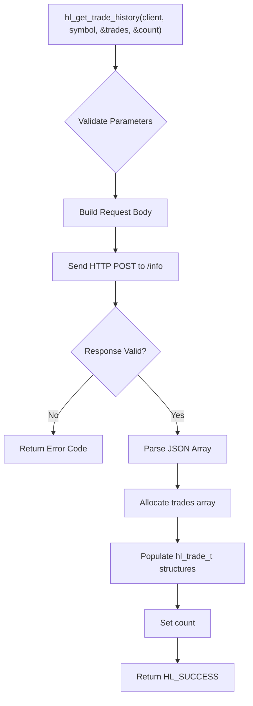
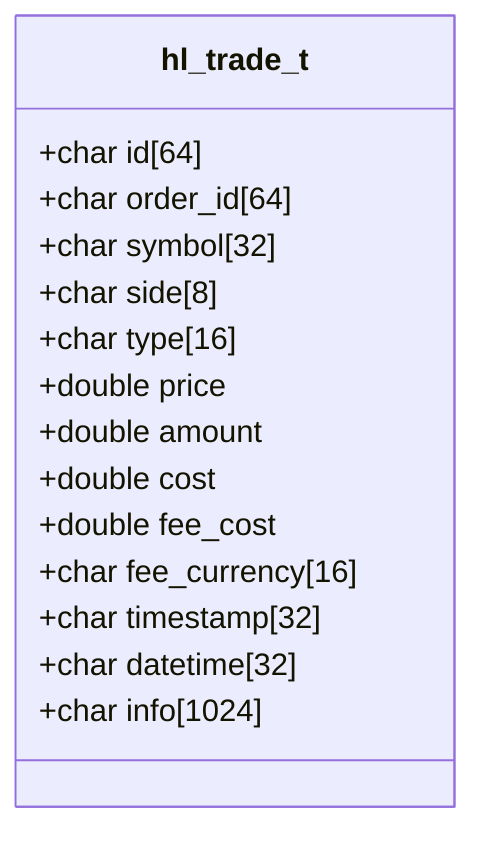
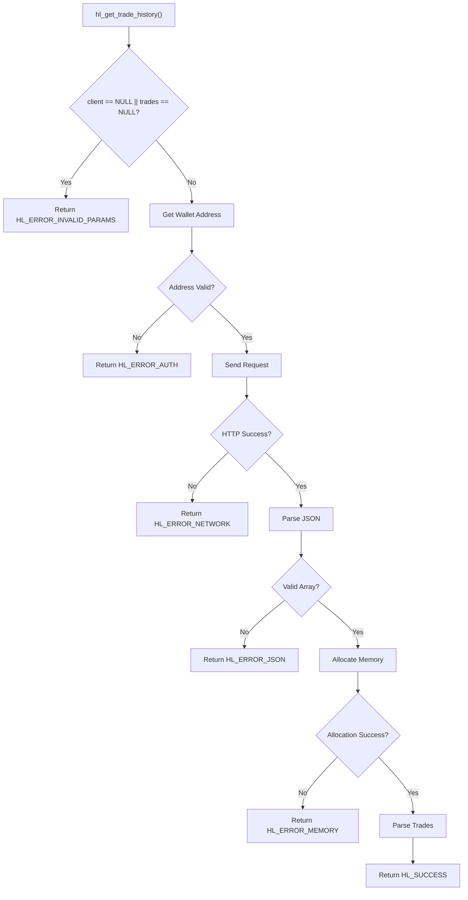
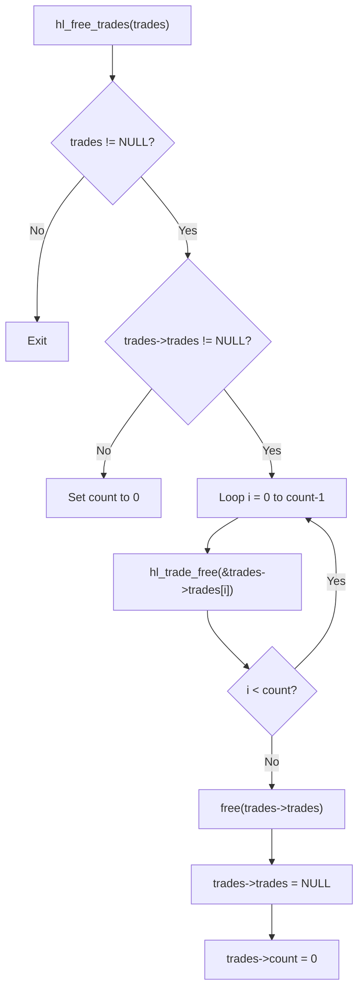

# Trade History

<cite>
**Referenced Files in This Document**   
- [hyperliquid.h](file://include/hyperliquid.h)
- [hl_types.h](file://include/hl_types.h)
- [trades.c](file://src/trades.c)
- [types.c](file://src/types.c)
</cite>

## Table of Contents
1. [Introduction](#introduction)
2. [Function Parameters and Usage](#function-parameters-and-usage)
3. [Trade Record Structure](#trade-record-structure)
4. [Server-Side Filtering and Pagination](#server-side-filtering-and-pagination)
5. [Real-World Use Cases](#real-world-use-cases)
6. [Error Handling](#error-handling)
7. [Best Practices for Efficient Polling](#best-practices-for-efficient-polling)
8. [Memory Management](#memory-management)

## Introduction
The `hl_get_trade_history` function provides access to a user's historical trade records on the Hyperliquid exchange. This documentation details the implementation, usage, and best practices for retrieving and processing trade history data. The function supports symbol filtering, dynamic memory allocation for results, and integrates with the exchange's API to deliver accurate and timely trade data. It is designed for post-trade analysis, auditing, and compliance workflows.

**Section sources**
- [hyperliquid.h](file://include/hyperliquid.h#L332-L335)

## Function Parameters and Usage
The `hl_get_trade_history` function retrieves trade history for a given trading symbol. It accepts four parameters: a client handle, an optional symbol filter, a pointer to a dynamically allocated array of `hl_trade_t` structures, and a pointer to store the count of returned trades. When the symbol parameter is NULL, the function returns all trades across all symbols. The function internally manages HTTP communication, JSON parsing, and memory allocation for the result set.

**Diagram sources**
- [trades.c](file://src/trades.c#L17-L99)
- [trades.c](file://src/trades.c#L104-L191)

**Section sources**
- [hyperliquid.h](file://include/hyperliquid.h#L332-L335)
- [trades.c](file://src/trades.c#L17-L191)

## Trade Record Structure
The `hl_trade_t` structure represents a single trade record with fields including symbol, trade side (buy/sell), price, quantity, fee, and timestamp. Each trade contains a unique trade ID and order ID for reference. The symbol field is limited to 32 characters, and all monetary values are stored as double-precision floating-point numbers. Timestamps are recorded in milliseconds since the Unix epoch.

**Diagram sources**
- [hl_types.h](file://include/hl_types.h#L25-L25)
- [hyperliquid.h](file://include/hyperliquid.h#L156-L165)

**Section sources**
- [hl_types.h](file://include/hl_types.h#L25-L25)
- [hyperliquid.h](file://include/hyperliquid.h#L156-L165)

## Server-Side Filtering and Pagination
Trade history retrieval is subject to server-side filtering based on the provided symbol parameter. The Hyperliquid API does not support pagination through limit/offset parameters in the current implementation. All available trades matching the symbol filter are returned in a single response. For user-specific trade history, the API uses the authenticated wallet address to scope results. Public trade history for a symbol is accessible without authentication.

**Section sources**
- [trades.c](file://src/trades.c#L17-L191)

## Real-World Use Cases
The trade history functionality supports various real-world scenarios including post-trade analysis, audit workflows, and compliance reporting. Traders can analyze their historical performance by symbol, calculate realized P&L, and verify execution quality. Compliance teams can use the data for regulatory reporting and audit trails. The structured format enables integration with external analytics tools for deeper market analysis.

**Section sources**
- [trades.c](file://src/trades.c#L17-L191)

## Error Handling
The function returns standardized error codes for various failure conditions. Common errors include `HL_ERROR_INVALID_PARAMS` for null client or output parameters, `HL_ERROR_AUTH` when the wallet address cannot be retrieved, `HL_ERROR_NETWORK` for HTTP communication failures, `HL_ERROR_JSON` for response parsing issues, and `HL_ERROR_MEMORY` when dynamic allocation fails. Applications should check the return value and handle errors appropriately before accessing the trade data.

**Diagram sources**
- [trades.c](file://src/trades.c#L17-L191)

**Section sources**
- [trades.c](file://src/trades.c#L17-L191)

## Best Practices for Efficient Polling
For applications requiring frequent trade history updates, implement polling with appropriate rate limiting to avoid overwhelming the API. Use symbol-specific queries to reduce payload size and improve response times. Cache results when possible and compare timestamps to detect new trades. Consider using WebSocket-based notifications if available for real-time updates instead of polling. Always validate the trade count before processing the array to handle empty results gracefully.

**Section sources**
- [trades.c](file://src/trades.c#L17-L191)

## Memory Management
The `hl_get_trade_history` function dynamically allocates memory for the trades array using `calloc`. The caller is responsible for freeing this memory using the `hl_free_trades` function. This function iterates through each trade to release individual resources and then frees the array itself. Failure to call `hl_free_trades` will result in memory leaks. The function safely handles NULL pointers and zero counts.

**Diagram sources**
- [types.c](file://src/types.c#L57-L66)

**Section sources**
- [types.c](file://src/types.c#L57-L66)
- [hyperliquid.h](file://include/hyperliquid.h#L342-L342)