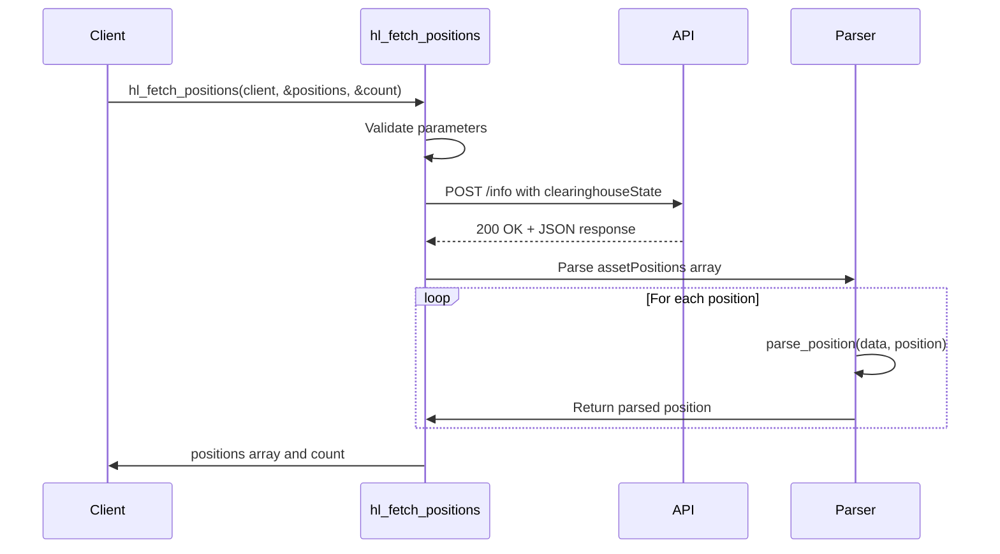
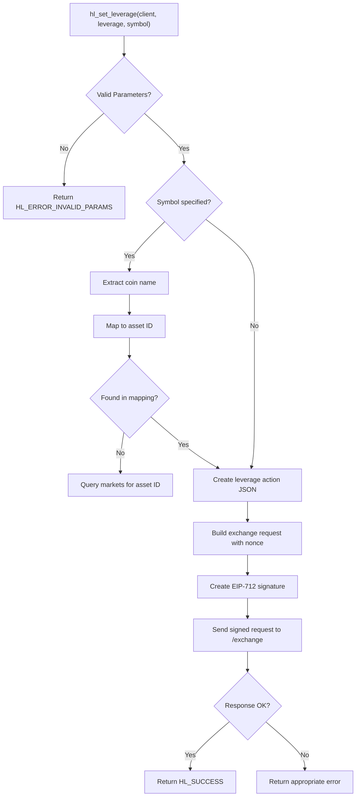
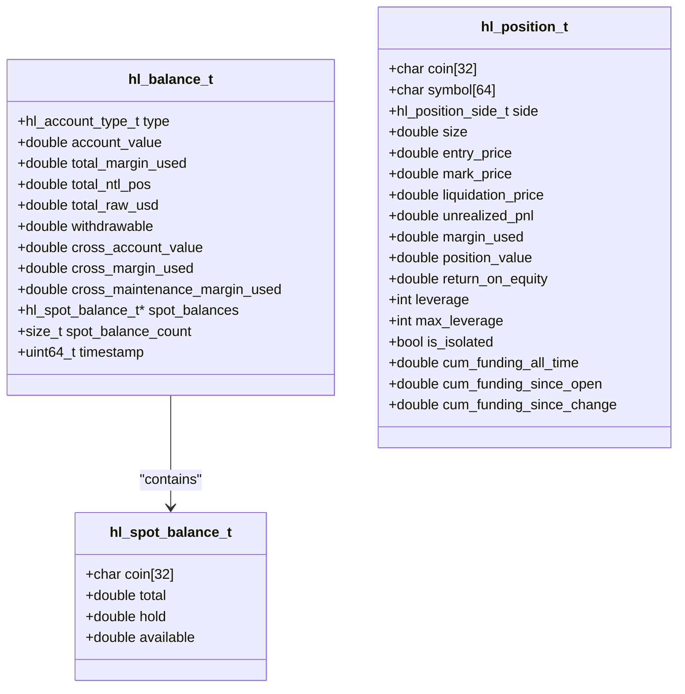

# Account Management

<cite>
**Referenced Files in This Document**   
- [hl_account.h](file://include/hl_account.h)
- [hl_types.h](file://include/hl_types.h)
- [account.c](file://src/account.c)
- [leverage.c](file://src/leverage.c)
- [simple_balance.c](file://examples/simple_balance.c)
- [simple_positions.c](file://examples/simple_positions.c)
</cite>

## Table of Contents
1. [Balance Queries with hl_fetch_balance()](#balance-queries-with-hl_fetch_balance)
2. [Position Tracking via hl_fetch_positions()](#position-tracking-via-hl_fetch_positions)
3. [Margin Mode and Leverage Configuration](#margin-mode-and-leverage-configuration)
4. [Trade History and Funding Rate Calculations](#trade-history-and-funding-rate-calculations)
5. [Data Models: hl_balance_t and hl_position_t](#data-models-hl_balance_t-and-hl_position_t)
6. [Portfolio Monitoring and Risk Assessment Workflows](#portfolio-monitoring-and-risk-assessment-workflows)
7. [Rate Limiting Considerations](#rate-limiting-considerations)

## Balance Queries with hl_fetch_balance()

The `hl_fetch_balance()` function retrieves account balance information for either perpetual or spot accounts. It serves as the primary interface for balance queries and routes requests to the appropriate internal handler based on account type.

When querying perpetual account balances, the function makes an HTTP POST request to the `/info` endpoint with a `clearinghouseState` payload containing the user's wallet address. The response contains margin summary data including account value, total margin used, total notional position value, and withdrawable amount. For spot accounts, it requests `spotClearinghouseState` and parses individual coin balances with total, hold, and available amounts.

The function validates input parameters and initializes the balance structure before dispatching to either `fetch_perpetual_balance()` or `fetch_spot_balance()` based on the specified account type. Error handling covers invalid parameters, network issues, API errors, and JSON parsing failures.

```mermaid
flowchart TD
A["hl_fetch_balance(client, type, balance)"] --> B{Valid Parameters?}
B --> |No| C[Return HL_ERROR_INVALID_PARAMS]
B --> |Yes| D[Initialize balance structure]
D --> E{Account Type?}
E --> |Perpetual| F[fetch_perpetual_balance()]
E --> |Spot| G[fetch_spot_balance()]
F --> H[Parse margin summary data]
G --> I[Parse spot balances array]
H --> J[Return HL_SUCCESS]
I --> J
```

**Diagram sources**
- [account.c](file://src/account.c#L249-L261)
- [account.c](file://src/account.c#L30-L144)
- [account.c](file://src/account.c#L149-L244)

**Section sources**
- [hl_account.h](file://include/hl_account.h#L135-L139)
- [account.c](file://src/account.c#L249-L261)

## Position Tracking via hl_fetch_positions()

The `hl_fetch_positions()` function retrieves all open positions for a user's account by querying the clearinghouse state. It extracts the wallet address from the client, constructs an HTTP request with the user's information, and parses the `assetPositions` array from the response.

The function first validates input parameters and client state, then builds a request body containing the user's wallet address. After making the HTTP request to the `/info` endpoint, it parses the JSON response to extract position data. Each position is processed through the `parse_position()` function which extracts key metrics like coin symbol, position size, entry price, mark price, liquidation price, unrealized PnL, margin used, and leverage settings.

For accounts with no positions, the function returns successfully with empty arrays rather than an error. Memory allocation for the positions array is handled dynamically based on the number of positions returned. The function also manages error conditions including network failures, API errors, and JSON parsing issues.



**Diagram sources**
- [account.c](file://src/account.c#L450-L540)
- [account.c](file://src/account.c#L276-L397)

**Section sources**
- [hl_account.h](file://include/hl_account.h#L163-L167)
- [account.c](file://src/account.c#L450-L540)

## Margin Mode and Leverage Configuration

The `hl_set_leverage()` function configures leverage settings for trading positions. It supports both default leverage configuration and asset-specific leverage settings. The function validates input parameters including leverage values (constrained between 1x and 50x) and client authentication credentials.

To set leverage for a specific asset, the function first extracts the coin name from the symbol (e.g., "BTC/USDC:USDC" → "BTC") and maps it to an asset ID. It maintains a basic mapping for major coins (BTC=1, ETH=2, SOL=3, USDC=0) and falls back to querying market data when needed. The leverage action is formatted as a JSON array and included in an exchange request with a nonce and EIP-712 signature.

The function builds a signed request containing the leverage update action and posts it to the `/exchange` endpoint. Response validation checks for HTTP status codes and response content to distinguish between API errors and network issues. The implementation supports both cross and isolated margin modes through the leverage type specification in the response data.



**Diagram sources**
- [leverage.c](file://src/leverage.c#L14-L125)

**Section sources**
- [hyperliquid.h](file://include/hyperliquid.h#L451-L453)
- [leverage.c](file://src/leverage.c#L14-L125)

## Trade History and Funding Rate Calculations

The account management system provides access to trade history and funding rate information through dedicated functions. While the core balance and position functions focus on current state, historical data is available through additional endpoints.

Funding rate calculations are derived from the cumulative funding fields in the position data structure, which include `cum_funding_all_time`, `cum_funding_since_open`, and `cum_funding_since_change`. These values represent the total funding payments/receipts over different time periods and can be used to calculate effective funding rates for positions.

Trade history can be retrieved through the `hl_fetch_ledger()` function, which queries the `userNonFundingLedgerUpdates` endpoint. This returns a comprehensive record of all account transactions including trades, deposits, withdrawals, and transfers. Each ledger entry includes timestamp, amount, balance after transaction, and reference IDs that can be used to reconstruct trading history and calculate performance metrics.

The system also provides trading fee information through `hl_fetch_trading_fee()`, which returns maker and taker fee rates for specific symbols. This information is essential for calculating net PnL and assessing the impact of funding rates on position profitability.

**Section sources**
- [account.c](file://src/account.c#L600-L799)
- [hl_account.h](file://include/hl_account.h#L180-L195)

## Data Models: hl_balance_t and hl_position_t

The account management system uses two primary data structures to represent account state: `hl_balance_t` and `hl_position_t`. These structures are defined in the header files and contain comprehensive information about account balances and open positions.

The `hl_balance_t` structure contains fields for both perpetual and spot account types. For perpetual accounts, it includes `account_value`, `total_margin_used`, `total_ntl_pos`, `total_raw_usd`, and `withdrawable` amounts. It also provides cross-margin summary fields like `cross_account_value` and `cross_maintenance_margin_used`. For spot accounts, it contains an array of `hl_spot_balance_t` structures with coin symbol, total balance, hold amount, and calculated available balance.

The `hl_position_t` structure captures detailed information about open positions including `coin` symbol, `side` (long/short), `size`, `entry_price`, `mark_price`, `liquidation_price`, `unrealized_pnl`, `margin_used`, `position_value`, and `return_on_equity`. It also includes leverage information with current `leverage`, `max_leverage`, and `is_isolated` flag. Funding metrics include `cum_funding_all_time`, `cum_funding_since_open`, and `cum_funding_since_change`.



**Diagram sources**
- [hl_account.h](file://include/hl_account.h#L50-L133)

**Section sources**
- [hl_account.h](file://include/hl_account.h#L50-L133)
- [hl_types.h](file://include/hl_types.h#L13-L14)

## Portfolio Monitoring and Risk Assessment Workflows

The account management functions enable comprehensive portfolio monitoring and risk assessment workflows. Applications can implement regular polling of balance and position data to track portfolio value, exposure, and risk metrics.

A typical monitoring workflow involves fetching both perpetual and spot balances to calculate total portfolio value, then retrieving open positions to assess directional exposure and leverage usage. Risk assessment can be performed by calculating metrics such as margin utilization ratio (total_margin_used / account_value), maximum position concentration, and liquidation risk based on distance to liquidation prices.

The system supports both comprehensive portfolio views and targeted queries. For example, applications can fetch all positions and filter for specific symbols, or retrieve a single position using `hl_fetch_position()`. This flexibility enables efficient monitoring of specific assets of interest without retrieving unnecessary data.

Risk assessment workflows should incorporate funding rate analysis by monitoring cumulative funding changes over time. This helps identify cost-effective positions and optimize timing for position adjustments. The combination of unrealized PnL, funding costs, and margin requirements provides a complete picture of position health and portfolio risk.

**Section sources**
- [simple_balance.c](file://examples/simple_balance.c#L18-L86)
- [simple_positions.c](file://examples/simple_positions.c#L18-L118)
- [comprehensive_demo.c](file://examples/comprehensive_demo.c#L85-L111)

## Rate Limiting Considerations

When polling account data frequently, applications must consider rate limiting to avoid being throttled by the exchange API. The account endpoints are subject to rate limits that vary based on account type and usage patterns.

Best practices for handling rate limiting include implementing exponential backoff for retry logic, caching results for a reasonable period (e.g., 1-5 seconds), and batching requests when possible. Applications should also monitor HTTP response headers for rate limit information and adjust polling frequency accordingly.

For real-time monitoring requirements, consider using WebSocket subscriptions instead of frequent HTTP polling. The system provides WebSocket capabilities that can deliver balance and position updates with lower latency and reduced load on the API servers.

When designing trading systems, implement circuit breakers that detect rate limiting responses and temporarily reduce request frequency. This prevents cascading failures during periods of high market volatility when both trading activity and monitoring requirements increase simultaneously.

**Section sources**
- [account.c](file://src/account.c#L30-L144)
- [account.c](file://src/account.c#L149-L244)
- [account.c](file://src/account.c#L450-L540)