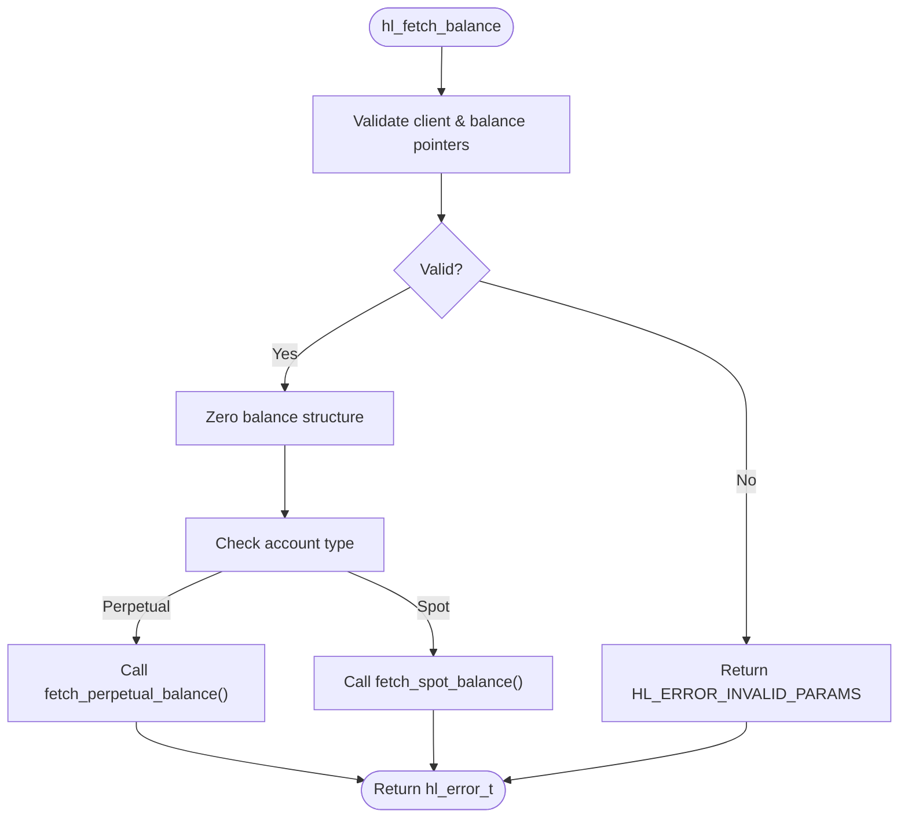
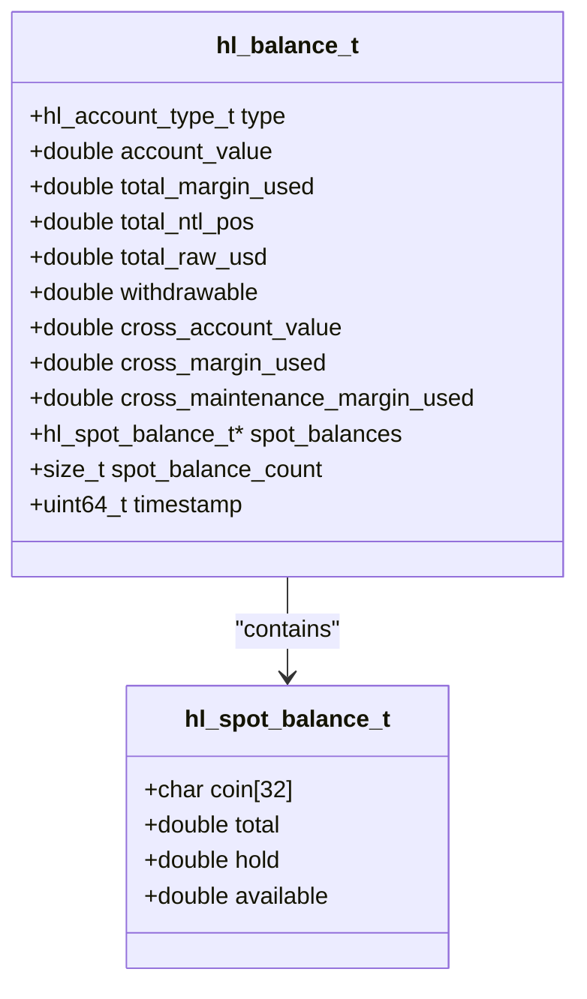
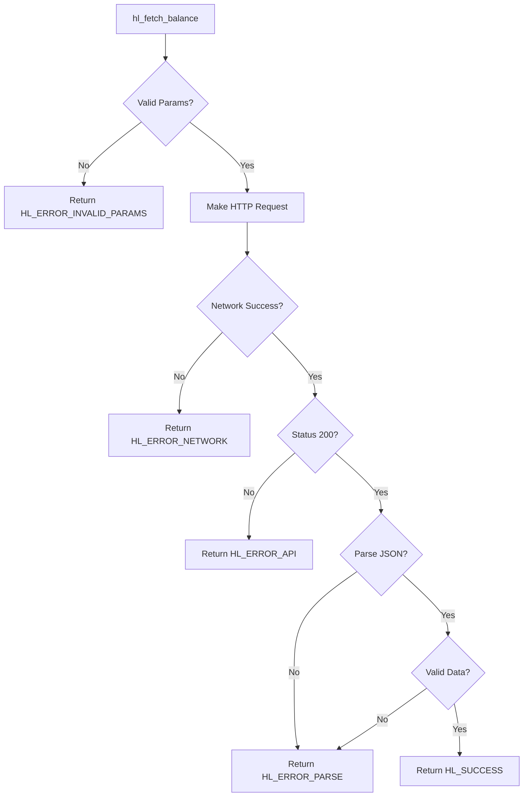

# Balance Queries

<cite>
**Referenced Files in This Document**   
- [src/account.c](file://src/account.c)
- [include/hl_account.h](file://include/hl_account.h)
- [include/hl_types.h](file://include/hl_types.h)
- [examples/simple_balance.c](file://examples/simple_balance.c)
- [include/hl_error.h](file://include/hl_error.h)
- [include/hl_internal.h](file://include/hl_internal.h)
- [include/hl_http.h](file://include/hl_http.h)
</cite>

## Table of Contents
1. [Introduction](#introduction)
2. [Function Parameters](#function-parameters)
3. [Internal Flow](#internal-flow)
4. [Balance Data Model](#balance-data-model)
5. [Code Example](#code-example)
6. [Error Handling](#error-handling)
7. [Performance and Thread Safety](#performance-and-thread-safety)

## Introduction
The `hl_fetch_balance()` function is the primary interface for retrieving account balance information from the Hyperliquid exchange. It supports both perpetual and spot trading accounts, returning structured balance data through the `hl_balance_t` type. This document details the function's parameters, internal execution flow, data model, usage examples, error handling, and performance considerations.

**Section sources**
- [include/hl_account.h](file://include/hl_account.h#L135-L139)
- [src/account.c](file://src/account.c#L249-L261)

## Function Parameters
The `hl_fetch_balance()` function accepts three parameters:

- `hl_client_t* client`: A pointer to the initialized client instance containing authentication and connection details. This must be a valid client created via `hl_client_new()`.
- `hl_account_type_t type`: An enumeration specifying the account type to query. Valid values are:
  - `HL_ACCOUNT_PERPETUAL`: For perpetual/swap account balances
  - `HL_ACCOUNT_SPOT`: For spot trading account balances
- `hl_balance_t* balance`: A pointer to a pre-allocated `hl_balance_t` structure where the result will be written. The caller is responsible for ensuring this memory is valid.

The function returns an `hl_error_t` code indicating success or failure.

**Section sources**
- [include/hl_account.h](file://include/hl_account.h#L135-L139)
- [include/hl_account.h](file://include/hl_account.h#L15-L25)

## Internal Flow
The internal execution of `hl_fetch_balance()` follows a structured sequence:

1. **Parameter Validation**: The function first checks that both `client` and `balance` pointers are non-null. If either is invalid, it returns `HL_ERROR_INVALID_PARAMS`.
2. **Memory Initialization**: The output `balance` structure is zeroed using `memset()` to ensure all fields start in a known state.
3. **Account Type Routing**: Based on the `type` parameter:
   - If `HL_ACCOUNT_PERPETUAL`, it calls the internal `fetch_perpetual_balance()` function
   - Otherwise, it calls `fetch_spot_balance()`

This routing enables specialized handling for different account types while maintaining a unified interface.



**Diagram sources**
- [src/account.c](file://src/account.c#L249-L261)

**Section sources**
- [src/account.c](file://src/account.c#L249-L261)

## Balance Data Model
The `hl_balance_t` structure contains fields relevant to both perpetual and spot accounts, with certain fields populated based on account type.

### Perpetual Account Fields
When `type` is `HL_ACCOUNT_PERPETUAL`, the following fields are populated:
- `account_value`: Total account value in USDC
- `total_margin_used`: Total margin currently used
- `total_ntl_pos`: Total notional position value
- `total_raw_usd`: Total raw USD value
- `withdrawable`: Amount available for withdrawal
- `cross_account_value`: Cross margin account value
- `cross_margin_used`: Cross margin used
- `cross_maintenance_margin_used`: Cross maintenance margin used
- `timestamp`: Response timestamp in milliseconds

### Spot Account Fields
When `type` is `HL_ACCOUNT_SPOT`, the following fields are populated:
- `spot_balances`: Pointer to an array of `hl_spot_balance_t` structures
- `spot_balance_count`: Number of elements in the spot balances array

Each `hl_spot_balance_t` contains:
- `coin`: Coin symbol (e.g., "USDC", "BTC")
- `total`: Total balance
- `hold`: Amount on hold (in open orders)
- `available`: Available balance (calculated as total - hold)

The `spot_balances` array must be freed by the caller using `hl_free_spot_balances()`.



**Diagram sources**
- [include/hl_account.h](file://include/hl_account.h#L50-L82)
- [include/hl_account.h](file://include/hl_account.h#L43-L48)

**Section sources**
- [include/hl_account.h](file://include/hl_account.h#L50-L82)
- [include/hl_account.h](file://include/hl_account.h#L43-L48)

## Code Example
The `simple_balance.c` example demonstrates proper usage of `hl_fetch_balance()` for retrieving perpetual balance:

```c
hl_balance_t perpetual_balance = {0};
hl_error_t err = hl_fetch_balance(client, HL_ACCOUNT_PERPETUAL, &perpetual_balance);

if (err != HL_SUCCESS) {
    printf("❌ Failed to fetch perpetual balance: %s\n", hl_error_string(err));
    return 1;
}

printf("✅ Perpetual Balance:\n");
printf("   Account Value: %.2f USDC\n", perpetual_balance.account_value);
printf("   Margin Used: %.2f USDC\n", perpetual_balance.total_margin_used);
printf("   Withdrawable: %.2f USDC\n", perpetual_balance.withdrawable);
```

For spot balances, the example shows proper cleanup:
```c
if (spot_balance.spot_balances) {
    hl_free_spot_balances(spot_balance.spot_balances, spot_balance.spot_balance_count);
}
```

**Section sources**
- [examples/simple_balance.c](file://examples/simple_balance.c#L45-L65)
- [examples/simple_balance.c](file://examples/simple_balance.c#L78-L80)

## Error Handling
The function implements comprehensive error handling:

- `HL_ERROR_INVALID_PARAMS`: Returned when `client` or `balance` is NULL, or when wallet address is unavailable
- `HL_ERROR_NETWORK`: Indicates network communication failure during HTTP request
- `HL_ERROR_API`: Returned when the API responds with non-200 status code
- `HL_ERROR_PARSE`: Indicates JSON parsing failure or missing required fields
- `HL_ERROR_MEMORY`: Only for spot balances, when memory allocation fails
- `HL_SUCCESS`: Indicates successful balance retrieval

Error codes should be checked after each call, and `hl_error_string()` can be used to get human-readable messages.



**Diagram sources**
- [src/account.c](file://src/account.c#L30-L144)
- [src/account.c](file://src/account.c#L149-L244)
- [include/hl_error.h](file://include/hl_error.h#L15-L35)

**Section sources**
- [src/account.c](file://src/account.c#L30-L144)
- [src/account.c](file://src/account.c#L149-L244)
- [include/hl_error.h](file://include/hl_error.h#L15-L35)

## Performance and Thread Safety
To optimize performance and ensure thread safety:

- **Minimize API Calls**: Cache balance results when possible, as each `hl_fetch_balance()` call makes a network request. Consider implementing application-level caching with appropriate TTL.
- **Thread Safety**: The function itself is not guaranteed to be thread-safe. When using from multiple threads, callers should implement external synchronization using mutexes or similar mechanisms.
- **Memory Management**: For spot balances, always free the `spot_balances` array using `hl_free_spot_balances()` to prevent memory leaks.
- **Connection Reuse**: The underlying HTTP client reuses connections, so creating a single client instance and reusing it across balance queries is more efficient than creating new clients.

**Section sources**
- [src/account.c](file://src/account.c#L30-L261)
- [include/hl_client.h](file://include/hl_client.h#L100-L110)