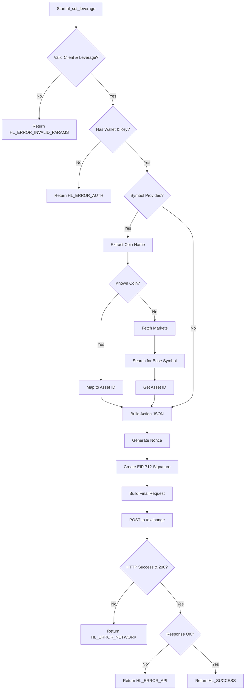

# Leverage Management

<cite>
**Referenced Files in This Document**   
- [leverage.c](file://src/leverage.c)
- [hl_client.h](file://include/hl_client.h)
- [hl_error.h](file://include/hl_error.h)
- [hl_markets.h](file://include/hl_markets.h)
- [hl_internal.h](file://include/hl_internal.h)
- [eip712.c](file://src/crypto/eip712.c)
- [trading_api.c](file://src/trading_api.c)
</cite>

## Table of Contents
1. [Function Parameters](#function-parameters)
2. [Implementation Flow](#implementation-flow)
3. [Default vs Per-Asset Leverage](#default-vs-per-asset-leverage)
4. [Error Handling](#error-handling)
5. [Security Considerations](#security-considerations)

## Function Parameters

The `hl_set_leverage()` function configures leverage settings for trading on Hyperliquid. It accepts three parameters:

- **Client Context**: A pointer to `hl_client_t` containing authentication credentials, wallet address, and connection settings. This context is essential for API authentication and network communication.
- **Leverage Value**: An integer between 1 and 50 representing the desired leverage multiplier. Values outside this range trigger `HL_ERROR_INVALID_PARAMS`.
- **Symbol (Optional)**: A `const char*` specifying the trading pair (e.g., "BTC/USDC:USDC") for asset-specific leverage. If NULL, the leverage applies globally as the default setting.

**Section sources**
- [leverage.c](file://src/leverage.c#L14-L125)
- [hl_client.h](file://include/hl_client.h#L451-L453)

## Implementation Flow

The leverage configuration process follows a structured sequence of operations:

1. **Parameter Validation**: The function first validates the client pointer and ensures the leverage value is within the 1–50 range. Invalid inputs return `HL_ERROR_INVALID_PARAMS`.

2. **Authentication Check**: Retrieves wallet address and private key using legacy accessors (`hl_client_get_wallet_address_old`, `hl_client_get_private_key_old`). Missing credentials result in `HL_ERROR_AUTH`.

3. **Asset ID Mapping**: When a symbol is provided:
   - Extracts the base coin (e.g., "BTC" from "BTC/USDC:USDC") using string parsing.
   - Maps known coins (BTC, ETH, SOL, USDC) to predefined asset IDs via hardcoded logic.
   - For unknown coins, queries the exchange via `hl_fetch_markets()` and searches for a matching base symbol.

4. **Action Payload Construction**: Builds a JSON action array:
   - For specific assets: Includes both `leverage` and `asset` fields.
   - For default leverage: Omits the `asset` field.

5. **Nonce Generation**: Uses `get_timestamp_ms()` to generate a millisecond-precision timestamp as the nonce, ensuring request uniqueness.

6. **EIP-712 Signature**: Generates a cryptographic signature using `hl_build_exchange_signature()`, which internally uses `eip712_sign_agent()` with domain "Exchange", chain ID 1337, and source "a" (mainnet) or "b" (testnet).

7. **Request Submission**: Constructs the final JSON request with action, nonce, and signature, then sends it via `http_client_post_old()` to the `/exchange` endpoint.

**Diagram sources**
- [leverage.c](file://src/leverage.c#L14-L125)
- [eip712.c](file://src/crypto/eip712.c#L22-L297)
- [trading_api.c](file://src/trading_api.c#L22-L340)

**Section sources**
- [leverage.c](file://src/leverage.c#L14-L125)
- [hl_markets.h](file://include/hl_markets.h#L86-L86)
- [eip712.c](file://src/crypto/eip712.c#L22-L297)

## Default vs Per-Asset Leverage

The function supports two leverage configuration modes:

- **Default Leverage**: When `symbol` is NULL, the leverage applies to all positions. The JSON action contains only the `leverage` field, setting a global default.

- **Per-Asset Leverage**: When `symbol` is specified, the system attempts to map it to an asset ID. If successful, the JSON action includes both `leverage` and `asset` fields, applying the setting only to the specified asset.

This dual-mode design allows traders to set a baseline leverage while fine-tuning risk exposure for specific high-volatility assets.

**Section sources**
- [leverage.c](file://src/leverage.c#L14-L125)

## Error Handling

The function returns standardized error codes defined in `hl_error_t`:

- **HL_ERROR_INVALID_PARAMS**: Client is NULL or leverage is outside 1–50 range.
- **HL_ERROR_AUTH**: Missing wallet address or private key in client context.
- **HL_ERROR_SIGNATURE**: Failure during EIP-712 signing process.
- **HL_ERROR_NETWORK**: HTTP request failure or no response from server.
- **HL_ERROR_API**: Server returns non-200 status or response lacks "status":"ok".

API-level errors may indicate invalid asset IDs, rate limiting, or temporary exchange issues.

**Section sources**
- [leverage.c](file://src/leverage.c#L14-L125)
- [hl_error.h](file://include/hl_error.h#L1-L38)

## Security Considerations

Private key handling follows critical security practices:

- The private key remains within the client context and is never exposed in logs or external systems.
- Signing occurs locally using `ecdsa_sign_secp256k1` with deterministic RFC 6979 signatures.
- The EIP-712 standard ensures structured data hashing, preventing signature replay attacks across domains.
- Recovery ID validation confirms the correct public key derivation, mitigating malleability risks.

Developers must ensure private keys are stored securely (e.g., environment variables, hardware wallets) and never hard-coded in source files.

**Section sources**
- [eip712.c](file://src/crypto/eip712.c#L22-L297)
- [hl_internal.h](file://include/hl_internal.h#L1-L113)