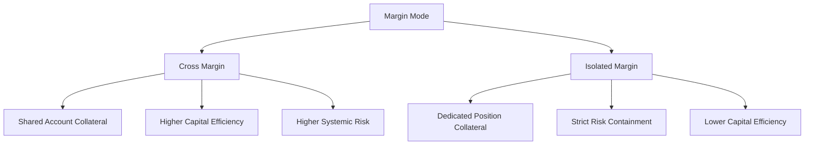
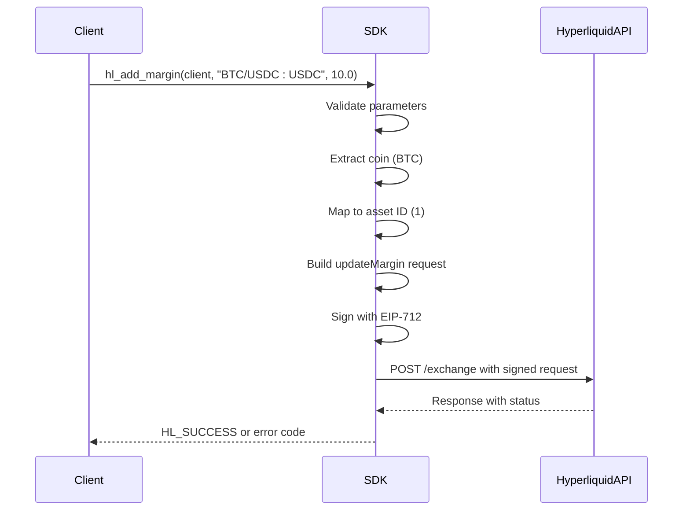
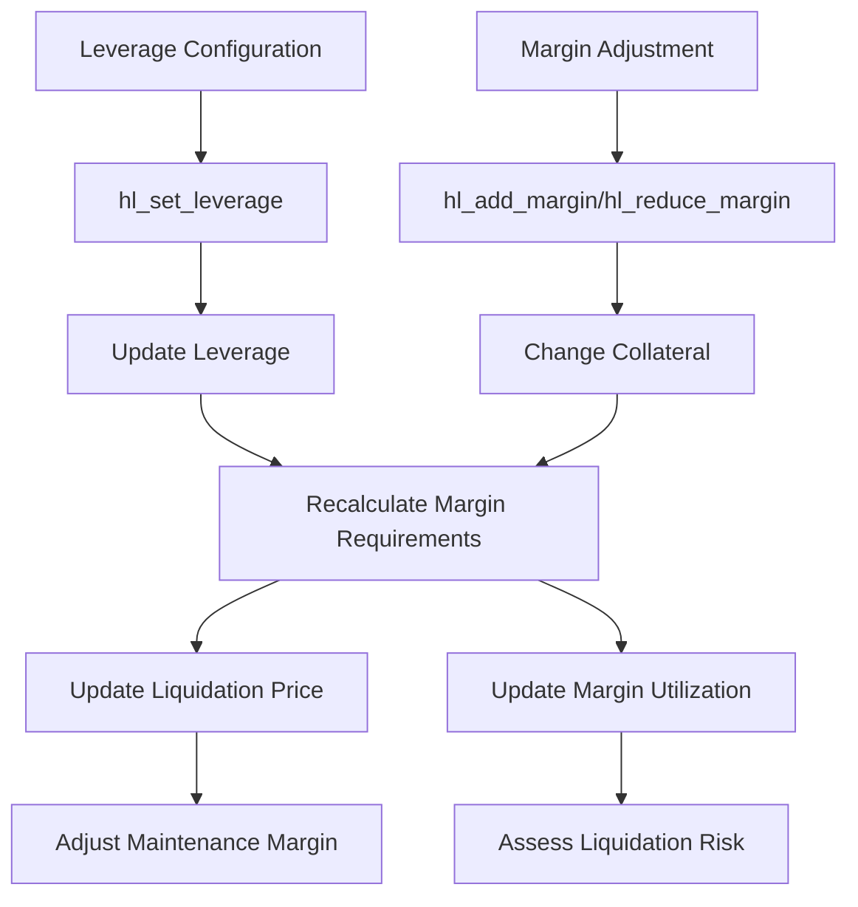
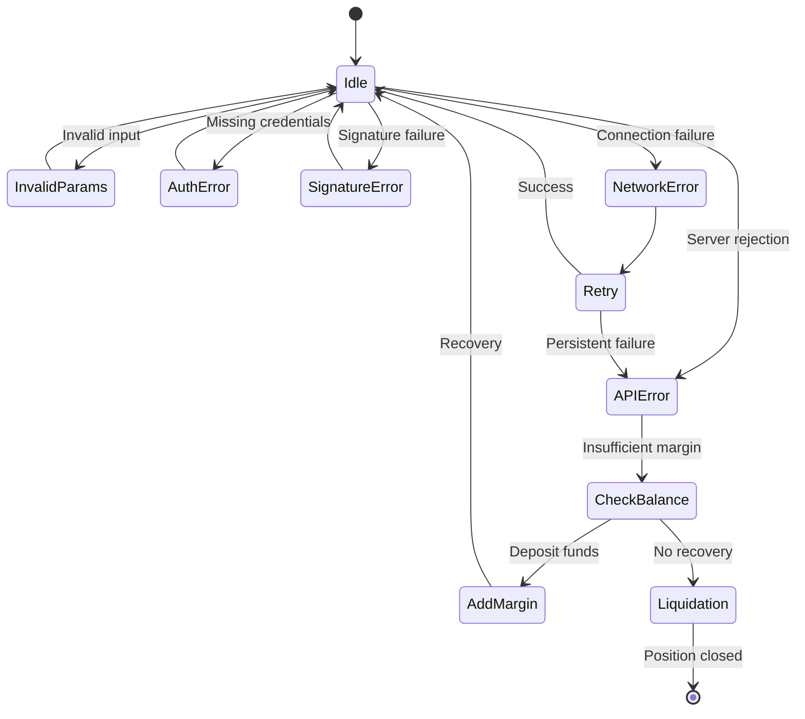
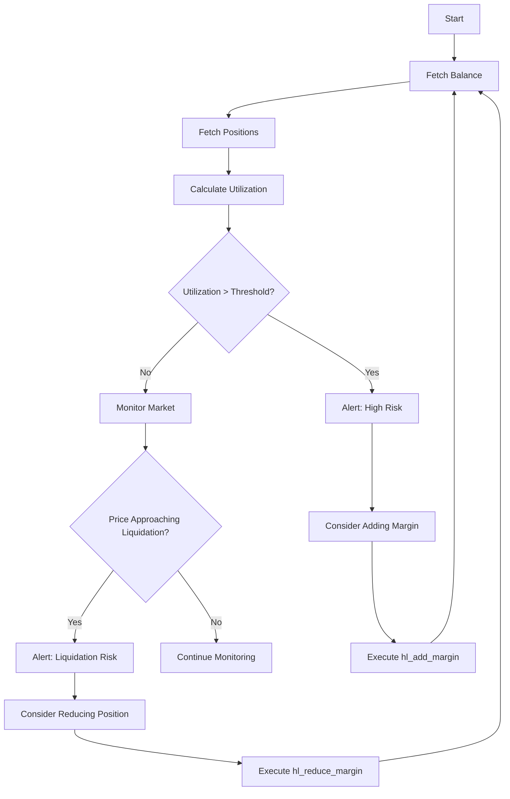

# Margin Operations

<cite>
**Referenced Files in This Document**   
- [margin.c](file://src/margin.c)
- [hl_account.h](file://include/hl_account.h)
- [hl_types.h](file://include/hl_types.h)
- [leverage.c](file://src/leverage.c)
</cite>

## Table of Contents
1. [Margin System Architecture](#margin-system-architecture)
2. [Cross vs Isolated Margin](#cross-vs-isolated-margin)
3. [Margin Query and Modification Functions](#margin-query-and-modification-functions)
4. [Interaction Between Margin and Leverage](#interaction-between-margin-and-leverage)
5. [Error Conditions in Margin Operations](#error-conditions-in-margin-operations)
6. [Risk Assessment Workflows](#risk-assessment-workflows)
7. [hl_balance_t Fields Related to Margin](#hl_balance_t-fields-related-to-margin)
8. [Best Practices for Monitoring Margin Utilization](#best-practices-for-monitoring-margin-utilization)

## Margin System Architecture

The Hyperliquid margin system is designed to manage collateral allocation for perpetual trading positions. It supports both cross and isolated margin modes, allowing traders to choose their risk exposure strategy. The system operates through a set of API functions that enable margin adjustments, leverage configuration, and real-time balance monitoring. Margin operations are executed via signed requests to the exchange endpoint, ensuring secure and authenticated transactions.

The architecture integrates with the broader trading system through the `hl_client_t` interface, which handles authentication, request signing, and communication with the Hyperliquid API. All margin-related operations are processed through the `/exchange` endpoint using EIP-712 signatures for security.

**Section sources**
- [margin.c](file://src/margin.c#L14-L123)
- [hl_account.h](file://include/hl_account.h#L21-L215)

## Cross vs Isolated Margin

Hyperliquid supports two distinct margin modes: cross margin and isolated margin. These modes are defined by the `hl_margin_mode_t` enum in `hl_account.h`.

**Cross Margin** (`HL_MARGIN_CROSS`): In this mode, the entire account balance serves as collateral for all open positions. This allows for maximum capital efficiency as profits from one position can help maintain others. However, it also means that a significant loss in one position could impact the entire account.

**Isolated Margin** (`HL_MARGIN_ISOLATED`): Each position has its own dedicated margin allocation. This limits risk to the specific position and prevents losses in one position from affecting others. Isolated margin is particularly useful for traders who want to strictly control their risk exposure per trade.

The margin mode is determined at the position level and can be checked via the `is_isolated` field in the `hl_position_t` structure. This field indicates whether a specific position is using isolated margin.

**Diagram sources**
- [hl_account.h](file://include/hl_account.h#L25-L29)
- [hl_account.h](file://include/hl_account.h#L108-L124)

## Margin Query and Modification Functions

The Hyperliquid C SDK provides functions to modify margin allocations for existing positions. These functions are implemented in `margin.c` and exposed through the public API.

**hl_add_margin**: This function increases the margin allocated to a specific position. It takes a client instance, symbol, and amount as parameters. The function validates inputs, derives the asset ID from the symbol, constructs a signed request with the "updateMargin" action, and sends it to the exchange API.

**hl_reduce_margin**: This function decreases the margin allocated to a position. It is implemented as a wrapper around `hl_add_margin`, passing a negative amount to achieve the reduction.

Both functions return `HL_SUCCESS` on successful execution or an appropriate error code. They require valid authentication credentials and proper symbol formatting (e.g., "BTC/USDC:USDC").

**Diagram sources**
- [margin.c](file://src/margin.c#L14-L123)
- [hyperliquid.h](file://include/hyperliquid.h#L585-L599)

## Interaction Between Margin and Leverage

Margin settings and leverage configuration are closely intertwined in the Hyperliquid system. Leverage determines the multiplier applied to position size relative to margin, while margin represents the actual collateral allocated.

The `hl_set_leverage` function in `leverage.c` allows traders to configure leverage for specific symbols or globally. When leverage is changed, it affects the maintenance margin requirements and liquidation price calculations for positions. Higher leverage increases both potential returns and liquidation risk.

The relationship between margin and leverage is reflected in the position data:
- **Position Value** = Position Size × Mark Price
- **Margin Used** = Position Value / Leverage
- **Maintenance Margin** = Position Value × Maintenance Rate

Changes to either margin or leverage will affect the margin utilization ratio and liquidation risk. For example, increasing leverage without adding additional margin will increase the risk of forced liquidation.

**Diagram sources**
- [leverage.c](file://src/leverage.c#L14-L126)
- [margin.c](file://src/margin.c#L14-L123)

## Error Conditions in Margin Operations

Several error conditions can occur during margin operations, each with specific causes and implications:

**HL_ERROR_INVALID_PARAMS**: Triggered when invalid parameters are provided to margin functions, such as null client, invalid symbol, or non-positive amount. This can also occur if the asset cannot be mapped to a valid asset ID.

**HL_ERROR_AUTH**: Occurs when authentication credentials (wallet address or private key) are missing or invalid. This prevents the creation of valid EIP-712 signatures required for margin operations.

**HL_ERROR_SIGNATURE**: Generated when the EIP-712 signature creation fails. This could be due to cryptographic errors or invalid private key formatting.

**HL_ERROR_NETWORK**: Indicates network communication failures when sending requests to the exchange API. This could result from connectivity issues or server unavailability.

**HL_ERROR_API**: Returned when the exchange API rejects the request, typically due to insufficient maintenance margin, position not found, or exceeding maximum leverage limits.

A critical error condition specific to margin operations is **insufficient maintenance margin**, which occurs when the account's margin balance falls below the required threshold to maintain open positions. This can lead to forced liquidations if not addressed promptly.

**Diagram sources**
- [margin.c](file://src/margin.c#L14-L123)
- [leverage.c](file://src/leverage.c#L14-L126)

## Risk Assessment Workflows

Effective risk management requires combining margin status with position data to assess overall account health. The following workflow demonstrates how to monitor and evaluate margin utilization:

1. Fetch the current account balance using `hl_fetch_balance` with `HL_ACCOUNT_PERPETUAL` type
2. Retrieve all open positions using `hl_fetch_positions`
3. Calculate margin utilization ratio: `total_margin_used / account_value`
4. For each position, verify that `margin_used` is sufficient relative to position value and leverage
5. Monitor `withdrawable` balance to ensure adequate buffer for maintenance margin
6. Track `liquidation_price` for each position relative to current market conditions

A comprehensive risk assessment should be performed before and after any margin or leverage changes. The system provides all necessary data through the balance and position APIs, allowing traders to build automated monitoring systems that trigger alerts when margin utilization exceeds predefined thresholds.

**Diagram sources**
- [hl_account.h](file://include/hl_account.h#L135-L167)
- [account.c](file://src/account.c#L249-L540)

## hl_balance_t Fields Related to Margin

The `hl_balance_t` structure contains several fields critical to margin operations and risk assessment:

- **account_value**: Total account value in USDC, representing the overall equity
- **total_margin_used**: Sum of margin allocated across all positions
- **total_ntl_pos**: Total notional position value
- **total_raw_usd**: Total raw USD value of positions
- **withdrawable**: Amount available for withdrawal, indicating excess margin
- **cross_account_value**: Account value when using cross margin
- **cross_margin_used**: Margin used in cross margin mode
- **cross_maintenance_margin_used**: Maintenance margin requirement in cross margin mode

These fields provide a comprehensive view of account health and margin utilization. The ratio of `total_margin_used` to `account_value` indicates overall margin utilization, while `withdrawable` shows the buffer available before reaching maintenance margin requirements.

**Section sources**
- [hl_account.h](file://include/hl_account.h#L70-L90)

## Best Practices for Monitoring Margin Utilization

To prevent forced liquidations and maintain healthy trading operations, follow these best practices:

1. **Regular Monitoring**: Check margin utilization at least daily, or more frequently during volatile market conditions
2. **Set Alerts**: Implement automated alerts when margin utilization exceeds 70-80% of available equity
3. **Maintain Buffer**: Keep a minimum of 20-30% of account value as excess margin to absorb market fluctuations
4. **Position Sizing**: Size positions appropriately based on account equity and risk tolerance
5. **Leverage Management**: Use conservative leverage settings, especially for volatile assets
6. **Diversification**: Avoid concentrating margin across highly correlated assets
7. **Emergency Plan**: Have a plan for quickly adding margin or reducing positions if utilization becomes critical

Regularly review the `withdrawable` balance as a key indicator of financial health. A declining withdrawable balance signals increasing margin utilization and potential risk. When `withdrawable` approaches zero, immediate action is required to either add margin or reduce position size.

**Section sources**
- [hl_account.h](file://include/hl_account.h#L70-L90)
- [margin.c](file://src/margin.c#L14-L123)