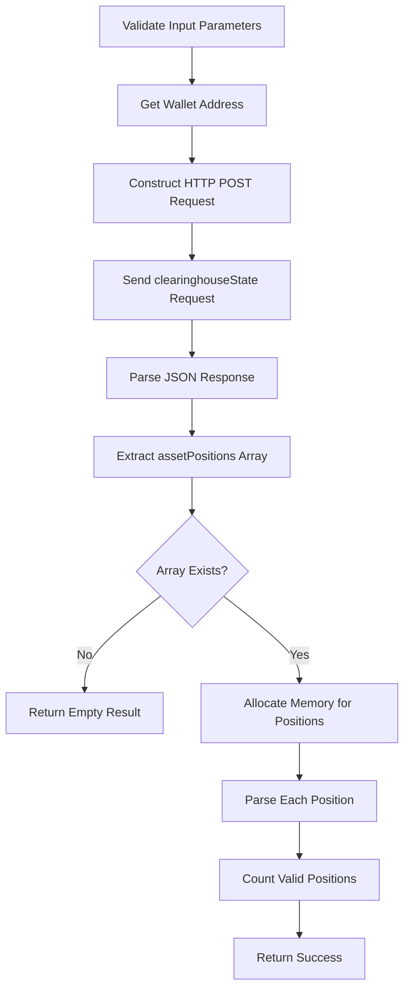
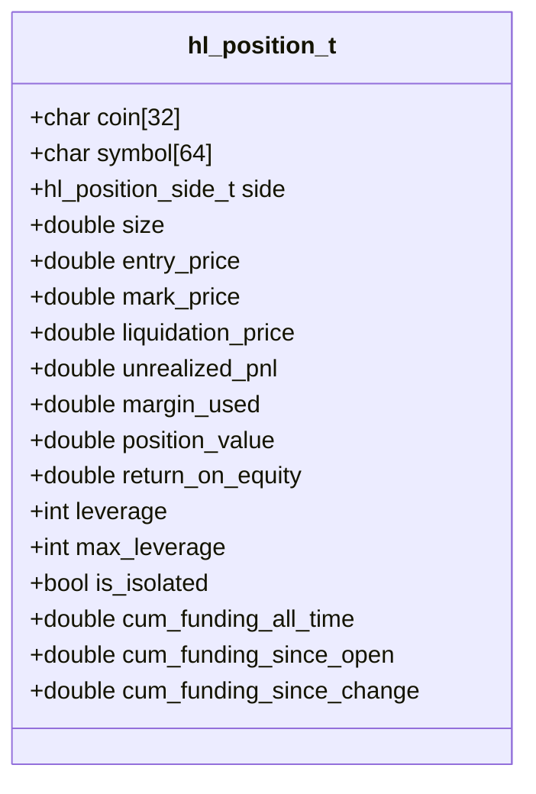
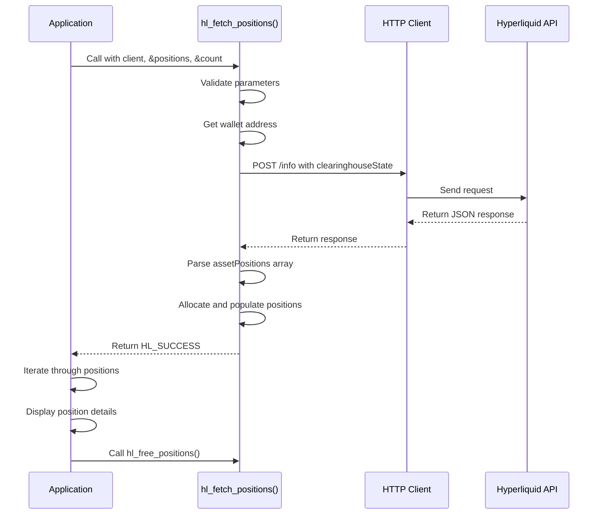
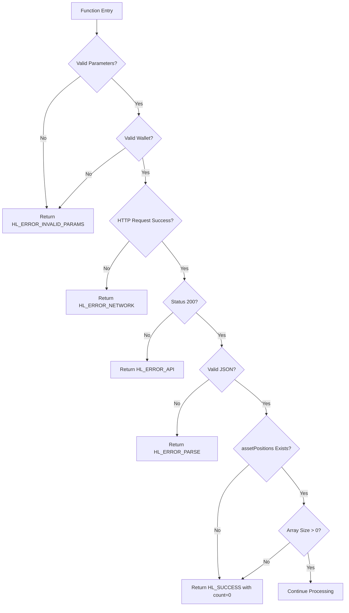
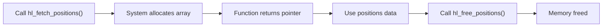

# Position Tracking

<cite>
**Referenced Files in This Document**   
- [account.c](file://src/account.c)
- [hl_account.h](file://include/hl_account.h)
- [hl_types.h](file://include/hl_types.h)
- [simple_positions.c](file://examples/simple_positions.c)
- [hl_error.h](file://include/hl_error.h)
- [hl_http.h](file://include/hl_http.h)
</cite>

## Table of Contents
1. [Function Signature and Parameters](#function-signature-and-parameters)
2. [Workflow Overview](#workflow-overview)
3. [Position Data Structure](#position-data-structure)
4. [Usage Example](#usage-example)
5. [Error Handling and Edge Cases](#error-handling-and-edge-cases)
6. [Memory Management](#memory-management)
7. [Polling and Rate Limiting](#polling-and-rate-limiting)

## Function Signature and Parameters

The `hl_fetch_positions()` function retrieves all open trading positions for a Hyperliquid account. It follows a standard C pattern using output parameters for data return.

```c
hl_error_t hl_fetch_positions(
    hl_client_t* client,
    hl_position_t** positions,
    size_t* count
);
```

- `client`: Initialized client instance containing wallet and authentication data
- `positions`: Double pointer to receive dynamically allocated array of positions (caller must free)
- `count`: Pointer to receive number of valid positions returned

The function returns an `hl_error_t` code indicating success or failure.

**Section sources**
- [hl_account.h](file://include/hl_account.h#L163-L167)
- [account.c](file://src/account.c#L450-L540)

## Workflow Overview

The position fetching workflow consists of several sequential steps:



**Diagram sources**
- [account.c](file://src/account.c#L450-L540)

**Section sources**
- [account.c](file://src/account.c#L450-L540)

### Request Construction

The function constructs a JSON request body containing the wallet address:

```json
{"type":"clearinghouseState","user":"0x..."}
```

This is sent via POST to the `/info` endpoint of the appropriate base URL (production or testnet).

### Response Processing

The API response is parsed using cJSON. The `assetPositions` array is extracted and iterated over. Each position object is processed through the internal `parse_position()` function to populate the `hl_position_t` structure.

## Position Data Structure

The `hl_position_t` structure contains comprehensive position information:



**Diagram sources**
- [hl_account.h](file://include/hl_account.h#L140-L160)

**Section sources**
- [hl_account.h](file://include/hl_account.h#L140-L160)
- [account.c](file://src/account.c#L276-L397)

### Key Fields

- **coin**: Base asset symbol (e.g., "BTC")
- **symbol**: Market symbol in CCXT format (e.g., "BTC/USDC:USDC")
- **side**: Position direction (LONG or SHORT)
- **size**: Position size in base asset units
- **entry_price**: Average entry price in quote currency
- **unrealized_pnl**: Current profit/loss in quote currency
- **leverage**: Current leverage used
- **is_isolated**: Margin mode flag

## Usage Example

The `simple_positions.c` example demonstrates proper usage:



**Diagram sources**
- [simple_positions.c](file://examples/simple_positions.c#L30-L85)

**Section sources**
- [simple_positions.c](file://examples/simple_positions.c#L30-L85)

## Error Handling and Edge Cases

The function handles several error conditions and edge cases:



**Diagram sources**
- [account.c](file://src/account.c#L450-L540)

**Section sources**
- [account.c](file://src/account.c#L450-L540)
- [hl_error.h](file://include/hl_error.h#L15-L35)

### Specific Edge Cases

- **Empty positions array**: Returns `HL_SUCCESS` with `*count = 0` and `*positions = NULL`
- **Invalid position data**: Skips invalid entries but continues processing others
- **Partial parsing failures**: Returns success if at least one valid position is found
- **Network errors**: Returns `HL_ERROR_NETWORK`
- **API errors**: Returns `HL_ERROR_API` for non-200 responses

## Memory Management

Proper memory management is critical when using `hl_fetch_positions()`:



The caller is responsible for freeing the allocated positions array using `hl_free_positions()`:

```c
hl_position_t* positions = NULL;
size_t count = 0;
hl_fetch_positions(client, &positions, &count);

// ... use positions ...

if (positions) {
    hl_free_positions(positions, count);
}
```

**Section sources**
- [account.c](file://src/account.c#L592-L597)
- [hl_account.h](file://include/hl_account.h#L189)

## Polling and Rate Limiting

When implementing position tracking in applications:

- **Polling frequency**: Recommended interval is 3-5 seconds for most use cases
- **Rate limiting**: The Hyperliquid API may impose rate limits; excessive polling can result in temporary bans
- **Efficient updates**: Consider using WebSocket feeds for real-time updates instead of frequent HTTP polling
- **Error backoff**: Implement exponential backoff when encountering rate limit errors

For applications requiring real-time data, consider using the WebSocket interface rather than polling `hl_fetch_positions()` repeatedly.

**Section sources**
- [account.c](file://src/account.c#L450-L540)
- [simple_positions.c](file://examples/simple_positions.c#L30-L85)