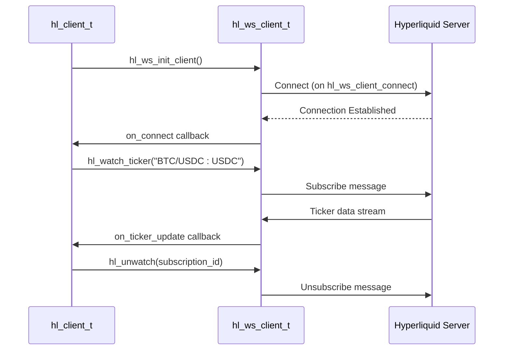
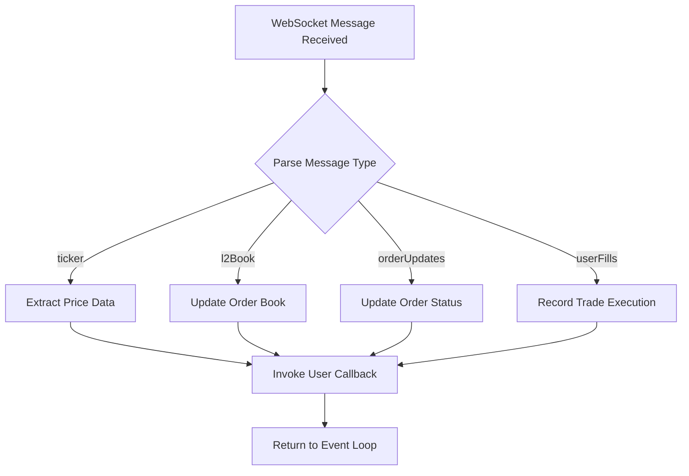

# Advanced Features

<cite>
**Referenced Files in This Document**   
- [leverage.c](file://src/leverage.c)
- [funding.c](file://src/funding.c)
- [websocket.c](file://src/websocket.c)
- [ws_client.c](file://src/ws_client.c)
- [hl_ws_client.h](file://include/hl_ws_client.h)
- [hyperliquid.h](file://include/hyperliquid.h)
- [websocket_demo.c](file://examples/websocket_demo.c)
</cite>

## Table of Contents
1. [Leverage and Margin Management](#leverage-and-margin-management)
2. [Funding Rate Calculations and Retrieval](#funding-rate-calculations-and-retrieval)
3. [WebSocket Integration for Real-Time Data Streaming](#websocket-integration-for-real-time-data-streaming)
4. [Connection Resilience and Reconnection Strategies](#connection-resilience-and-reconnection-strategies)
5. [Message Parsing and Event Handling](#message-parsing-and-event-handling)
6. [Performance Considerations for High-Throughput Applications](#performance-considerations-for-high-throughput-applications)
7. [Memory Management for Continuous Data Streams](#memory-management-for-continuous-data-streams)

## Leverage and Margin Management

The Hyperliquid C SDK provides functionality for managing leverage settings through the `hl_set_leverage` function. This function allows users to configure leverage for specific trading symbols or globally. The leverage value must be within the range of 1 to 50, inclusive. When a symbol is specified, the system extracts the base coin (e.g., "BTC" from "BTC/USDC:USDC") and maps it to an internal asset ID, either through a predefined mapping or by querying available markets.

The implementation handles authentication using the client's private key and wallet address, constructs an EIP-712 compliant signature for the exchange request, and submits the update via HTTP POST to the `/exchange` endpoint. Error handling includes validation of input parameters, authentication status, signature generation, and network response processing.

**Section sources**
- [leverage.c](file://src/leverage.c#L14-L125)
- [hyperliquid.h](file://include/hyperliquid.h#L522-L524)

## Funding Rate Calculations and Retrieval

Funding rates are retrieved using the `hl_fetch_funding_rates` function, which queries the `/info` endpoint with a `"metaAndAssetCtxs"` request type. The response contains both market metadata and asset contexts, which are parsed to extract funding-related data such as funding rate, mark price, index price (oracle), open interest, and premium for each supported asset.

The function dynamically allocates memory for the `hl_funding_rates_t` structure, which holds an array of `hl_funding_rate_t` entries. Each entry includes the symbol in standard format (e.g., "BTC/USDC:USDC"), timestamps, and raw context data. The parsing logic handles both string and numeric JSON values to ensure compatibility with varying API responses.

Additional functions such as `hl_fetch_funding_rate_history` and `hl_fetch_funding_history` allow retrieval of historical funding data, supporting time-based queries and pagination via the `since` and `limit` parameters.

**Section sources**
- [funding.c](file://src/funding.c#L34-L199)
- [funding.c](file://src/funding.c#L26-L29)
- [README.md](file://README.md#L186-L191)
- [README.md](file://README.md#L238-L243)
- [README.md](file://README.md#L244-L249)

## WebSocket Integration for Real-Time Data Streaming

The SDK provides a comprehensive WebSocket framework for real-time market and user data streaming. The integration is built around the `hl_ws_client_t` structure, which encapsulates connection state, configuration, and callback handlers for messages, errors, and connection events.

### Connection Setup

WebSocket clients are initialized using `hl_ws_init_client`, which configures the connection URL (mainnet or testnet), sets up internal threading, and registers callback handlers. The `hl_ws_config_default` function populates default configuration values including reconnection behavior, ping intervals, and timeouts.

### Subscription Management

The SDK supports multiple subscription types:
- **Ticker updates**: `hl_watch_ticker` for real-time price data
- **Order book updates**: `hl_watch_order_book` for L2 book depth
- **User order updates**: `hl_watch_orders` for private order status changes
- **User trade updates**: `hl_watch_my_trades` for executed trades

Each subscription generates a unique ID using UUID generation, which can be used later to unsubscribe via `hl_unwatch`. Subscriptions are managed in a dynamic array within the `hl_client_ws_extension_t` structure, which automatically resizes as needed.

### Message Handling

Incoming messages are dispatched through the `ws_message_handler`, which currently logs raw JSON payloads. In a production implementation, this would parse message types and route them to appropriate user-defined callbacks based on subscription ID and channel type.

**Diagram sources**
- [websocket.c](file://src/websocket.c#L104-L130)
- [websocket.c](file://src/websocket.c#L156-L181)
- [websocket.c](file://src/websocket.c#L197-L222)
- [websocket.c](file://src/websocket.c#L287-L315)
- [websocket.c](file://src/websocket.c#L320-L348)
- [websocket.c](file://src/websocket.c#L353-L375)
- [ws_client.c](file://src/ws_client.c#L127-L161)

**Section sources**
- [websocket.c](file://src/websocket.c#L104-L130)
- [websocket.c](file://src/websocket.c#L156-L181)
- [websocket.c](file://src/websocket.c#L197-L222)
- [websocket.c](file://src/websocket.c#L287-L315)
- [websocket.c](file://src/websocket.c#L320-L348)
- [websocket.c](file://src/websocket.c#L353-L375)
- [hl_ws_client.h](file://include/hl_ws_client.h#L66-L66)
- [websocket_demo.c](file://examples/websocket_demo.c)

## Connection Resilience and Reconnection Strategies

The WebSocket client is designed with resilience in mind. The configuration structure `hl_ws_config_t` includes parameters for automatic reconnection (`auto_reconnect`), reconnection delay (`reconnect_delay_ms`), and maximum retry attempts (`max_reconnect_attempts`). These settings allow applications to maintain connectivity in unstable network conditions.

The `hl_ws_client_connect` function initiates the connection process and spawns a background thread (`ws_client_thread`) to handle I/O operations. If the connection drops, the client can automatically attempt to reconnect based on the configured policy. The `hl_ws_client_is_connected` function provides a thread-safe way to check connection status, which is protected by a mutex to prevent race conditions.

Error callbacks (`hl_ws_client_set_error_callback`) allow applications to respond to connection failures, while connect callbacks (`hl_ws_client_set_connect_callback`) notify when the client successfully establishes a connection, enabling re-subscription to required channels.

**Section sources**
- [hl_ws_client.h](file://include/hl_ws_client.h)
- [ws_client.c](file://src/ws_client.c#L127-L161)
- [ws_client.c](file://src/ws_client.c#L166-L185)
- [ws_client.c](file://src/ws_client.c#L214-L216)

## Message Parsing and Event Handling

The SDK uses a callback-based architecture for handling WebSocket events. Users register data callbacks through subscription functions like `hl_watch_ticker`, which are invoked when corresponding messages arrive. The `hl_ws_data_callback_t` signature accepts a void pointer to message data and user context, allowing flexible data handling.

Currently, the reference implementation in `websocket_demo.c` shows placeholder callbacks that log message receipt. In practice, applications would parse the JSON payload according to the channel type:
- **Ticker**: Price, volume, 24h change
- **L2 Book**: Bid/ask levels with size
- **Order Updates**: Order status changes with fill details
- **User Fills**: Trade executions with fee information

The `add_subscription` function maintains a registry of active subscriptions, mapping generated UUIDs to their respective callbacks and symbols, enabling proper dispatch of incoming messages.

**Diagram sources**
- [websocket.c](file://src/websocket.c#L32-L67)
- [websocket.c](file://src/websocket.c#L72-L79)
- [websocket_demo.c](file://examples/websocket_demo.c)

**Section sources**
- [websocket.c](file://src/websocket.c#L32-L67)
- [websocket.c](file://src/websocket.c#L72-L79)
- [websocket.c](file://src/websocket.c#L84-L89)
- [websocket.c](file://src/websocket.c#L94-L99)
- [websocket_demo.c](file://examples/websocket_demo.c)

## Performance Considerations for High-Throughput Applications

For high-frequency trading applications, several performance aspects should be considered:
- **Thread Safety**: The WebSocket client uses mutexes to protect shared state, but high-throughput applications should minimize work in callback contexts to avoid blocking the I/O thread.
- **Message Processing**: JSON parsing can be a bottleneck; consider using optimized libraries or pre-allocated buffers.
- **Subscription Granularity**: Subscribe only to necessary channels and symbols to reduce bandwidth and processing overhead.
- **Batching**: Where possible, batch updates before processing or storing to reduce system calls and database transactions.

The use of fixed-size buffers (e.g., 2048 bytes for request bodies) suggests the API is designed for efficiency, but applications should monitor memory usage and allocation patterns under load.

**Section sources**
- [websocket.c](file://src/websocket.c)
- [ws_client.c](file://src/ws_client.c)
- [websocket_demo.c](file://examples/websocket_demo.c)

## Memory Management for Continuous Data Streams

The SDK employs dynamic memory allocation for subscription management and funding rate storage. The `hl_funding_rates_t` structure uses `calloc` to allocate an array of `hl_funding_rate_t` entries, which must be freed by the caller. Similarly, the subscription array in `hl_client_ws_extension_t` uses `realloc` to grow as needed.

Applications should:
- Ensure timely cleanup using `hl_ws_cleanup_client` to free WebSocket resources
- Free any allocated data structures (e.g., `hl_funding_rates_t`)
- Avoid memory leaks in callback handlers by properly managing user data lifetime
- Monitor long-running processes for memory bloat, especially when handling high-volume data streams

The use of `free()` in cleanup functions and absence of garbage collection necessitates careful resource management in C applications.

**Section sources**
- [funding.c](file://src/funding.c#L34-L199)
- [websocket.c](file://src/websocket.c#L135-L151)
- [websocket.c](file://src/websocket.c#L32-L67)