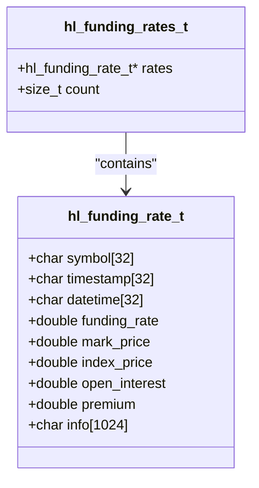
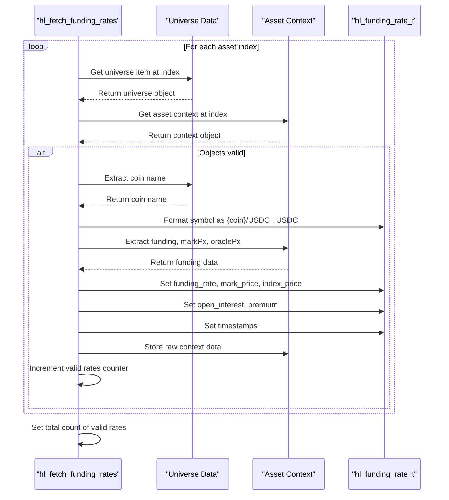
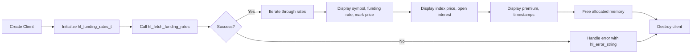
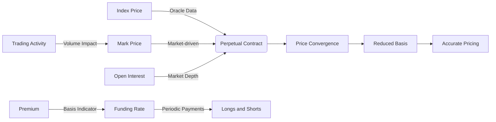
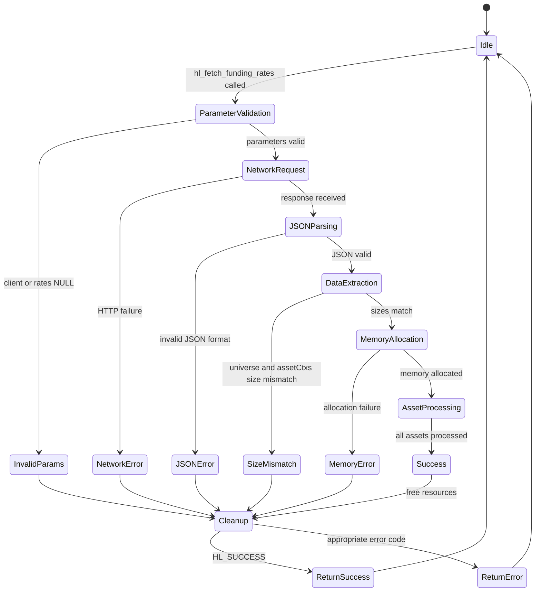
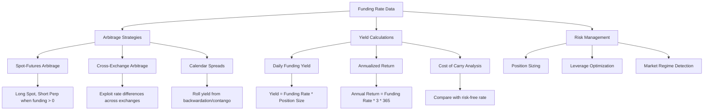
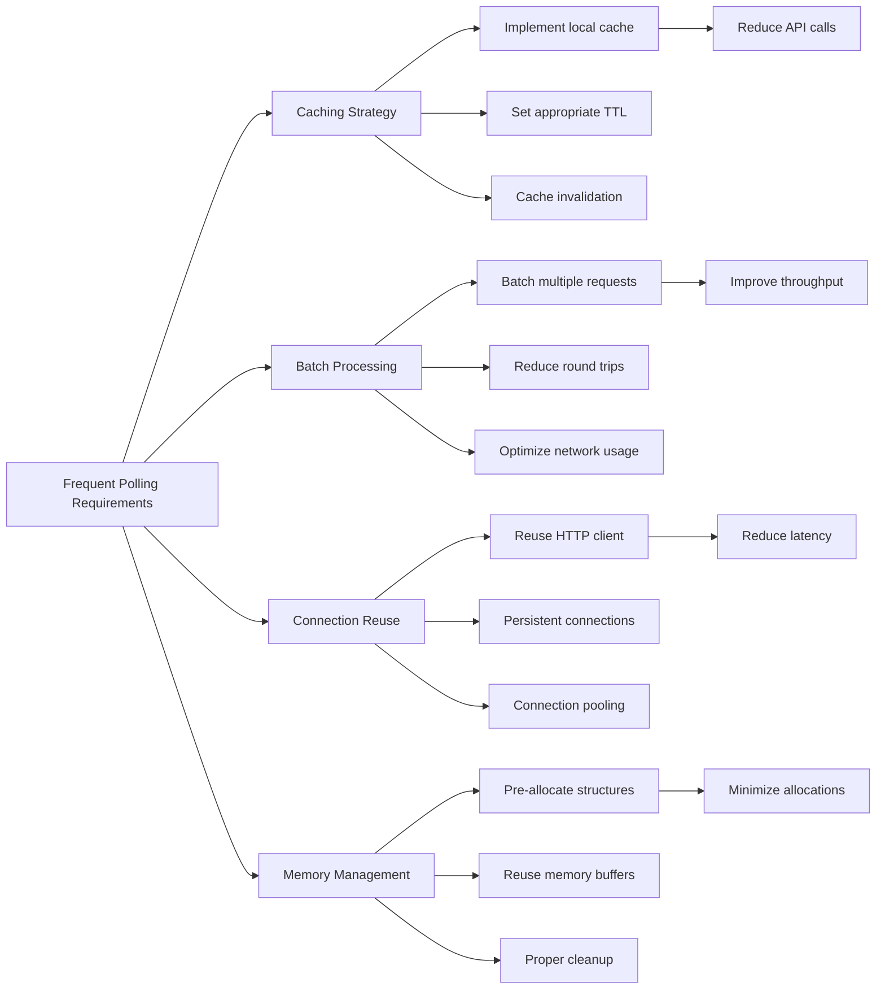

# Funding Rates

<cite>
**Referenced Files in This Document**   
- [funding.c](file://src/funding.c)
- [hyperliquid.h](file://include/hyperliquid.h)
- [hl_http.h](file://include/hl_http.h)
- [hl_internal.h](file://include/hl_internal.h)
- [types.c](file://src/types.c)
- [simple_client.c](file://src/http/simple_client.c)
- [simple_ticker.c](file://examples/simple_ticker.c)
</cite>

## Table of Contents
1. [Introduction](#introduction)
2. [Core Data Structures](#core-data-structures)
3. [Funding Rate Retrieval Implementation](#funding-rate-retrieval-implementation)
4. [HTTP Request Construction and Response Handling](#http-request-construction-and-response-handling)
5. [Symbol Mapping and Data Parsing](#symbol-mapping-and-data-parsing)
6. [Usage Examples](#usage-examples)
7. [Relationship to Perpetual Contract Pricing](#relationship-to-perpetual-contract-pricing)
8. [Error Handling and Common Issues](#error-handling-and-common-issues)
9. [Trading Strategy Applications](#trading-strategy-applications)
10. [Performance Optimization](#performance-optimization)

## Introduction
This document provides comprehensive documentation for the funding rate calculation and retrieval system in the Hyperliquid C SDK. It details the implementation of `hl_fetch_funding_rates`, including input validation, HTTP request construction, response parsing, and data structure design. The documentation covers how funding rates are mapped to symbols, their relationship to perpetual contract pricing, and practical applications in trading strategies. Special attention is given to error handling, performance considerations, and usage patterns for both single and multiple symbol queries.

## Core Data Structures

The funding rate system is built around two primary data structures that organize and store funding rate information.



**Diagram sources**
- [funding.c](file://src/funding.c#L14-L24)
- [funding.c](file://src/funding.c#L26-L29)

**Section sources**
- [funding.c](file://src/funding.c#L14-L29)

## Funding Rate Retrieval Implementation

The `hl_fetch_funding_rates` function serves as the primary interface for retrieving funding rate data from the Hyperliquid exchange. This function implements a robust process for fetching, parsing, and organizing funding rate information for all available perpetual contracts.

```mermaid
sequenceDiagram
participant Client as "Application"
participant Funding as "hl_fetch_funding_rates"
participant HTTP as "HTTP Client"
participant Exchange as "Hyperliquid API"
Client->>Funding : hl_fetch_funding_rates(client, rates)
activate Funding
Funding->>Funding : Validate parameters
alt Invalid parameters
Funding-->>Client : HL_ERROR_INVALID_PARAMS
deactivate Funding
else Valid parameters
Funding->>Funding : Initialize output structure
Funding->>HTTP : Prepare request body
HTTP->>Exchange : POST /info with metaAndAssetCtxs
activate Exchange
Exchange-->>HTTP : JSON response [meta, assetCtxs]
deactivate Exchange
HTTP->>Funding : Return response
Funding->>Funding : Parse JSON response
alt Parse failure
Funding-->>Client : HL_ERROR_JSON
deactivate Funding
else Valid response
Funding->>Funding : Extract universe and asset contexts
Funding->>Funding : Allocate funding rates array
loop For each asset
Funding->>Funding : Map symbol and extract funding data
end
Funding->>Funding : Set timestamps and store raw data
Funding-->>Client : HL_SUCCESS
deactivate Funding
end
end
```

**Diagram sources**
- [funding.c](file://src/funding.c#L34-L199)
- [hyperliquid.h](file://include/hyperliquid.h#L546)

**Section sources**
- [funding.c](file://src/funding.c#L34-L199)

## HTTP Request Construction and Response Handling

The funding rate retrieval process involves constructing a specific HTTP POST request to the Hyperliquid API endpoint and handling the response with proper error checking and resource management.

```mermaid
flowchart TD
Start([Function Entry]) --> ValidateParams["Validate client and rates parameters"]
ValidateParams --> InputValid{"Parameters Valid?"}
InputValid --> |No| ReturnInvalid["Return HL_ERROR_INVALID_PARAMS"]
InputValid --> |Yes| ClearOutput["Clear output structure"]
ClearOutput --> PrepareRequest["Prepare request body: {\"type\":\"metaAndAssetCtxs\"}"]
PrepareRequest --> MakeRequest["Make HTTP POST request to /info"]
MakeRequest --> CheckResponse{"Response Valid?"}
CheckResponse --> |No| HandleNetwork["Return HL_ERROR_NETWORK"]
CheckResponse --> |Yes| ParseJSON["Parse JSON response"]
ParseJSON --> JSONValid{"JSON Valid?"}
JSONValid --> |No| ReturnJSONError["Return HL_ERROR_JSON"]
JSONValid --> |Yes| ExtractData["Extract meta and assetCtxs arrays"]
ExtractData --> SizeMatch{"Array sizes match?"}
SizeMatch --> |No| ReturnJSONError
SizeMatch --> |Yes| AllocateMemory["Allocate memory for funding rates"]
AllocateMemory --> MemoryValid{"Memory allocated?"}
MemoryValid --> |No| ReturnMemoryError["Return HL_ERROR_MEMORY"]
MemoryValid --> |Yes| ProcessAssets["Process each asset context"]
ProcessAssets --> SetTimestamps["Set current timestamps"]
SetTimestamps --> Cleanup["Clean up JSON and response"]
Cleanup --> ReturnSuccess["Return HL_SUCCESS"]
ReturnInvalid --> End([Function Exit])
HandleNetwork --> End
ReturnJSONError --> End
ReturnMemoryError --> End
ReturnSuccess --> End
```

**Diagram sources**
- [funding.c](file://src/funding.c#L34-L199)
- [hl_http.h](file://include/hl_http.h#L33-L39)
- [simple_client.c](file://src/http/simple_client.c#L175-L193)

**Section sources**
- [funding.c](file://src/funding.c#L34-L199)

## Symbol Mapping and Data Parsing

The system implements a systematic approach to map funding rate data to trading symbols by extracting coin names from the universe metadata and formatting them into standardized symbol formats.



**Diagram sources**
- [funding.c](file://src/funding.c#L34-L199)
- [types.c](file://src/types.c#L84-L89)

**Section sources**
- [funding.c](file://src/funding.c#L34-L199)

## Usage Examples

The SDK provides practical examples for retrieving and utilizing funding rate data in trading applications. The following demonstrates how to fetch and display funding rate information.



**Section sources**
- [simple_ticker.c](file://examples/simple_ticker.c#L1-L104)

## Relationship to Perpetual Contract Pricing

Funding rates play a critical role in the pricing mechanism of perpetual contracts, serving as a convergence tool between mark price and index price.



**Section sources**
- [funding.c](file://src/funding.c#L34-L199)
- [simple_ticker.c](file://examples/simple_ticker.c#L1-L104)

## Error Handling and Common Issues

The funding rate retrieval system implements comprehensive error handling for various failure scenarios that may occur during the data retrieval process.



**Section sources**
- [funding.c](file://src/funding.c#L34-L199)
- [hyperliquid.h](file://include/hyperliquid.h#L546)

## Trading Strategy Applications

Funding rates provide valuable information for various trading strategies, particularly in the realm of arbitrage and yield generation.



**Section sources**
- [funding.c](file://src/funding.c#L34-L199)
- [simple_ticker.c](file://examples/simple_ticker.c#L1-L104)

## Performance Optimization

For applications requiring frequent polling of funding rates, several performance optimization strategies can be implemented to minimize resource usage and maximize efficiency.



**Section sources**
- [funding.c](file://src/funding.c#L34-L199)
- [hl_http.h](file://include/hl_http.h#L33-L39)
- [simple_client.c](file://src/http/simple_client.c#L175-L193)