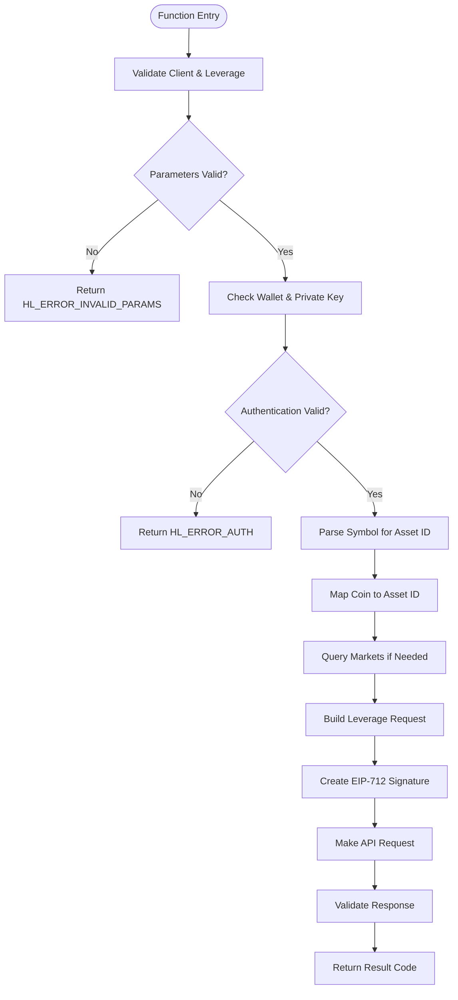
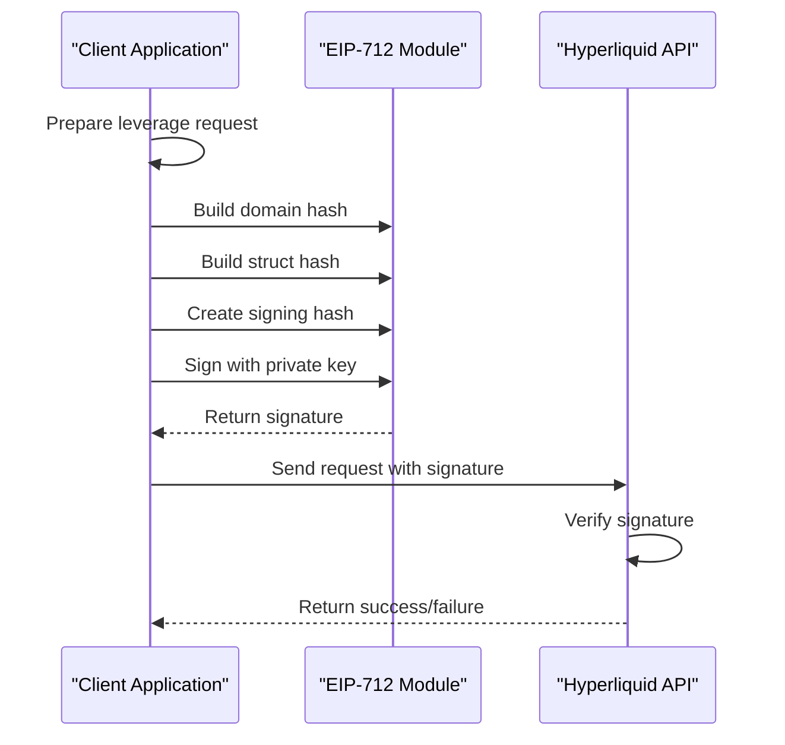
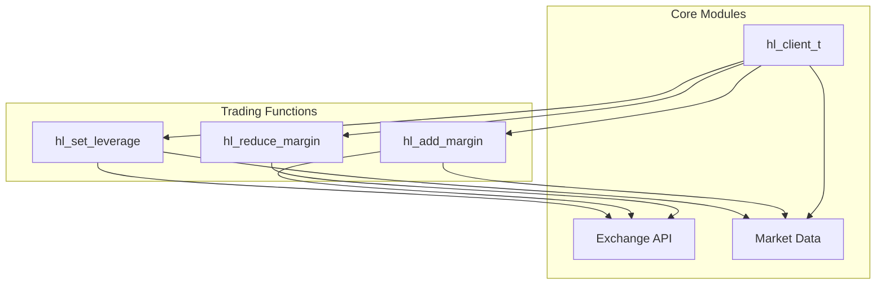

# Leverage & Margin

<cite>
**Referenced Files in This Document**   
- [leverage.c](file://src/leverage.c)
- [margin.c](file://src/margin.c)
- [hyperliquid.h](file://include/hyperliquid.h)
- [hl_exchange.h](file://include/hl_exchange.h)
- [hl_client.h](file://include/hl_client.h)
- [eip712.c](file://src/crypto/eip712.c)
</cite>

## Table of Contents
1. [Introduction](#introduction)
2. [Leverage Management Implementation](#leverage-management-implementation)
3. [Parameter Validation and Asset Resolution](#parameter-validation-and-asset-resolution)
4. [EIP-712 Signing Process](#eip-712-signing-process)
5. [Per-Asset vs Global Leverage](#per-asset-vs-global-leverage)
6. [Margin Management Functions](#margin-management-functions)
7. [Margin Requirement Calculations](#margin-requirement-calculations)
8. [Integration with Trading and Account Modules](#integration-with-trading-and-account-modules)
9. [Error Handling and Common Issues](#error-handling-and-common-issues)
10. [Best Practices for Automated Trading](#best-practices-for-automated-trading)
11. [Performance Considerations](#performance-considerations)

## Introduction
This document provides comprehensive documentation on leverage and margin management within the Hyperliquid C SDK. It details the implementation of leverage controls, margin operations, and their integration with trading functionality. The system enables traders to manage risk through configurable leverage settings and margin adjustments, with all operations secured through EIP-712 signatures. The documentation covers both the technical implementation and practical usage patterns for these critical trading functions.

## Leverage Management Implementation

The leverage management system is implemented through the `hl_set_leverage` function, which allows users to configure leverage settings for trading positions. This function serves as the primary interface for leverage control, handling both per-asset and global leverage configurations. The implementation follows a structured process that includes parameter validation, asset identification, request construction, cryptographic signing, and API communication.

The leverage system operates within defined boundaries, supporting leverage values from 1x to 50x, which aligns with common derivatives trading practices. The function integrates with the exchange's batch modification system, packaging leverage updates as part of a broader action framework. This approach ensures consistency with other trading operations and maintains a uniform security model across all trading functions.

**Section sources**
- [leverage.c](file://src/leverage.c#L14-L125)
- [hyperliquid.h](file://include/hyperliquid.h#L522-L524)

## Parameter Validation and Asset Resolution

The `hl_set_leverage` function implements comprehensive parameter validation to ensure data integrity and prevent invalid operations. The validation process checks three critical elements: the client instance, leverage value, and symbol parameter. The client pointer is verified for null values, ensuring a valid connection context exists before proceeding.

Leverage values are constrained to the range of 1-50, enforcing risk management boundaries. Values outside this range trigger `HL_ERROR_INVALID_PARAMS`, preventing potentially dangerous over-leveraged positions. This validation occurs early in the function execution, providing immediate feedback to the calling application.

Asset resolution is handled through symbol parsing, which extracts the base coin from various symbol formats (e.g., "BTC/USDC:USDC" → "BTC"). The system employs a two-tiered approach to asset ID resolution: first checking a predefined mapping for major assets (BTC=1, ETH=2, SOL=3, USDC=0), then falling back to dynamic market data retrieval when necessary. This hybrid approach balances performance with accuracy, ensuring reliable asset identification across different market conditions.



**Diagram sources**
- [leverage.c](file://src/leverage.c#L14-L125)

**Section sources**
- [leverage.c](file://src/leverage.c#L14-L125)
- [margin.c](file://src/margin.c#L43-L82)

## EIP-712 Signing Process

The leverage update system employs EIP-712 typed data signing to ensure transaction authenticity and prevent replay attacks. This cryptographic process begins with the construction of a structured exchange request containing the leverage modification action and a timestamp-based nonce. The nonce, generated from the current millisecond timestamp, ensures request uniqueness and prevents replay attacks.

The signing process utilizes the `hl_build_exchange_signature` function, which implements the full EIP-712 specification. This involves computing the domain separator hash with the exchange name ("Hyperliquid"), chain ID, and version information, then combining it with the struct hash of the specific action (updateLeverage). The final signing hash is created by concatenating the Ethereum-defined prefix (0x1901) with the domain and struct hashes.

The actual ECDSA signature is generated using libsecp256k1 with deterministic k-value generation (RFC 6979), producing a 65-byte signature with properly calculated recovery ID (v-value). This signature is then base64-encoded and included in the API request, allowing the exchange to verify both the authenticity and integrity of the leverage update instruction.



**Diagram sources**
- [leverage.c](file://src/leverage.c#L14-L125)
- [eip712.c](file://src/crypto/eip712.c#L182-L295)

**Section sources**
- [leverage.c](file://src/leverage.c#L14-L125)
- [eip712.c](file://src/crypto/eip712.c#L182-L295)

## Per-Asset vs Global Leverage

The leverage system supports both per-asset and global leverage configurations, providing flexibility for different trading strategies. When a symbol is specified in the `hl_set_leverage` call, the system applies the leverage setting to that specific asset only. This allows traders to maintain different leverage levels across various positions based on their risk assessment of individual assets.

For per-asset leverage, the request includes both the leverage value and the asset ID in the action JSON: `[{"type":"updateLeverage","leverage":10,"asset":1}]`. This targets the leverage update specifically to the identified asset (in this example, BTC with asset ID 1). The asset ID resolution process ensures accurate targeting even when multiple symbols reference the same underlying asset.

When no symbol is provided (symbol parameter is NULL), the system applies the leverage setting as a default or global configuration. This affects the leverage setting for all assets unless overridden by specific per-asset configurations. The global request format omits the asset field: `[{"type":"updateLeverage","leverage":10}]`. This hierarchical approach allows for efficient management of leverage settings across portfolios while maintaining the ability to fine-tune individual position risk.

```mermaid
classDiagram
class LeverageRequest {
+int leverage
+uint32_t asset_id (optional)
+string type = "updateLeverage"
}
class GlobalLeverage : LeverageRequest
<<stereotype>>
-Applies to all assets
-No asset_id specified
}
class PerAssetLeverage : LeverageRequest
<<stereotype>>
-Applies to specific asset
-asset_id required
}
LeverageRequest <|-- GlobalLeverage
LeverageRequest <|-- PerAssetLeverage
```

**Diagram sources**
- [leverage.c](file://src/leverage.c#L14-L125)

**Section sources**
- [leverage.c](file://src/leverage.c#L14-L125)

## Margin Management Functions

The margin management system provides two primary functions: `hl_add_margin` and `hl_reduce_margin`, which allow traders to adjust the collateral backing their positions. These functions follow a similar pattern to leverage management, using EIP-712 signed requests to modify position margins. The `hl_add_margin` function increases the margin allocated to a specific position, improving its liquidation price and reducing risk.

Both margin functions share the same underlying implementation, with `hl_reduce_margin` simply calling `hl_add_margin` with a negative amount. This design reduces code duplication and ensures consistent behavior across margin operations. The functions validate input parameters including client state, symbol validity, and positive amount values, returning appropriate error codes for invalid inputs.

The margin update process follows the same security model as leverage changes, requiring EIP-712 signatures for authentication. This ensures that only authorized users can modify position margins, protecting against unauthorized access and potential liquidation risks. The system uses the same batch modification endpoint as leverage updates, allowing multiple position adjustments to be processed in a single atomic operation when needed.

**Section sources**
- [margin.c](file://src/margin.c#L0-L123)
- [hyperliquid.h](file://include/hyperliquid.h#L680-L688)

## Margin Requirement Calculations

While the provided code does not contain explicit margin requirement calculation functions, the system interacts with margin requirements through position management and balance reporting. The margin requirements are determined by the exchange based on position size, leverage, and market volatility. The SDK provides access to margin-related information through balance queries and position data.

The margin system maintains separate tracking for cross-margin and isolated margin positions, with different risk parameters for each. Cross-margin positions share the account's total balance as collateral, while isolated positions have dedicated margin allocations. The margin requirement for a position is calculated as the position notional value divided by the applied leverage, with additional buffers for maintenance margin requirements.

Traders can monitor their margin utilization through the account balance functions, which report key metrics such as total margin used, account value, and withdrawable balance. These values allow traders to assess their margin health and make informed decisions about margin adjustments. The system also reports liquidation prices for positions, providing clear visibility into risk levels.

**Section sources**
- [account.c](file://src/account.c#L47-L122)
- [margin.c](file://src/margin.c#L43-L82)

## Integration with Trading and Account Modules

The leverage and margin systems are tightly integrated with the broader trading and account infrastructure. The `hl_client_t` structure serves as the central coordination point, maintaining authentication credentials, connection state, and cached market data used by both leverage and margin functions. This unified client model ensures consistent behavior across all trading operations.

The leverage and margin functions depend on the exchange module for API communication, using the same HTTP client infrastructure as other trading operations. They also rely on market data functions like `hl_fetch_markets` for asset ID resolution, creating a dependency on the market data caching system. This integration allows for dynamic asset resolution without requiring hardcoded mappings for all possible trading pairs.

The account module provides essential services for leverage and margin operations, including wallet address and private key management. The error handling system is shared across all modules, using the same `hl_error_t` enumeration to provide consistent error reporting. This cohesive architecture ensures that leverage and margin operations feel like natural extensions of the overall trading experience rather than isolated features.



**Diagram sources**
- [hl_client.h](file://include/hl_client.h#L0-L188)
- [leverage.c](file://src/leverage.c#L14-L125)
- [margin.c](file://src/margin.c#L0-L123)

**Section sources**
- [hl_client.h](file://include/hl_client.h#L0-L188)
- [leverage.c](file://src/leverage.c#L14-L125)
- [margin.c](file://src/margin.c#L0-L123)

## Error Handling and Common Issues

The leverage and margin system implements comprehensive error handling to address common failure scenarios. The primary error categories include invalid parameters, authentication failures, network issues, and API errors. Each function returns specific error codes that enable applications to implement appropriate recovery strategies.

Common issues include invalid leverage values (outside 1-50 range), unsupported symbols, missing authentication credentials, and network connectivity problems. The system validates leverage values immediately upon function entry, preventing invalid requests from reaching the exchange. Symbol resolution failures occur when asset IDs cannot be determined, either through the static mapping or dynamic market data lookup.

Authentication failures typically result from missing or invalid private keys, while network errors indicate connectivity issues with the exchange API. API errors may occur due to rate limiting, invalid signatures, or temporary exchange issues. Applications should implement retry logic with exponential backoff for transient errors, while treating permanent errors (like invalid parameters) as requiring user intervention.

**Section sources**
- [leverage.c](file://src/leverage.c#L14-L125)
- [margin.c](file://src/margin.c#L0-L123)
- [hyperliquid.h](file://include/hyperliquid.h#L50-L65)

## Best Practices for Automated Trading

For automated trading systems, effective leverage and margin management requires careful consideration of several best practices. Applications should implement comprehensive input validation before calling leverage and margin functions, reducing the likelihood of API errors and ensuring trading strategy integrity. This includes validating leverage values against the allowed range and verifying symbol validity against known market data.

Systems should implement proper error handling and retry mechanisms, particularly for transient network errors. However, retry logic should be avoided for permanent errors like invalid parameters or authentication failures. Applications should also respect rate limits to prevent being throttled by the exchange API.

For high-frequency trading strategies, applications should consider caching market data to reduce the overhead of repeated asset ID lookups. The system's support for both per-asset and global leverage settings allows for sophisticated risk management strategies, such as maintaining conservative global defaults with aggressive leverage on high-conviction trades.

**Section sources**
- [leverage.c](file://src/leverage.c#L14-L125)
- [margin.c](file://src/margin.c#L0-L123)

## Performance Considerations

The leverage and margin functions are designed with performance in mind, particularly for high-frequency trading applications. The implementation minimizes memory allocations and string operations, using fixed-size buffers for request construction. However, certain operations like market data retrieval for asset ID resolution can introduce latency when the static mapping does not contain the required asset.

Applications making frequent leverage adjustments should consider the overhead of EIP-712 signature generation, which involves multiple cryptographic hash operations. While optimized through the use of libsecp256k1, this process still represents a significant computational cost. Systems requiring extremely low latency may benefit from pre-computing domain separators or implementing signature caching for repeated operations.

Network latency is typically the dominant factor in overall performance, as each leverage or margin operation requires a round-trip to the exchange API. Applications should implement connection pooling and keep-alive strategies to minimize connection establishment overhead. For systems requiring maximum throughput, batching multiple leverage or margin updates into single requests (when supported by the API) can significantly improve performance.

**Section sources**
- [leverage.c](file://src/leverage.c#L14-L125)
- [eip712.c](file://src/crypto/eip712.c#L0-L297)