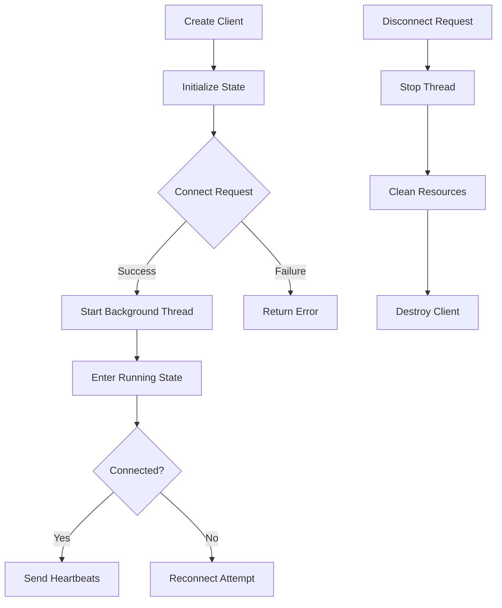
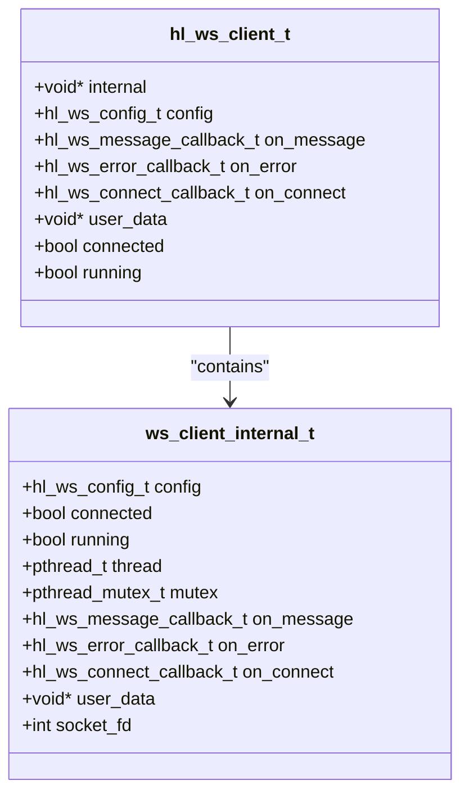
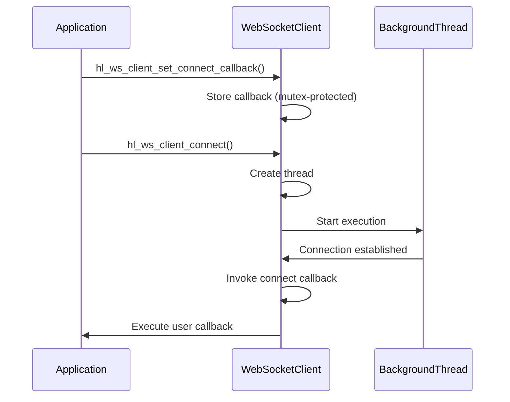

# Connection Management

<cite>
**Referenced Files in This Document**   
- [ws_client.c](file://src/ws_client.c)
- [hl_ws_client.h](file://include/hl_ws_client.h)
- [websocket.c](file://src/websocket.c)
- [websocket_demo.c](file://examples/websocket_demo.c)
</cite>

## Table of Contents
1. [Introduction](#introduction)
2. [Core Components](#core-components)
3. [Connection Lifecycle Management](#connection-lifecycle-management)
4. [Thread and State Management](#thread-and-state-management)
5. [Callback Mechanisms](#callback-mechanisms)
6. [Resource Management and Teardown](#resource-management-and-teardown)
7. [Integration with Client System](#integration-with-client-system)
8. [Usage Examples](#usage-examples)
9. [Best Practices for Production](#best-practices-for-production)

## Introduction
This document provides comprehensive documentation for WebSocket connection lifecycle management in the Hyperliquid C SDK. It details the implementation of the `hl_ws_client_connect` function, thread creation via `pthread_create`, mutex-protected state transitions, and connection flag management. The internal `ws_client_internal_t` structure maintains connection state, while error handling during thread initialization and failure recovery is thoroughly explained. The on_connect callback mechanism for signaling successful connection establishment is described, along with thread-safety considerations, resource allocation patterns, and integration with the client's event loop.

## Core Components

The WebSocket client implementation consists of several key components that work together to manage the connection lifecycle. The public interface is defined in `hl_ws_client.h`, while the internal implementation details are contained in `ws_client.c`. The `hl_ws_client_t` structure serves as the public client handle, containing connection state flags and callback function pointers, while the internal implementation is encapsulated in the `ws_client_internal_t` structure.

The `ws_client_internal_t` structure maintains critical connection state including the connected and running flags, thread handle, mutex for synchronization, configuration settings, and socket file descriptor. This separation of public and internal structures allows for a clean API while maintaining the necessary internal state for connection management.

**Section sources**
- [hl_ws_client.h](file://include/hl_ws_client.h#L43-L96)
- [ws_client.c](file://src/ws_client.c#L13-L28)

## Connection Lifecycle Management

The connection lifecycle is managed through a series of well-defined functions that handle creation, connection, disconnection, and destruction of WebSocket clients. The `hl_ws_client_create` function initializes a new client with the provided configuration, allocating memory for both the public client structure and the internal implementation structure. During creation, the mutex is initialized to ensure thread safety for subsequent operations.

The `hl_ws_client_connect` function initiates the connection process by first acquiring the mutex to ensure atomic state transitions. It updates both the internal and public connected and running flags to true, then creates a background thread using `pthread_create` that executes the `ws_client_thread` function. If thread creation fails, the function rolls back the state changes and returns false, ensuring consistent error handling.

The `hl_ws_client_disconnect` function terminates the connection by setting the running and connected flags to false within a mutex-protected section, effectively signaling the background thread to stop. The `hl_ws_client_destroy` function performs complete cleanup, joining the background thread if it was running, closing the socket, destroying the mutex, and freeing allocated memory.

**Diagram sources**
- [ws_client.c](file://src/ws_client.c#L115-L171)
- [ws_client.c](file://src/ws_client.c#L169-L216)

**Section sources**
- [ws_client.c](file://src/ws_client.c#L115-L171)
- [ws_client.c](file://src/ws_client.c#L169-L216)

## Thread and State Management

Thread creation and management is a critical aspect of the WebSocket client implementation. The `hl_ws_client_connect` function uses `pthread_create` to spawn a background thread that handles the WebSocket communication loop. The thread function `ws_client_thread` runs as long as the running flag is true, checking the connected state to determine whether to send heartbeats (when connected) or attempt reconnection (when disconnected).

State transitions are protected by a mutex to ensure thread safety. The mutex is acquired before modifying any shared state variables such as connected, running, or socket file descriptor. This prevents race conditions that could occur if multiple threads attempted to modify the state simultaneously. The mutex is also used when setting or retrieving callback functions to ensure consistent callback state.

The implementation uses two boolean flags to track connection state: connected and running. The connected flag indicates whether a valid WebSocket connection is established, while the running flag controls whether the background thread should continue executing. This separation allows for graceful shutdown where the thread can be stopped without necessarily indicating a connection failure.

**Diagram sources**
- [ws_client.c](file://src/ws_client.c#L13-L28)
- [hl_ws_client.h](file://include/hl_ws_client.h#L43-L96)

**Section sources**
- [ws_client.c](file://src/ws_client.c#L115-L171)
- [ws_client.c](file://src/ws_client.c#L0-L59)

## Callback Mechanisms

The WebSocket client implements a callback-based event notification system that allows users to respond to various connection events. Three primary callback types are supported: message callbacks for incoming WebSocket messages, error callbacks for connection errors, and connect callbacks for successful connection establishment.

The `hl_ws_client_set_connect_callback` function allows users to register a callback that will be invoked when a successful connection is established. After the background thread is successfully created in `hl_ws_client_connect`, the connect callback is invoked if one has been registered. This provides a mechanism for users to perform post-connection initialization or notify their application that the WebSocket is ready for use.

Callback functions are stored in both the public client structure and the internal structure to allow access from different contexts. When setting a callback, the mutex is acquired to ensure atomic updates to the callback pointers, preventing race conditions that could occur if a callback were changed while being invoked.

**Diagram sources**
- [ws_client.c](file://src/ws_client.c#L115-L171)
- [ws_client.c](file://src/ws_client.c#L218-L262)

**Section sources**
- [ws_client.c](file://src/ws_client.c#L115-L171)
- [ws_client.c](file://src/ws_client.c#L218-L262)

## Resource Management and Teardown

Proper resource management is essential for preventing memory leaks and ensuring clean shutdown of WebSocket connections. The `hl_ws_client_destroy` function performs comprehensive cleanup of all allocated resources. It first stops the background thread by setting the running flag to false and joining the thread with `pthread_join`. This ensures that the thread has completely terminated before proceeding with further cleanup.

After the thread has been joined, the socket file descriptor is closed if it is valid, and the mutex is destroyed using `pthread_mutex_destroy`. Finally, the memory allocated for the internal structure and the client structure itself is freed using `free`. This orderly teardown process ensures that all system resources are properly released.

The implementation also handles error conditions during resource allocation. If `pthread_mutex_init` fails during client creation, both the internal and client structures are freed before returning NULL. Similarly, if `pthread_create` fails during connection, the state changes are rolled back and false is returned, maintaining consistent error handling throughout the API.

**Section sources**
- [ws_client.c](file://src/ws_client.c#L115-L122)
- [ws_client.c](file://src/ws_client.c#L115-L171)

## Integration with Client System

The WebSocket client is integrated into the broader Hyperliquid client system through the `hl_ws_init_client` function in `websocket.c`. This function creates a WebSocket extension structure that contains the WebSocket client and subscription management data, then initializes the WebSocket client with the appropriate configuration and callbacks.

The integration sets up three key callbacks: a message handler that processes incoming WebSocket messages, an error handler for connection errors, and a connect handler that is invoked when the connection is established. These callbacks are bound to the main client structure, allowing the WebSocket events to be processed in the context of the overall application state.

The `hl_watch_ticker` function demonstrates how the WebSocket connection is used to subscribe to real-time market data. It first ensures the WebSocket is connected, then sends a subscription message using `hl_ws_client_send_text`, and finally registers the subscription in the client's subscription list. This pattern is used for all WebSocket-based data subscriptions in the API.

**Section sources**
- [websocket.c](file://src/websocket.c#L88-L138)
- [websocket.c](file://src/websocket.c#L138-L181)

## Usage Examples

The `websocket_demo.c` example demonstrates the complete lifecycle of a WebSocket client. It begins by creating a configuration using `hl_ws_config_default`, which sets the appropriate URL for the testnet or production environment. The client is then created with `hl_ws_client_create`, and callbacks are set using the appropriate setter functions.

The connection process is initiated with `hl_ws_client_connect`, and upon success, the example sends a test message using `hl_ws_client_send_text`. After demonstrating the connection, the client is disconnected with `hl_ws_client_disconnect` and finally destroyed with `hl_ws_client_destroy`.

The example also demonstrates the integration pattern where a higher-level client structure manages the WebSocket connection. In this case, `hl_ws_init_client` is used to initialize the WebSocket functionality for a client, and `hl_ws_cleanup_client` is used to properly clean up the WebSocket resources when the client is no longer needed.

**Section sources**
- [websocket_demo.c](file://examples/websocket_demo.c#L137-L175)
- [websocket.c](file://src/websocket.c#L88-L138)

## Best Practices for Production

When using the WebSocket client in production environments, several best practices should be followed. First, always check the return value of `hl_ws_client_connect` and handle connection failures appropriately, potentially implementing exponential backoff for reconnection attempts. The configuration parameters such as reconnect_delay_ms and max_reconnect_attempts should be tuned based on the specific use case and network conditions.

For long-lived connections, implement proper error handling in the error callback to detect and respond to connection issues. Consider implementing application-level heartbeats in addition to the WebSocket-level ping/pong mechanism to detect stalled connections. When sending messages, always check the return value of `hl_ws_client_send` and `hl_ws_client_send_text` to handle cases where the connection may have been lost.

Resource cleanup is critical in production environments. Always call `hl_ws_client_destroy` when a client is no longer needed to prevent memory leaks. In multi-threaded applications, ensure that WebSocket operations are properly synchronized to avoid race conditions, particularly when setting callbacks or modifying connection state from multiple threads.

**Section sources**
- [ws_client.c](file://src/ws_client.c#L115-L171)
- [websocket_demo.c](file://examples/websocket_demo.c#L137-L175)