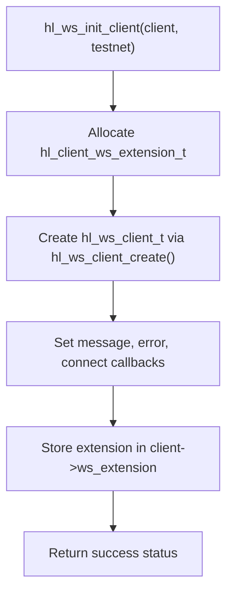
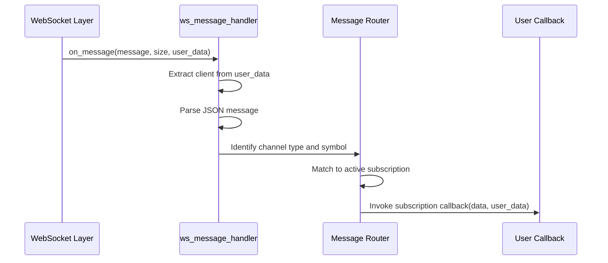
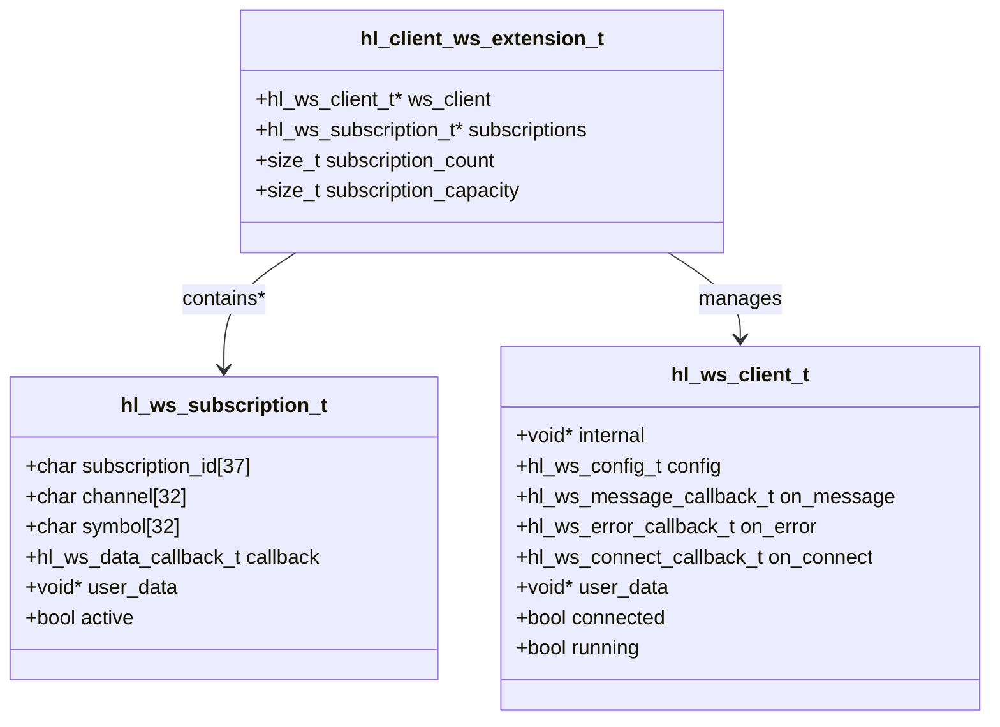
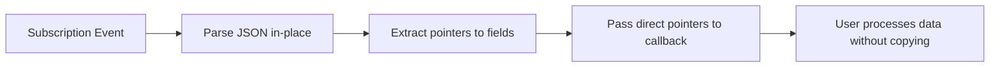

# Message Handling

<cite>
**Referenced Files in This Document**   
- [websocket_demo.c](file://examples/websocket_demo.c)
- [websocket.c](file://src/websocket.c)
- [ws_client.c](file://src/ws_client.c)
- [hl_ws_client.h](file://include/hl_ws_client.h)
- [hl_client.h](file://include/hl_client.h)
- [hl_types.h](file://include/hl_types.h)
</cite>

## Table of Contents
1. [Introduction](#introduction)
2. [WebSocket Initialization and Client Setup](#websocket-initialization-and-client-setup)
3. [Message Dispatch Pipeline](#message-dispatch-pipeline)
4. [Event Type Parsing and Subscription Management](#event-type-parsing-and-subscription-management)
5. [Callback Integration and User Logic](#callback-integration-and-user-logic)
6. [Data Extraction Patterns](#data-extraction-patterns)
7. [Memory Management and Zero-Copy Access](#memory-management-and-zero-copy-access)
8. [Error Handling Strategies](#error-handling-strategies)
9. [Performance Considerations](#performance-considerations)
10. [Thread-Safe Data Access in Callbacks](#thread-safe-data-access-in-callbacks)

## Introduction
This document provides an in-depth analysis of the WebSocket message processing system in the Hyperliquid C SDK. It details the full lifecycle of real-time market and user data from raw WebSocket frames to structured event callbacks. The architecture supports subscription-based real-time updates for ticker data, order books, user orders, and trade executions. The system is designed for high-frequency financial data processing with emphasis on performance, reliability, and ease of integration.

**Section sources**
- [websocket_demo.c](file://examples/websocket_demo.c#L1-L202)

## WebSocket Initialization and Client Setup
The WebSocket client initialization begins with `hl_ws_init_client()`, which creates a WebSocket extension structure (`hl_client_ws_extension_t`) and associates it with the main client. This extension manages the underlying `hl_ws_client_t` instance, subscription tracking, and callback routing. The configuration is set via `hl_ws_config_default()`, which determines the appropriate endpoint (production or testnet). The client uses pthread-based threading for connection management and mutex-protected state transitions to ensure thread safety during connect/disconnect operations.

**Diagram sources**
- [websocket.c](file://src/websocket.c#L104-L130)
- [ws_client.c](file://src/ws_client.c#L56-L93)

**Section sources**
- [websocket.c](file://src/websocket.c#L104-L130)
- [ws_client.c](file://src/ws_client.c#L56-L93)

## Message Dispatch Pipeline
The message dispatch pipeline begins when the underlying WebSocket implementation receives a text frame and invokes the registered `ws_message_handler`. This handler receives raw JSON messages as `const char*` with explicit size information to support binary-safe processing. The handler then parses the JSON payload to determine the event type (e.g., 'subscription_data', 'user_events') and routes it to the appropriate subscription callback based on channel type and symbol. The current implementation includes placeholder logging, with the actual JSON parsing and dispatch logic intended for future implementation.

**Diagram sources**
- [websocket.c](file://src/websocket.c#L72-L79)
- [websocket.c](file://src/websocket.c#L197-L222)

**Section sources**
- [websocket.c](file://src/websocket.c#L72-L79)

## Event Type Parsing and Subscription Management
The system supports multiple event types through dedicated subscription functions: `hl_watch_ticker()` for price updates, `hl_watch_order_book()` for order book deltas, `hl_watch_orders()` for user order status changes, and `hl_watch_my_trades()` for executed trades. Each function generates a standardized JSON subscription message following the format `{"method":"subscribe","subscription":{"type":"[channel]","coin":"[symbol]"}}`. Subscriptions are tracked in a dynamically allocated array within `hl_client_ws_extension_t`, with automatic resizing when capacity is exceeded. Each subscription is assigned a unique UUID-based identifier for later unsubscription via `hl_unwatch()`.

**Diagram sources**
- [websocket.c](file://src/websocket.c#L13-L18)
- [websocket.c](file://src/websocket.c#L32-L67)

**Section sources**
- [websocket.c](file://src/websocket.c#L156-L181)
- [websocket.c](file://src/websocket.c#L197-L222)
- [websocket.c](file://src/websocket.c#L287-L315)
- [websocket.c](file://src/websocket.c#L320-L348)
- [websocket.c](file://src/websocket.c#L353-L375)

## Callback Integration and User Logic
User-defined callbacks are integrated through the `hl_ws_data_callback_t` function pointer type, which accepts `void* data` and `void* user_data` parameters. This design allows users to pass context-specific information to their handlers without global variables. The SDK provides example callback implementations in `websocket_demo.c` that demonstrate how to handle different update types. When an event occurs, the system invokes the registered callback with parsed data (in future implementation) and the user-provided context, enabling direct integration with trading strategies, UI updates, or logging systems.

**Section sources**
- [websocket_demo.c](file://examples/websocket_demo.c#L17-L44)
- [trading_bot.c](file://examples/trading_bot.c#L36-L51)

## Data Extraction Patterns
The SDK is designed to support structured data extraction for various market data types:
- **Ticker updates**: Contain best bid/ask prices and volumes
- **Order book deltas**: Include incremental updates to bid and ask levels
- **Trade executions**: Provide price, quantity, and timestamp of executed trades

Although the current implementation logs raw JSON, the architecture anticipates parsing these messages into structured types defined in `hl_types.h` such as `hl_order_t` and `hl_trade_t`. The `hl_watch_order_book()` function is designed to maintain a full order book state by applying delta updates, while `hl_watch_ticker()` provides summary statistics for rapid price monitoring.

**Section sources**
- [hl_types.h](file://include/hl_types.h#L1-L130)

## Memory Management and Zero-Copy Access
The WebSocket system employs manual memory management through `malloc`, `calloc`, `realloc`, and `free` for all dynamic allocations. The `hl_client_ws_extension_t` structure manages its own subscription array, which is resized by doubling capacity when needed. The callback interface supports zero-copy data access by passing direct pointers to parsed message content (in future implementation), avoiding unnecessary memory duplication. The use of `const char*` with explicit size parameters in message handlers enables efficient string handling without requiring null-terminated copies.

**Section sources**
- [websocket.c](file://src/websocket.c#L32-L67)
- [ws_client.c](file://src/ws_client.c#L56-L93)

## Error Handling Strategies
The system implements comprehensive error handling through dedicated callback mechanisms. The `ws_error_handler` function is invoked for protocol-level errors, connection failures, and message processing issues. Input validation is performed at API boundaries, with functions returning `NULL` or `false` for invalid parameters. Subscription functions validate client state, WebSocket connection status, and required authentication credentials before sending subscription messages. The `hl_unwatch()` function includes bounds checking and string comparison to safely locate and deactivate subscriptions.

**Section sources**
- [websocket.c](file://src/websocket.c#L84-L89)
- [websocket.c](file://src/websocket.c#L156-L181)
- [websocket.c](file://src/websocket.c#L353-L375)

## Performance Considerations
The WebSocket client is optimized for high-frequency message processing through several design choices:
- Dynamic subscription array resizing with exponential growth to minimize reallocation frequency
- Mutex-protected but lightweight critical sections to reduce contention
- Background thread for connection maintenance and heartbeat management
- Direct message passing to callbacks without intermediate queuing
- Fixed-size buffers for subscription/unsubscription messages to avoid dynamic allocation during operation

The architecture balances performance with reliability, using connection state tracking and automatic reconnection support (via configuration) to maintain data continuity during network disruptions.

**Section sources**
- [ws_client.c](file://src/ws_client.c#L221-L234)
- [websocket.c](file://src/websocket.c#L32-L67)

## Thread-Safe Data Access in Callbacks
All WebSocket operations are protected by a pthread mutex to ensure thread-safe access to client state. The `hl_ws_client_set_message_callback()` and related functions lock the internal mutex before updating callback pointers and user data. The message dispatch system ensures that callbacks are invoked in a controlled context, preventing race conditions during client reconfiguration. Users should maintain their own synchronization if accessing shared data structures from multiple callbacks, as the SDK does not provide higher-level concurrency primitives.

**Section sources**
- [ws_client.c](file://src/ws_client.c#L221-L234)
- [ws_client.c](file://src/ws_client.c#L206-L209)