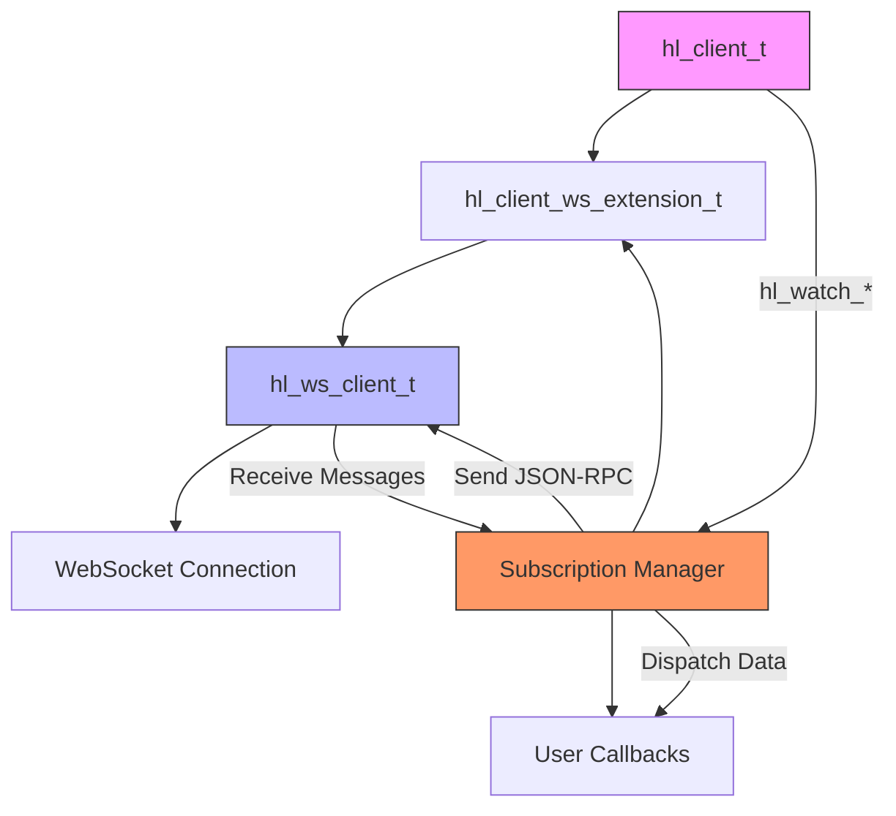
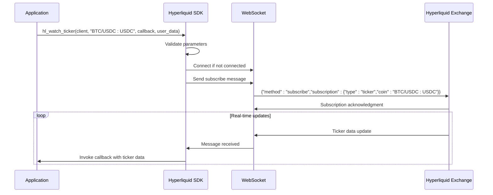
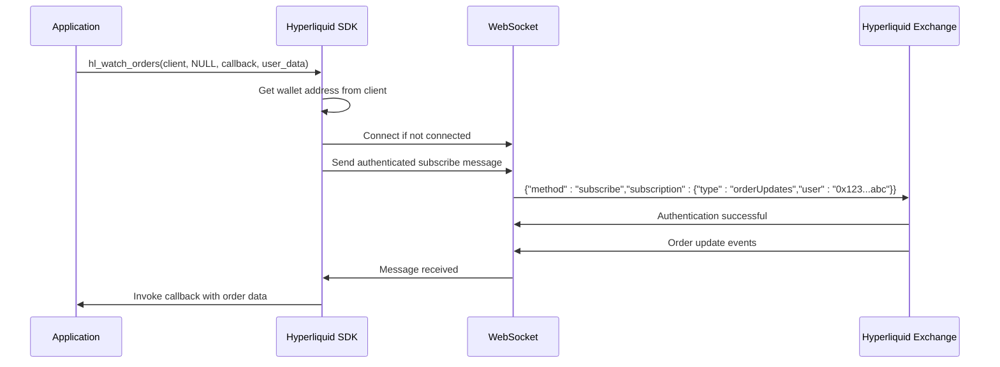
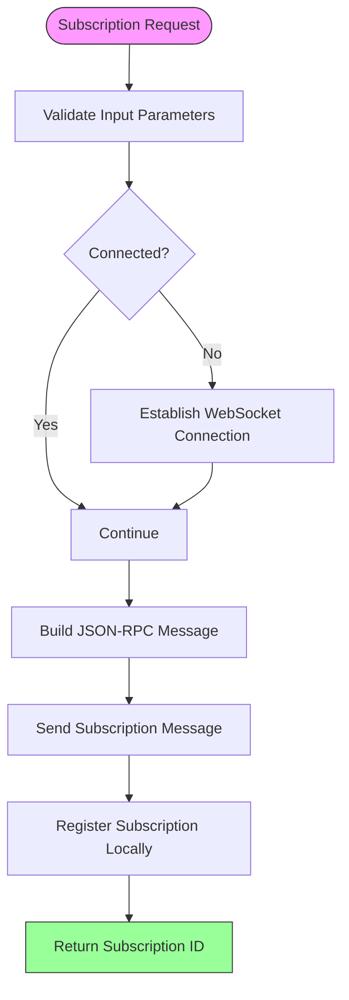
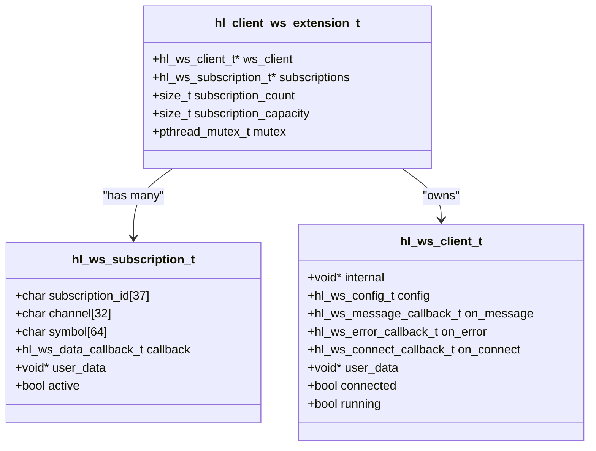
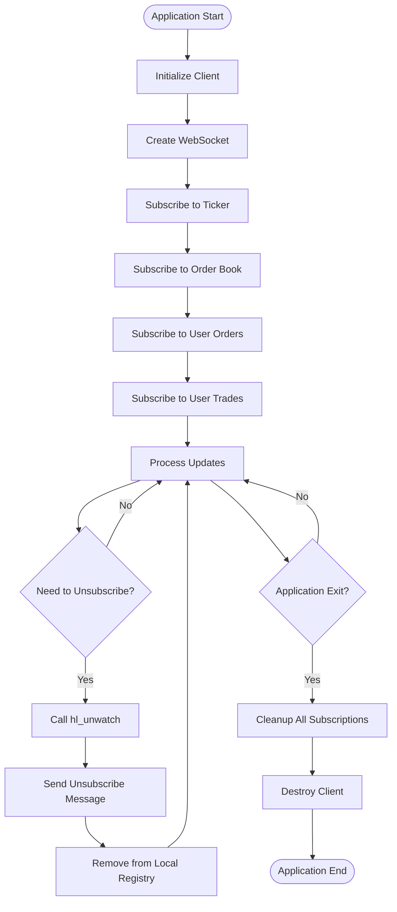

# Subscription Model

<cite>
**Referenced Files in This Document**   
- [websocket_demo.c](file://examples/websocket_demo.c)
- [hl_ws_client.h](file://include/hl_ws_client.h)
- [websocket.c](file://src/websocket.c)
- [hl_internal.h](file://include/hl_internal.h)
- [hl_ticker.h](file://include/hl_ticker.h)
</cite>

## Table of Contents
1. [Introduction](#introduction)
2. [Subscription Architecture Overview](#subscription-architecture-overview)
3. [Public Channel Subscriptions](#public-channel-subscriptions)
4. [Private Channel Subscriptions](#private-channel-subscriptions)
5. [Subscription Payload Structure](#subscription-payload-structure)
6. [Subscription Lifecycle Management](#subscription-lifecycle-management)
7. [Authentication Requirements](#authentication-requirements)
8. [Error Handling and Acknowledgments](#error-handling-and-acknowledgments)
9. [Efficient Subscription Management](#efficient-subscription-management)
10. [Dynamic Subscription Examples](#dynamic-subscription-examples)

## Introduction
The Hyperliquid C SDK implements a WebSocket-based real-time data subscription system using JSON-RPC style messaging. This document details the subscription mechanism for both public market data channels (ticker, orderbook, trades) and private user data channels (orders, positions). The system is designed to provide low-latency updates through a structured subscription interface that handles connection management, message serialization, and callback dispatching. The implementation abstracts the underlying WebSocket protocol while maintaining compatibility with the exchange's API requirements.

**Section sources**
- [websocket_demo.c](file://examples/websocket_demo.c#L1-L202)
- [hl_ws_client.h](file://include/hl_ws_client.h#L1-L137)

## Subscription Architecture Overview

**Diagram sources**
- [websocket.c](file://src/websocket.c#L104-L130)
- [hl_ws_client.h](file://include/hl_ws_client.h#L30-L60)

**Section sources**
- [websocket.c](file://src/websocket.c#L104-L130)
- [hl_ws_client.h](file://include/hl_ws_client.h#L30-L60)

## Public Channel Subscriptions

The SDK provides dedicated functions for subscribing to public market data channels including ticker, orderbook, and trades. These channels do not require authentication and can be accessed with an unauthenticated client instance. Each subscription function generates a JSON-RPC formatted message that follows the exchange's subscription protocol.

The `hl_watch_ticker` function subscribes to real-time ticker updates for a specified symbol, delivering changes in best bid/ask prices, last traded price, and volume metrics. Similarly, `hl_watch_order_book` establishes a Level 2 order book subscription with configurable depth, providing incremental updates to the order book state.

**Diagram sources**
- [websocket.c](file://src/websocket.c#L156-L181)
- [websocket_demo.c](file://examples/websocket_demo.c#L50-L60)

**Section sources**
- [websocket.c](file://src/websocket.c#L156-L181)
- [websocket_demo.c](file://examples/websocket_demo.c#L50-L60)

## Private Channel Subscriptions

Private channels require authenticated access and provide user-specific data streams. The SDK automatically handles authentication by retrieving the wallet address from the client instance when establishing subscriptions to private channels. Two primary private channels are supported: order updates and user trade fills.

The `hl_watch_orders` function subscribes to order update events for the authenticated user, delivering real-time notifications when orders are created, modified, filled, or canceled. Similarly, `hl_watch_my_trades` establishes a subscription to receive notifications of all trades executed by the user across any market.

Authentication is handled transparently through the `hl_client_get_wallet_address_old` function, which retrieves the wallet address from the client context. This address is then included in the subscription message as the "user" parameter, allowing the exchange to authenticate the subscription request based on the associated account.

**Diagram sources**
- [websocket.c](file://src/websocket.c#L287-L315)
- [hl_internal.h](file://include/hl_internal.h#L51-L51)

**Section sources**
- [websocket.c](file://src/websocket.c#L287-L315)
- [hl_internal.h](file://include/hl_internal.h#L51-L51)

## Subscription Payload Structure

All subscription requests follow a consistent JSON-RPC format with a standardized structure. The payload consists of a method identifier and a subscription object containing the channel type and relevant parameters. The SDK abstracts the message construction, but understanding the underlying structure is essential for debugging and integration purposes.

Public channel subscriptions use the symbol (market identifier) as the primary parameter, while private channels use the user's wallet address for authentication and data filtering. The subscription ID is generated client-side using UUID generation, ensuring uniqueness across multiple concurrent subscriptions.

**Diagram sources**
- [websocket.c](file://src/websocket.c#L156-L181)
- [websocket.c](file://src/websocket.c#L197-L222)

**Section sources**
- [websocket.c](file://src/websocket.c#L156-L181)
- [websocket.c](file://src/websocket.c#L197-L222)

## Subscription Lifecycle Management

The SDK provides comprehensive lifecycle management for WebSocket subscriptions, from creation to termination. Each subscription is tracked internally with a unique identifier, active status, and associated callback function. This allows for efficient management of multiple concurrent subscriptions and proper cleanup during application shutdown.

The `add_subscription` function handles the internal registration of new subscriptions, managing dynamic memory allocation for the subscription array and generating unique subscription IDs using UUID generation. When the subscription capacity is reached, the array is automatically resized to accommodate additional subscriptions.

Unsubscription is handled through the `hl_unwatch` function, which takes a subscription ID and sends the appropriate unsubscribe message to the server. The function searches the internal subscription array for the matching ID, marks it as inactive, and sends the unsubscribe request, ensuring proper cleanup of server-side resources.

**Diagram sources**
- [websocket.c](file://src/websocket.c#L32-L67)
- [websocket.c](file://src/websocket.c#L353-L375)

**Section sources**
- [websocket.c](file://src/websocket.c#L32-L67)
- [websocket.c](file://src/websocket.c#L353-L375)

## Authentication Requirements

The subscription system differentiates between authenticated and unauthenticated access patterns based on the channel type. Public market data channels (ticker, orderbook) are accessible without authentication, while private user data channels (order updates, trade fills) require wallet-based authentication.

Authentication is implemented through the inclusion of the user's wallet address in the subscription message. The SDK automatically retrieves this address from the client instance using the `hl_client_get_wallet_address_old` function, which is part of the internal API. This approach eliminates the need for manual authentication token management while maintaining security through the client's existing wallet configuration.

The authentication mechanism follows a zero-knowledge principle where the wallet address serves as a public identifier, and no private keys or signatures are transmitted over the WebSocket connection. The exchange validates the subscription request by verifying that the specified address has permission to access the requested data stream.

**Section sources**
- [websocket.c](file://src/websocket.c#L287-L315)
- [hl_internal.h](file://include/hl_internal.h#L51-L51)

## Error Handling and Acknowledgments

The subscription system implements robust error handling for both client-side and server-side failures. Client-side validation occurs before sending subscription requests, with functions returning NULL for invalid parameters or connection failures. Server-side errors are communicated through the WebSocket message channel and handled by the registered error callback.

Subscription acknowledgments are implicit rather than explicit. A successful subscription is indicated by the absence of error messages and the subsequent delivery of data updates. The SDK does not implement a formal acknowledgment protocol but relies on the underlying WebSocket connection's reliability and the exchange's guaranteed delivery semantics.

Error conditions include invalid symbols, authentication failures for private channels, rate limiting, and connection timeouts. These are surfaced to the application through the registered error callback, allowing for appropriate recovery strategies such as reconnection or subscription retry.

**Section sources**
- [websocket.c](file://src/websocket.c#L72-L89)
- [websocket.c](file://src/websocket.c#L156-L181)

## Efficient Subscription Management

The SDK is designed to support efficient management of multiple subscriptions through connection multiplexing. All subscriptions share a single WebSocket connection, reducing network overhead and resource consumption. This approach also minimizes the risk of hitting connection-based rate limits imposed by the exchange.

The subscription manager uses a dynamic array to store active subscriptions, automatically resizing when capacity is reached. Each subscription is identified by a unique UUID, allowing for O(1) lookup during unsubscription operations. A mutex ensures thread-safe access to the subscription array, enabling concurrent subscription management from multiple threads.

Applications should batch subscription requests during initialization to minimize connection overhead. For dynamic scenarios requiring frequent subscription changes, applications should implement debouncing or batching to avoid excessive subscription/unsubscription cycles that could trigger rate limiting.

**Section sources**
- [websocket.c](file://src/websocket.c#L32-L67)
- [websocket.c](file://src/websocket.c#L104-L130)

## Dynamic Subscription Examples

The SDK supports dynamic subscription and unsubscription during runtime, allowing applications to adapt to changing market conditions or user preferences. The `hl_unwatch` function enables clean removal of subscriptions, sending the appropriate unsubscribe message to the server before removing the subscription from the local registry.

The `websocket_demo.c` example demonstrates a complete lifecycle of subscription management, including:
- Establishing multiple concurrent subscriptions
- Processing incoming data updates through registered callbacks
- Unsubscribing from specific channels during runtime
- Proper cleanup of all resources on application shutdown

Applications can implement sophisticated subscription strategies such as:
- Market scanning by rotating through different symbols
- Conditional subscriptions based on market events
- User-driven subscription changes in response to interface interactions
- Resource optimization by unsubscribing from inactive channels

**Diagram sources**
- [websocket_demo.c](file://examples/websocket_demo.c#L50-L100)
- [websocket.c](file://src/websocket.c#L353-L375)

**Section sources**
- [websocket_demo.c](file://examples/websocket_demo.c#L50-L100)
- [websocket.c](file://src/websocket.c#L353-L375)