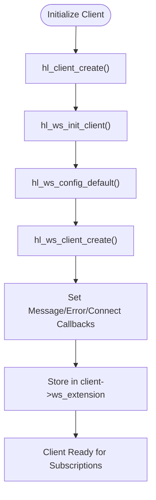
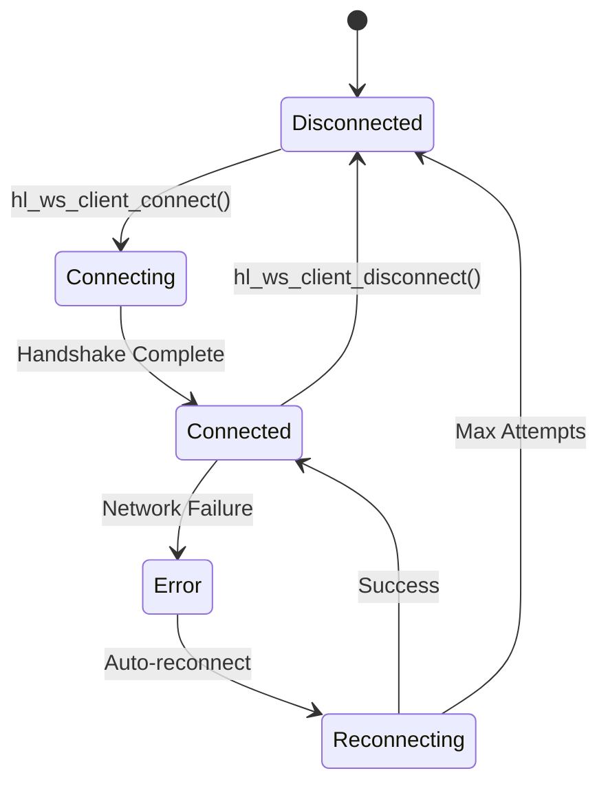
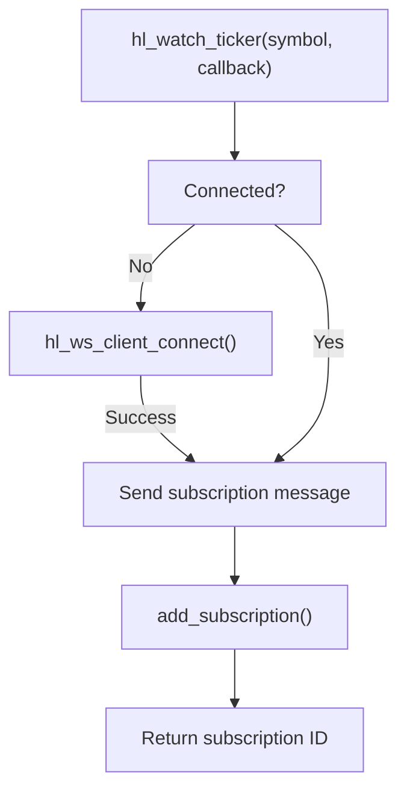
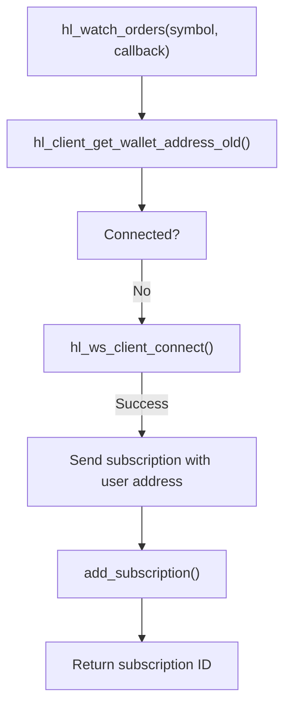
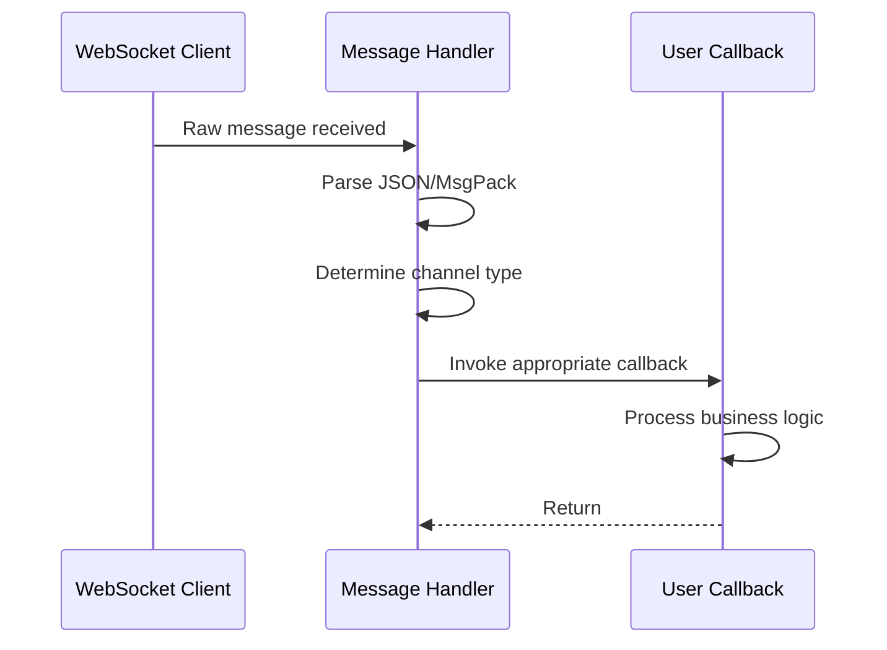
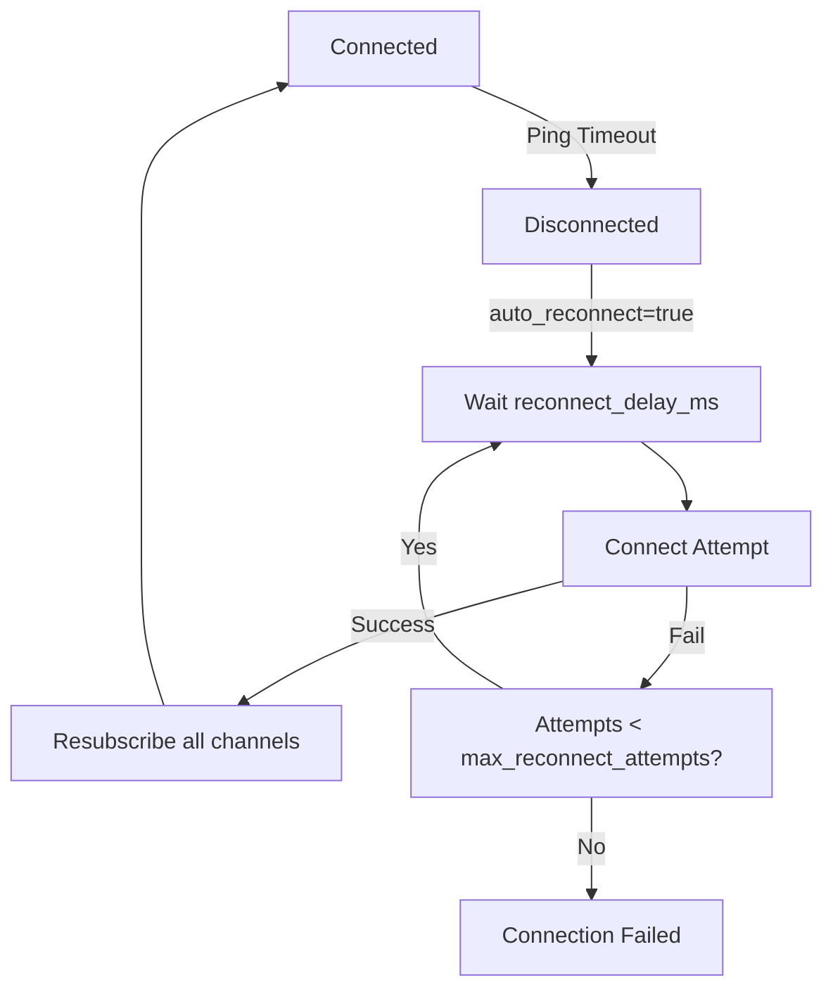
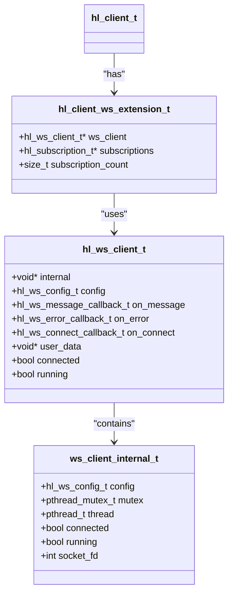

# WebSocket Integration

<cite>
**Referenced Files in This Document**   
- [websocket_demo.c](file://examples/websocket_demo.c)
- [hl_ws_client.h](file://include/hl_ws_client.h)
- [hl_client.h](file://include/hl_client.h)
- [websocket.c](file://src/websocket.c)
- [ws_client.c](file://src/ws_client.c)
- [hl_internal.h](file://include/hl_internal.h)
</cite>

## Table of Contents
1. [Introduction](#introduction)
2. [WebSocket Client Initialization](#websocket-client-initialization)
3. [Connection Management](#connection-management)
4. [Subscription Mechanisms](#subscription-mechanisms)
5. [Message Handling and Event Parsing](#message-handling-and-event-parsing)
6. [Public vs Private Channel Authentication](#public-vs-private-channel-authentication)
7. [Connection Resilience and Reconnection](#connection-resilience-and-reconnection)
8. [Performance Optimization](#performance-optimization)
9. [Thread Safety and Memory Management](#thread-safety-and-memory-management)
10. [Error Recovery](#error-recovery)

## Introduction
This document provides comprehensive documentation for WebSocket integration within the Hyperliquid C SDK. It covers the complete lifecycle of WebSocket connections, including initialization, subscription management, message handling, and connection resilience. The documentation focuses on real-time data streaming for both public market data (ticker, orderbook, trades) and private user data (orders, positions), using the `hl_ws_client_connect` framework and demonstrated through the `websocket_demo.c` example.

**Section sources**
- [websocket_demo.c](file://examples/websocket_demo.c#L1-L201)

## WebSocket Client Initialization
WebSocket integration begins with client initialization through the `hl_ws_init_client` function, which configures the WebSocket extension for a Hyperliquid client instance. This process involves creating a WebSocket client with default configuration parameters including testnet selection, URL endpoints, and connection timeouts. The initialization automatically sets up message, error, and connect callbacks that route incoming data to the appropriate handlers.

The WebSocket client operates as an extension to the main `hl_client_t` structure, storing its configuration and state within the `ws_extension` field. This design allows seamless integration between HTTP-based REST operations and WebSocket-based real-time data streaming within the same client context.

**Diagram sources**
- [websocket.c](file://src/websocket.c#L104-L130)
- [ws_client.c](file://src/ws_client.c#L56-L93)
- [hl_ws_client.h](file://include/hl_ws_client.h#L133-L133)

**Section sources**
- [websocket.c](file://src/websocket.c#L104-L130)
- [ws_client.c](file://src/ws_client.c#L56-L93)
- [hl_ws_client.h](file://include/hl_ws_client.h#L133-L133)

## Connection Management
The connection lifecycle is managed through a dedicated background thread that handles the WebSocket handshake, message processing, and connection monitoring. When `hl_ws_client_connect` is called, it creates a pthread that runs the `ws_client_thread` function, establishing the connection and maintaining its state. The connection state is tracked through boolean flags (`connected`, `running`) that are protected by a mutex to ensure thread safety.

Connection setup includes automatic configuration of the WebSocket URL based on the testnet flag, with `wss://api.hyperliquid-testnet.xyz/ws` for testnet and `wss://api.hyperliquid.xyz/ws` for production. The client maintains its connection state and provides `hl_ws_client_is_connected` to query the current status. Proper cleanup is performed through `hl_ws_cleanup_client`, which disconnects the WebSocket, joins the background thread, and frees allocated resources.

**Diagram sources**
- [ws_client.c](file://src/ws_client.c#L127-L161)
- [ws_client.c](file://src/ws_client.c#L166-L185)
- [websocket.c](file://src/websocket.c#L135-L151)

**Section sources**
- [ws_client.c](file://src/ws_client.c#L127-L185)
- [websocket.c](file://src/websocket.c#L135-L151)

## Subscription Mechanisms
The SDK provides dedicated functions for subscribing to both public and private data channels. Public channels include market data such as ticker updates, order book changes, and trade executions, while private channels provide user-specific data including order updates and trade fills.

Each subscription function returns a unique subscription ID that can be used to unsubscribe later. The subscription process automatically establishes the WebSocket connection if not already connected. Subscriptions are managed internally through a dynamic array stored in the WebSocket extension, tracking channel type, symbol, callback functions, and active status.

### Public Channel Subscriptions
Public channels require no authentication and provide real-time market data:

### Private Channel Subscriptions
Private channels require wallet authentication and provide user-specific data:

**Diagram sources**
- [websocket.c](file://src/websocket.c#L156-L181)
- [websocket.c](file://src/websocket.c#L197-L222)
- [websocket.c](file://src/websocket.c#L287-L315)
- [websocket.c](file://src/websocket.c#L320-L348)

**Section sources**
- [websocket.c](file://src/websocket.c#L156-L348)
- [websocket_demo.c](file://examples/websocket_demo.c#L70-L120)

## Message Handling and Event Parsing
Message handling is implemented through callback functions that are invoked when data is received on subscribed channels. The SDK uses a generic `hl_ws_data_callback_t` signature that accepts raw data and user context, allowing applications to process updates according to their specific requirements.

Each message type follows a consistent pattern where the incoming data corresponds to specific market or user events:
- **Ticker updates**: Price changes, volume updates, funding rates
- **Order book updates**: Changes to bid/ask levels at specified depth
- **Order updates**: Status changes to user orders (open, filled, canceled)
- **Trade updates**: Execution of user trades with price and quantity

The message parsing occurs within the callback context, where developers can cast the data to appropriate structures (not shown in current implementation but implied by function documentation). The callback system allows non-blocking processing of real-time data streams, enabling high-throughput applications to handle thousands of messages per second.

**Diagram sources**
- [websocket_demo.c](file://examples/websocket_demo.c#L25-L65)
- [websocket.c](file://src/websocket.c#L156-L348)

**Section sources**
- [websocket_demo.c](file://examples/websocket_demo.c#L25-L65)

## Public vs Private Channel Authentication
The authentication requirements differ significantly between public and private channels. Public channels (ticker, orderbook, trades) require no authentication and can be accessed with a client instance created without wallet credentials. Private channels (user orders, positions, fills) require wallet authentication and can only be accessed when the client is initialized with a valid wallet address and private key.

For private channel subscriptions, the system automatically retrieves the wallet address using `hl_client_get_wallet_address_old` and includes it in the subscription message. This ensures that users only receive data relevant to their account. The authentication is handled at the subscription level rather than the connection level, allowing a single WebSocket connection to carry both public market data and private user data.

The key difference lies in the subscription message structure:
- **Public**: `{"method":"subscribe","subscription":{"type":"ticker","coin":"BTC/USDC:USDC"}}`
- **Private**: `{"method":"subscribe","subscription":{"type":"orderUpdates","user":"0x123...abc"}}`

This design optimizes connection efficiency by multiplexing authenticated and unauthenticated data streams over a single WebSocket connection.

**Section sources**
- [websocket.c](file://src/websocket.c#L287-L348)
- [hl_internal.h](file://include/hl_internal.h#L51-L51)

## Connection Resilience and Reconnection
The WebSocket client implements robust connection resilience features to maintain reliable data streaming in production environments. The default configuration includes automatic reconnection with a 5-second delay between attempts, up to a maximum of 10 attempts. Heartbeat management is handled through periodic ping messages sent at 30-second intervals to detect and recover from stale connections.

The reconnection strategy follows a systematic approach:
1. Attempt connection with exponential backoff
2. Re-establish all active subscriptions upon successful reconnection
3. Validate connection state before resuming message processing
4. Notify applications through connect/error callbacks

Applications can customize resilience parameters through the `hl_ws_config_t` structure, adjusting reconnect delay, ping interval, timeout values, and maximum reconnection attempts according to their specific requirements. The `auto_reconnect` flag enables or disables automatic reconnection behavior.

**Section sources**
- [hl_ws_client.h](file://include/hl_ws_client.h#L133-L133)
- [ws_client.c](file://src/ws_client.c#L275-L286)

## Performance Optimization
For high-throughput applications processing continuous data streams, several performance optimization strategies should be employed:

### Connection-Level Optimizations
- **Batch subscriptions**: Subscribe to multiple symbols in a single connection rather than creating multiple clients
- **Appropriate depth selection**: For order book subscriptions, request only the necessary depth (e.g., 20 levels instead of full book)
- **Selective channel usage**: Subscribe only to required channels to reduce bandwidth and processing overhead

### Memory Management
The SDK allocates memory for subscription tracking and message handling that must be properly managed:
- Subscriptions are stored in dynamically allocated arrays that grow as needed
- Message callbacks receive raw data that should be processed efficiently
- Proper cleanup with `hl_ws_cleanup_client` prevents memory leaks

### Throughput Considerations
Applications should consider the following for optimal performance:
- Process messages in the callback context without blocking operations
- Use ring buffers or queues to decouple message reception from processing
- Implement message batching for downstream systems
- Monitor connection health and latency regularly

**Section sources**
- [websocket.c](file://src/websocket.c#L156-L348)
- [ws_client.c](file://src/ws_client.c#L56-L93)

## Thread Safety and Memory Management
The WebSocket client implementation incorporates thread safety through pthread mutex protection around critical sections. The `ws_client_internal_t` structure contains a mutex that guards access to connection state, socket file descriptor, and thread control flags. This ensures that concurrent calls to connection, disconnection, and message sending functions are properly synchronized.

Memory management follows a clear ownership model:
- Client creation functions (`hl_ws_client_create`, `hl_client_create`) return allocated memory that must be freed
- Subscription management uses internal tracking that is cleaned up during client destruction
- Callback user data is owned by the application and not managed by the SDK

The implementation uses `calloc` and `free` for memory allocation/deallocation, with proper zeroization of sensitive data (like private keys) before freeing. Background threads are properly joined during cleanup to prevent resource leaks.

**Diagram sources**
- [ws_client.c](file://src/ws_client.c#L56-L93)
- [websocket.c](file://src/websocket.c#L104-L130)

**Section sources**
- [ws_client.c](file://src/ws_client.c#L56-L122)
- [websocket.c](file://src/websocket.c#L104-L151)

## Error Recovery
Error recovery is implemented through a combination of callback mechanisms and automatic reconnection strategies. The SDK provides `hl_ws_client_set_error_callback` to notify applications of connection errors, with detailed error messages describing the failure cause.

Key error recovery patterns include:
- **Connection failures**: Handled through automatic reconnection with exponential backoff
- **Message parsing errors**: Isolated to individual messages without affecting the overall connection
- **Authentication failures**: Detected during private channel subscription attempts
- **Network timeouts**: Detected through ping/pong monitoring and connection health checks

Applications should implement defensive programming practices:
- Validate subscription return values before use
- Handle NULL callbacks gracefully
- Implement timeout monitoring for expected messages
- Log errors for diagnostic purposes using the provided logging macros

The error callback receives descriptive messages that can be used for troubleshooting connection issues, monitoring service health, and implementing custom alerting systems.

**Section sources**
- [hl_ws_client.h](file://include/hl_ws_client.h#L82-L87)
- [websocket_demo.c](file://examples/websocket_demo.c#L70-L120)