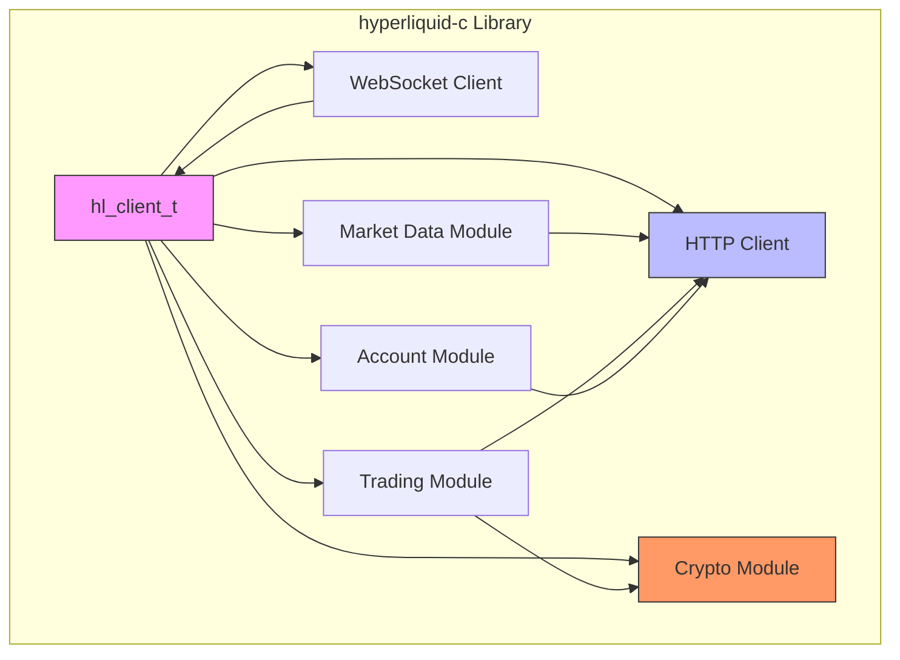
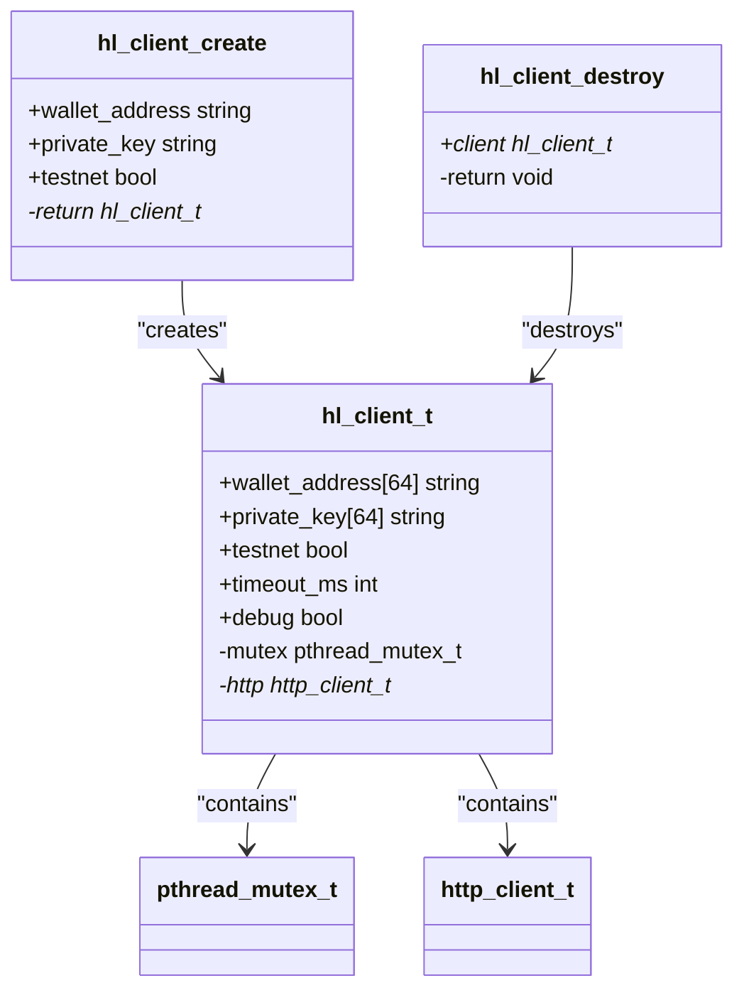
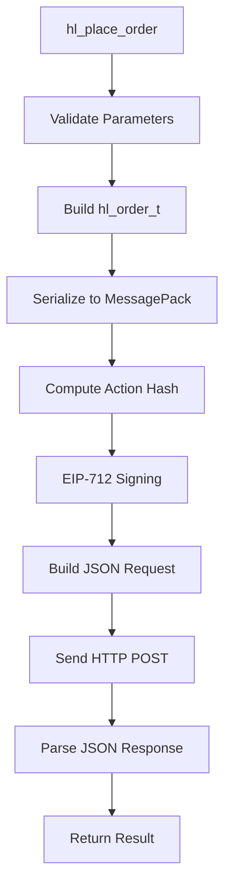
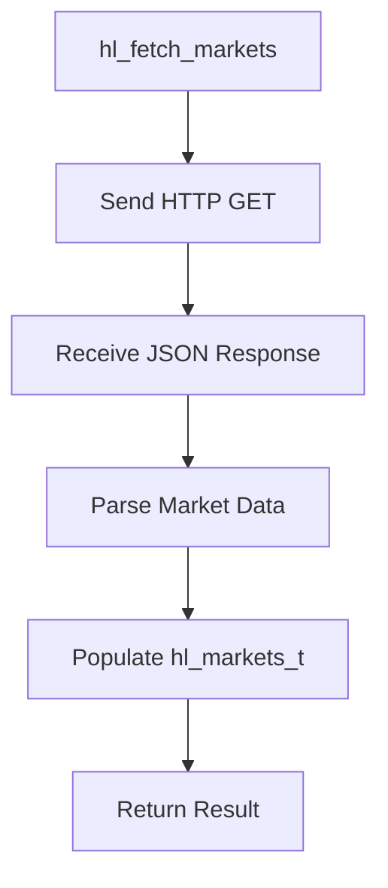
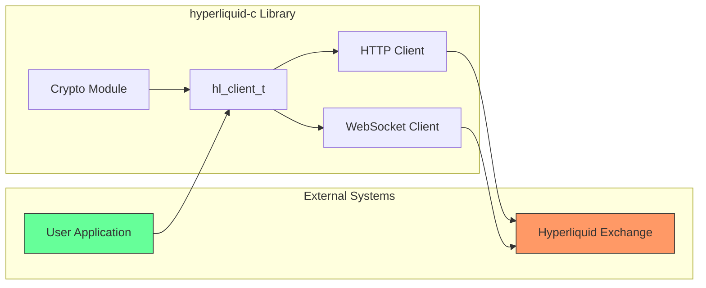
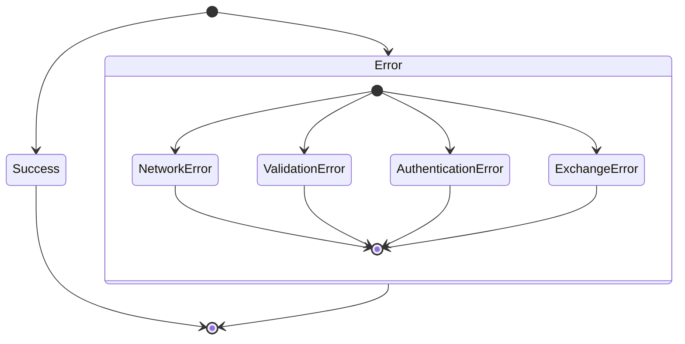

# Architecture and Design

<cite>
**Referenced Files in This Document**   
- [ARCHITECTURE.md](file://ARCHITECTURE.md)
- [include/hl_client.h](file://include/hl_client.h)
- [include/hl_http.h](file://include/hl_http.h)
- [include/hl_crypto_internal.h](file://include/hl_crypto_internal.h)
- [include/hl_ws_client.h](file://include/hl_ws_client.h)
- [include/hl_types.h](file://include/hl_types.h)
- [include/hl_exchange.h](file://include/hl_exchange.h)
- [include/hl_logger.h](file://include/hl_logger.h)
- [include/hl_msgpack.h](file://include/hl_msgpack.h)
- [src/client.c](file://src/client.c)
- [src/client_new.c](file://src/client_new.c)
</cite>

## Table of Contents
1. [Introduction](#introduction)
2. [High-Level Modular Design](#high-level-modular-design)
3. [Opaque Pointer Pattern and Client Abstraction](#opaque-pointer-pattern-and-client-abstraction)
4. [Component Interactions and Data Flows](#component-interactions-and-data-flows)
5. [System Context and External Dependencies](#system-context-and-external-dependencies)
6. [Design Trade-offs](#design-trade-offs)
7. [C11 Standard and Compatibility](#c11-standard-and-compatibility)
8. [Error Handling Strategy](#error-handling-strategy)
9. [Logging Infrastructure](#logging-infrastructure)
10. [Scalability for High-Frequency Trading](#scalability-for-high-frequency-trading)
11. [Memory Efficiency Optimizations](#memory-efficiency-optimizations)

## Introduction
The hyperliquid-c library provides a C11 implementation for interacting with the Hyperliquid exchange API, designed with performance, thread safety, and security as primary objectives. This document details the architectural design, focusing on the modular structure, client abstraction through opaque pointers, component interactions, and system-level considerations for high-frequency trading applications. The library follows CCXT compatibility patterns while implementing exchange-specific requirements for order signing, message serialization, and real-time data access.

## High-Level Modular Design
The hyperliquid-c library employs a clear separation of concerns through distinct modules that handle specific aspects of exchange interaction. This modular design enables maintainability, testability, and focused optimization of individual components.

### Client Module
The client module serves as the central coordination point, managing the lifecycle of the connection to Hyperliquid. It encapsulates authentication credentials, configuration options, and references to underlying HTTP and WebSocket clients. The `hl_client_t` structure provides a unified interface for all exchange operations while abstracting the complexity of the underlying implementation.

### HTTP Module
The HTTP module implements a robust HTTP client using libcurl, providing secure HTTPS communication with the Hyperliquid API endpoints. It supports connection pooling, configurable timeouts, automatic retries with exponential backoff, and proxy configuration. The module handles both public market data requests and private authenticated trading operations.

### Crypto Module
The crypto module implements the cryptographic operations required by the Hyperliquid protocol, including EIP-712 signing using libsecp256k1 and Keccak-256 hashing using SHA3IUF. The module ensures secure private key handling with memory zeroing on cleanup and provides functions for address derivation and signature generation.

### Feature Modules
The library includes specialized modules for different exchange features:
- **Market Data**: Functions for retrieving tickers, order books, OHLCV data, and market listings
- **Trading**: Order placement, cancellation, and modification operations
- **Account**: Balance queries, position management, and trade history
- **WebSocket**: Real-time data streaming for tickers, order books, and user events

**Diagram sources**
- [include/hl_client.h](file://include/hl_client.h)
- [include/hl_http.h](file://include/hl_http.h)
- [include/hl_crypto_internal.h](file://include/hl_crypto_internal.h)
- [include/hl_ws_client.h](file://include/hl_ws_client.h)

**Section sources**
- [ARCHITECTURE.md](file://ARCHITECTURE.md)
- [include/hl_client.h](file://include/hl_client.h)

## Opaque Pointer Pattern and Client Abstraction
The hyperliquid-c library employs the opaque pointer pattern through the `hl_client_t` type, which is declared as an incomplete struct in the public headers and defined only in the implementation files. This design provides several key benefits for encapsulation and ABI stability.

### Encapsulation Benefits
The opaque pointer pattern hides the internal implementation details of the client, exposing only a well-defined API surface. This allows the internal structure to evolve without affecting client code. The client's private fields, including the private key, HTTP client handle, and mutex, are completely hidden from users of the library.

### ABI Stability
By using an opaque pointer, the library maintains ABI (Application Binary Interface) stability across versions. Changes to the internal structure of the client, such as adding new fields or changing data types, do not require recompilation of client applications. This is particularly important for a C library that may be distributed as a shared object.

### Memory Management
The opaque pointer pattern enables clear ownership semantics. The client is created with `hl_client_create()` and destroyed with `hl_client_destroy()`, with all internal resources managed by the library. This RAII-like pattern ensures that resources are properly cleaned up, including zeroing the private key from memory and destroying synchronization primitives.

**Diagram sources**
- [include/hl_client.h](file://include/hl_client.h)
- [src/client.c](file://src/client.c)

**Section sources**
- [src/client.c](file://src/client.c#L34-L87)
- [include/hl_client.h](file://include/hl_client.h)

## Component Interactions and Data Flows
The hyperliquid-c library implements well-defined data flows for different operations, ensuring consistency and reliability in communication with the Hyperliquid exchange.

### Order Placement Flow
The order placement process follows a strict sequence of validation, serialization, signing, and transmission:

**Diagram sources**
- [ARCHITECTURE.md](file://ARCHITECTURE.md)

### Market Data Flow
Market data retrieval follows a simpler flow, primarily involving HTTP requests and JSON parsing:

**Section sources**
- [ARCHITECTURE.md](file://ARCHITECTURE.md)
- [src/client.c](file://src/client.c)

## System Context and External Dependencies
The hyperliquid-c library interacts with several external systems and depends on specific third-party libraries to provide its functionality.

### External Dependencies
The library relies on the following external dependencies:
- **libcurl**: For HTTP/HTTPS communication
- **libsecp256k1**: For ECDSA signing operations
- **SHA3IUF**: For Keccak-256 hashing
- **pthread**: For thread synchronization

### Integration Points
The library integrates with the Hyperliquid exchange through two primary endpoints:
- **REST API**: For market data and trading operations
- **WebSocket API**: For real-time data streaming

**Diagram sources**
- [include/hl_http.h](file://include/hl_http.h)
- [include/hl_ws_client.h](file://include/hl_ws_client.h)

## Design Trade-offs
The hyperliquid-c library makes several deliberate design trade-offs to balance performance, safety, simplicity, and flexibility.

### Performance vs. Safety
The library prioritizes performance through zero-copy operations and minimal memory allocations, while maintaining safety through rigorous input validation and secure private key handling. The use of stack allocation where possible reduces heap fragmentation and allocation overhead, but requires careful management of buffer sizes.

### Simplicity vs. Flexibility
The API design favors simplicity with a small number of well-defined functions, while providing flexibility through configuration options and callback mechanisms. The opaque pointer pattern simplifies the API surface but limits direct access to internal state, which could be needed for advanced use cases.

### Synchronous vs. Asynchronous
The library primarily uses a synchronous API design, which is simpler to use and understand, but provides a WebSocket interface for asynchronous real-time data. This hybrid approach balances ease of use with the performance requirements of high-frequency trading applications.

**Section sources**
- [ARCHITECTURE.md](file://ARCHITECTURE.md)

## C11 Standard and Compatibility
The hyperliquid-c library is implemented using the C11 standard, which provides several advantages for compatibility and portability.

### Standard Compliance
Using C11 ensures compatibility with a wide range of compilers and platforms, including embedded systems and high-performance computing environments. The standard provides features like threads, atomic operations, and improved Unicode support that enhance the library's capabilities.

### Portability Considerations
The library avoids platform-specific features and uses standard C library functions where possible. This ensures that the code can be compiled and run on different operating systems and architectures without modification.

### Backward Compatibility
The API design maintains backward compatibility through stable function signatures and the opaque pointer pattern. This allows applications to upgrade to newer versions of the library without code changes.

**Section sources**
- [ARCHITECTURE.md](file://ARCHITECTURE.md)

## Error Handling Strategy
The hyperliquid-c library implements a comprehensive error handling strategy based on explicit error codes and descriptive error messages.

### Error Code Convention
The library uses negative integers for error codes and zero for success, following the Unix convention. Each error code corresponds to a specific failure mode, allowing applications to handle different error conditions appropriately.

### Error Propagation
Errors are propagated through return values, with functions returning error codes that can be checked by the caller. This approach avoids the complexity of exception handling in C while providing clear feedback about operation failures.

### Error Information
In addition to error codes, the library provides descriptive error messages through a dedicated error string function. This helps with debugging and provides meaningful feedback to end users.

**Diagram sources**
- [ARCHITECTURE.md](file://ARCHITECTURE.md)

**Section sources**
- [ARCHITECTURE.md](file://ARCHITECTURE.md)

## Logging Infrastructure
The library implements a simple but effective logging infrastructure using preprocessor macros that can be enabled or disabled at compile time.

### Logging Levels
The logging system supports four levels:
- **DEBUG**: Detailed information for development and troubleshooting
- **INFO**: General operational information
- **WARN**: Warning messages about potential issues
- **ERROR**: Error messages about failed operations

### Conditional Compilation
The DEBUG macro controls whether debug messages are compiled into the binary, allowing for zero-overhead logging in production builds. This approach balances the need for detailed diagnostics during development with performance requirements in production.

**Section sources**
- [include/hl_logger.h](file://include/hl_logger.h)

## Scalability for High-Frequency Trading
The hyperliquid-c library is designed with scalability in mind, supporting the requirements of high-frequency trading applications.

### Thread Safety
All public APIs are thread-safe, using mutexes to protect shared state. This allows multiple threads to use the same client instance concurrently, though best practices recommend one client per thread for maximum performance.

### Connection Management
The library implements connection pooling and keeps HTTP connections alive, reducing the overhead of establishing new connections for each request. This is critical for high-frequency trading where latency is a key factor.

### Performance Optimization
The library employs several performance optimizations:
- Pre-allocation of buffers to minimize allocations
- Minimal data copying through zero-copy operations
- Fast path optimization for common successful cases
- Efficient serialization and deserialization

**Section sources**
- [ARCHITECTURE.md](file://ARCHITECTURE.md)

## Memory Efficiency Optimizations
The hyperliquid-c library implements several memory efficiency optimizations to minimize resource usage and improve performance.

### Zero-Copy Operations
The library minimizes memory allocations and copies, passing data by reference whenever possible. This reduces memory overhead and improves cache locality.

### Stack Allocation
Where feasible, the library uses stack allocation instead of heap allocation, reducing memory fragmentation and allocation overhead.

### Buffer Reuse
The library reuses buffers for JSON and MessagePack operations, avoiding repeated allocation and deallocation.

### Memory Zeroing
Sensitive data, particularly private keys, is zeroed from memory when no longer needed to prevent exposure through memory dumps or other security vulnerabilities.

**Section sources**
- [ARCHITECTURE.md](file://ARCHITECTURE.md)