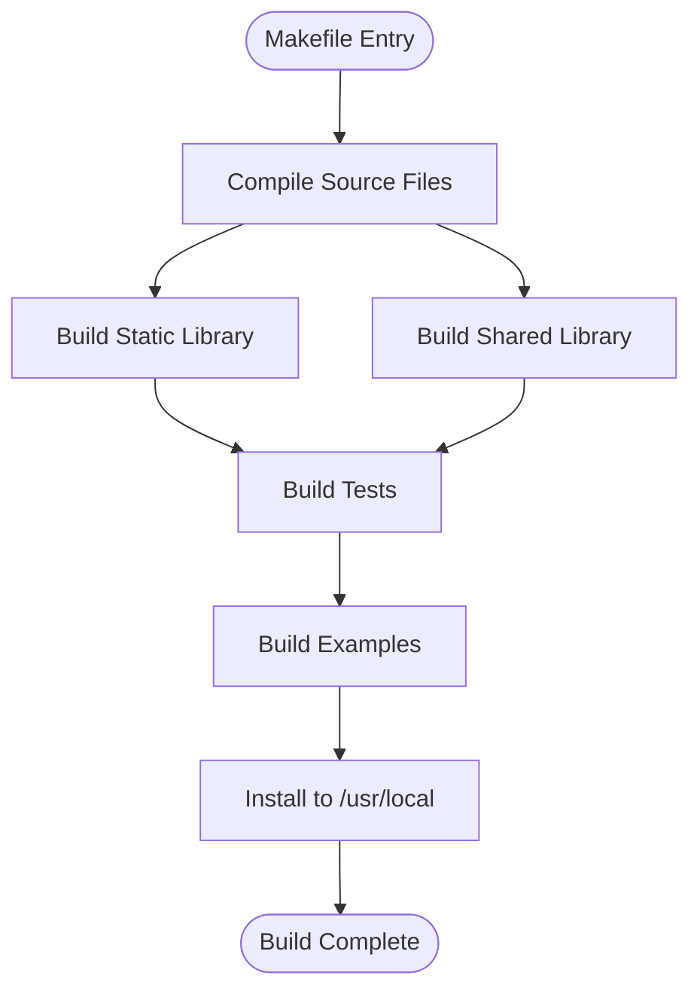
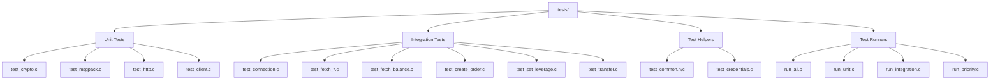
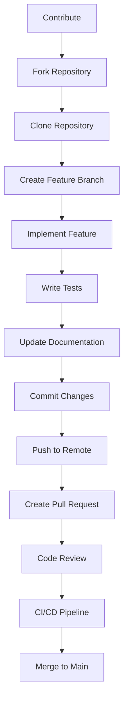
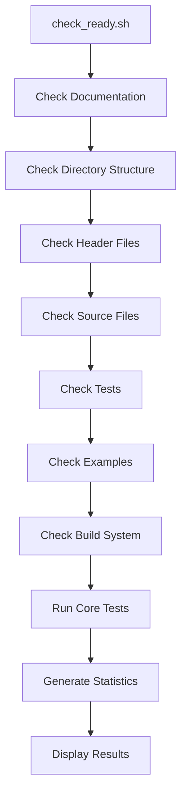
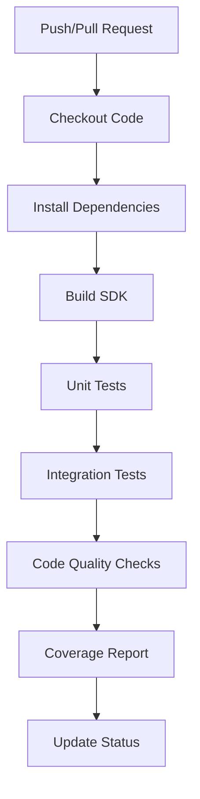

# Build and Development

<cite>
**Referenced Files in This Document**   
- [Makefile](file://Makefile)
- [CONTRIBUTING.md](file://CONTRIBUTING.md)
- [check_ready.sh](file://check_ready.sh)
- [tests/README.md](file://tests/README.md)
- [README.md](file://README.md)
</cite>

## Table of Contents
1. [Introduction](#introduction)
2. [Build System](#build-system)
3. [Test Suite Organization](#test-suite-organization)
4. [Development Workflow](#development-workflow)
5. [Contribution Process](#contribution-process)
6. [Development Environment Setup](#development-environment-setup)
7. [Development Readiness Checks](#development-readiness-checks)
8. [Cross-Platform Development](#cross-platform-development)
9. [Continuous Integration](#continuous-integration)

## Introduction
This document provides comprehensive guidance on the build and development processes for the Hyperliquid C SDK. It covers the build system, test suite organization, development workflow, contribution guidelines, environment setup, and quality assurance practices. The documentation is designed to help developers understand how to build, test, and contribute to the project effectively.

## Build System

The Hyperliquid C SDK uses a Makefile-based build system that supports compilation, testing, cleaning, and installation of the library. The build system is designed to be production-ready and cross-platform compatible.



**Diagram sources**
- [Makefile](file://Makefile#L1-L227)

**Section sources**
- [Makefile](file://Makefile#L1-L227)

### Build Targets
The Makefile provides several targets for different development and deployment scenarios:

- **all**: Default target that builds both static and shared libraries
- **tests**: Builds test executables
- **test**: Builds and runs all tests
- **examples**: Builds example programs
- **debug**: Builds with debug symbols and sanitizers
- **install**: Installs the library to /usr/local
- **uninstall**: Removes the installed library
- **clean**: Removes all build artifacts
- **format**: Formats code using clang-format
- **analyze**: Runs static analysis with cppcheck
- **docs**: Generates documentation with Doxygen
- **memcheck**: Runs memory checks with valgrind
- **coverage**: Generates code coverage report

### Compilation Process
The build system compiles source files from the `src/` directory into object files, which are then linked into static and shared libraries. The system automatically detects the platform and adjusts the shared library extension accordingly (`.so` for Unix-like systems, `.dll` for Windows).

### Build Configuration
The build system uses the following configuration variables:
- `CC`: Compiler (default: gcc)
- `CFLAGS`: Compiler flags including optimization and warning levels
- `DEBUG_FLAGS`: Debug-specific flags including sanitizers
- `INCLUDES`: Include paths for header files
- `LIBS`: External libraries required by the SDK
- `VERSION`: Library version

## Test Suite Organization

The test suite is organized in the `tests/` directory and follows a structured approach to ensure comprehensive coverage of the SDK's functionality.



**Diagram sources**
- [tests/README.md](file://tests/README.md#L1-L387)

**Section sources**
- [tests/README.md](file://tests/README.md#L1-L387)

### Test Categories
The test suite is divided into two main categories:

#### Unit Tests
Unit tests focus on individual modules without requiring network connectivity:
- Crypto operations (keccak, EIP-712)
- MessagePack serialization
- HTTP request building
- Client initialization
- Error code conversion

#### Integration Tests
Integration tests verify the SDK's interaction with the Hyperliquid testnet:
- **Priority 1 (HIGH)**: 20 critical methods
- **Priority 2 (MEDIUM)**: 18 useful methods
- **Priority 3 (LOW)**: 13 additional methods

### Test Execution
Tests can be executed using various Makefile targets:
- `make test`: Run all tests
- `make test-unit`: Run only unit tests
- `make test-integration`: Run only integration tests
- `make test-priority`: Run high priority tests
- `make test-market-data`: Run market data tests
- `make test-trading`: Run trading tests
- `make test-fetch-balance`: Run specific test

### Test Coverage
The test suite aims to achieve 100% coverage of the 51 API methods. The current coverage is tracked in the README.md and updated regularly. The test structure follows a naming convention where unit tests are named `test_<module>_<function>` and integration tests are named `test_<action>_<resource>`.

## Development Workflow

The development workflow for the Hyperliquid C SDK follows a structured process to ensure code quality and consistency.

```mermaid
flowchart LR
Fork[Fork Repository] --> Clone[Clone Repository]
Clone --> Branch[Create Feature Branch]
Branch --> Code[Make Changes]
Code --> Test[Run Tests]
Test --> Commit[Commit Changes]
Commit --> Push[Push to Remote]
Push --> PR[Create Pull Request]
PR --> Review[Code Review]
Review --> Merge[Merge to Main]
```



**Diagram sources**
- [CONTRIBUTING.md](file://CONTRIBUTING.md#L1-L447)

**Section sources**
- [CONTRIBUTING.md](file://CONTRIBUTING.md#L1-L447)

### Code Style Guidelines
The project follows specific code style guidelines to maintain consistency:

- **Function names**: snake_case
- **Struct names**: snake_case with _t suffix
- **Constants**: UPPER_CASE
- **Variables**: snake_case
- **Indentation**: 4 spaces (not tabs)
- **Braces**: K&R style
- **Pointer declaration**: asterisk with type (e.g., char* string)

### Documentation Style
Functions should be documented with Doxygen-style comments that include:
- Brief description of the function
- Parameter descriptions
- Return value description
- Notes about thread safety or other important considerations

### Testing Guidelines
When adding new functionality, contributors should:
1. Write unit tests for individual functions
2. Write integration tests for module interactions
3. Ensure test coverage is maintained
4. Test both success and error cases
5. Clean up after tests (cancel orders, close positions)

## Contribution Process

The contribution process for the Hyperliquid C SDK is designed to be straightforward and welcoming to new contributors.



**Diagram sources**
- [CONTRIBUTING.md](file://CONTRIBUTING.md#L1-L447)

**Section sources**
- [CONTRIBUTING.md](file://CONTRIBUTING.md#L1-L447)

### Areas for Contribution
The project identifies several areas where contributions are needed:

#### Priority 1: Phase 3 Integration
- Adapt `src/trading.c` to use new public API signatures
- Create integration tests for testnet interaction
- Update and create usage examples

#### Priority 2: Documentation Improvements
- Add more code examples to documentation
- Create a troubleshooting guide
- Document performance considerations

#### Priority 3: Advanced Features
- Add WebSocket support for real-time data streaming
- Implement advanced order types (stop-loss, take-profit, etc.)
- Add hardware wallet integration (Ledger, Trezor)

### Pull Request Guidelines
Pull requests should follow these guidelines:
- Include a clear description of the changes
- Reference any related issues
- Include tests for new functionality
- Update documentation as needed
- Follow the project's code style

### Code Review Expectations
All contributions undergo a code review process that includes:
- Automated checks (compilation, tests, code style)
- Manual review (code quality, documentation, test coverage, performance impact)
- At least one maintainer approval
- All CI checks passing
- No merge conflicts

## Development Environment Setup

Setting up a development environment for the Hyperliquid C SDK requires installing several dependencies and tools.

### Prerequisites
The following tools and libraries are required for development:

- **C Compiler**: GCC or Clang with C99 support
- **Build System**: Make
- **Libraries**:
  - libcurl
  - cJSON
  - libsecp256k1
  - libuuid
  - OpenSSL

### Platform-Specific Installation

#### Linux (Ubuntu/Debian)
```bash
sudo apt-get install libcurl4-openssl-dev libjansson-dev libsecp256k1-dev uuid-dev
```

#### macOS (with Homebrew)
```bash
brew install curl jansson libsecp256k1 ossp-uuid
```

#### Windows (MSYS2)
```bash
pacman -S mingw-w64-x86_64-curl mingw-w64-x86_64-jansson mingw-w64-x86_64-libsecp256k1
```

### Development Tools
For optimal development experience, install the following tools:
- clang-format for code formatting
- cppcheck for static analysis
- valgrind for memory leak detection
- doxygen for documentation generation

### Quick Start for Contributors
```bash
# Clone the repository
git clone https://github.com/suenot/hyperliquid-c.git
cd hyperliquid-c

# Install dependencies (macOS)
brew install libsecp256k1 msgpack-c curl cjson openssl

# Run tests to verify setup
make -f Makefile.test test_minimal
```

**Section sources**
- [CONTRIBUTING.md](file://CONTRIBUTING.md#L1-L447)
- [README.md](file://README.md#L1-L728)

## Development Readiness Checks

The `check_ready.sh` script provides a comprehensive readiness check to ensure the project is ready for publication.



**Diagram sources**
- [check_ready.sh](file://check_ready.sh#L1-L164)

**Section sources**
- [check_ready.sh](file://check_ready.sh#L1-L164)

### Check Categories
The script performs the following checks:

#### Documentation
- Main README
- GitHub README
- License file
- Quick start guide
- Architecture docs
- Status document
- Contributing guide
- Current status
- Phase completion reports
- Git ignore file

#### Directory Structure
- include/ directory
- src/ directory
- tests/ directory
- examples/ directory
- docs/ directory

#### Header Files
- Public API (hyperliquid.h)
- Crypto internals (hl_crypto_internal.h)
- MessagePack API (hl_msgpack.h)
- HTTP API (hl_http.h)
- Internal API (hl_internal.h)
- Logger (hl_logger.h)

#### Source Files
- Client wrapper (src/client.c)
- Trading logic (src/trading.c)
- Keccak-256 implementation (src/crypto/keccak.c)
- EIP-712 implementation (src/crypto/eip712.c)
- MessagePack serialization (src/msgpack/serialize.c)
- HTTP client (src/http/client.c)

#### Tests and Examples
- Minimal test (tests/test_minimal.c)
- Simple trade example (examples/simple_trade.c)

#### Build System
- Production Makefile
- Test Makefile

### Running the Readiness Check
The script can be executed with:
```bash
./check_ready.sh
```

The script provides a detailed report of all checks, including which files are present and which are missing. It also runs the core module tests to ensure they are passing. If all checks pass, the script indicates that the project is ready for publication and provides next steps for initializing the git repository and pushing to the remote.

## Cross-Platform Development

The Hyperliquid C SDK is designed to be cross-platform compatible, supporting Linux, macOS, and Windows.

### Platform Detection
The Makefile includes platform detection logic that automatically adjusts the build process based on the operating system:

```makefile
ifeq ($(OS),Windows_NT)
    SHARED_LIB_TARGET = $(SHARED_LIB_WIN)
    LIB_EXT = dll
else
    SHARED_LIB_TARGET = $(SHARED_LIB)
    LIB_EXT = so
endif
```

This allows the same Makefile to work across different platforms with minimal changes.

### Compiler Compatibility
The build system is compatible with multiple compilers:
- GCC (Linux, macOS, Windows via MSYS2)
- Clang (macOS, Linux)
- MSVC (Windows, though not directly supported by the Makefile)

### Library Dependencies
The SDK depends on several external libraries that are available on all major platforms:
- libcurl for HTTP requests
- cJSON for JSON parsing
- libsecp256k1 for cryptographic operations
- OpenSSL for SSL/TLS support
- libmsgpackc for MessagePack serialization
- libpthread for threading (Unix-like systems)

### Build Instructions by Platform

#### Linux
```bash
# Install dependencies
sudo apt-get install libcurl4-openssl-dev libjansson-dev libsecp256k1-dev uuid-dev

# Build the SDK
make

# Run tests
make test
```

#### macOS
```bash
# Install dependencies
brew install curl jansson libsecp256k1 ossp-uuid

# Build the SDK
make

# Run tests
make test
```

#### Windows
```bash
# Using MSYS2
pacman -S mingw-w64-x86_64-curl mingw-w64-x86_64-jansson mingw-w64-x86_64-libsecp256k1

# Build with MinGW
make CC=gcc
```

### Continuous Integration
The project uses GitHub Actions for continuous integration, with workflows that test the build and test suite on multiple platforms:
- Linux (GCC/Clang)
- macOS (Clang)
- Windows (MSYS2 GCC)

This ensures that changes do not break the build on any supported platform.

**Section sources**
- [Makefile](file://Makefile#L1-L227)
- [README.md](file://README.md#L1-L728)

## Continuous Integration

The Hyperliquid C SDK uses GitHub Actions for continuous integration, ensuring code quality and build reliability across multiple platforms.



**Diagram sources**
- [README.md](file://README.md#L1-L728)

**Section sources**
- [README.md](file://README.md#L1-L728)

### CI/CD Workflows
The project has several automated workflows:

#### Automated Builds
- **Cross-Platform Builds**: The SDK is built and tested on Linux, macOS, and Windows
- **Multi-Compiler**: Compatibility testing with GCC and Clang
- **Memory Safety**: Valgrind integration for leak detection on Linux
- **Static Analysis**: Cppcheck integration for code quality

#### Quality Assurance
- **Test Coverage**: Automated coverage analysis with daily badge updates
- **Code Modularity**: Automated checks for file size limits (< 1000 lines)
- **Quality Gates**: Builds fail if files exceed size limits or if coverage drops

### Badge System
The project uses a comprehensive badge system to communicate quality metrics:
- **Test Coverage**: Percentage of code covered by automated tests
- **Code Modularity**: Grade based on file size (< 1000 lines = A grade)
- **CI/CD**: Build and test status across all workflows
- **Platform Support**: Build status for Linux, macOS, and Windows

### Quality Gates
The CI/CD pipeline enforces several quality gates:
- Builds fail if any file exceeds 1000 lines
- Coverage badge updates automatically after test runs
- Static analysis warnings are tracked and reported
- All tests must pass before merging

### Development Commands
Several Makefile targets support the CI/CD process:
- `make analyze`: Runs static analysis with cppcheck
- `make memcheck`: Runs tests with valgrind for memory leak detection
- `make coverage`: Generates code coverage report
- `make format`: Formats code with clang-format

These commands can be run locally to ensure code meets the project's quality standards before pushing to the remote repository.