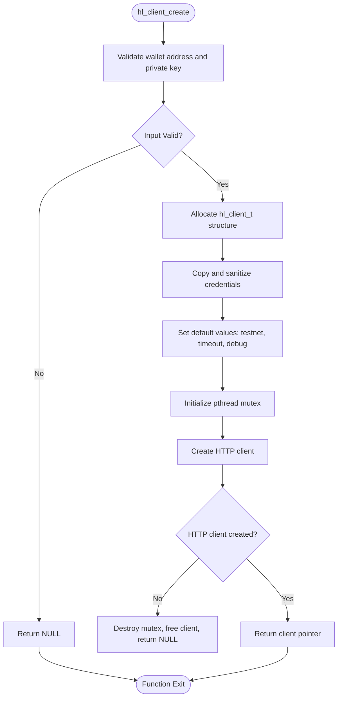
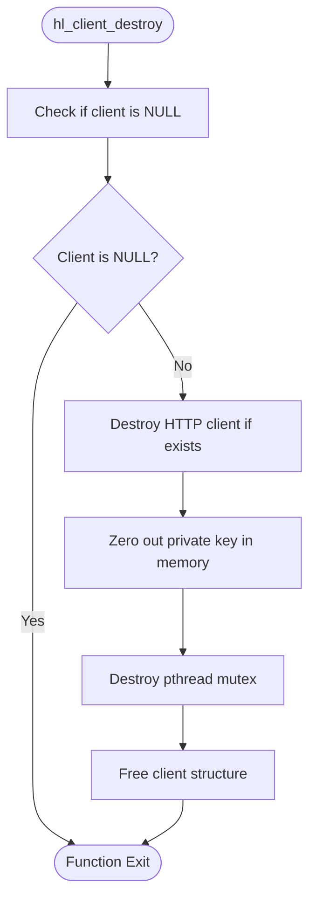
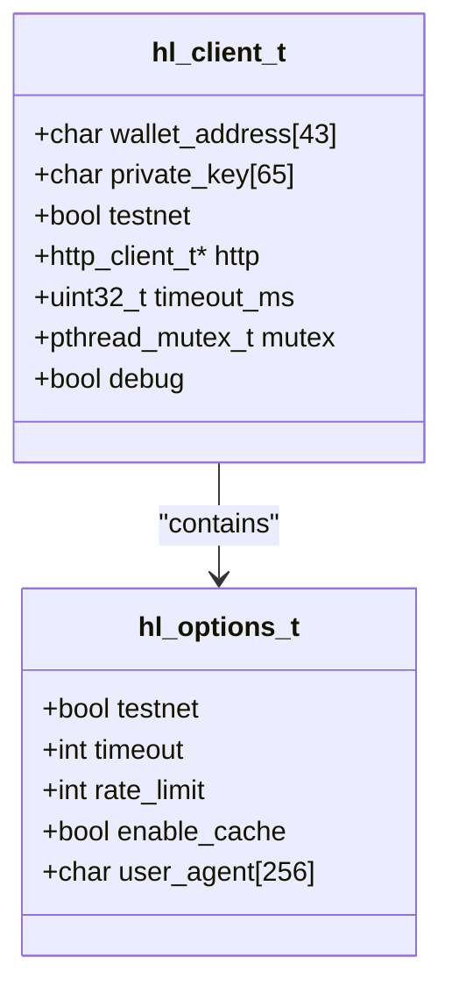
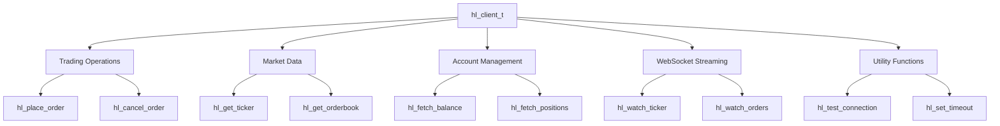

# Client Management

<cite>
**Referenced Files in This Document**   
- [client.c](file://src/client.c)
- [client_new.c](file://src/client_new.c)
- [hl_client.h](file://include/hl_client.h)
- [hyperliquid.h](file://include/hyperliquid.h)
- [simple_balance.c](file://examples/simple_balance.c)
- [trading_bot.c](file://examples/trading_bot.c)
</cite>

## Table of Contents
1. [Introduction](#introduction)
2. [Client Lifecycle Management](#client-lifecycle-management)
3. [Configuration Options](#configuration-options)
4. [Connection Testing and Health Checks](#connection-testing-and-health-checks)
5. [State and Credential Management](#state-and-credential-management)
6. [Thread Safety](#thread-safety)
7. [Usage Examples](#usage-examples)
8. [Common Issues](#common-issues)
9. [Performance Considerations](#performance-considerations)
10. [Client as Central Coordination Point](#client-as-central-coordination-point)

## Introduction
The `hl_client_t` structure serves as the central component for interacting with the Hyperliquid exchange API. This document provides comprehensive documentation on client management, covering the complete lifecycle from creation to destruction, configuration options, connection testing, and internal state management. The client acts as the primary interface for all trading operations, market data retrieval, and account information access.

**Section sources**
- [hyperliquid.h](file://include/hyperliquid.h#L220-L222)
- [hl_client.h](file://include/hl_client.h#L13-L13)

## Client Lifecycle Management

### Creation with hl_client_create()
The `hl_client_create()` function initializes a new client instance with the provided wallet address, private key, and network selection. The function performs validation on the input parameters, ensuring the wallet address follows the Ethereum format (0x prefix followed by 40 hexadecimal characters) and the private key is either 64 or 66 characters long (with or without the 0x prefix).

Upon successful validation, the function allocates memory for the client structure, copies the credentials (stripping the 0x prefix if present), sets default configuration values, initializes a mutex for thread safety, and creates an HTTP client for API communication. The client is configured for 30-second timeout by default and debug mode is disabled.



**Diagram sources**
- [client.c](file://src/client.c#L34-L87)
- [client_new.c](file://src/client_new.c#L230-L232)

**Section sources**
- [client.c](file://src/client.c#L34-L87)
- [client_new.c](file://src/client_new.c#L18-L68)

### Destruction with hl_client_destroy()
The `hl_client_destroy()` function properly cleans up all resources associated with a client instance. It first checks if the client pointer is valid, then destroys the HTTP client, securely zeros out the private key in memory before freeing it, destroys the mutex, and finally frees the client structure itself. This secure cleanup process prevents sensitive information from remaining in memory after the client is destroyed.



**Diagram sources**
- [client.c](file://src/client.c#L89-L107)
- [client_new.c](file://src/client_new.c#L234-L236)

**Section sources**
- [client.c](file://src/client.c#L89-L107)
- [client_new.c](file://src/client_new.c#L70-L106)

## Configuration Options

### Network Selection (Testnet vs Mainnet)
The client supports both testnet and mainnet environments through the `testnet` boolean parameter in `hl_client_create()`. When `testnet` is set to `true`, the client connects to the Hyperliquid testnet API endpoint, allowing for safe testing of trading strategies without risking real funds. When set to `false`, the client connects to the production mainnet environment.

The network selection affects the base URL used for API requests:
- Testnet: `https://api.hyperliquid-testnet.xyz`
- Mainnet: `https://api.hyperliquid.xyz`

Clients can check their current network configuration using the `hl_client_is_testnet()` function, which returns a boolean indicating whether the client is configured for testnet.

**Section sources**
- [client.c](file://src/client.c#L34-L87)
- [client_new.c](file://src/client_new.c#L108-L110)

### Logging Level Configuration
The client library provides a global debug mode that can be enabled or disabled using the `hl_set_debug()` function. When debug mode is enabled, the library may output additional diagnostic information to aid in troubleshooting. However, this function is currently marked as a TODO in the implementation, indicating that the debug logging functionality is not yet fully implemented.

For production use, debug mode should remain disabled to prevent potential exposure of sensitive information and to minimize performance overhead.

**Section sources**
- [client.c](file://src/client.c#L148-L152)

### Timeout Settings
The client allows configuration of HTTP request timeouts through the `hl_set_timeout()` function. By default, the client is configured with a 30-second timeout (30000 milliseconds). This timeout applies to all HTTP requests made through the client and helps prevent operations from hanging indefinitely in case of network issues.

The timeout can be adjusted based on network conditions and application requirements. For applications running in environments with high network latency, a longer timeout may be necessary. For high-frequency trading applications, a shorter timeout might be preferred to quickly fail and retry requests.



**Diagram sources**
- [client.c](file://src/client.c#L34-L87)
- [hl_client.h](file://include/hl_client.h#L45-L53)

**Section sources**
- [client.c](file://src/client.c#L142-L146)
- [client_new.c](file://src/client_new.c#L18-L68)

## Connection Testing and Health Checks
The client provides the `hl_test_connection()` function to verify connectivity with the Hyperliquid API. This function sends a POST request to the `/info` endpoint with a minimal JSON body containing `{"type":"meta"}`. The function returns `true` if the request is successful and returns a 200 status code, indicating that the client can successfully communicate with the exchange API.

The connection test automatically uses the appropriate base URL based on the client's testnet configuration and is protected by the client's mutex to ensure thread safety during the operation.

**Section sources**
- [client.c](file://src/client.c#L109-L140)
- [client_new.c](file://src/client_new.c#L147-L152)

## State and Credential Management
The client maintains several pieces of internal state to facilitate efficient operation and secure credential handling. Credentials (wallet address and private key) are stored securely within the client structure and are never exposed directly through the public API. The private key is zeroed out in memory during client destruction to prevent potential exposure.

The client also maintains a cache of market data when using the CCXT-compatible implementation, storing market information in the `markets` field of the `hl_client_t` structure. This caching mechanism reduces the need for repeated API calls to fetch market information, improving performance for applications that frequently access market data.

Additionally, the client manages HTTP connection state through the embedded `http_client_t` structure, maintaining persistent connections where possible to reduce connection overhead for subsequent requests.

**Section sources**
- [client.c](file://src/client.c#L34-L87)
- [client_new.c](file://src/client_new.c#L18-L68)

## Thread Safety
The client implementation includes built-in thread safety through the use of a pthread mutex. The mutex is initialized during client creation and protects access to shared resources, particularly during HTTP requests and connection testing. This allows the client to be safely used from multiple threads without external synchronization.

Each public function that accesses shared state acquires the mutex at the beginning of its execution and releases it before returning, ensuring that operations are atomic from the perspective of other threads. This design enables concurrent use of the client for different operations, such as fetching market data on one thread while placing orders on another.

**Section sources**
- [client.c](file://src/client.c#L34-L87)
- [client.c](file://src/client.c#L193-L195)

## Usage Examples

### Simple Balance Example
The `simple_balance.c` example demonstrates basic client usage for fetching account balance information. It creates a client with testnet credentials, fetches both perpetual and spot account balances, displays the balance information, and properly destroys the client.

```mermaid
sequenceDiagram
participant Main as "main()"
participant Client as "hl_client_create()"
participant Balance as "hl_fetch_balance()"
participant Destroy as "hl_client_destroy()"
Main->>Client : Create client with wallet, key, testnet=true
Client-->>Main : Return client pointer
Main->>Balance : Fetch perpetual balance
Balance-->>Main : Return balance data
Main->>Balance : Fetch spot balance
Balance-->>Main : Return balance data
Main->>Destroy : Destroy client
Destroy-->>Main : Complete cleanup
```

**Diagram sources**
- [simple_balance.c](file://examples/simple_balance.c#L18-L86)

**Section sources**
- [simple_balance.c](file://examples/simple_balance.c#L18-L86)

### Trading Bot Example
The `trading_bot.c` example demonstrates a more complex usage pattern, including connection testing, balance monitoring, market data fetching, order placement, and WebSocket integration. The example shows how the client serves as the central coordination point for various trading operations and how different components interact through the client instance.

**Section sources**
- [trading_bot.c](file://examples/trading_bot.c#L22-L22)

## Common Issues

### Connection Timeouts
Connection timeouts can occur due to network issues, high API load, or firewall restrictions. To mitigate this, applications should:
1. Implement retry logic with exponential backoff
2. Adjust the timeout setting based on network conditions
3. Monitor connection health using `hl_test_connection()`
4. Handle timeout errors gracefully and provide appropriate user feedback

### Authentication Failures
Authentication failures typically result from invalid wallet addresses or private keys. To prevent these issues:
1. Validate credentials before client creation
2. Ensure private keys do not contain the 0x prefix (it will be stripped automatically)
3. Verify wallet address format (0x followed by 40 hex characters)
4. Handle authentication errors by prompting for credential verification

### Resource Leaks
Resource leaks can occur if `hl_client_destroy()` is not called after `hl_client_create()`. To prevent leaks:
1. Always pair client creation with destruction
2. Use RAII patterns or try-finally constructs where possible
3. Implement proper error handling that includes cleanup
4. Consider using static analysis tools to detect potential leaks

**Section sources**
- [client.c](file://src/client.c#L34-L107)
- [client_new.c](file://src/client_new.c#L18-L106)

## Performance Considerations

### Long-Running Client Instances
For applications that maintain long-running client instances, consider the following:
1. Reuse client instances rather than creating and destroying them frequently
2. Monitor connection health and recreate clients if connectivity is lost
3. Implement connection pooling for applications with multiple concurrent operations
4. Periodically refresh market data caches to ensure accuracy

### Connection Pooling Strategies
While the current implementation does not include built-in connection pooling, applications can implement pooling strategies by:
1. Maintaining a pool of pre-created client instances
2. Using a single client with multiple worker threads (leveraging the built-in thread safety)
3. Implementing a connection factory that manages client lifecycle
4. Monitoring pool utilization and adjusting pool size based on load

**Section sources**
- [client.c](file://src/client.c#L34-L107)
- [client_new.c](file://src/client_new.c#L18-L106)

## Client as Central Coordination Point
The `hl_client_t` instance serves as the central coordination point for all interactions with the Hyperliquid exchange. It provides the foundation for:
1. **Authentication**: Securely storing and using credentials for signed API requests
2. **Network Communication**: Managing HTTP connections and request/response cycles
3. **State Management**: Caching market data and maintaining connection state
4. **Error Handling**: Centralizing error reporting and recovery mechanisms
5. **Feature Integration**: Coordinating between different modules (trading, market data, account management)

All other modules in the SDK, including trading operations, market data retrieval, and account information access, depend on the client instance to perform their functions. This centralized design simplifies the API surface while providing a consistent interface for all exchange interactions.



**Diagram sources**
- [hyperliquid.h](file://include/hyperliquid.h#L220-L229)
- [hl_client.h](file://include/hl_client.h#L74-L80)

**Section sources**
- [hyperliquid.h](file://include/hyperliquid.h#L220-L229)
- [hl_client.h](file://include/hl_client.h#L74-L80)