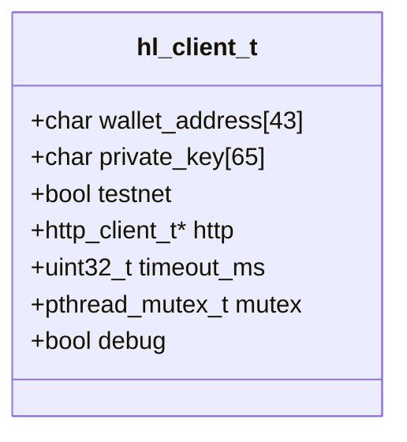
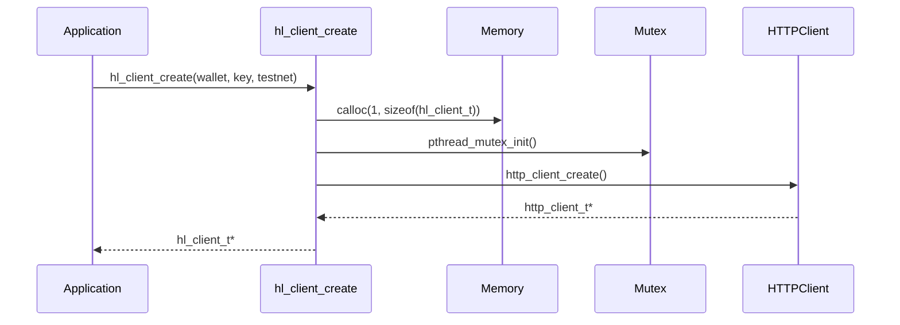
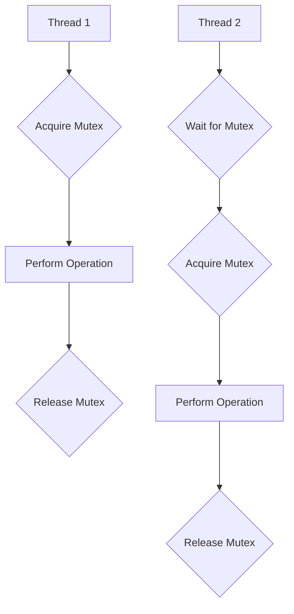
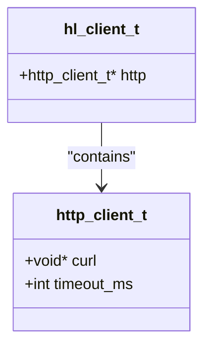
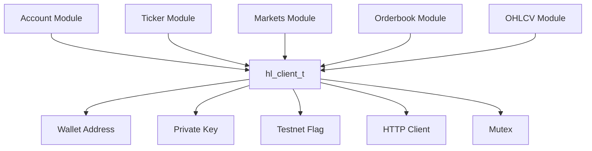
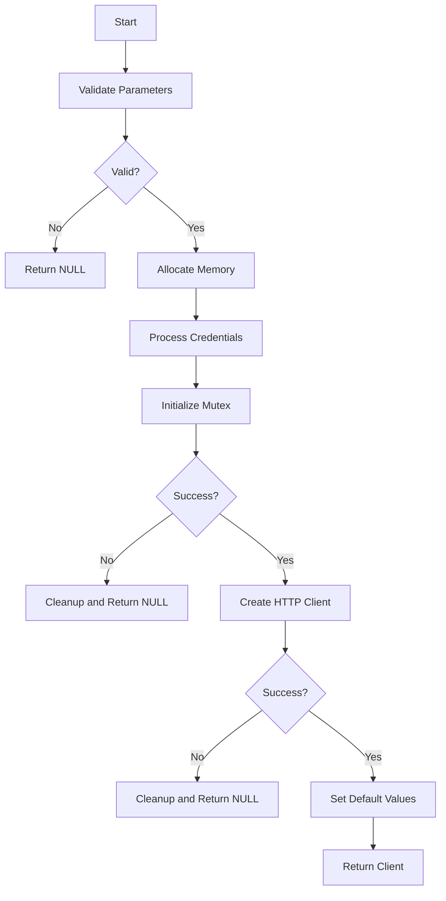

# Client Architecture

<cite>
**Referenced Files in This Document**   
- [src/client.c](file://src/client.c)
- [include/hl_client.h](file://include/hl_client.h)
- [include/hyperliquid.h](file://include/hyperliquid.h)
- [src/http/client.c](file://src/http/client.c)
- [examples/simple_ticker.c](file://examples/simple_ticker.c)
- [examples/simple_markets.c](file://examples/simple_markets.c)
- [examples/simple_orderbook.c](file://examples/simple_orderbook.c)
- [examples/simple_ohlcv.c](file://examples/simple_ohlcv.c)
</cite>

## Table of Contents
1. [Introduction](#introduction)
2. [Core Structure and Opaque Pointer Design](#core-structure-and-opaque-pointer-design)
3. [Client Lifecycle Management](#client-lifecycle-management)
4. [Thread Safety and Concurrency](#thread-safety-and-concurrency)
5. [Configuration and Credential Management](#configuration-and-credential-management)
6. [HTTP and WebSocket Connection Encapsulation](#http-and-websocket-connection-encapsulation)
7. [Dependency Hub for Module Interactions](#dependency-hub-for-module-interactions)
8. [Initialization Process](#initialization-process)
9. [Common Issues and Error Handling](#common-issues-and-error-handling)
10. [Performance Considerations](#performance-considerations)
11. [Code Examples](#code-examples)
12. [Conclusion](#conclusion)

## Introduction
The `hl_client_t` opaque pointer serves as the central coordination point for all operations within the hyperliquid-c library. This architectural design encapsulates the client's state, configuration, and connections, providing a clean interface for interacting with the Hyperliquid exchange. The client structure manages authentication credentials, HTTP and WebSocket connections, thread safety through pthread mutexes, and serves as the dependency hub for all module interactions. This document provides a comprehensive analysis of the client architecture, detailing its responsibilities, initialization process, lifecycle management, and performance characteristics.

**Section sources**
- [src/client.c](file://src/client.c#L34-L87)
- [include/hl_client.h](file://include/hl_client.h#L13-L13)

## Core Structure and Opaque Pointer Design
The `hl_client_t` is implemented as an opaque pointer, hiding its internal structure from external users while providing a stable API interface. This design pattern ensures encapsulation and allows for internal implementation changes without affecting the public API. The client structure contains essential fields for wallet address, private key, testnet flag, HTTP client handle, timeout settings, pthread mutex for thread safety, and debug flag.



**Diagram sources**
- [src/client.c](file://src/client.c#L20-L28)

**Section sources**
- [src/client.c](file://src/client.c#L20-L28)

## Client Lifecycle Management
The client lifecycle is managed through two primary functions: `hl_client_create` for initialization and `hl_client_destroy` for cleanup. The creation process validates input parameters, allocates memory, initializes the mutex, creates the HTTP client, and sets default configuration values. The destruction process ensures proper cleanup of all resources, including zeroing out the private key before freeing memory.



**Diagram sources**
- [src/client.c](file://src/client.c#L34-L87)
- [src/client.c](file://src/client.c#L89-L107)

**Section sources**
- [src/client.c](file://src/client.c#L34-L107)

## Thread Safety and Concurrency
Thread safety is implemented using pthread mutexes to protect shared resources and ensure data consistency in multi-threaded environments. The client structure includes a mutex that is initialized during creation and destroyed during cleanup. This mutex is used to synchronize access to the HTTP client and other shared resources, preventing race conditions and data corruption.



**Diagram sources**
- [src/client.c](file://src/client.c#L73-L75)
- [src/client.c](file://src/client.c#L115-L137)

**Section sources**
- [src/client.c](file://src/client.c#L23-L23)
- [src/client.c](file://src/client.c#L73-L75)
- [src/client.c](file://src/client.c#L81-L81)
- [src/client.c](file://src/client.c#L103-L103)
- [src/client.c](file://src/client.c#L115-L137)

## Configuration and Credential Management
The client manages configuration and credentials through dedicated fields and accessor functions. Wallet addresses and private keys are validated during initialization, with automatic stripping of the "0x" prefix if present. The testnet flag determines whether the client connects to the testnet or mainnet API endpoints. Configuration options such as timeout values are set with sensible defaults but can be modified using dedicated functions.

**Section sources**
- [src/client.c](file://src/client.c#L42-L65)
- [src/client.c](file://src/client.c#L77-L80)

## HTTP and WebSocket Connection Encapsulation
The client encapsulates HTTP and WebSocket connections, providing a unified interface for network operations. The HTTP client is created during initialization and destroyed during cleanup, ensuring proper resource management. The client provides accessor functions to retrieve the HTTP client handle, allowing other modules to perform HTTP operations while maintaining encapsulation.



**Diagram sources**
- [src/client.c](file://src/client.c#L25-L25)
- [include/hl_http.h](file://include/hl_http.h#L15-L18)

**Section sources**
- [src/client.c](file://src/client.c#L25-L25)
- [src/client.c](file://src/client.c#L85-L87)
- [src/client.c](file://src/client.c#L100-L102)
- [src/client.c](file://src/client.c#L189-L191)

## Dependency Hub for Module Interactions
The client serves as the central dependency hub for all module interactions, providing accessor functions that allow other modules to retrieve necessary components. This design promotes loose coupling between modules while ensuring they can access the shared client state and resources they need to function.



**Diagram sources**
- [src/client.c](file://src/client.c#L177-L195)

**Section sources**
- [src/client.c](file://src/client.c#L177-L195)

## Initialization Process
The client initialization process involves several critical steps: parameter validation, memory allocation, credential processing, mutex initialization, and HTTP client creation. The process begins with validating the wallet address format and private key length, ensuring they meet the required specifications. Memory is allocated using calloc to ensure zero-initialization of all fields.



**Diagram sources**
- [src/client.c](file://src/client.c#L34-L87)

**Section sources**
- [src/client.c](file://src/client.c#L34-L87)

## Common Issues and Error Handling
Common issues with client management include improper destruction leading to memory leaks and thread contention under high concurrency. The destruction function addresses memory leaks by properly cleaning up all allocated resources, including zeroing out the private key before freeing memory. Thread contention can occur when multiple threads attempt to access the client simultaneously, which is mitigated by the mutex-based synchronization.

**Section sources**
- [src/client.c](file://src/client.c#L89-L107)

## Performance Considerations
Performance considerations for the client architecture include connection reuse and lock contention. The HTTP client is created once during initialization and reused for all subsequent requests, reducing the overhead of establishing new connections. However, the global mutex can become a bottleneck under high concurrency, as all operations must acquire the lock before proceeding. This design prioritizes data consistency over maximum throughput.

**Section sources**
- [src/client.c](file://src/client.c#L85-L87)
- [src/client.c](file://src/client.c#L115-L137)

## Code Examples
The following examples demonstrate proper client instantiation and cleanup:

```c
// Create client
hl_client_t *client = hl_client_create(wallet_address, private_key, true);
if (!client) {
    // Handle error
}

// Use client for operations
// ...

// Destroy client
hl_client_destroy(client);
```

**Section sources**
- [examples/simple_ticker.c](file://examples/simple_ticker.c#L18-L103)
- [examples/simple_markets.c](file://examples/simple_markets.c#L18-L154)
- [examples/simple_orderbook.c](file://examples/simple_orderbook.c#L64-L194)
- [examples/simple_ohlcv.c](file://examples/simple_ohlcv.c#L75-L191)

## Conclusion
The `hl_client_t` opaque pointer serves as the central coordination point for all operations in the hyperliquid-c library, providing a robust and thread-safe foundation for interacting with the Hyperliquid exchange. Its design emphasizes encapsulation, proper resource management, and ease of use, while addressing critical concerns such as security, concurrency, and performance. The client's role as a dependency hub ensures that all modules can access the shared state and resources they need while maintaining loose coupling and separation of concerns.