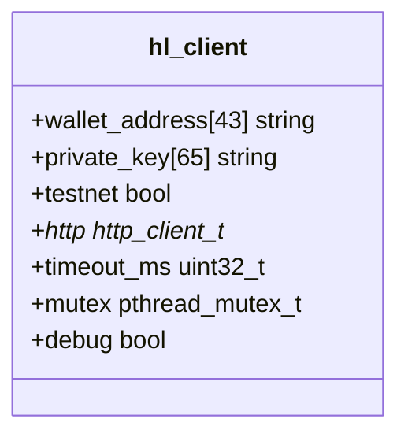
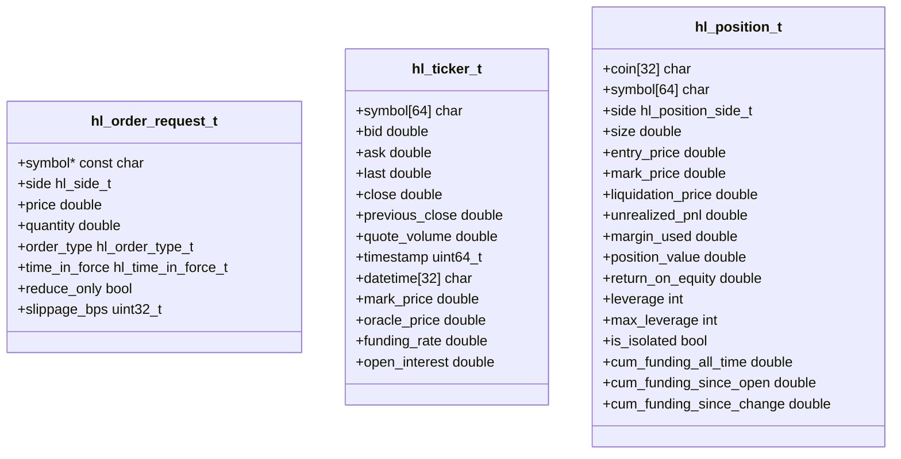
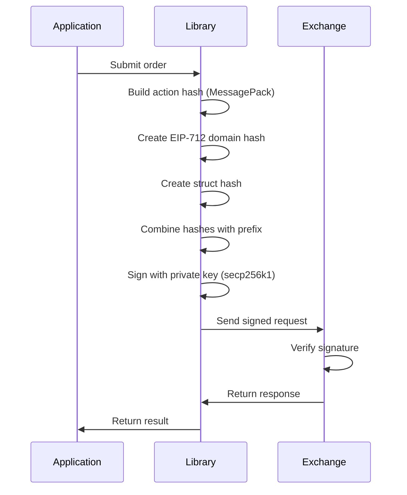
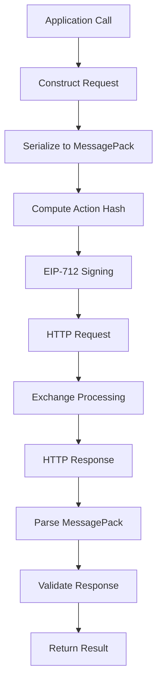

# Core Concepts

<cite>
**Referenced Files in This Document**   
- [hl_client.h](file://include/hl_client.h)
- [hl_types.h](file://include/hl_types.h)
- [client.c](file://src/client.c)
- [serialize.c](file://src/msgpack/serialize.c)
- [eip712.c](file://src/crypto/eip712.c)
</cite>

## Table of Contents
1. [Opaque Client Handle](#opaque-client-handle)
2. [Error Code Conventions](#error-code-conventions)
3. [Thread Safety Model](#thread-safety-model)
4. [Key Data Types](#key-data-types)
5. [Zero-Copy Design Philosophy](#zero-copy-design-philosophy)
6. [RAII-Like Resource Management](#raii-like-resource-management)
7. [EIP-712 Signing for Authentication](#eip-712-signing-for-authentication)
8. [MessagePack for Efficient Serialization](#messagepack-for-efficient-serialization)
9. [Public vs Internal Headers](#public-vs-internal-headers)
10. [Request-Response Lifecycle](#request-response-lifecycle)
11. [Memory Management Best Practices](#memory-management-best-practices)

## Opaque Client Handle

The `hl_client_t` opaque handle serves as the central interface for interacting with the Hyperliquid exchange. This handle encapsulates all necessary state, including authentication credentials, network clients, and configuration options. Users interact with the client through a well-defined API without direct access to its internal structure, promoting encapsulation and API stability.

The client is created using `hl_client_create()` and must be properly destroyed using `hl_client_destroy()` to release associated resources. The opaque nature of the handle allows for internal implementation changes without affecting the public API.

**Section sources**
- [hl_client.h](file://include/hl_client.h#L13)
- [client.c](file://src/client.c#L34-L87)

## Error Code Conventions

The library uses a consistent error code convention where negative integer values represent errors and zero indicates success. Each error code corresponds to a specific failure mode, such as `HL_ERROR_INVALID_PARAMS`, `HL_ERROR_NETWORK`, or `HL_ERROR_AUTH`. This convention enables straightforward error checking and handling across all API functions.

The `hl_error_string()` function provides human-readable descriptions of error codes, facilitating debugging and user feedback. This approach ensures predictable error handling patterns throughout the library.

**Section sources**
- [client.c](file://src/client.c#L153-L170)

## Thread Safety Model

The hyperliquid-c library implements thread safety using pthread mutexes to protect shared client state. Each `hl_client_t` instance contains a dedicated `pthread_mutex_t` that is initialized during client creation and destroyed during cleanup. This mutex protects access to the HTTP client and other shared resources.

All public API functions that access mutable client state acquire this mutex before execution and release it upon completion, ensuring that concurrent calls from multiple threads are properly serialized. This design allows the client to be safely used in multi-threaded applications without requiring external synchronization.

**Diagram sources**
- [client.c](file://src/client.c#L34-L45)

**Section sources**
- [client.c](file://src/client.c#L34-L107)

## Key Data Types

The library defines several key data structures in `hl_types.h` and related headers to represent exchange data and operations. These include:

- `hl_order_request_t`: Represents an order submission with fields for symbol, side, price, quantity, and order parameters
- `hl_ticker_t`: Contains market data including bid, ask, last price, volume, and timestamp information
- `hl_position_t`: Represents an open position with details like coin, size, entry price, and leverage

These structures follow a consistent naming and documentation convention, with descriptive field names and clear comments explaining their purpose and usage.

**Diagram sources**
- [hyperliquid.h](file://include/hyperliquid.h#L127-L136)
- [hl_ticker.h](file://include/hl_ticker.h#L26-L48)
- [hl_account.h](file://include/hl_account.h#L85-L108)

**Section sources**
- [hl_types.h](file://include/hl_types.h)
- [hyperliquid.h](file://include/hyperliquid.h#L127-L136)
- [hl_ticker.h](file://include/hl_ticker.h#L26-L48)
- [hl_account.h](file://include/hl_account.h#L85-L108)

## Zero-Copy Design Philosophy

The library adheres to a zero-copy design philosophy where possible, minimizing memory allocations and data copying during API operations. This is particularly evident in the MessagePack serialization implementation, where data is packed directly into buffers without intermediate representations.

By avoiding unnecessary memory allocations and copies, the library reduces overhead and improves performance, especially in high-frequency trading scenarios where latency is critical. This design also reduces memory fragmentation and garbage collection pressure in long-running applications.

**Section sources**
- [serialize.c](file://src/msgpack/serialize.c)

## RAII-Like Resource Management

The library implements an RAII-like pattern for resource management, where resources are acquired during client creation and automatically released during destruction. The `hl_client_create()` function allocates memory, initializes mutexes, and creates HTTP clients, while `hl_client_destroy()` ensures proper cleanup of all resources.

This pattern includes zeroing out sensitive data (like private keys) before freeing memory, providing an additional security layer against memory scraping attacks. The use of paired create/destroy functions ensures that resources are properly managed and prevents leaks.

**Section sources**
- [client.c](file://src/client.c#L89-L107)

## EIP-712 Signing for Authentication

Authentication with the Hyperliquid exchange is implemented using EIP-712 typed message signing, which provides a secure and standardized way to sign transactions off-chain. The library constructs structured data hashes using MessagePack serialization, then signs these hashes with the user's private key using secp256k1 ECDSA.

The signing process involves computing a domain separator hash, creating a message-specific struct hash, and combining these with a prefix to generate the final signing hash. This approach ensures that signatures are context-aware and resistant to replay attacks across different domains.

**Diagram sources**
- [serialize.c](file://src/msgpack/serialize.c#L133-L204)
- [eip712.c](file://src/crypto/eip712.c#L260-L295)

**Section sources**
- [eip712.c](file://src/crypto/eip712.c)

## MessagePack for Efficient Serialization

The library uses MessagePack for efficient binary serialization of API requests, providing a compact and fast alternative to JSON. MessagePack's binary format reduces payload size and parsing overhead, improving network performance and reducing latency.

The serialization implementation carefully orders dictionary keys alphabetically to ensure consistent hash generation, which is critical for signature verification. The library provides specialized packing functions for different message types (orders, cancels) that directly write to MessagePack buffers without intermediate representations.

**Section sources**
- [serialize.c](file://src/msgpack/serialize.c)

## Public vs Internal Headers

The library distinguishes between public and internal headers to maintain a clean API boundary. Public headers (e.g., `hl_client.h`, `hl_types.h`) contain the stable API that applications should use, while internal headers (e.g., `hl_crypto_internal.h`, `hl_internal.h`) contain implementation details that may change between versions.

This separation allows the library to evolve internal implementations without breaking client code. Applications should only include public headers and avoid relying on internal implementation details that are not part of the official API.

**Section sources**
- [hl_client.h](file://include/hl_client.h)
- [hl_crypto_internal.h](file://include/hl_crypto_internal.h)

## Request-Response Lifecycle

The request-response lifecycle begins with an API call that constructs a request structure, which is then serialized to MessagePack format. The library computes a cryptographic hash of the serialized data, signs it using EIP-712, and sends the signed request via HTTP to the exchange.

Upon receiving a response, the library parses the MessagePack data, validates the response structure, and returns the result to the caller. Error responses are translated into appropriate error codes following the library's error convention. Throughout this process, the client's mutex ensures thread safety for concurrent operations.

**Diagram sources**
- [client.c](file://src/client.c)
- [serialize.c](file://src/msgpack/serialize.c)

**Section sources**
- [client.c](file://src/client.c)
- [serialize.c](file://src/msgpack/serialize.c)

## Memory Management Best Practices

Proper memory management is critical when using the hyperliquid-c library. Applications must always pair `hl_client_create()` calls with corresponding `hl_client_destroy()` calls to prevent resource leaks. The destroy function handles cleanup of all internal resources, including memory, mutexes, and network clients.

Sensitive data like private keys are explicitly zeroed before memory is freed, protecting against potential exposure through memory dumps. Applications should avoid holding references to data returned by the library beyond the scope of the calling function unless explicitly documented as safe.

**Section sources**
- [client.c](file://src/client.c#L89-L107)