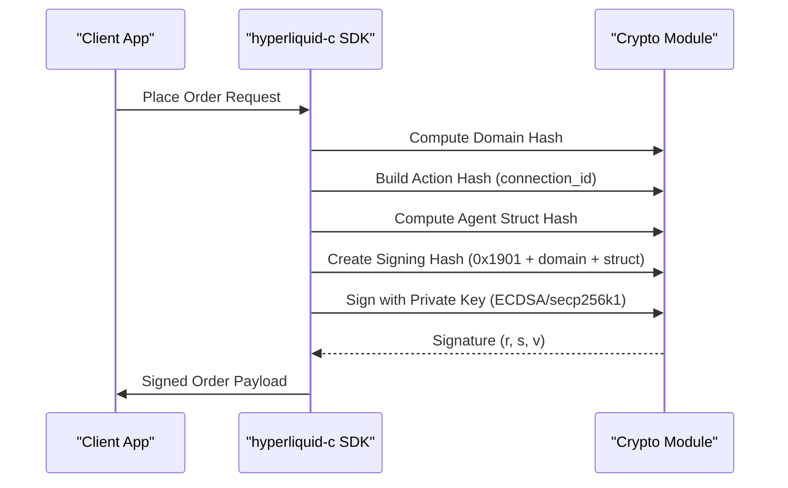
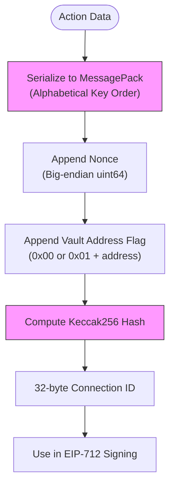
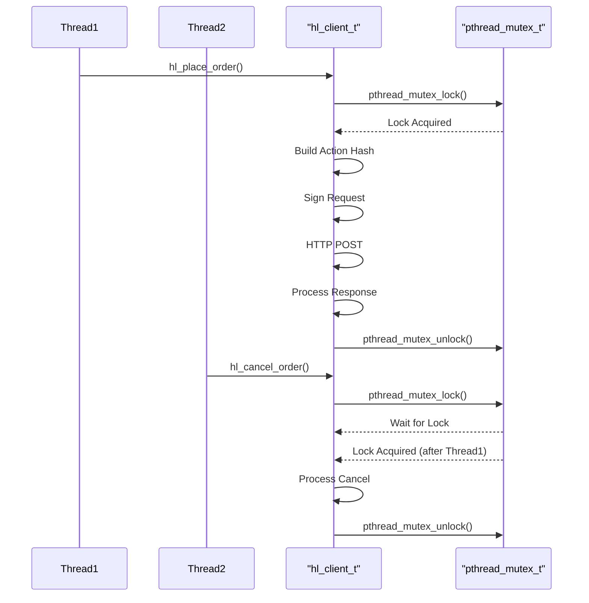
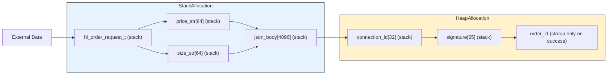
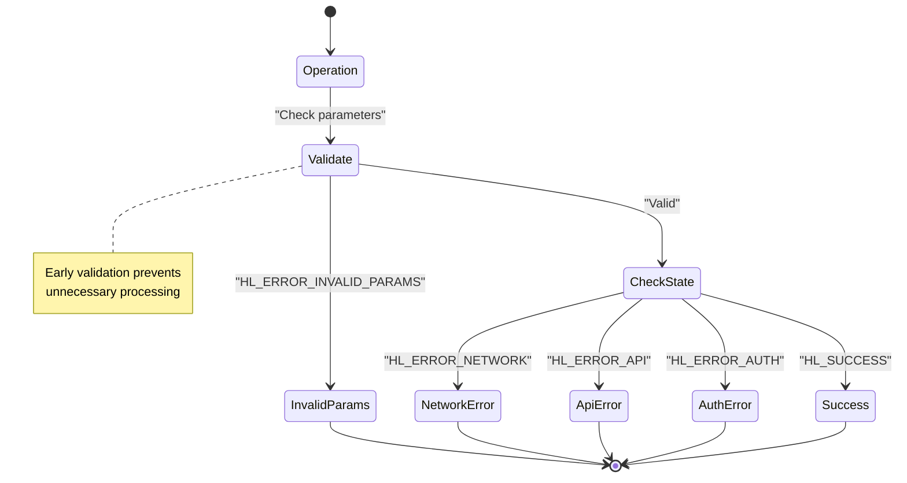
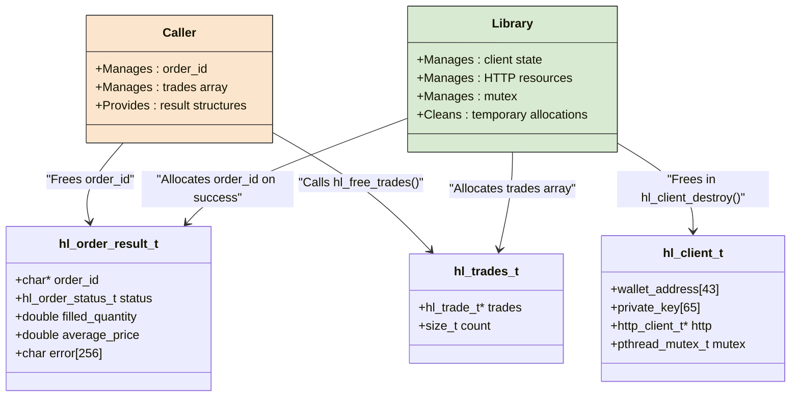

# Core Concepts

<cite>
**Referenced Files in This Document**   
- [hl_error.h](file://include/hl_error.h)
- [hl_msgpack.h](file://include/hl_msgpack.h)
- [serialize.c](file://src/msgpack/serialize.c)
- [hl_crypto_internal.h](file://include/hl_crypto_internal.h)
- [eip712.c](file://src/crypto/eip712.c)
- [hl_client.h](file://include/hl_client.h)
- [client.c](file://src/client.c)
- [trading_api.c](file://src/trading_api.c)
- [hyperliquid.h](file://include/hyperliquid.h)
</cite>

## Table of Contents
1. [EIP-712 Typed Data Signing](#eip-712-typed-data-signing)
2. [MessagePack Binary Serialization](#messagepack-binary-serialization)
3. [Thread Safety and Reentrancy](#thread-safety-and-reentrancy)
4. [Zero-Copy Design Philosophy](#zero-copy-design-philosophy)
5. [Error Handling System](#error-handling-system)
6. [Memory Management Responsibilities](#memory-management-responsibilities)

## EIP-712 Typed Data Signing

The hyperliquid-c library implements EIP-712 typed data signing for secure order authentication, ensuring that trading operations are cryptographically verified and tamper-proof. This mechanism leverages Ethereum's EIP-712 standard to create structured, human-readable data hashes that are signed using ECDSA on the secp256k1 curve.

Authentication is based on a two-layer hashing approach: first computing the domain separator hash, then the message-specific struct hash. The domain separator establishes the signing context with critical parameters including the domain name ("Exchange"), chain ID (1337), version ("1"), and verifying contract (zero address). This prevents replay attacks across different networks or applications.

For order operations, the library constructs an "Agent" struct containing the source identifier ("a" for mainnet, "b" for testnet) and a unique connection ID derived from MessagePack serialization of the action payload. The final signing hash is computed as `keccak256(0x1901 || domainSeparator || structHash)`, following the EIP-712 specification precisely.

The implementation uses libsecp256k1 for production-grade cryptographic operations, with deterministic signatures via RFC 6979 to prevent private key exposure. Recovery IDs are properly calculated and encoded in Ethereum format (v = recovery_id + 27). The signing process is abstracted through the `eip712_sign_agent` function, which orchestrates domain hash computation, struct hash generation, and final signature creation.

**Diagram sources**
- [eip712.c](file://src/crypto/eip712.c#L200-L297)
- [hl_crypto_internal.h](file://include/hl_crypto_internal.h#L80-L86)

**Section sources**
- [eip712.c](file://src/crypto/eip712.c#L1-L297)
- [hl_crypto_internal.h](file://include/hl_crypto_internal.h#L70-L86)

## MessagePack Binary Serialization

The library employs MessagePack binary serialization for efficient payload encoding and action hash computation, achieving byte-perfect compatibility with Hyperliquid's Go-based backend. This compact binary format minimizes network bandwidth usage while maintaining type safety and fast serialization/deserialization performance.

MessagePack encoding follows strict alphabetical key ordering requirements to ensure deterministic hashing across different implementations. The serialization process constructs flat maps with minimal overhead, using single-character keys for efficiency (e.g., "a" for asset ID, "b" for buy/sell flag). Complex types like orders are serialized as maps with fields ordered alphabetically: a, b, p, r, s, t.

The action hashing workflow begins with MessagePack serialization of the action payload (order or cancel), followed by appending the nonce (timestamp in milliseconds) as big-endian uint64, and optionally a vault address flag and value. The complete byte stream is then hashed using Keccak256 to produce the 32-byte connection ID used in EIP-712 signing.

Key serialization functions include `pack_order_action` for order batches and `pack_cancel_action` for cancellation requests, both ensuring consistent dictionary insertion order as required by the exchange API. The implementation uses the official MessagePack C library with custom packing routines to maintain precise control over the output format.

**Diagram sources**
- [serialize.c](file://src/msgpack/serialize.c#L100-L200)
- [hl_msgpack.h](file://include/hl_msgpack.h#L50-L100)

**Section sources**
- [serialize.c](file://src/msgpack/serialize.c#L1-L234)
- [hl_msgpack.h](file://include/hl_msgpack.h#L1-L120)

## Thread Safety and Reentrancy

The hyperliquid-c library provides thread safety guarantees through explicit mutex protection of shared client state, enabling safe concurrent access from multiple threads. Each client instance contains a pthread mutex that protects critical sections involving HTTP communication, cryptographic operations, and state modifications.

The implementation follows a consistent pattern of mutex acquisition before any operation that accesses shared resources, particularly around the HTTP request lifecycle and cryptographic signing. In `hl_place_order` and `hl_cancel_order`, the mutex is locked for the entire duration of the operation, from action hash generation through signature creation to HTTP transmission, preventing race conditions when multiple threads use the same client.

Reentrancy is supported within the constraints of the mutex-based locking strategy. While the library does not support true asynchronous reentrancy (nested calls from signal handlers), it allows sequential operations from different threads by queuing access to the shared client state. This design prioritizes correctness over maximum concurrency, ensuring that each operation completes atomically.

The thread safety model assumes that client creation and destruction occur in a single-threaded context, while subsequent operations (order placement, cancellation, etc.) can be safely called from multiple threads. This balances performance with safety, avoiding the complexity of fully lock-free data structures while preventing common concurrency bugs.

**Diagram sources**
- [client.c](file://src/client.c#L50-L100)
- [trading_api.c](file://src/trading_api.c#L100-L150)

**Section sources**
- [client.c](file://src/client.c#L1-L197)
- [trading_api.c](file://src/trading_api.c#L1-L340)

## Zero-Copy Design Philosophy

The library adheres to a zero-copy design philosophy that minimizes memory allocations and data copying throughout the request lifecycle, optimizing performance and reducing heap fragmentation. This approach prioritizes stack allocation, static buffers, and direct references over dynamic memory allocation whenever possible.

Critical data structures like `hl_order_t` and `hl_cancel_t` are designed to hold pointers to string data rather than owning copies, allowing callers to provide string literals or stack-allocated buffers. The action hash computation uses stack-allocated buffers for intermediate data, with only temporary heap allocation for the concatenated message before hashing.

String formatting operations use fixed-size buffers on the stack (e.g., `char price_str[64]`) rather than dynamically allocated strings, eliminating allocation overhead for transient data. The HTTP request body is constructed directly into a stack buffer using `snprintf`, avoiding intermediate string objects.

The design avoids unnecessary data duplication by passing references through the call chain. For example, the wallet address and private key are stored once in the client structure and referenced directly during signing operations, rather than being copied to temporary buffers.

This philosophy extends to the API design, where output parameters are provided by the caller (e.g., `hl_order_result_t *result`) rather than allocated by the library, giving the caller control over memory management and enabling stack allocation of result structures.

**Diagram sources**
- [trading_api.c](file://src/trading_api.c#L150-L250)
- [client.c](file://src/client.c#L100-L150)

**Section sources**
- [trading_api.c](file://src/trading_api.c#L1-L340)
- [client.c](file://src/client.c#L1-L197)

## Error Handling System

The library implements a comprehensive error handling system centered around the `hl_error_t` enum, providing clear error codes and descriptive messages for troubleshooting. Errors are propagated through return values rather than exceptions, following C programming conventions.

The `hl_error_t` enum defines 16 distinct error conditions ranging from `HL_SUCCESS` (0) to `HL_ERROR_PARSE` (-15), covering validation, network, API, authentication, and system-level failures. Each error code corresponds to a specific failure mode, enabling precise error handling in client applications.

Error information is conveyed through both return codes and optional output parameters. Functions like `hl_place_order` and `hl_cancel_order` return `hl_error_t` while also populating error message fields in result structures (e.g., `result->error`). This dual approach allows for both programmatic error handling and user-facing error display.

The `hl_error_string` function provides human-readable descriptions for each error code, facilitating debugging and logging. The system distinguishes between recoverable errors (e.g., `HL_ERROR_NETWORK`, `HL_ERROR_TIMEOUT`) and unrecoverable errors (e.g., `HL_ERROR_INVALID_PARAMS`, `HL_ERROR_SIGNATURE`), guiding appropriate retry strategies.

Error handling is consistent across the API, with validation performed early in function execution and errors returned immediately upon detection. This fail-fast approach minimizes resource consumption for invalid operations and provides clear feedback to callers.

**Diagram sources**
- [hl_error.h](file://include/hl_error.h#L1-L37)
- [hyperliquid.h](file://include/hyperliquid.h#L500-L550)

**Section sources**
- [hl_error.h](file://include/hl_error.h#L1-L37)
- [hyperliquid.h](file://include/hyperliquid.h#L500-L550)

## Memory Management Responsibilities

The library follows a clear ownership model for memory management, delineating responsibilities between caller and library to prevent leaks and double-frees. This model combines automatic cleanup of internal state with explicit caller responsibility for certain allocated resources.

The library owns all internal client state, automatically freeing resources in `hl_client_destroy`. This includes the HTTP client handle, mutex, and any internal data structures. The private key is securely zeroed before client memory is freed, protecting sensitive information.

Callers are responsible for freeing specific allocated outputs, particularly strings returned through output parameters. For example, `hl_order_result_t.order_id` is allocated with `strdup` on successful order placement and must be freed by the caller using `free`. Similarly, arrays of trades or orders returned by fetch functions must be freed using dedicated cleanup functions like `hl_free_trades`.

The API design minimizes heap allocation by using output parameters for most data, allowing callers to provide stack-allocated structures. When allocation is necessary, the library clearly documents ownership transfer through function documentation and naming conventions.

Temporary allocations during request processing (e.g., for action hashing) are managed internally and automatically cleaned up, even in error conditions, using cleanup patterns with `goto` statements to ensure proper resource release.

**Diagram sources**
- [client.c](file://src/client.c#L150-L197)
- [hyperliquid.h](file://include/hyperliquid.h#L400-L450)
- [trading_api.c](file://src/trading_api.c#L250-L300)

**Section sources**
- [client.c](file://src/client.c#L1-L197)
- [hyperliquid.h](file://include/hyperliquid.h#L1-L617)
- [trading_api.c](file://src/trading_api.c#L1-L340)