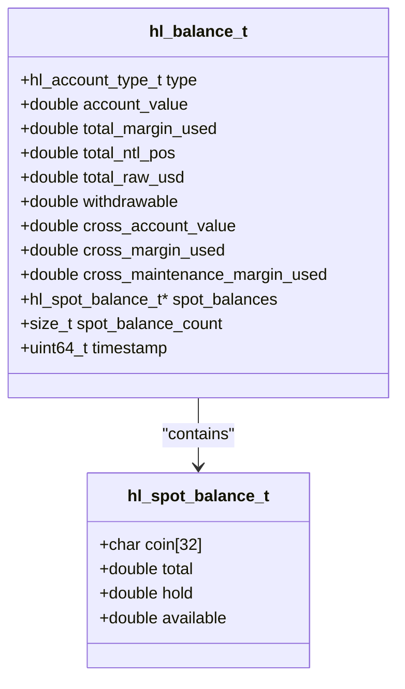
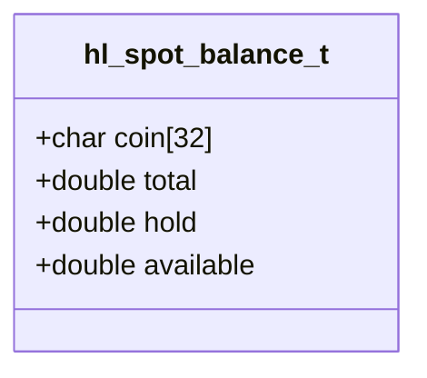
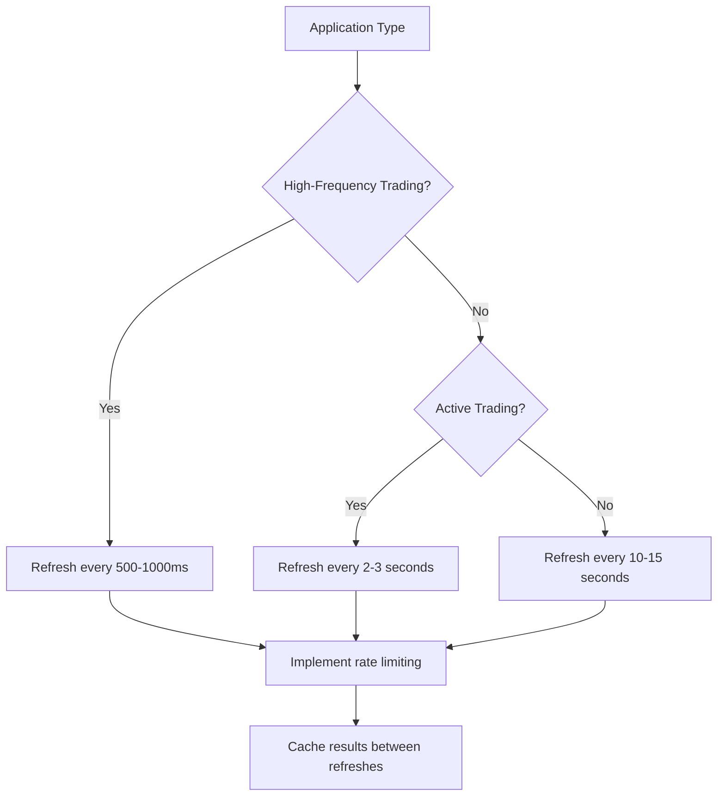
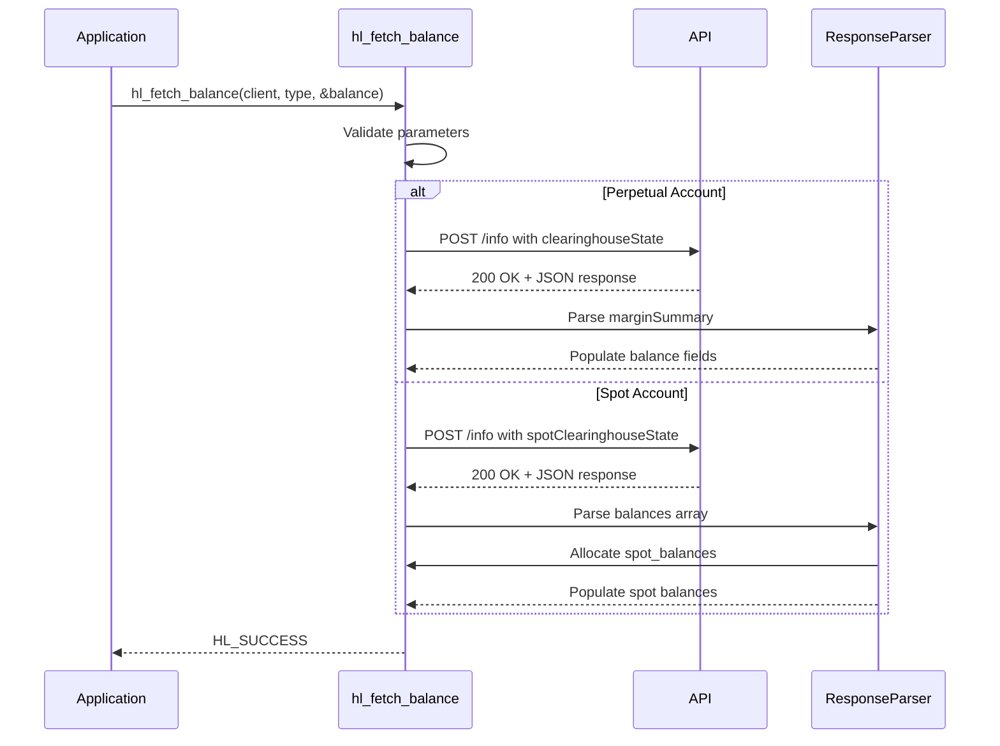
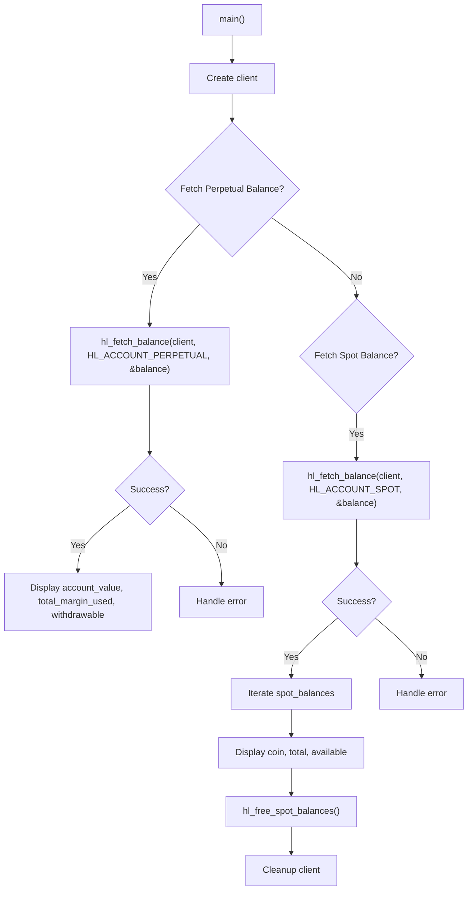

# Balance Data Model

<cite>
**Referenced Files in This Document**   
- [hl_account.h](file://include/hl_account.h)
- [account.c](file://src/account.c)
- [simple_balance.c](file://examples/simple_balance.c)
- [types.c](file://src/types.c)
</cite>

## Table of Contents
1. [Introduction](#introduction)
2. [Core Data Structure](#core-data-structure)
3. [Account Type and Conditional Fields](#account-type-and-conditional-fields)
4. [Perpetual Account Metrics](#perpetual-account-metrics)
5. [Spot Balances Management](#spot-balances-management)
6. [Cross-Margin vs Isolated Margin](#cross-margin-vs-isolated-margin)
7. [Memory Ownership and Resource Management](#memory-ownership-and-resource-management)
8. [Timestamp and Data Freshness](#timestamp-and-data-freshness)
9. [Balance Retrieval Workflow](#balance-retrieval-workflow)
10. [Available Margin Calculation](#available-margin-calculation)
11. [Example Usage](#example-usage)

## Introduction
The `hl_balance_t` data model provides a unified representation of account balance and margin information for the Hyperliquid C SDK. This document details the structure's fields, their semantic meaning, memory management requirements, and usage patterns for both perpetual and spot trading accounts. The model supports real-time balance tracking, margin analysis, and withdrawal eligibility calculations.

## Core Data Structure

The `hl_balance_t` structure encapsulates comprehensive account state information including both perpetual and spot metrics. It serves as the primary interface for balance queries in the Hyperliquid C SDK.



**Diagram sources**
- [hl_account.h](file://include/hl_account.h#L52-L72)
- [hl_account.h](file://include/hl_account.h#L42-L47)

**Section sources**
- [hl_account.h](file://include/hl_account.h#L52-L72)

## Account Type and Conditional Fields

The `hl_balance_t` structure adapts its field usage based on the account type specified in the `type` field. This polymorphic behavior enables a single interface for both perpetual and spot account queries.

### Account Type Enumeration
The `hl_account_type_t` enum defines two distinct account types:
- `HL_ACCOUNT_PERPETUAL`: For perpetual/swap trading accounts
- `HL_ACCOUNT_SPOT`: For spot trading accounts

### Conditional Field Presence
The presence and validity of certain fields depend on the account type:

| Field | Perpetual Account | Spot Account |
|-------|------------------|-------------|
| `spot_balances` | NULL | Pointer to allocated array |
| `spot_balance_count` | 0 | Number of spot balances |
| `account_value` | Valid | 0.0 |
| `total_margin_used` | Valid | 0.0 |
| `withdrawable` | Valid | 0.0 |

When retrieving a spot balance, perpetual-specific fields are explicitly reset to zero, while spot balances are populated. Conversely, perpetual balance queries set `spot_balances` to NULL and `spot_balance_count` to 0.

**Section sources**
- [hl_account.h](file://include/hl_account.h#L52-L72)
- [account.c](file://src/account.c#L249-L261)

## Perpetual Account Metrics

For perpetual accounts, the `hl_balance_t` structure provides comprehensive margin trading metrics that reflect the account's derivatives position status.

### Key Perpetual Fields
- **`account_value`**: Total account equity denominated in USDC, representing the sum of all positions' mark values plus cash balance
- **`total_margin_used`**: Current margin allocated to open positions
- **`total_ntl_pos`**: Total notional value of all open positions
- **`total_raw_usd`**: Raw USD value across all positions before margin calculations
- **`withdrawable`**: Amount available for withdrawal without triggering liquidation

### Cross-Margin Summary
The structure includes cross-margin specific metrics that provide insight into the account's overall margin health:
- **`cross_account_value`**: Account value under cross-margin mode
- **`cross_margin_used`**: Total margin consumed in cross-margin mode
- **`cross_maintenance_margin_used`**: Maintenance margin requirement for all positions

These metrics are populated from the `crossMarginSummary` field in the API response and provide critical information for risk management.

**Section sources**
- [hl_account.h](file://include/hl_account.h#L52-L72)
- [account.c](file://src/account.c#L30-L144)

## Spot Balances Management

The spot balance functionality provides detailed information about cryptocurrency holdings in the spot wallet.

### Spot Balance Structure
The `hl_spot_balance_t` structure represents individual coin balances:



- **`coin`**: Coin symbol (e.g., "USDC", "BTC")
- **`total`**: Total balance including held amounts
- **`hold`**: Amount currently on hold in open orders
- **`available`**: Calculated as `total - hold`, representing immediately tradable balance

### Conditional Array Allocation
The `spot_balances` array is conditionally allocated only when:
1. The account type is `HL_ACCOUNT_SPOT`
2. The user has non-zero balances in one or more coins
3. The API response contains a valid balances array

If no spot balances exist, `spot_balances` is set to NULL and `spot_balance_count` to 0.

**Section sources**
- [hl_account.h](file://include/hl_account.h#L42-L47)
- [account.c](file://src/account.c#L149-L244)

## Cross-Margin vs Isolated Margin

The `hl_balance_t` structure primarily reflects cross-margin metrics, but understanding the distinction between margin modes is essential for proper interpretation.

### Cross-Margin Calculations
Cross-margin uses the entire account equity as potential collateral. The metrics in `hl_balance_t` reflect this mode:
- **Account Value**: Sum of all positions' mark values plus cash balance
- **Maintenance Margin**: Aggregate maintenance requirements across all positions
- **Margin Used**: Total initial margin for all open positions

### Isolated Margin Context
While the balance structure doesn't directly represent isolated margin positions, individual position data (available through other APIs) contains isolated margin flags. In isolated mode:
- Each position has dedicated margin separate from other positions
- Position-specific leverage settings apply
- Liquidation risk is contained to individual positions

The cross-margin metrics in `hl_balance_t` still reflect the overall account state, but risk assessment should consider both cross and isolated positions when present.

**Section sources**
- [hl_account.h](file://include/hl_account.h#L52-L72)
- [account.c](file://src/account.c#L30-L144)

## Memory Ownership and Resource Management

Proper memory management is critical when working with the `hl_balance_t` structure, particularly regarding the `spot_balances` array.

### Memory Allocation Rules
- **Perpetual balances**: No additional memory allocation; all data is contained within the `hl_balance_t` structure
- **Spot balances**: Dynamic allocation occurs when `fetch_spot_balance` populates the `spot_balances` array using `calloc`

### Resource Deallocation
The caller is responsible for freeing spot balance memory using the provided utility function:

```c
if (balance.spot_balances) {
    hl_free_spot_balances(balance.spot_balances, balance.spot_balance_count);
}
```

The `hl_free_spot_balances` function safely handles NULL pointers and uses standard `free()` to release the allocated memory. The `count` parameter is accepted but not used in the current implementation.

Failure to call `hl_free_spot_balances` when `spot_balances` is non-NULL will result in memory leaks.

**Section sources**
- [hl_account.h](file://include/hl_account.h#L146-L146)
- [account.c](file://src/account.c#L266-L271)

## Timestamp and Data Freshness

The `hl_balance_t` structure includes timestamp information to assess data validity and implement appropriate refresh strategies.

### Timestamp Field
- **`timestamp`**: Response timestamp in milliseconds since Unix epoch (extracted from API response "time" field)

### Validity Considerations
Balance data should be considered stale after:
- 1-2 seconds for high-frequency trading applications
- 5-10 seconds for general trading monitoring
- 30+ seconds for basic account overview

### Refresh Strategies
Recommended refresh patterns based on use case:



The timestamp enables clients to verify data freshness and avoid acting on stale balance information, which could lead to order rejections or miscalculated risk exposure.

**Section sources**
- [hl_account.h](file://include/hl_account.h#L72-L72)
- [account.c](file://src/account.c#L138-L140)
- [types.c](file://src/types.c#L68-L89)

## Balance Retrieval Workflow

The process of retrieving account balance follows a consistent workflow across account types.



The `hl_fetch_balance` function serves as the entry point, routing to either `fetch_perpetual_balance` or `fetch_spot_balance` based on the requested account type. Both functions follow similar patterns:
1. Validate input parameters
2. Construct appropriate API request
3. Execute HTTP POST to `/info` endpoint
4. Parse JSON response
5. Populate the balance structure
6. Return status code

Error handling is comprehensive, covering network issues, API errors, and parsing failures.

**Diagram sources**
- [account.c](file://src/account.c#L249-L261)
- [account.c](file://src/account.c#L30-L144)
- [account.c](file://src/account.c#L149-L244)

**Section sources**
- [account.c](file://src/account.c#L249-L261)

## Available Margin Calculation

While not directly provided in the balance structure, available margin can be derived from the available fields.

### Available Margin Formula
For cross-margin accounts:
```
available_margin = account_value - total_margin_used
```

This represents the additional margin available for opening new positions or adding to existing ones.

### Withdrawable Amount
The `withdrawable` field provides a more conservative measure of available funds, representing the amount that can be withdrawn without violating margin requirements:

```
withdrawable ≤ available_margin
```

The withdrawable amount considers maintenance margin requirements and is typically less than or equal to the available margin.

### Maintenance Margin Context
The `cross_maintenance_margin_used` field indicates the total maintenance margin requirement across all positions. This is critical for understanding the buffer between current margin usage and liquidation thresholds.

**Section sources**
- [hl_account.h](file://include/hl_account.h#L52-L72)
- [account.c](file://src/account.c#L30-L144)

## Example Usage

The `simple_balance.c` example demonstrates proper usage of the balance API.



Key implementation patterns from the example:
- Initialize balance structure to zero before use
- Check return value of `hl_fetch_balance` for error conditions
- Format output with appropriate precision for financial values
- Free spot balances when present
- Destroy client instance to release resources

The example also demonstrates error handling best practices, including displaying human-readable error messages using `hl_error_string`.

**Section sources**
- [simple_balance.c](file://examples/simple_balance.c#L0-L87)
- [account.c](file://src/account.c#L249-L261)
- [hl_account.h](file://include/hl_account.h#L134-L138)