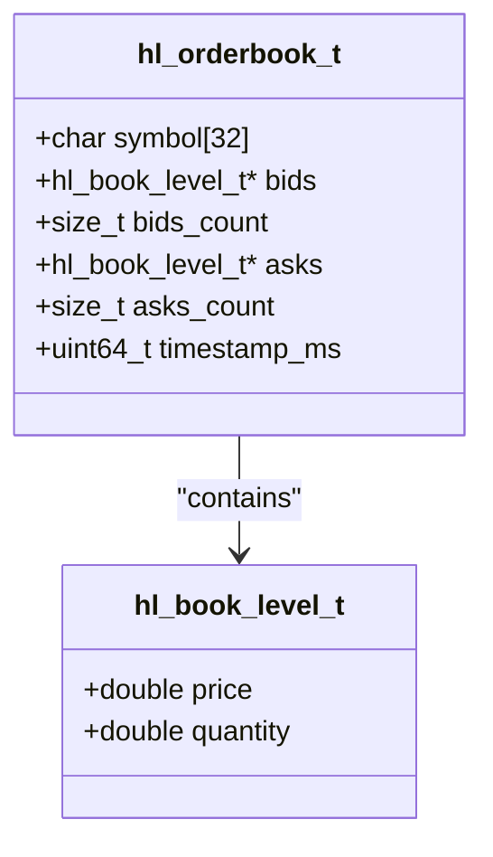

# Data Models

<cite>
**Referenced Files in This Document**   
- [hl_types.h](file://include/hl_types.h)
- [hyperliquid.h](file://include/hyperliquid.h)
- [hl_account.h](file://include/hl_account.h)
- [hl_ticker.h](file://include/hl_ticker.h)
- [hl_orderbook.h](file://include/hl_orderbook.h)
- [ticker.c](file://src/ticker.c)
- [orderbook.c](file://src/orderbook.c)
</cite>

## Table of Contents
1. [Introduction](#introduction)
2. [Core Data Models](#core-data-models)
3. [Order Request Model](#order-request-model)
4. [Order Result Model](#order-result-model)
5. [Ticker Model](#ticker-model)
6. [Orderbook Model](#orderbook-model)
7. [Position Model](#position-model)
8. [Balance Model](#balance-model)
9. [Data Flow and Population](#data-flow-and-population)
10. [Zero-Copy Design Principle](#zero-copy-design-principle)
11. [Memory Ownership and Lifetime](#memory-ownership-and-lifetime)
12. [Common Issues and Best Practices](#common-issues-and-best-practices)

## Introduction
This document provides comprehensive documentation for the core data models used throughout the hyperliquid-c library. The models serve as the foundation for interacting with the Hyperliquid exchange API, enabling trading operations, market data retrieval, and account management. These structures are designed with CCXT compatibility in mind while maintaining native C performance characteristics. The document focuses on key structs defined in hl_types.h and related headers, detailing their field semantics, data types, and usage patterns. Special attention is given to the zero-copy design principle that underpins the library's efficiency, along with memory ownership rules and best practices for safe data access.

## Core Data Models
The hyperliquid-c library implements a comprehensive set of data models that represent various aspects of cryptocurrency trading on the Hyperliquid exchange. These models are structured to provide both low-level access to exchange data and high-level abstractions compatible with the CCXT standard. The core models include order requests and results, market tickers, order books, positions, and account balances. Each model is carefully designed with appropriate data types and field constraints to ensure accuracy and reliability in trading operations. The models are interconnected through a consistent naming convention and data flow pattern, enabling seamless transitions between different aspects of the trading workflow. These structures are optimized for performance with minimal memory overhead and efficient data access patterns.

**Section sources**
- [hl_types.h](file://include/hl_types.h#L1-L145)
- [hyperliquid.h](file://include/hyperliquid.h#L1-L689)

## Order Request Model
The hl_order_request_t structure represents a request to place an order on the Hyperliquid exchange. This model contains all necessary parameters for defining a trading order, including the trading symbol, order side (buy or sell), price, quantity, order type (limit or market), time in force, reduce-only flag, and slippage tolerance for market orders. The symbol field is a const char pointer that references the trading pair, following the exchange's naming convention. The price field uses double precision floating-point representation to accommodate the wide range of cryptocurrency prices with sufficient precision. For market orders, the price field should be set to 0. The quantity field specifies the amount of the base asset to trade, also represented as a double. The time_in_force field determines how the order should be handled if it cannot be immediately filled, with options including Good Till Cancel (GTC), Immediate Or Cancel (IOC), and Add Liquidity Only (ALO). The reduce_only flag indicates whether the order should only reduce an existing position, preventing it from increasing position size. The slippage_bps field specifies the maximum acceptable slippage in basis points for market orders, providing control over execution quality.

**Section sources**
- [hyperliquid.h](file://include/hyperliquid.h#L127-L136)

## Order Result Model
The hl_order_result_t structure captures the outcome of an order placement operation. This model includes the order ID assigned by the exchange, the current order status, filled quantity, average fill price, and any error message if the operation failed. The order_id field is a dynamically allocated string that must be freed by the caller, containing the unique identifier assigned by the exchange. The status field uses an enumeration to represent the order's current state, including open, filled, partially filled, cancelled, and rejected. The filled_quantity field indicates how much of the requested quantity has been executed, represented as a double for precision. The average_price field provides the weighted average price at which the filled portion was executed. The error field is a fixed-size character array (256 bytes) that contains a human-readable error message if the order placement was unsuccessful. This model enables applications to track order execution and respond appropriately to different outcomes, such as partial fills or rejections due to insufficient balance or market conditions.

**Section sources**
- [hyperliquid.h](file://include/hyperliquid.h#L139-L145)

## Ticker Model
The hl_ticker_t structure provides comprehensive market data for a specific trading symbol. This model includes bid and ask prices, last traded price, 24-hour volume metrics, price change percentages, and timestamp information. The symbol field is a fixed-size character array (64 bytes) that identifies the trading pair. Price fields use double precision floating-point values to maintain accuracy across different price ranges. The bid and ask fields represent the best available prices for buying and selling, respectively. The last_price field indicates the most recent transaction price. The 24-hour metrics include high_24h and low_24h for price range, volume_24h for base asset volume, quote_volume for quote asset volume, and change_24h for percentage change. Timestamp information is provided in both millisecond precision (timestamp) and ISO 8601 format (datetime). For perpetual contracts, additional fields include mark_price (the fair price used for settlement), oracle_price (the reference price from external oracles), funding_rate (the current funding rate for perpetuals), and open_interest (the total value of open positions). The ticker data is populated from API responses and can be retrieved for individual symbols or in bulk for multiple symbols.

**Section sources**
- [hyperliquid.h](file://include/hyperliquid.h#L168-L188)
- [hl_ticker.h](file://include/hl_ticker.h#L26-L48)

## Orderbook Model
The hl_orderbook_t structure represents a snapshot of the order book for a specific trading symbol, containing bid and ask levels with their corresponding prices and quantities. This model includes a symbol field (32 bytes) to identify the trading pair, pointers to arrays of bid and ask levels (hl_book_level_t), count fields for the number of bid and ask levels, and a timestamp in milliseconds. The hl_book_level_t structure contains price and quantity fields, both represented as double precision floating-point values. Bids are sorted in descending order by price (highest first), while asks are sorted in ascending order (lowest first). The order book data is typically limited to a specified depth to reduce bandwidth and memory usage, though the full order book can be requested. The timestamp_ms field provides millisecond-precision timing for the snapshot, enabling applications to track market changes over time. The order book is populated from Level 2 market data API responses, with each level parsed from JSON arrays containing price and size information. Utility functions are provided to access the best bid and ask prices, calculate the spread, and sum volumes at various depths.

**Diagram sources**
- [hyperliquid.h](file://include/hyperliquid.h#L197-L204)
- [hl_orderbook.h](file://include/hl_orderbook.h#L39-L39)

**Section sources**
- [hyperliquid.h](file://include/hyperliquid.h#L191-L194)
- [hyperliquid.h](file://include/hyperliquid.h#L197-L204)

## Position Model
The hl_position_t structure represents an open position in a trading account, containing detailed information about the position's characteristics and performance. This model includes the coin symbol and market symbol, position side (long or short), size (absolute value of the position), entry_price (average price at which the position was established), mark_price (current mark price for valuation), and liquidation_price (price at which the position would be liquidated). Additional fields include unrealized_pnl (profit and loss not yet realized), margin_used (margin allocated to the position), position_value (notional value of the position), and return_on_equity (ROE percentage). The model also tracks leverage information with current leverage and maximum allowed leverage fields. The is_isolated flag indicates whether the position uses isolated margin mode. For funding calculations, the model includes cumulative funding metrics since the position was opened, since the last funding payment, and since the last funding rate change. This comprehensive structure enables applications to monitor position risk, calculate potential liquidation scenarios, and manage position adjustments effectively.

**Section sources**
- [hl_account.h](file://include/hl_account.h#L85-L108)

## Balance Model
The hl_balance_t structure provides a comprehensive view of an account's financial state, with different fields depending on the account type (perpetual or spot). For perpetual accounts, the model includes account_value (total account value in USDC), total_margin_used (margin consumed by open positions), total_ntl_pos (total notional position value), total_raw_usd (total raw USD value), and withdrawable (amount available for withdrawal). Cross-margin summary fields include cross_account_value, cross_margin_used, and cross_maintenance_margin_used. For spot accounts, the model includes a pointer to an array of spot_balances (hl_spot_balance_t) and a count of the number of balances. Each hl_spot_balance_t contains the coin symbol, total balance, hold amount (funds in open orders), and available balance (total minus hold). The timestamp field provides the response timestamp in milliseconds. This structure enables applications to monitor account health, calculate available margin, and manage fund transfers between different account types. The balance data is typically retrieved through API calls that return the current state of the account, with spot balances requiring additional memory management as they are dynamically allocated.

**Section sources**
- [hl_account.h](file://include/hl_account.h#L52-L72)

## Data Flow and Population
The data models in the hyperliquid-c library are populated through a consistent process that begins with API requests and ends with structured data available to the application. For ticker data, the hl_get_ticker function in ticker.c initiates a request to the exchange's info endpoint with a "metaAndAssetCtxs" type payload. The response is parsed using cJSON, with market data extracted from the universe and contexts arrays. The parse_ticker_from_market function then maps the raw market data to the hl_ticker_t structure, setting prices, volumes, and timestamps. For order book data, the hl_fetch_order_book function in orderbook.c makes a request to the info endpoint with an "l2Book" type payload, specifying the coin or asset ID. The response contains a levels array with bid and ask data, which is parsed by parse_orderbook_levels and parse_orderbook_level functions. These functions convert JSON string representations of prices and sizes into double values and populate the hl_orderbook_t structure. The symbol is copied directly, and the timestamp is extracted from the response or set to the current time as a fallback. This data flow ensures that models are consistently populated with accurate exchange data while handling potential parsing errors and network issues.

**Section sources**
- [ticker.c](file://src/ticker.c#L188-L213)
- [orderbook.c](file://src/orderbook.c#L102-L215)

## Zero-Copy Design Principle
The hyperliquid-c library employs a zero-copy design principle to minimize memory allocations and improve performance. This approach ensures that data is referenced directly from parsed buffers rather than being copied into new memory locations. When JSON responses are received from the exchange API, they are parsed in place, and string fields in data models reference substrings within the original response buffer when possible. For example, the symbol field in hl_ticker_t and hl_orderbook_t is populated using strncpy from the parsed JSON data, avoiding dynamic allocation for fixed-size string fields. Numeric values are converted from string representations in the JSON response using functions like atof and strtoull, but the conversion happens in place without intermediate buffers. This design reduces memory fragmentation and allocation overhead, which is critical for high-frequency trading applications. The zero-copy principle extends to function parameters, where const char pointers are used for input strings to avoid unnecessary duplication. However, this approach requires careful attention to memory lifetime and ownership, as the validity of referenced data depends on the lifespan of the original response buffer.

**Section sources**
- [ticker.c](file://src/ticker.c#L0-L214)
- [orderbook.c](file://src/orderbook.c#L0-L318)

## Memory Ownership and Lifetime
Memory ownership and lifetime management are critical aspects of the hyperliquid-c library's data models. The library follows a clear convention where the caller is responsible for allocating memory for output structures and the library populates these pre-allocated structures. For example, when calling hl_get_ticker or hl_fetch_order_book, the caller must provide a pointer to an already-allocated hl_ticker_t or hl_orderbook_t structure. The library then fills in the fields of this structure without allocating additional memory for the structure itself. However, some fields require dynamic allocation: the order_id field in hl_order_result_t is a dynamically allocated string that must be freed by the caller, and collection types like hl_positions_t contain pointers to dynamically allocated arrays that must be freed using appropriate cleanup functions (e.g., hl_free_positions). The hl_free_orderbook function demonstrates proper cleanup of dynamically allocated order book levels. Applications must follow the library's memory management conventions to avoid leaks and dangling pointers. The general rule is that if a function documentation specifies that the caller must free a field or structure, this responsibility must be honored. Temporary buffers used during JSON parsing are managed internally by the library and do not require intervention from the caller.

**Section sources**
- [orderbook.c](file://src/orderbook.c#L217-L238)
- [hyperliquid.h](file://include/hyperliquid.h#L348-L352)

## Common Issues and Best Practices
Several common issues can arise when working with the hyperliquid-c library's data models, along with corresponding best practices to mitigate them. Uninitialized fields are a frequent problem, as structures are not automatically zeroed; always initialize structures with memset or designated initializers before use. String null-termination issues can occur when copying symbol or other string fields; always ensure destination buffers are large enough and explicitly null-terminate strings when necessary. Memory leaks are a risk with dynamically allocated fields like order_id and collection arrays; always pair allocation with appropriate cleanup using the provided free functions. When accessing parsed data, validate that required fields are present and within expected ranges before use, as API responses may occasionally be incomplete or malformed. For high-frequency applications, consider reusing data structures rather than allocating and freeing them repeatedly to reduce memory pressure. When working with timestamps, be aware of the difference between millisecond precision timestamps and ISO 8601 formatted datetime strings, and choose the appropriate format for your use case. Finally, always check return values from library functions to handle errors gracefully, as failed operations may leave data structures in an undefined state.

**Section sources**
- [ticker.c](file://src/ticker.c#L0-L214)
- [orderbook.c](file://src/orderbook.c#L0-L318)