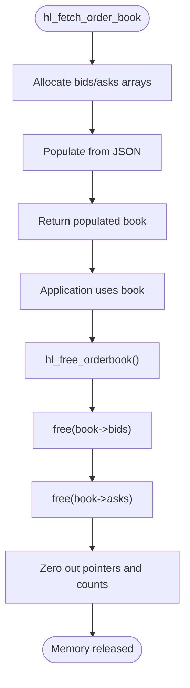

# Order Book Data Model

<cite>
**Referenced Files in This Document**   
- [hl_orderbook.h](file://include/hl_orderbook.h)
- [orderbook.c](file://src/orderbook.c)
- [simple_orderbook.c](file://examples/simple_orderbook.c)
</cite>

## Table of Contents
1. [Introduction](#introduction)
2. [Core Data Structures](#core-data-structures)
3. [Field Definitions](#field-definitions)
4. [Memory Management](#memory-management)
5. [JSON Parsing and Population Logic](#json-parsing-and-population-logic)
6. [Sorting and Ordering Principles](#sorting-and-ordering-principles)
7. [Zero-Copy String Handling](#zero-copy-string-handling)
8. [Performance Considerations](#performance-considerations)
9. [Best Practices for Safe Data Copying](#best-practices-for-safe-data-copying)
10. [Edge Case Handling](#edge-case-handling)
11. [Utility Functions](#utility-functions)

## Introduction
The `hl_orderbook_t` data model represents real-time market depth information from the Hyperliquid exchange, providing a structured view of bid and ask levels for a given trading symbol. This document details the internal structure, memory management, parsing logic, and usage patterns of the order book implementation in the Hyperliquid C SDK. The model supports Level 2 (L2) book data with configurable depth limits and is designed for high-performance algorithmic trading applications.

## Core Data Structures

The order book system is built around two primary structures: `hl_orderbook_t` for the overall book state and `hl_book_level_t` for individual price levels.


**Diagram sources**
- [hl_orderbook.h](file://include/hl_orderbook.h#L23-L41)

**Section sources**
- [hl_orderbook.h](file://include/hl_orderbook.h#L23-L41)

## Field Definitions

### symbol
The `symbol` field stores the trading pair identifier (e.g., "BTC/USDC:USDC") as a fixed-size character array of 64 bytes. This field is populated directly from the input parameter during order book fetching and provides context for the market data.

### bids and asks
The `bids` and `asks` fields are pointers to dynamically allocated arrays of `hl_book_level_t` structures. These arrays contain the price-quantity pairs representing market depth on the bid (buy) and ask (sell) sides respectively.

### bid_count and ask_count
These size_t fields store the number of valid price levels in the corresponding `bids` and `asks` arrays. They are essential for safe iteration and prevent buffer overruns when accessing the level data.

### timestamp_ms
The `timestamp_ms` field records the exact time of the order book snapshot in milliseconds since Unix epoch. This timestamp is extracted from the API response's "time" field and serves as the primary temporal reference for the data.

**Section sources**
- [hl_orderbook.h](file://include/hl_orderbook.h#L29-L41)

## Memory Management

The order book follows a strict ownership model where the `hl_orderbook_t` structure owns its level arrays. Memory allocation occurs during JSON parsing via `calloc()`, and all resources must be explicitly released using `hl_free_orderbook()`.



**Diagram sources**
- [orderbook.c](file://src/orderbook.c#L220-L235)

**Section sources**
- [orderbook.c](file://src/orderbook.c#L220-L235)
- [hl_orderbook.h](file://include/hl_orderbook.h#L67-L67)

## JSON Parsing and Population Logic

The parsing process begins with an HTTP request to the `/info` endpoint, followed by structured extraction of the JSON response. The `parse_orderbook_levels()` function handles conversion of JSON arrays into native `hl_book_level_t` arrays.


**Diagram sources**
- [orderbook.c](file://src/orderbook.c#L55-L97)
- [orderbook.c](file://src/orderbook.c#L102-L215)

**Section sources**
- [orderbook.c](file://src/orderbook.c#L55-L97)
- [orderbook.c](file://src/orderbook.c#L102-L215)

## Sorting and Ordering Principles

The API guarantees specific sorting orders which the SDK preserves:
- **Bids**: Sorted from highest to lowest price (best bid first)
- **Asks**: Sorted from lowest to highest price (best ask first)

This ordering enables efficient access to the best available prices through direct array indexing (index 0). The sorting is maintained by the exchange and not modified by the client library.

**Section sources**
- [hl_orderbook.h](file://include/hl_orderbook.h#L33-L34)
- [hl_orderbook.h](file://include/hl_orderbook.h#L37-L38)

## Zero-Copy String Handling

The `symbol` field employs a zero-copy principle where the input string is copied directly into the fixed-size buffer using `strncpy()`. This avoids dynamic allocation for the symbol string and ensures predictable memory usage. The copy operation respects the 63-character limit (leaving space for null termination).

**Section sources**
- [orderbook.c](file://src/orderbook.c#L186-L188)

## Performance Considerations

When processing large order books, consider the following performance implications:
- Memory allocation time scales with depth (default unlimited unless specified)
- Deep books may impact cache performance during iteration
- Frequent book updates require careful memory management to avoid leaks
- The depth parameter can be used to limit resource consumption

For high-frequency applications, consider reusing `hl_orderbook_t` instances and calling `hl_free_orderbook()` between uses rather than stack allocation.

**Section sources**
- [orderbook.c](file://src/orderbook.c#L55-L97)
- [orderbook.c](file://src/orderbook.c#L102-L215)

## Best Practices for Safe Data Copying

To safely copy order book data:
1. Always initialize the target structure to zero
2. Use `hl_free_orderbook()` before reusing a book instance
3. Respect the `bid_count` and `ask_count` bounds when iterating
4. Make deep copies of level arrays if needed beyond the book's lifetime
5. Never manually free `bids` or `asks` without clearing pointers

Example pattern:
```c
hl_orderbook_t local_book = {0};
hl_error_t err = hl_fetch_order_book(client, symbol, depth, &local_book);
// ... use data ...
hl_free_orderbook(&local_book); // Safe even if fetch failed
```

**Section sources**
- [orderbook.c](file://src/orderbook.c#L220-L235)
- [simple_orderbook.c](file://examples/simple_orderbook.c#L145-L147)

## Edge Case Handling

The implementation robustly handles several edge cases:
- Empty books: Sets counts to 0 and pointers to NULL
- Invalid JSON: Returns appropriate error codes
- Network failures: Propagates HTTP errors
- Zero depth: Interpreted as "all available levels"
- Missing timestamp: Falls back to current system time

Empty books are represented with `bid_count = 0`, `ask_count = 0`, and null level pointers, which utility functions handle gracefully.

**Section sources**
- [orderbook.c](file://src/orderbook.c#L65-L68)
- [orderbook.c](file://src/orderbook.c#L207-L209)

## Utility Functions

Several helper functions simplify common operations:


These functions provide safe access to key metrics like best prices, spread calculations, and volume aggregation across specified depth levels.

**Diagram sources**
- [hl_orderbook.h](file://include/hl_orderbook.h#L75-L109)

**Section sources**
- [orderbook.c](file://src/orderbook.c#L240-L310)
- [hl_orderbook.h](file://include/hl_orderbook.h#L75-L109)