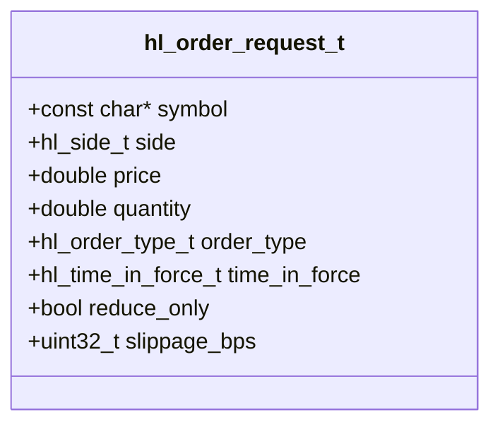
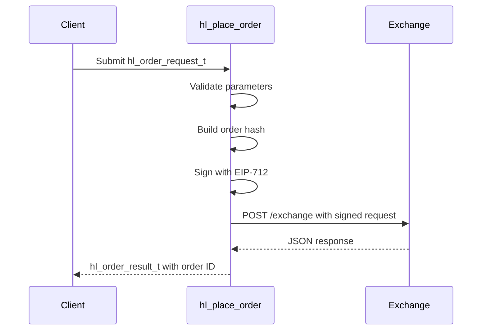

# Order Request Model

<cite>
**Referenced Files in This Document**   
- [hyperliquid.h](file://include/hyperliquid.h#L127-L136)
- [trading_api.c](file://src/trading_api.c#L79-L220)
- [hyperliquid.h](file://include/hyperliquid.h#L276-L278)
</cite>

## Table of Contents
1. [Introduction](#introduction)
2. [hl_order_request_t Data Model](#hl_order_request_t-data-model)
3. [Field Specifications](#field-specifications)
4. [Order Placement Functions](#order-placement-functions)
5. [Usage Examples](#usage-examples)
6. [Zero-Copy Memory Design](#zero-copy-memory-design)
7. [Common Pitfalls and Best Practices](#common-pitfalls-and-best-practices)
8. [Conclusion](#conclusion)

## Introduction
The `hl_order_request_t` struct is the core data model used for placing orders on the Hyperliquid exchange through the C SDK. This document provides a comprehensive breakdown of its fields, valid value ranges, and integration with order submission functions. It also covers practical usage patterns, memory management considerations, and common implementation errors to avoid.

**Section sources**
- [hyperliquid.h](file://include/hyperliquid.h#L127-L136)

## hl_order_request_t Data Model
The `hl_order_request_t` structure encapsulates all parameters required to place an order on the Hyperliquid exchange. It supports both limit and market order types with configurable time-in-force, reduce-only flags, and slippage tolerance for market orders.



**Diagram sources**
- [hyperliquid.h](file://include/hyperliquid.h#L127-L136)

**Section sources**
- [hyperliquid.h](file://include/hyperliquid.h#L127-L136)

## Field Specifications
Each field in the `hl_order_request_t` struct has specific semantic meaning and value constraints:

### symbol
- **Purpose**: Trading symbol (e.g., "BTC", "ETH")
- **Type**: `const char*`
- **Constraints**: Must be a valid Hyperliquid trading symbol
- **Validation**: Checked against known asset IDs during order placement

### side
- **Purpose**: Buy or sell direction
- **Type**: `hl_side_t` enum
- **Valid Values**: `HL_SIDE_BUY`, `HL_SIDE_SELL`

### price
- **Purpose**: Limit price for limit orders
- **Type**: `double`
- **Constraints**: Positive value; set to 0 for market orders
- **Note**: Ignored for market orders

### quantity
- **Purpose**: Order size in base asset units
- **Type**: `double`
- **Constraints**: Positive value greater than minimum lot size

### order_type
- **Purpose**: Order execution type
- **Type**: `hl_order_type_t` enum
- **Valid Values**: `HL_ORDER_TYPE_LIMIT`, `HL_ORDER_TYPE_MARKET`

### time_in_force
- **Purpose**: Order lifetime and execution behavior
- **Type**: `hl_time_in_force_t` enum
- **Valid Values**: `HL_TIF_GTC` (Good Till Cancel), `HL_TIF_IOC` (Immediate Or Cancel), `HL_TIF_FOK` (Fill Or Kill)

### reduce_only
- **Purpose**: Restricts order to reducing existing position
- **Type**: `bool`
- **Behavior**: Prevents opening new positions or increasing existing ones

### slippage_bps
- **Purpose**: Maximum acceptable slippage for market orders
- **Type**: `uint32_t`
- **Unit**: Basis points (1% = 100 bps)
- **Note**: Only applicable to market orders

**Section sources**
- [hyperliquid.h](file://include/hyperliquid.h#L127-L136)

## Order Placement Functions
The `hl_order_request_t` model is used with two primary order submission functions:

### hl_place_order()
- **Purpose**: Submit a single order
- **Parameters**: 
  - `hl_client_t* client`: Authenticated client instance
  - `const hl_order_request_t* request`: Order parameters
  - `hl_order_result_t* result`: Output result structure
- **Return**: `hl_error_t` status code
- **Thread Safety**: Internally synchronized via client mutex

### hl_place_batch_orders()
- **Purpose**: Submit multiple orders atomically
- **Parameters**: 
  - Array of `hl_order_request_t` structures
  - Count of orders
  - Array of `hl_order_result_t` for output
- **Behavior**: All orders share the same nonce and signature



**Diagram sources**
- [trading_api.c](file://src/trading_api.c#L79-L220)

**Section sources**
- [trading_api.c](file://src/trading_api.c#L79-L220)
- [hyperliquid.h](file://include/hyperliquid.h#L276-L278)

## Usage Examples
### Limit Order Configuration
```c
hl_order_request_t limit_order = {
    .symbol = "BTC",
    .side = HL_SIDE_BUY,
    .price = 65000.0,
    .quantity = 0.01,
    .order_type = HL_ORDER_TYPE_LIMIT,
    .time_in_force = HL_TIF_GTC,
    .reduce_only = false,
    .slippage_bps = 0  // Not used for limit orders
};
```

### Market Order Configuration
```c
hl_order_request_t market_order = {
    .symbol = "ETH",
    .side = HL_SIDE_SELL,
    .price = 0.0,  // Required for market orders
    .quantity = 2.5,
    .order_type = HL_ORDER_TYPE_MARKET,
    .time_in_force = HL_TIF_IOC,
    .reduce_only = true,
    .slippage_bps = 50  // 0.5% maximum slippage
};
```

**Section sources**
- [hyperliquid.h](file://include/hyperliquid.h#L127-L136)

## Zero-Copy Memory Design
The `hl_order_request_t` struct employs a zero-copy design principle:
- String fields (like `symbol`) contain pointers to caller-owned memory
- No internal duplication of string data occurs
- Caller must ensure memory validity until order processing completes
- This reduces memory allocation overhead and improves performance
- Particularly important in high-frequency trading scenarios

**Section sources**
- [hyperliquid.h](file://include/hyperliquid.h#L127-L136)

## Common Pitfalls and Best Practices
### Common Pitfalls
- **Uninitialized slippage**: Forgetting to set `slippage_bps` for market orders may result in default 0 value (no slippage allowed)
- **Incorrect time-in-force**: Using GTC for market orders when IOC/FOK is more appropriate
- **Invalid symbol names**: Using non-standard symbol formats not recognized by the exchange
- **Memory lifetime issues**: Releasing string memory before order processing completes

### Best Practices
- **Input validation**: Always validate symbol, price, and quantity before submission
- **Error handling**: Check return values and inspect `hl_order_result_t.error` field
- **Market data synchronization**: Use current market data to determine valid price ranges
- **Rate limiting**: Respect exchange rate limits to avoid throttling
- **Testnet validation**: Test order logic on testnet before deploying to production

**Section sources**
- [trading_api.c](file://src/trading_api.c#L79-L220)

## Conclusion
The `hl_order_request_t` data model provides a comprehensive interface for placing orders on the Hyperliquid exchange. Its design balances flexibility with safety, supporting various order types and execution parameters while maintaining efficient memory usage through zero-copy semantics. Proper understanding of field semantics, valid value ranges, and integration with placement functions is essential for reliable trading application development.