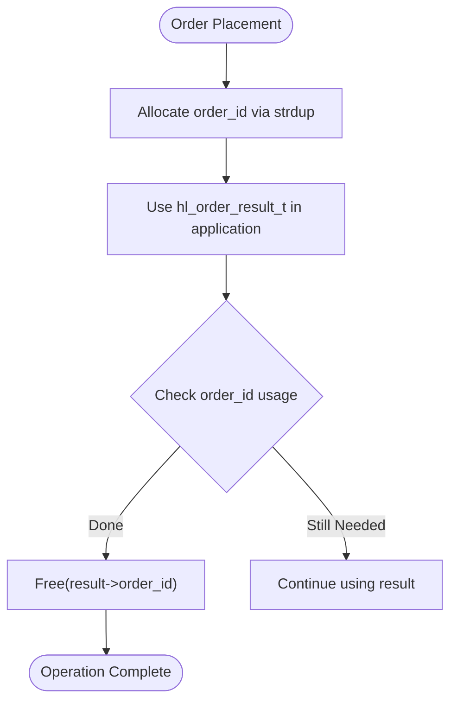
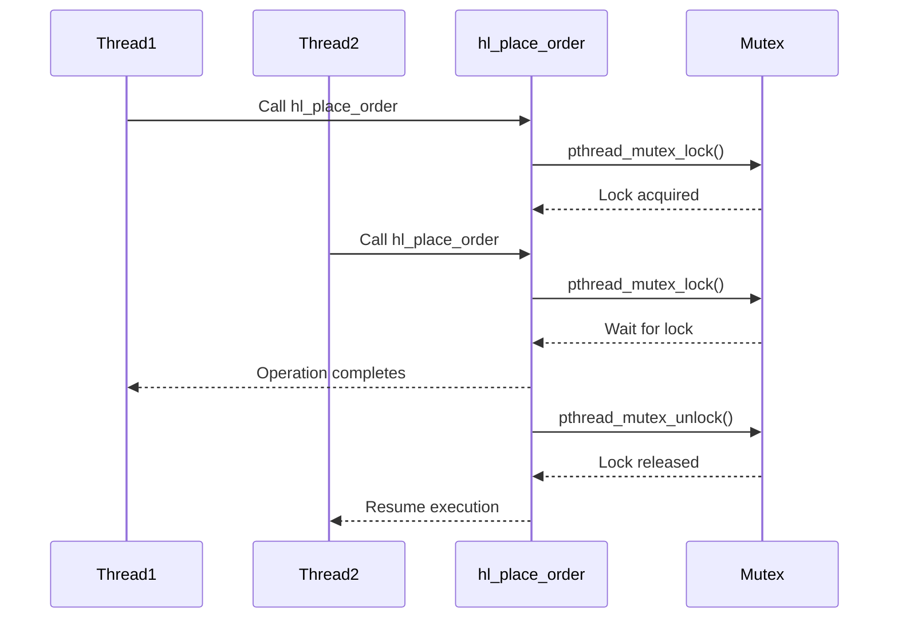

# Order Result Model

<cite>
**Referenced Files in This Document**   
- [hyperliquid.h](file://include/hyperliquid.h#L139-L145)
- [trading_api.c](file://src/trading_api.c#L79-L220)
- [simple_trade.c](file://examples/simple_trade.c#L17-L163)
- [trading_bot.c](file://examples/trading_bot.c#L130-L178)
</cite>

## Table of Contents
1. [Introduction](#introduction)
2. [Core Fields of hl_order_result_t](#core-fields-of-hl_order_result_t)
3. [Memory Management](#memory-management)
4. [Order Status Interpretation](#order-status-interpretation)
5. [API Response Mapping](#api-response-mapping)
6. [Thread Safety](#thread-safety)
7. [Error Handling and Retry Strategies](#error-handling-and-retry-strategies)
8. [Conclusion](#conclusion)

## Introduction
The `hl_order_result_t` data model represents the outcome of order placement operations in the Hyperliquid C SDK. It encapsulates critical information about an order including its identifier, execution status, fill details, and any associated error messages. This document provides a comprehensive breakdown of each field, memory management requirements, interpretation of order statuses, and practical usage patterns derived from real implementation examples.

**Section sources**
- [hyperliquid.h](file://include/hyperliquid.h#L139-L145)

## Core Fields of hl_order_result_t
The `hl_order_result_t` structure contains five essential fields that convey the result of an order operation:

- **order_id**: A dynamically allocated string representing the unique identifier assigned by the exchange to the order. The caller is responsible for freeing this memory.
- **status**: An enumeration of type `hl_order_status_t` indicating the current state of the order (e.g., OPEN, FILLED, REJECTED).
- **filled_quantity**: A double-precision floating-point value representing the quantity of the asset that has been filled. This value is zero for new orders and increases as fills occur.
- **average_price**: A double-precision floating-point value representing the average price at which the order was filled. This is only meaningful when `filled_quantity > 0`.
- **error**: A fixed-size character buffer (256 bytes) used to store error messages in case the order operation fails.

These fields collectively provide a complete picture of the order's lifecycle and execution outcome.

**Section sources**
- [hyperliquid.h](file://include/hyperliquid.h#L139-L145)

## Memory Management
The `order_id` field in `hl_order_result_t` is allocated using `strdup()` during the parsing of the API response in the `hl_place_order` function. As such, it must be explicitly freed by the caller to prevent memory leaks. The allocation occurs when the response JSON contains an `"oid"` field, which is parsed and converted into a string via `snprintf` and then duplicated with `strdup`.

Other fields in the structure do not require manual memory management:
- `status`, `filled_quantity`, and `average_price` are simple value types.
- `error` is a fixed-size array embedded within the struct.

Callers must ensure that after using the `order_id`, they invoke `free(result->order_id)` to release the allocated memory.



**Diagram sources**
- [trading_api.c](file://src/trading_api.c#L79-L220)

**Section sources**
- [trading_api.c](file://src/trading_api.c#L79-L220)

## Order Status Interpretation
The `status` field determines how the `filled_quantity` and `average_price` values should be interpreted:

- **HL_ORDER_STATUS_OPEN**: The order is active on the book. `filled_quantity` and `average_price` will be 0.0.
- **HL_ORDER_STATUS_FILLED**: The order has been completely filled. `filled_quantity` equals the original order size, and `average_price` reflects the weighted average fill price.
- **HL_ORDER_STATUS_PARTIALLY_FILLED**: Only part of the order has executed. `filled_quantity` is greater than 0 but less than the original amount, and `average_price` is valid.
- **HL_ORDER_STATUS_CANCELLED**: The order was canceled before full execution. `filled_quantity` may be > 0 if partial fills occurred.
- **HL_ORDER_STATUS_REJECTED**: The order was rejected by the exchange. Both `filled_quantity` and `average_price` are 0.0, and the `error` buffer contains the rejection reason.

This status-driven interpretation allows clients to accurately assess the outcome of their order without needing additional queries.

**Section sources**
- [hyperliquid.h](file://include/hyperliquid.h#L114-L124)

## API Response Mapping
In `trading_api.c`, the `hl_place_order` function maps the JSON response from the Hyperliquid API to the `hl_order_result_t` structure. When a successful response is received (HTTP 200 with `"status":"ok"`), the function searches for the `"oid"` field in the JSON body using `strstr`. Once found, it extracts the numeric order ID, converts it to a string, duplicates it with `strdup`, and assigns it to `result->order_id`.

The status is set to `HL_ORDER_STATUS_OPEN` by default upon successful submission. The `filled_quantity` and `average_price` remain 0.0 initially, as the order has just been placed. If the order fills immediately, subsequent updates would need to be retrieved via order status polling or websocket events.

Example from `simple_trade.c` shows how the result is checked:
```c
if (ret == HL_SUCCESS) {
    printf("✅ Order placed successfully!\n");
    printf("   Order ID: %llu\n", result.order_id);
    printf("   Status:   %s\n", 
           result.status == HL_ORDER_STATUS_OPEN ? "OPEN" : "FILLED");
}
```

**Section sources**
- [trading_api.c](file://src/trading_api.c#L79-L220)
- [simple_trade.c](file://examples/simple_trade.c#L17-L163)

## Thread Safety
The `hl_place_order` function ensures thread safety by locking a mutex associated with the client before making the API request. The mutex is obtained via `hl_client_get_mutex_old(client)` and locked with `pthread_mutex_lock(mutex)` at the beginning of the function. It is unlocked before returning, ensuring that only one thread can execute an order placement at a time per client instance.

This prevents race conditions during signature generation and nonce management, both of which are sensitive to concurrent access. However, callers should still avoid sharing the same `hl_order_result_t` instance across threads without external synchronization, as the structure itself is not thread-safe.



**Diagram sources**
- [trading_api.c](file://src/trading_api.c#L79-L220)

**Section sources**
- [trading_api.c](file://src/trading_api.c#L79-L220)

## Error Handling and Retry Strategies
When an order operation fails, the `hl_order_result_t.error` buffer is populated with a descriptive message using `snprintf`. Common failure scenarios include network errors, invalid parameters, authentication issues, insufficient balance, or order rejection by the exchange.

From `simple_trade.c`, error handling is demonstrated:
```c
if (ret != HL_SUCCESS) {
    fprintf(stderr, "❌ Failed to place order: %s\n", hl_error_string(ret));
    if (strlen(result.error) > 0) {
        fprintf(stderr, "   API Error: %s\n", result.error);
    }
}
```

Recommended retry strategies include:
- **Network Errors**: Implement exponential backoff with jitter before retrying.
- **Insufficient Balance**: Check account balance and reduce order size before retrying.
- **Order Rejected**: Validate order parameters (price, quantity) against exchange rules and correct before retrying.
- **Nonce Conflicts**: Ensure proper synchronization via mutex; no manual retry needed due to built-in locking.

The error buffer provides actionable feedback to determine the appropriate recovery path.

**Section sources**
- [simple_trade.c](file://examples/simple_trade.c#L17-L163)
- [trading_api.c](file://src/trading_api.c#L79-L220)

## Conclusion
The `hl_order_result_t` model serves as a critical interface between the application and the Hyperliquid exchange, providing structured feedback on order operations. Proper handling of its fields—particularly memory management of `order_id` and correct interpretation of status-dependent values—is essential for robust trading applications. The integration of thread safety and clear error reporting further enhances reliability in production environments.