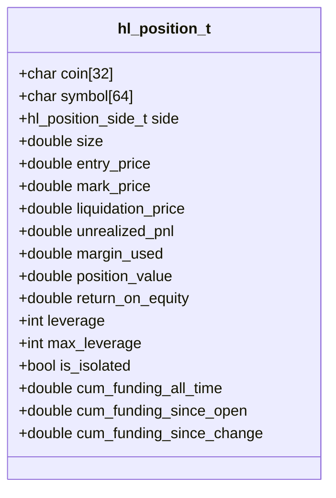
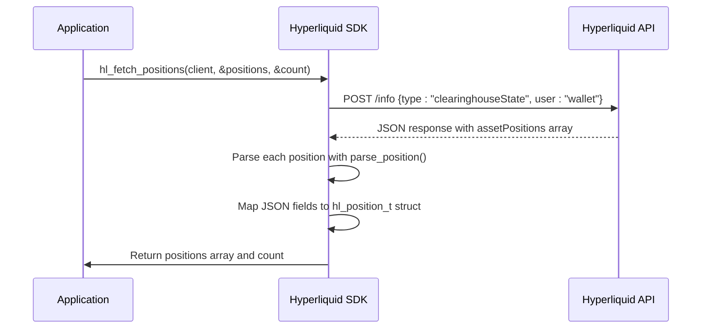
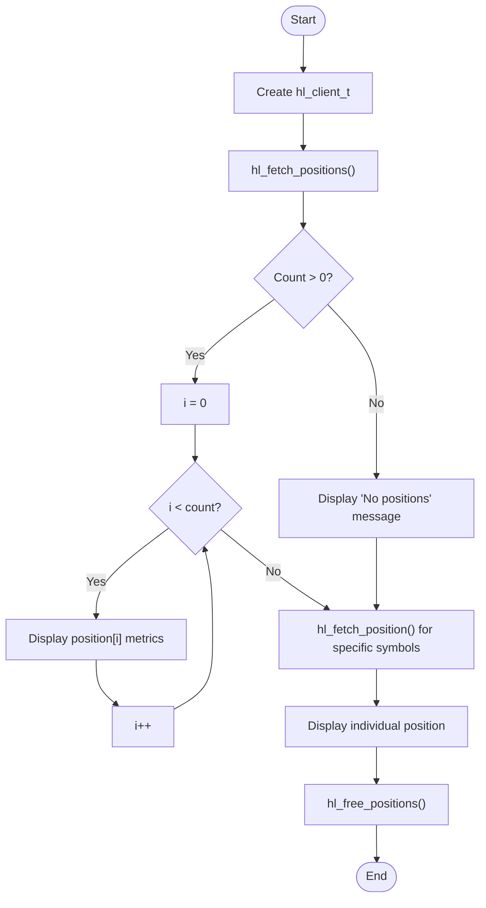

# Position Data Model

<cite>
**Referenced Files in This Document**   
- [hl_account.h](file://include/hl_account.h)
- [account.c](file://src/account.c)
- [simple_positions.c](file://examples/simple_positions.c)
</cite>

## Table of Contents
1. [Introduction](#introduction)
2. [Position Data Structure](#position-data-structure)
3. [Field Definitions](#field-definitions)
4. [Position Population and API Integration](#position-population-and-api-integration)
5. [Position Size, Side, and Notional Value](#position-size-side-and-notional-value)
6. [Margin Mode: Isolated vs Cross](#margin-mode-isolated-vs-cross)
7. [Position Monitoring Workflows](#position-monitoring-workflows)
8. [Interpreting ROE and Funding Metrics](#interpreting-roe-and-funding-metrics)
9. [Common Issues and Edge Cases](#common-issues-and-edge-cases)
10. [Conclusion](#conclusion)

## Introduction

The `hl_position_t` data model represents open trading positions in the Hyperliquid C SDK, capturing essential information about perpetual contract positions. This structure serves as the primary interface for retrieving and analyzing active trades, providing comprehensive details about position characteristics, risk metrics, and performance indicators. The model is designed to support trading applications that require real-time monitoring of open positions, risk management calculations, and performance analysis.

**Section sources**
- [hl_account.h](file://include/hl_account.h#L85-L108)

## Position Data Structure

The `hl_position_t` struct is defined in `hl_account.h` and contains comprehensive information about open trading positions. The structure is populated from account API responses and provides a complete snapshot of position state including market details, financial metrics, and risk parameters.

**Diagram sources**
- [hl_account.h](file://include/hl_account.h#L85-L108)

**Section sources**
- [hl_account.h](file://include/hl_account.h#L85-L108)

## Field Definitions

### Core Position Attributes
The position model includes fundamental attributes that identify the trading instrument and position characteristics:

- **coin**: The base cryptocurrency symbol (e.g., "BTC", "ETH") stored as a 32-character string
- **symbol**: The full market symbol in format "COIN/USDC:USDC" stored as a 64-character string
- **side**: The position direction, represented as `HL_POSITION_LONG` or `HL_POSITION_SHORT`
- **size**: The absolute position size in base currency units
- **entry_price**: The average entry price for the position
- **mark_price**: The current mark price used for valuation and liquidation calculations

### Risk and Performance Metrics
The model includes comprehensive risk and performance indicators:

- **liquidation_price**: The price level at which the position would be liquidated
- **unrealized_pnl**: The current profit/loss on the position in quote currency
- **margin_used**: The amount of margin capital allocated to maintain the position
- **position_value**: The notional value of the position in quote currency
- **return_on_equity**: The return on equity percentage for the position

### Leverage and Margin Configuration
Leverage settings and margin mode are captured to understand position risk profile:

- **leverage**: The current leverage multiplier applied to the position
- **max_leverage**: The maximum leverage allowed for this position
- **is_isolated**: Boolean flag indicating isolated margin mode

### Funding Accumulators
The model tracks cumulative funding payments:

- **cum_funding_all_time**: Total funding paid/received over the position's lifetime
- **cum_funding_since_open**: Funding accumulated since position opening
- **cum_funding_since_change**: Funding accumulated since the last position size change

**Section sources**
- [hl_account.h](file://include/hl_account.h#L85-L108)

## Position Population and API Integration

The `hl_position_t` structure is populated from the Hyperliquid API's clearinghouse state endpoint through the `hl_fetch_positions` function in `account.c`. The population process involves several key steps:

1. **API Request**: The client sends a POST request to `/info` with type "clearinghouseState" and the user's wallet address
2. **Response Parsing**: The JSON response contains an "assetPositions" array that is parsed into individual position objects
3. **Field Mapping**: Each field in the API response is mapped to the corresponding struct member
4. **Derived Calculations**: Some values like position side are derived from raw API data

The `parse_position` function handles the conversion from JSON to the `hl_position_t` structure, performing type conversions and string parsing as needed. The function extracts data from nested JSON objects, particularly for complex fields like leverage configuration and cumulative funding.

**Diagram sources**
- [account.c](file://src/account.c#L450-L540)
- [account.c](file://src/account.c#L276-L397)

**Section sources**
- [account.c](file://src/account.c#L450-L540)
- [account.c](file://src/account.c#L276-L397)

## Position Size, Side, and Notional Value

The relationship between position size, side, and notional value is fundamental to understanding position characteristics. The `hl_position_t` model captures these relationships through specific design patterns:

- **Size and Side**: The `size` field stores the absolute position size, while the `side` field indicates direction. This separation allows for consistent size values regardless of long/short position. The side is derived from the sign of the raw "szi" value in the API response, with positive values indicating long positions and negative values indicating short positions.

- **Notional Value**: The `position_value` field represents the notional value of the position, calculated as size multiplied by mark price. This value reflects the total market exposure of the position.

- **Mathematical Relationships**: For long positions, unrealized P&L increases as mark price rises above entry price. For short positions, unrealized P&L increases as mark price falls below entry price. The position value always represents the absolute market exposure regardless of direction.

These relationships enable consistent risk calculations and position analysis across both long and short positions.

**Section sources**
- [account.c](file://src/account.c#L276-L397)
- [hl_account.h](file://include/hl_account.h#L85-L108)

## Margin Mode: Isolated vs Cross

The `is_isolated` field indicates whether a position uses isolated or cross margin mode, which significantly impacts risk management:

- **Isolated Margin** (`is_isolated = true`): The position has a dedicated margin allocation that is isolated from other positions. Losses are limited to the allocated margin, providing better risk containment but requiring careful margin management.

- **Cross Margin** (`is_isolated = false`): The position shares the account's available balance as margin. This provides greater flexibility and reduces liquidation risk but exposes the entire account balance to potential losses.

The margin mode is determined by parsing the "type" field within the leverage object in the API response. This setting affects how margin requirements are calculated and how liquidation risks are managed. Traders should understand their margin mode to properly assess risk exposure and capital requirements.

**Section sources**
- [account.c](file://src/account.c#L276-L397)
- [hl_account.h](file://include/hl_account.h#L85-L108)

## Position Monitoring Workflows

The `simple_positions.c` example demonstrates practical workflows for monitoring positions. The typical monitoring pattern involves:

1. **Initialization**: Create a client instance with wallet address and private key
2. **Bulk Retrieval**: Use `hl_fetch_positions` to retrieve all open positions at once
3. **Individual Access**: Use `hl_fetch_position` to retrieve specific positions by symbol
4. **Data Processing**: Extract and analyze position metrics for trading decisions
5. **Cleanup**: Free allocated memory to prevent leaks

The example shows how to iterate through all positions, display key metrics, and handle cases where positions don't exist. It also demonstrates error handling for API failures and proper resource cleanup. This workflow pattern ensures efficient API usage by minimizing the number of requests while providing comprehensive position visibility.

**Diagram sources**
- [simple_positions.c](file://examples/simple_positions.c#L0-L119)

**Section sources**
- [simple_positions.c](file://examples/simple_positions.c#L0-L119)

## Interpreting ROE and Funding Metrics

The Return on Equity (ROE) and funding metrics provide critical insights for trading decisions:

- **ROE (return_on_equity)**: This metric represents the percentage return on the margin capital allocated to the position. A high ROE indicates efficient capital utilization, while negative ROE indicates losses. Traders should monitor ROE trends to assess position performance relative to capital at risk.

- **Funding Accumulators**: These metrics track the cumulative funding payments associated with the position:
  - `cum_funding_all_time`: Total funding paid/received over the position's lifetime
  - `cum_funding_since_open`: Funding accumulated since position opening
  - `cum_funding_since_change`: Funding accumulated since the last position size change

Funding metrics are particularly important for perpetual contracts, as they represent the cost of carry. Positive funding rates mean long positions pay shorts, while negative rates mean shorts pay longs. Monitoring these accumulators helps traders understand the ongoing costs or benefits of maintaining their positions.

**Section sources**
- [hl_account.h](file://include/hl_account.h#L85-L108)
- [account.c](file://src/account.c#L276-L397)

## Common Issues and Edge Cases

Several common issues can affect position data accuracy and interpretation:

- **Stale Mark Prices**: The `mark_price` field may become stale if not updated frequently, leading to inaccurate P&L calculations and liquidation risk assessments. Applications should implement regular position refreshes or use websocket updates for real-time pricing.

- **Incorrect Liquidation Price Assumptions**: The `liquidation_price` is calculated based on current market conditions and margin requirements. Changes in funding rates, volatility, or account balance can alter the actual liquidation price. Traders should treat the reported liquidation price as an estimate rather than an absolute guarantee.

- **Parsing Errors**: The `parse_position` function may fail to parse certain fields if the API response format changes. Robust error handling should be implemented to manage partial data availability.

- **Memory Management**: The `hl_fetch_positions` function allocates memory that must be freed with `hl_free_positions` to prevent memory leaks, especially in long-running applications.

- **Symbol Format Assumptions**: The current implementation assumes a specific symbol format ("COIN/USDC:USDC"). Changes to market naming conventions could require updates to the symbol parsing logic.

**Section sources**
- [account.c](file://src/account.c#L276-L397)
- [account.c](file://src/account.c#L450-L540)

## Conclusion

The `hl_position_t` data model provides a comprehensive representation of open trading positions in the Hyperliquid ecosystem. By understanding the structure's fields, population mechanisms, and relationships between key metrics, developers can build robust trading applications with accurate risk assessment and performance monitoring capabilities. The integration between the C SDK and Hyperliquid API enables efficient position management, while the clear separation of concerns in the data model facilitates reliable trading workflows. Proper handling of edge cases and regular data refreshes are essential for maintaining accurate position tracking in dynamic market conditions.