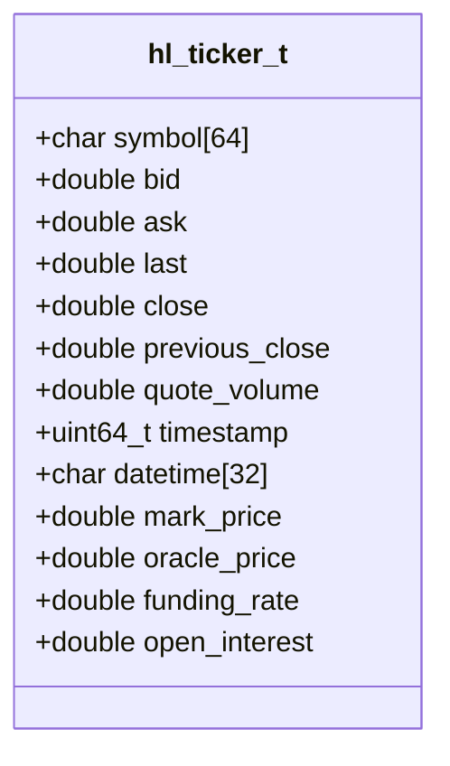
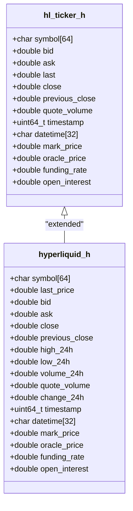
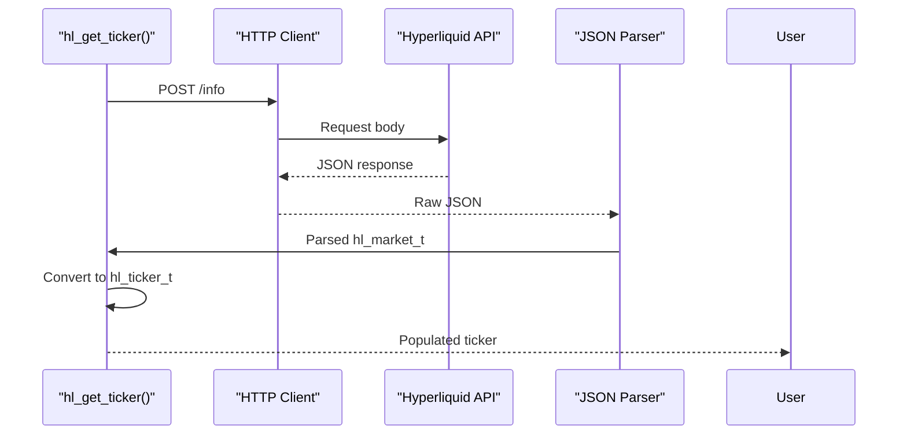
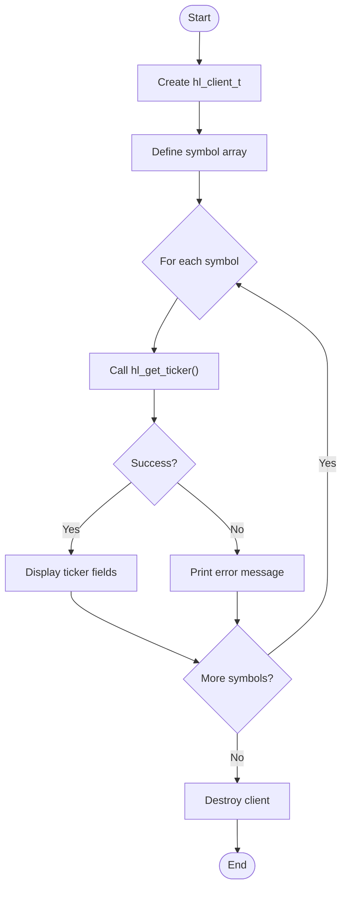

# Ticker Data Model

<cite>
**Referenced Files in This Document**   
- [hl_ticker.h](file://include/hl_ticker.h)
- [hyperliquid.h](file://include/hyperliquid.h)
- [ticker.c](file://src/ticker.c)
- [simple_ticker.c](file://examples/simple_ticker.c)
</cite>

## Table of Contents
1. [Introduction](#introduction)
2. [Core Data Structure: hl_ticker_t](#core-data-structure-hl_ticker_t)
3. [Field Definitions and Usage](#field-definitions-and-usage)
4. [Comparison of hl_ticker_t Definitions](#comparison-of-hl_ticker_t-definitions)
5. [Ticker Data Population and Zero-Copy Techniques](#ticker-data-population-and-zero-copy-techniques)
6. [Fixed-Size Buffer Design and Safety](#fixed-size-buffer-design-and-safety)
7. [Usage Examples from simple_ticker.c](#usage-examples-from-simple_tickerc)
8. [Common Issues and Considerations](#common-issues-and-considerations)

## Introduction
The `hl_ticker_t` data model is a central component of the Hyperliquid C SDK, designed to encapsulate comprehensive market ticker information for trading symbols. This structure provides real-time price data, volume metrics, timestamps, and perpetual-specific information such as mark price, oracle price, funding rate, and open interest. The model is used across various trading operations including order placement, market analysis, and risk management. Two slightly different definitions of this structure exist in the codebase, reflecting different contexts of use and evolution of the API.

**Section sources**
- [hl_ticker.h](file://include/hl_ticker.h#L26-L48)
- [hyperliquid.h](file://include/hyperliquid.h#L168-L188)

## Core Data Structure: hl_ticker_t
The `hl_ticker_t` structure is defined in two locations within the codebase: `hl_ticker.h` and `hyperliquid.h`. Both definitions serve as containers for market data but have evolved with slightly different field sets and naming conventions. The structure uses fixed-size character arrays for string fields and double-precision floating-point values for numerical data, ensuring predictable memory layout and efficient access patterns.

**Diagram sources**
- [hl_ticker.h](file://include/hl_ticker.h#L26-L48)

## Field Definitions and Usage
The `hl_ticker_t` structure contains several categories of market data fields:

### Symbol and Identification
- **symbol**: Fixed-size buffer (64 bytes) storing the market symbol in format like "BTC/USDC:USDC"

### Price Information
- **bid**: Best current bid price
- **ask**: Best current ask price  
- **last**: Last traded price (mid price)
- **close**: Closing price
- **previous_close**: Previous day's closing price

### Volume Metrics
- **quote_volume**: 24-hour quote volume in USDC

### Timestamps
- **timestamp**: Millisecond timestamp of data
- **datetime**: ISO 8601 formatted datetime string

### Perpetual-Specific Data
- **mark_price**: Current mark price for the perpetual
- **oracle_price**: Oracle price feed value
- **funding_rate**: Current funding rate percentage
- **open_interest**: Total open interest for the market

**Section sources**
- [hl_ticker.h](file://include/hl_ticker.h#L26-L48)
- [hyperliquid.h](file://include/hyperliquid.h#L168-L188)

## Comparison of hl_ticker_t Definitions
Two definitions of the `hl_ticker_t` structure exist in the codebase, located in different header files with distinct field sets:

### hl_ticker.h Definition
Located in `include/hl_ticker.h`, this version contains:
- `last` field for last price
- Only `quote_volume` for volume metrics
- Missing 24-hour high, low, and price change metrics

### hyperliquid.h Definition
Located in `include/hyperliquid.h`, this version contains:
- `last_price` field (renamed from `last`)
- Additional volume fields: `volume_24h`, `high_24h`, `low_24h`, `change_24h`
- More comprehensive market data representation

The differences reflect API evolution and different use cases. The `hyperliquid.h` version is more complete and appears to be the current standard, while the `hl_ticker.h` version may represent an earlier iteration or a simplified interface.

**Diagram sources**
- [hl_ticker.h](file://include/hl_ticker.h#L26-L48)
- [hyperliquid.h](file://include/hyperliquid.h#L168-L188)

**Section sources**
- [hl_ticker.h](file://include/hl_ticker.h#L26-L48)
- [hyperliquid.h](file://include/hyperliquid.h#L168-L188)

## Ticker Data Population and Zero-Copy Techniques
Ticker data is populated through HTTP API calls that fetch market data from the Hyperliquid exchange. The process involves:

1. Making a POST request to `/info` endpoint with type `metaAndAssetCtxs`
2. Parsing the JSON response using cJSON library
3. Extracting market data from universe and contexts arrays
4. Converting raw JSON data to `hl_ticker_t` structure

The implementation uses zero-copy techniques where possible by directly assigning parsed values to structure fields without intermediate buffering. The `parse_ticker_from_market` function in `ticker.c` handles the conversion from internal market representation to the public ticker interface, ensuring efficient data transformation.

**Diagram sources**
- [ticker.c](file://src/ticker.c#L95-L183)
- [ticker.c](file://src/ticker.c#L47-L90)

**Section sources**
- [ticker.c](file://src/ticker.c#L47-L213)

## Fixed-Size Buffer Design and Safety
The `hl_ticker_t` structure employs fixed-size buffers for string fields to ensure memory safety and predictable performance:

- **symbol[64]**: Provides ample space for market symbols with room for future expansion
- **datetime[32]**: Sufficient for ISO 8601 formatted timestamps with millisecond precision

Safety considerations include:
- Using `strncpy` with size limits to prevent buffer overflows
- Null-terminating strings after copying
- Validating input lengths before assignment
- Using `snprintf` for formatted string operations with size constraints

The design avoids dynamic memory allocation for string fields, reducing complexity and potential memory leaks while maintaining compatibility with C string handling conventions.

**Section sources**
- [hl_ticker.h](file://include/hl_ticker.h#L26-L48)
- [ticker.c](file://src/ticker.c#L47-L90)

## Usage Examples from simple_ticker.c
The `simple_ticker.c` example demonstrates proper usage of the ticker API:

1. Creating a client with wallet address and private key
2. Iterating through multiple symbols (BTC/USDC:USDC, ETH/USDC:USDC, etc.)
3. Fetching ticker data using `hl_get_ticker`
4. Displaying price information, volume metrics, and swap-specific data
5. Calculating bid-ask spread and percentage difference
6. Proper error handling and client cleanup

The example shows how to safely access and display all fields of the `hl_ticker_t` structure, including formatting prices to two decimal places and converting funding rates from decimal to percentage.

**Diagram sources**
- [simple_ticker.c](file://examples/simple_ticker.c#L18-L103)

**Section sources**
- [simple_ticker.c](file://examples/simple_ticker.c#L18-L103)

## Common Issues and Considerations
Several common issues should be considered when working with ticker data:

### Stale Timestamps
- Ticker data may become stale if not refreshed frequently
- Applications should implement refresh intervals appropriate to their use case
- Consider timestamp validation before using data for trading decisions

### Inconsistent Price Relationships
- Bid price should always be less than or equal to ask price
- Last price should typically fall between bid and ask
- Discrepancies may indicate data synchronization issues or extreme market conditions

### Field Availability
- Some fields may not be available for all market types
- Perpetual-specific fields (funding_rate, open_interest) are only meaningful for swap markets
- Volume metrics may vary in availability between different symbol types

### Memory Safety
- Always ensure symbol buffers are properly null-terminated
- Validate string lengths before copying to prevent buffer overflows
- Use size-limited string functions (strncpy, snprintf) consistently

**Section sources**
- [ticker.c](file://src/ticker.c#L47-L90)
- [simple_ticker.c](file://examples/simple_ticker.c#L18-L103)