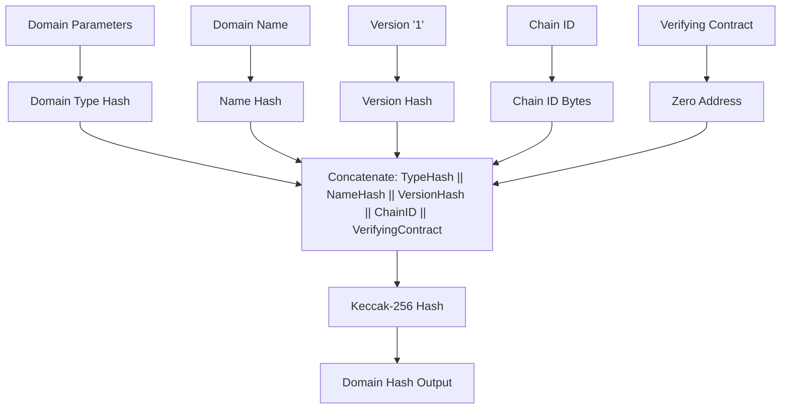
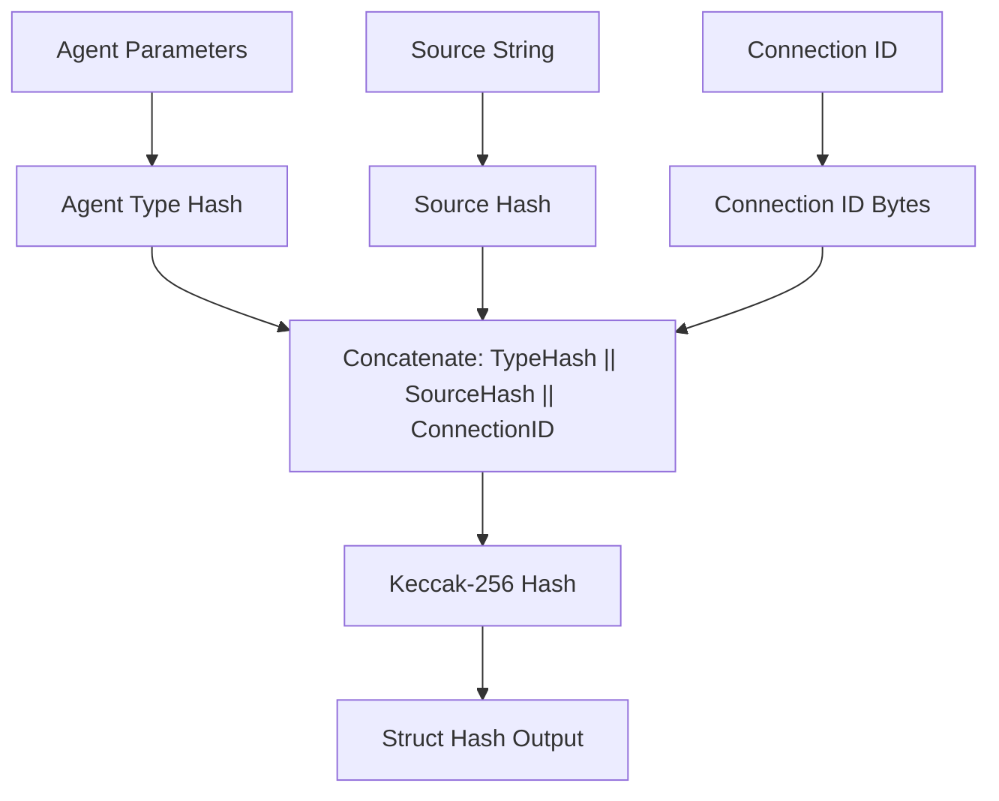
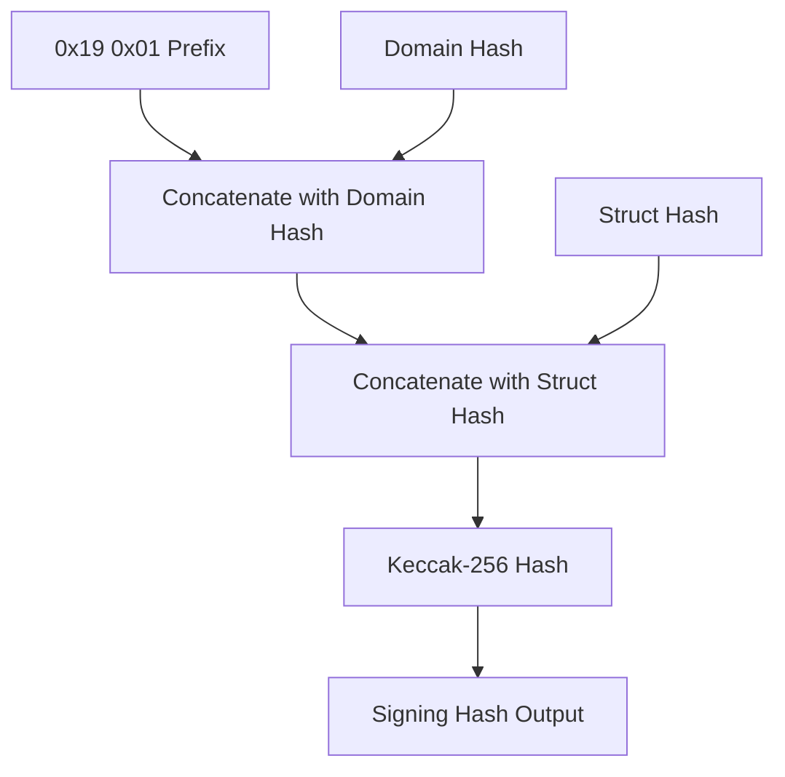
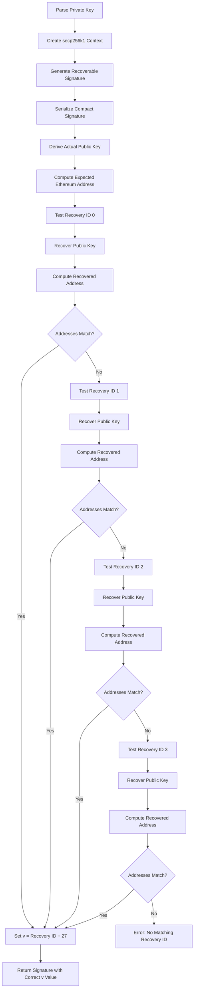
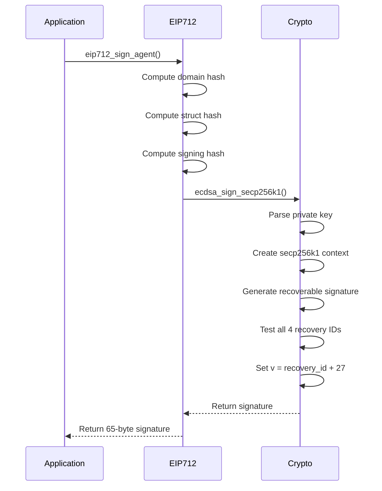
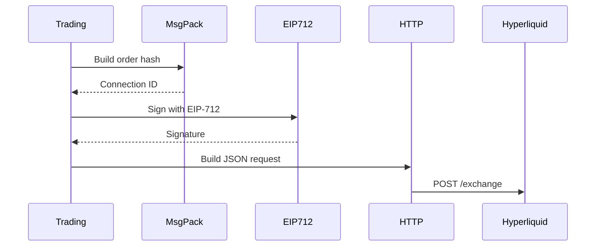
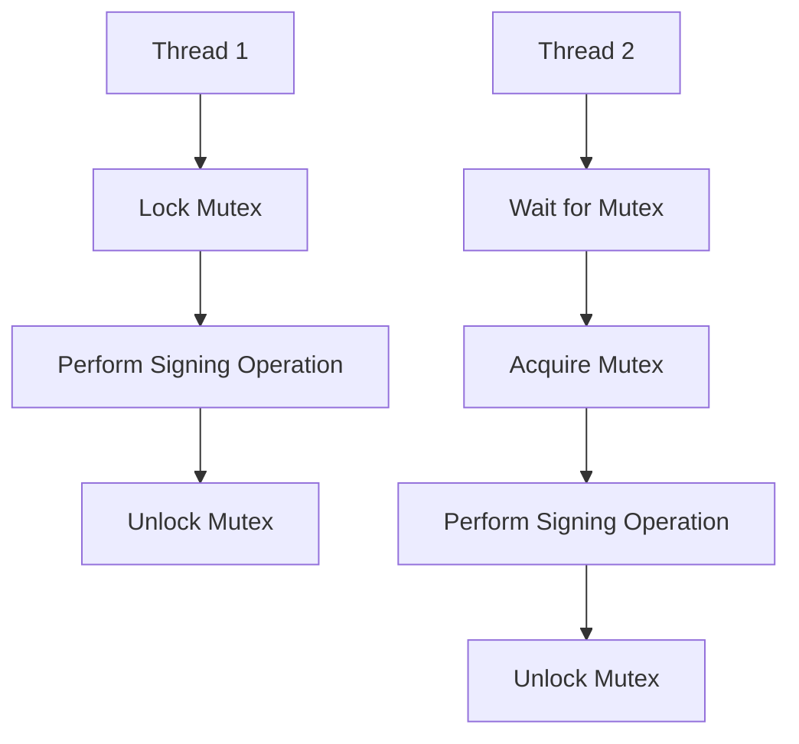

# EIP-712 Signing

<cite>
**Referenced Files in This Document**   
- [eip712.c](file://src/crypto/eip712.c)
- [hl_crypto_internal.h](file://include/hl_crypto_internal.h)
- [trading_api.c](file://src/trading_api.c)
- [trading.c](file://src/trading.c)
</cite>

## Table of Contents
1. [Introduction](#introduction)
2. [EIP-712 Domain and Message Hashing](#eip-712-domain-and-message-hashing)
3. [Recovery ID Calculation and ECDSA Signature](#recovery-id-calculation-and-ecdsa-signature)
4. [Full Signing Flow](#full-signing-flow)
5. [Integration with Trading API](#integration-with-trading-api)
6. [Common Issues and Troubleshooting](#common-issues-and-troubleshooting)
7. [Performance and Thread Safety](#performance-and-thread-safety)

## Introduction
This document provides a comprehensive explanation of the EIP-712 typed data signing implementation used for secure order authentication in the hyperliquid-c library. The implementation ensures cryptographic integrity and compatibility with Ethereum-based authentication standards. The signing process is critical for placing and canceling orders on the Hyperliquid exchange, where each action must be securely signed using the user's private key.

The core functionality is implemented in the `eip712.c` file, which leverages libsecp256k1 for ECDSA operations and SHA3IUF for Keccak-256 hashing. The system follows the EIP-712 standard for structured data signing, ensuring that signed messages are both human-readable and tamper-proof. This document details the complete signing flow, from domain separation to signature generation, and explains how this integrates with the trading API to authenticate user actions.

## EIP-712 Domain and Message Hashing

The EIP-712 signing process begins with the creation of two hash components: the domain separator and the message (agent struct) hash. These hashes are combined to form the final signing hash that is signed with the user's private key.

The domain separator provides context for the signed data, preventing signature replay across different applications or chains. The `eip712_domain_hash` function computes this hash using the domain name, chain ID, version, and verifying contract address. The domain type hash is precomputed as the Keccak-256 hash of the string "EIP712Domain(string name,string version,uint256 chainId,address verifyingContract)".

**Diagram sources**
- [eip712.c](file://src/crypto/eip712.c#L182-L220)

The agent struct hash represents the specific action being signed, such as placing an order or canceling a trade. The `eip712_agent_struct_hash` function computes this hash using the source string and connection ID. The agent type hash is derived from "Agent(string source,bytes32 connectionId)".

**Diagram sources**
- [eip712.c](file://src/crypto/eip712.c#L222-L245)

The final signing hash is constructed according to EIP-191 by concatenating the prefix bytes 0x19 and 0x01 with the domain hash and struct hash. This construction prevents ambiguity between different signing schemes and ensures the signature is clearly identified as an EIP-712 signature.

**Diagram sources**
- [eip712.c](file://src/crypto/eip712.c#L247-L258)

**Section sources**
- [eip712.c](file://src/crypto/eip712.c#L182-L258)
- [hl_crypto_internal.h](file://include/hl_crypto_internal.h#L80-L82)

## Recovery ID Calculation and ECDSA Signature

The ECDSA signature generation process in the hyperliquid-c library uses libsecp256k1 to produce recoverable signatures that include the recovery ID. This is critical for Ethereum address recovery and ensuring signature validity.

The `ecdsa_sign_secp256k1` function first parses the private key from its hexadecimal representation and creates a secp256k1 context for signing operations. It then generates a recoverable signature using RFC 6979 deterministic signing, which prevents signature malleability and ensures consistent signature generation for the same input.

The most critical aspect of the implementation is the recovery ID calculation. The library must determine which of the four possible recovery IDs (0-3) produces the correct Ethereum address when used to recover the public key. This is done by:

1. Deriving the actual public key from the private key
2. Computing the expected Ethereum address from the public key
3. Testing all four recovery IDs to find which one recovers to the correct address
4. Setting the v value to recovery_id + 27 (Ethereum style)

**Diagram sources**
- [eip712.c](file://src/crypto/eip712.c#L88-L180)

The recovery ID calculation is essential because without it, the API cannot verify that the signature was created by the owner of the Ethereum address. A mismatched recovery ID will result in a different recovered address, causing the API to reject the signature as invalid.

**Section sources**
- [eip712.c](file://src/crypto/eip712.c#L88-L180)
- [hl_crypto_internal.h](file://include/hl_crypto_internal.h#L79)

## Full Signing Flow

The complete EIP-712 signing flow in the hyperliquid-c library follows a well-defined sequence of operations that ensures cryptographic correctness and compatibility with the Hyperliquid exchange API.

The process begins with the `eip712_sign_agent` function, which orchestrates the entire signing operation. It first computes the domain hash using the domain name, chain ID, and other parameters. Then it computes the agent struct hash using the source string and connection ID. These two hashes are combined to create the signing hash, which is then signed with the user's private key.

**Diagram sources**
- [eip712.c](file://src/crypto/eip712.c#L260-L295)

The output is a 65-byte signature where the first 32 bytes represent the r value, the next 32 bytes represent the s value, and the final byte represents the v value (recovery ID + 27). This format is standard for Ethereum-style signatures and allows the API to recover the signer's address from the signature.

**Section sources**
- [eip712.c](file://src/crypto/eip712.c#L260-L295)
- [hl_crypto_internal.h](file://include/hl_crypto_internal.h#L83)

## Integration with Trading API

The EIP-712 signing implementation is tightly integrated with the trading API to authenticate all user actions on the Hyperliquid exchange. This integration occurs in both the internal trading functions and the public API wrappers.

In the `trading.c` file, the signing process is used when placing orders and canceling trades. The connection ID is first generated by hashing the order or cancel action using MessagePack serialization. This connection ID is then used as input to the EIP-712 signing process.

**Diagram sources**
- [trading.c](file://src/trading.c#L249-L291)
- [trading_api.c](file://src/trading_api.c#L110-L150)

The public API in `trading_api.c` follows the same pattern but provides a higher-level interface for users. The `hl_place_order` and `hl_cancel_order` functions handle the entire process of building the action, generating the connection ID, signing with EIP-712, and sending the request to the exchange.

The JSON request sent to the Hyperliquid API includes the action (order or cancel), nonce (timestamp), and signature object containing the r, s, and v values. The signature is transmitted in hexadecimal format with "0x" prefix.

**Section sources**
- [trading.c](file://src/trading.c#L249-L467)
- [trading_api.c](file://src/trading_api.c#L95-L318)

## Common Issues and Troubleshooting

Several common issues can arise when working with EIP-712 signatures in the hyperliquid-c library. Understanding these issues and their solutions is critical for successful integration.

The most common issue is rejected signatures due to incorrect recovery ID calculation. If the recovery ID is not properly determined by testing all four possibilities, the recovered address will not match the expected address, causing the API to reject the signature. This manifests as "User or API Wallet does not exist" errors.

Another frequent issue is incorrect MessagePack field ordering. The Hyperliquid API expects a specific field order in the serialized action, and any deviation will result in a different connection ID and thus a different signature. The correct order for orders is: a (asset_id), b (is_buy), p (price), s (size), r (reduce_only), t (order_type).

Timestamp issues can also cause problems. The nonce must be a current timestamp in milliseconds, and using an outdated or future timestamp may result in rejected requests. The system uses `get_timestamp_ms()` to ensure accurate time synchronization.

Private key format errors are another common problem. The private key must be provided as a 64-character hexadecimal string, optionally with a "0x" prefix. Invalid characters or incorrect length will prevent key parsing.

To troubleshoot signature issues:
1. Verify the private key format and ensure it can be parsed correctly
2. Check that MessagePack field ordering matches the expected sequence
3. Confirm the domain parameters (name, chain ID) are correct
4. Validate that the connection ID matches between signature generation and API request
5. Ensure the timestamp is current and in milliseconds
6. Verify the recovery ID calculation by testing all four possibilities

**Section sources**
- [eip712.c](file://src/crypto/eip712.c)
- [trading.c](file://src/trading.c)
- [trading_api.c](file://src/trading_api.c)

## Performance and Thread Safety

The EIP-712 signing implementation in the hyperliquid-c library has several performance and thread safety considerations that developers should be aware of.

Cryptographic operations, particularly ECDSA signing and Keccak-256 hashing, are computationally intensive. The signing process involves multiple hash computations and elliptic curve operations, which can impact performance when placing orders at high frequency. Each signing operation requires:
- Two Keccak-256 hashes for domain and struct hashing
- One Keccak-256 hash for the final signing hash
- ECDSA signing with recovery ID determination
- Four potential public key recovery operations to validate the recovery ID

To mitigate performance impacts, applications should avoid unnecessary signing operations and consider batching orders when possible. The computational cost of signing is fixed per operation, so batching multiple orders into a single action can improve efficiency.

Thread safety is ensured through the use of mutexes in the client implementation. The `hl_client_t` structure contains a mutex that is locked during critical operations, including signing. This prevents race conditions when multiple threads attempt to sign actions simultaneously.

**Diagram sources**
- [client.c](file://src/client.c)
- [trading_api.c](file://src/trading_api.c)

The secp256k1 context is created and destroyed within each signing operation, which adds overhead but ensures thread safety. For high-performance applications, consider maintaining a pool of pre-created contexts, though this requires careful synchronization.

**Section sources**
- [client.c](file://src/client.c)
- [trading_api.c](file://src/trading_api.c)
- [eip712.c](file://src/crypto/eip712.c)