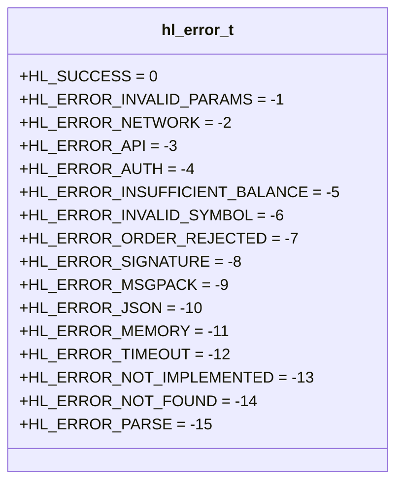
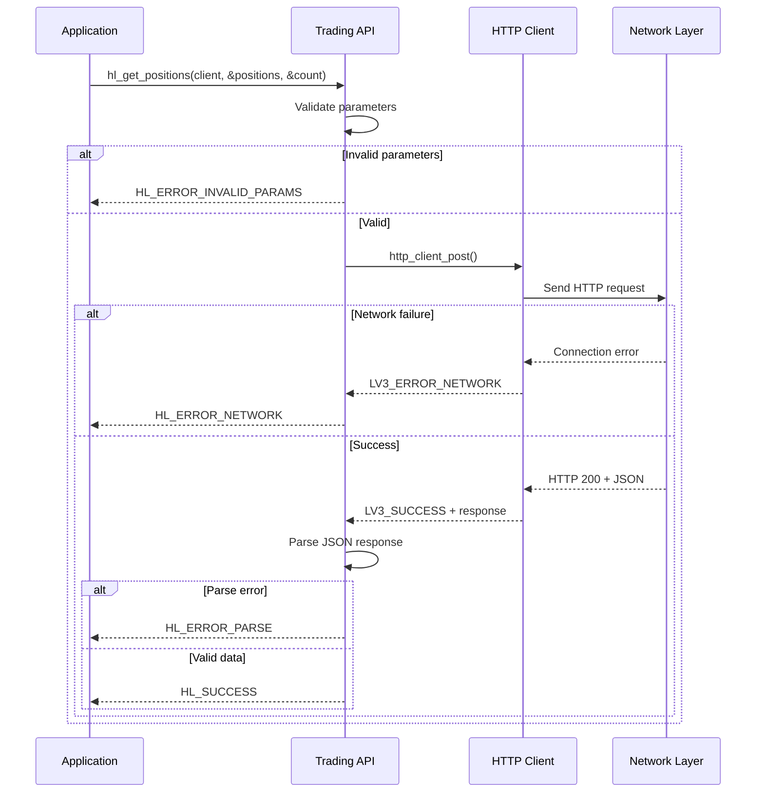
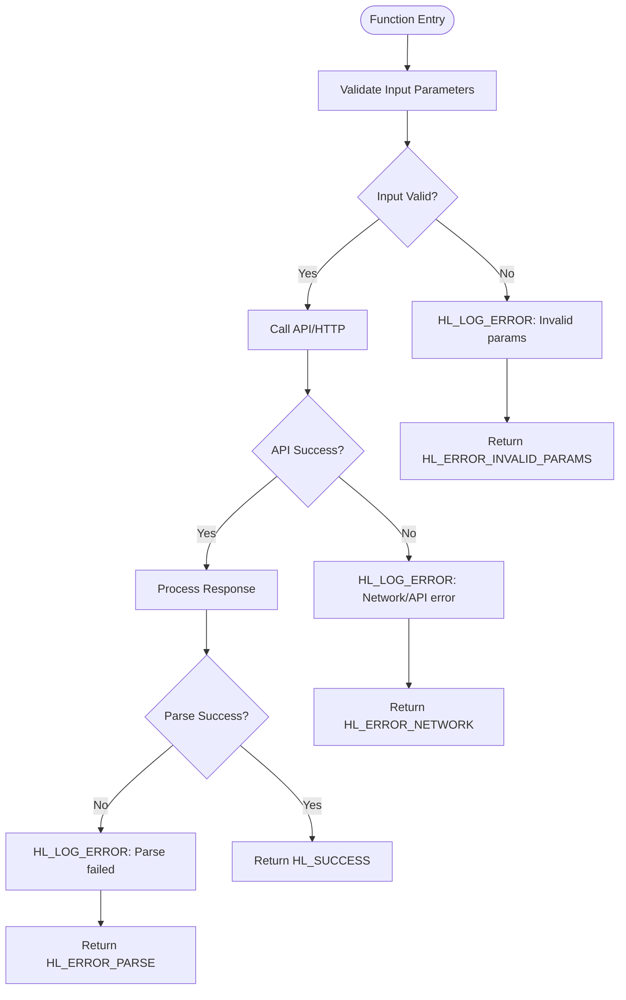

# Error Handling

<cite>
**Referenced Files in This Document**   
- [hl_error.h](file://include/hl_error.h)
- [hl_http.h](file://include/hl_http.h)
- [client.c](file://src/client.c)
- [http/client.c](file://src/http/client.c)
- [account.c](file://src/account.c)
- [hl_logger.h](file://include/hl_logger.h)
</cite>

## Table of Contents
1. [Introduction](#introduction)
2. [Error Code System](#error-code-system)
3. [Error Propagation and Layered Architecture](#error-propagation-and-layered-architecture)
4. [Error Checking Patterns](#error-checking-patterns)
5. [Common Error Scenarios and Recovery](#common-error-scenarios-and-recovery)
6. [Error Message Generation and Retrieval](#error-message-generation-and-retrieval)
7. [Debugging and Logging Practices](#debugging-and-logging-practices)
8. [Thread Safety and Global State](#thread-safety-and-global-state)
9. [Conclusion](#conclusion)

## Introduction
The Hyperliquid C SDK implements a robust, explicit error handling system designed for reliability, clarity, and ease of debugging in financial trading applications. This document details the comprehensive error handling subsystem, focusing on the `hl_error_t` enumeration, error propagation mechanisms, and best practices for handling, logging, and recovering from errors across network, API, validation, and cryptographic layers.

**Section sources**
- [hl_error.h](file://include/hl_error.h#L0-L37)
- [ARCHITECTURE.md](file://ARCHITECTURE.md#L129-L200)

## Error Code System
The SDK uses a centralized error code enumeration `hl_error_t` defined in `hl_error.h` to represent all possible failure states. All error codes are negative integers, with `HL_SUCCESS = 0` indicating successful execution. This design enables straightforward conditional checks and consistent error handling across the API surface.

The error codes cover a comprehensive range of failure categories:
- **Validation and Input Errors**: `HL_ERROR_INVALID_PARAMS`, `HL_ERROR_INVALID_SYMBOL`
- **Network Failures**: `HL_ERROR_NETWORK`, `HL_ERROR_TIMEOUT`
- **API and Server Errors**: `HL_ERROR_API`, `HL_ERROR_AUTH`, `HL_ERROR_ORDER_REJECTED`, `HL_ERROR_INSUFFICIENT_BALANCE`
- **Data Processing Errors**: `HL_ERROR_PARSE`, `HL_ERROR_JSON`, `HL_ERROR_MSGPACK`
- **Cryptographic Failures**: `HL_ERROR_SIGNATURE`
- **System and Resource Errors**: `HL_ERROR_MEMORY`, `HL_ERROR_NOT_FOUND`, `HL_ERROR_NOT_IMPLEMENTED`

This taxonomy allows developers to precisely identify the nature and origin of failures, enabling targeted recovery strategies.



**Diagram sources**
- [hl_error.h](file://include/hl_error.h#L15-L35)

**Section sources**
- [hl_error.h](file://include/hl_error.h#L15-L35)

## Error Propagation and Layered Architecture
Errors propagate through the system from lower-level transport components up to the application layer. The HTTP client in `src/http/client.c` uses its own `lv3_error_t` enum for transport-level issues (e.g., `LV3_ERROR_NETWORK`, `LV3_ERROR_TIMEOUT`), which are then translated into the higher-level `hl_error_t` codes in service modules like `account.c`.

For example, when `hl_get_positions()` is called:
1. The function validates input parameters, returning `HL_ERROR_INVALID_PARAMS` if invalid
2. It invokes the HTTP client to make a network request
3. If the HTTP client fails (e.g., timeout), `LV3_ERROR_NETWORK` is converted to `HL_ERROR_NETWORK`
4. If the API returns an error status, it's mapped to `HL_ERROR_API`
5. If response parsing fails, `HL_ERROR_PARSE` is returned
6. If no positions are found, `HL_ERROR_NOT_FOUND` may be returned

This layered propagation ensures that callers receive semantically meaningful errors regardless of the failure origin.



**Diagram sources**
- [src/http/client.c](file://src/http/client.c#L150-L200)
- [src/account.c](file://src/account.c#L50-L70)

**Section sources**
- [src/http/client.c](file://src/http/client.c#L150-L200)
- [src/account.c](file://src/account.c#L30-L80)

## Error Checking Patterns
All SDK functions return an `hl_error_t` code, requiring explicit error checking after each API call. The recommended pattern is:

```c
hl_error_t err = hl_some_function(args);
if (err != HL_SUCCESS) {
    // Handle error based on specific code
    fprintf(stderr, "Function failed: %d\n", err);
    // Recovery or cleanup logic
}
```

For functions that return data via output parameters, both the return code and the validity of output data should be checked. For example, when retrieving account positions, check the error code before processing the returned array.

The SDK examples (e.g., `examples/simple_positions.c`) demonstrate proper error checking, including handling `HL_ERROR_NOT_FOUND` when no positions exist.

**Section sources**
- [examples/simple_positions.c](file://examples/simple_positions.c#L86)
- [CONTRIBUTING.md](file://CONTRIBUTING.md#L288-L300)

## Common Error Scenarios and Recovery
### Network Timeouts (`HL_ERROR_TIMEOUT`, `HL_ERROR_NETWORK`)
These occur due to connectivity issues or server unresponsiveness. Recovery strategies include:
- Implement exponential backoff before retrying
- Verify network connectivity using `http_client_test_connection()`
- Check if the API endpoint URL is correct

### Invalid Signatures (`HL_ERROR_SIGNATURE`)
Caused by incorrect private key usage or EIP-712 signing failures. Recovery:
- Verify private key format and loading
- Ensure correct chain ID and domain separator
- Validate nonce and timestamp values

### Rate Limiting (`HL_ERROR_API`)
The API may reject requests due to rate limits. Strategies:
- Implement request throttling
- Use exponential backoff with jitter
- Monitor rate limit headers in responses

### Insufficient Balance (`HL_ERROR_INSUFFICIENT_BALANCE`)
Occurs when placing orders exceeding available funds. Prevention:
- Call `hl_get_balance()` before placing orders
- Implement pre-trade validation
- Use conservative position sizing

**Section sources**
- [src/http/client.c](file://src/http/client.c#L150-L200)
- [src/account.c](file://src/account.c#L250-L290)

## Error Message Generation and Retrieval
While the current implementation uses raw error codes, the architecture supports error message generation through functions like `hl_error_string()` (referenced in `ARCHITECTURE.md`). This function would map `hl_error_t` codes to descriptive strings for logging and debugging.

The error subsystem is designed to allow future extension with detailed error context, such as including HTTP status codes or API error messages from server responses, while maintaining the simple integer return code interface.

**Section sources**
- [ARCHITECTURE.md](file://ARCHITECTURE.md#L170-L180)

## Debugging and Logging Practices
The SDK includes a simple logging system in `hl_logger.h` with `HL_LOG_DEBUG`, `HL_LOG_INFO`, `HL_LOG_WARN`, and `HL_LOG_ERROR` macros. These write to standard output streams with appropriate prefixes.

Best practices:
- Use `HL_LOG_DEBUG` for detailed tracing (disabled in release builds)
- Use `HL_LOG_ERROR` for error conditions with error codes
- Avoid logging sensitive data like private keys or signatures
- Include context like function names and parameters in debug logs
- Use `DEBUG` preprocessor flag to control debug logging

The logging system balances visibility for development with security in production environments.



**Diagram sources**
- [include/hl_logger.h](file://include/hl_logger.h#L20-L30)
- [src/account.c](file://src/account.c#L30-L70)

**Section sources**
- [include/hl_logger.h](file://include/hl_logger.h#L20-L30)

## Thread Safety and Global State
All public SDK APIs are thread-safe, using internal mutexes to protect shared resources. The HTTP client initialization uses a static `curl_initialized` flag with appropriate synchronization to ensure `curl_global_init()` is called exactly once.

Error reporting functions that return error codes are stateless and thread-safe. Any global state related to error handling (such as error message buffers) would need to be thread-local or protected by locks, though the current implementation primarily relies on immediate error code return rather than persistent error state.

The design avoids global error state that could create race conditions, instead propagating errors through return values, which is inherently thread-safe.

**Section sources**
- [src/http/client.c](file://src/http/client.c#L50-L60)
- [ARCHITECTURE.md](file://ARCHITECTURE.md#L140-L160)

## Conclusion
The Hyperliquid C SDK's error handling system provides a comprehensive, consistent, and developer-friendly approach to managing failures in a trading environment. By using a well-defined error code taxonomy, propagating errors through layered components, and providing clear patterns for error checking and recovery, the SDK enables robust application development. The combination of explicit error codes, simple logging, and thread-safe design ensures reliability and maintainability for both simple scripts and high-frequency trading systems.