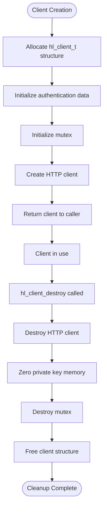
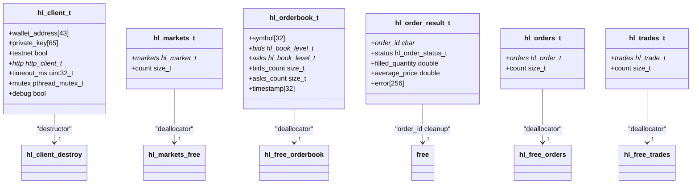

# Memory Management

<cite>
**Referenced Files in This Document**   
- [hl_client.h](file://include/hl_client.h)
- [client.c](file://src/client.c)
- [client_new.c](file://src/client_new.c)
- [hyperliquid.h](file://include/hyperliquid.h)
- [hl_markets.h](file://include/hl_markets.h)
- [hl_orderbook.h](file://include/hl_orderbook.h)
- [hl_ticker.h](file://include/hl_ticker.h)
- [hl_account.h](file://include/hl_account.h)
- [hl_types.h](file://include/hl_types.h)
- [types.c](file://src/types.c)
</cite>

## Table of Contents
1. [Introduction](#introduction)
2. [Core Memory Ownership Model](#core-memory-ownership-model)
3. [Client Lifecycle Management](#client-lifecycle-management)
4. [Data Structure Memory Allocation](#data-structure-memory-allocation)
5. [Function-Specific Memory Behavior](#function-specific-memory-behavior)
6. [Memory Cleanup and Deallocation](#memory-cleanup-and-deallocation)
7. [Common Memory Management Pitfalls](#common-memory-management-pitfalls)
8. [Stack vs Heap Allocation Strategy](#stack-vs-heap-allocation-strategy)
9. [Custom Memory Allocator Integration](#custom-memory-allocator-integration)
10. [Memory Issue Detection and Debugging](#memory-issue-detection-and-debugging)

## Introduction
This document provides comprehensive guidance on memory management responsibilities between the hyperliquid-c library and its users. It details the ownership model for key data structures, clarifies allocation and deallocation responsibilities, and provides best practices for resource management. The hyperliquid-c library follows a clear ownership model where most complex data structures are allocated by the library and must be explicitly freed by the caller using provided deallocation functions. Simple structures use caller-provided buffers with stack allocation, while dynamic collections require heap allocation and explicit cleanup.

**Section sources**
- [hyperliquid.h](file://include/hyperliquid.h#L1-L617)

## Core Memory Ownership Model
The hyperliquid-c library implements a hybrid memory ownership model that combines explicit ownership transfer with caller-provided buffer patterns. The library maintains ownership of internal state and client resources, while transferring ownership of dynamically allocated response data to the caller. For data retrieval functions, the library follows two primary patterns: output parameter filling for fixed-size structures and ownership transfer for dynamically sized collections.

The `hl_client_t` structure represents the primary ownership boundary, with the caller responsible for its lifecycle through `hl_client_create`/`hl_client_destroy`. Internal components like HTTP clients and mutexes are owned by the client and automatically cleaned up. For response data, functions that return variable-length data (markets, orders, trades) allocate memory that becomes the caller's responsibility to free using corresponding free functions.

**Section sources**
- [hl_client.h](file://include/hl_client.h#L1-L189)
- [hyperliquid.h](file://include/hyperliquid.h#L1-L617)

## Client Lifecycle Management
Client lifecycle is managed through explicit creation and destruction functions. The `hl_client_create` function allocates and initializes the `hl_client_t` structure along with its internal components, including HTTP client handles, mutexes, and authentication data. The caller assumes ownership of the returned client pointer and must eventually call `hl_client_destroy` to release all associated resources.

The destruction process follows a specific cleanup sequence: first destroying dependent components (HTTP client), then securely zeroing sensitive data (private key), destroying synchronization primitives (mutex), and finally freeing the client structure itself. This ensures proper resource cleanup and prevents information leakage.

**Diagram sources**
- [client.c](file://src/client.c#L89-L107)
- [client_new.c](file://src/client_new.c#L234-L236)

**Section sources**
- [client.c](file://src/client.c#L0-L197)
- [client_new.c](file://src/client_new.c#L0-L241)

## Data Structure Memory Allocation
The library employs different memory allocation strategies based on data structure characteristics. Fixed-size structures like `hl_ticker_t` and `hl_balance_t` use caller-provided buffers with stack allocation, while variable-length collections like `hl_markets_t` and `hl_orders_t` use heap allocation with ownership transfer.

For stack-allocated structures, the caller declares the structure on the stack and passes its address to retrieval functions, which populate the fields directly. For heap-allocated collections, the library allocates memory for the array and individual elements, returning ownership to the caller. The `hl_order_result_t` structure uses a hybrid approach, with most fields on the stack but the `order_id` field as a dynamically allocated string that must be freed by the caller.

**Section sources**
- [hl_ticker.h](file://include/hl_ticker.h#L0-L101)
- [hl_account.h](file://include/hl_account.h#L0-L215)
- [hl_markets.h](file://include/hl_markets.h#L0-L130)
- [hyperliquid.h](file://include/hyperliquid.h#L120-L126)

## Function-Specific Memory Behavior
Different function categories exhibit distinct memory management patterns based on their purpose and return data characteristics.

### Market Data Functions
Market data retrieval functions like `hl_fetch_markets` and `hl_fetch_ticker` follow different patterns. `hl_fetch_markets` allocates a `hl_markets_t` structure containing a dynamically allocated array of markets, transferring ownership to the caller who must free it with `hl_markets_free`. In contrast, `hl_fetch_ticker` uses a caller-provided buffer pattern where the caller allocates a `hl_ticker_t` structure (typically on the stack) and the function fills its fields.

### Order and Trade Functions
Order execution functions like `hl_create_order` use an output parameter pattern for the result, but with a critical exception: the `order_id` field in `hl_order_result_t` is dynamically allocated and must be freed by the caller. Batch operations like `hl_create_orders` apply this rule to each result in the array. For order and trade collections, functions like `hl_fetch_open_orders` allocate both the container structure and its elements, requiring the caller to free the entire structure with `hl_free_orders`.

### Account Information Functions
Account data functions follow consistent patterns based on data complexity. Simple queries like `hl_fetch_balance` use caller-provided buffers for the main structure, but when returning arrays (like spot balances), they allocate the array and require explicit cleanup with `hl_free_spot_balances`. Position queries follow a similar pattern, with `hl_fetch_positions` allocating an array that must be freed with `hl_free_positions`.

**Section sources**
- [hl_markets.h](file://include/hl_markets.h#L86-L93)
- [hl_ticker.h](file://include/hl_ticker.h#L74-L94)
- [hl_account.h](file://include/hl_account.h#L135-L189)
- [hyperliquid.h](file://include/hyperliquid.h#L120-L126)

## Memory Cleanup and Deallocation
Proper memory cleanup is essential for preventing leaks and ensuring application stability. The library provides specific deallocation functions for each dynamically allocated data type, following a consistent naming convention of `hl_free_*` or `*_free`.

The primary deallocation functions include:
- `hl_client_destroy` - Cleans up client resources
- `hl_markets_free` - Frees markets collection
- `hl_free_orderbook` - Releases order book memory
- `hl_tickers_free` - Cleans up tickers collection
- `hl_free_spot_balances` - Releases spot balances array
- `hl_free_positions` - Frees positions array
- `hl_free_orders` - Cleans up orders collection
- `hl_free_trades` - Releases trades collection

When cleaning up collections, these functions handle both the container structure and its elements, ensuring complete memory release. For individual objects created with `hl_order_new` or `hl_trade_new`, the corresponding `hl_order_free` and `hl_trade_free` functions must be used.

**Diagram sources**
- [client.c](file://src/client.c#L89-L107)
- [markets.c](file://src/markets.c#L416-L422)
- [orderbook.c](file://src/orderbook.c#L220-L235)
- [types.c](file://src/types.c#L70-L90)
- [hyperliquid.h](file://include/hyperliquid.h#L325-L325)

**Section sources**
- [client.c](file://src/client.c#L89-L107)
- [markets.c](file://src/markets.c#L416-L422)
- [orderbook.c](file://src/orderbook.c#L220-L235)
- [types.c](file://src/types.c#L70-L90)

## Common Memory Management Pitfalls
Several common memory management issues can occur when using the hyperliquid-c library, primarily related to incorrect ownership handling and improper cleanup sequences.

### Double-Free Errors
Double-free errors occur when deallocation functions are called multiple times on the same resource. This commonly happens with `hl_client_destroy` when users mistakenly believe they need to clean up internal components separately. The client destruction function handles all internal cleanup, so calling `http_client_destroy` or similar functions on client-owned resources will lead to double-free conditions.

### Use-After-Free Conditions
Use-after-free conditions arise when pointers to deallocated memory are accessed. This frequently occurs with cached data like markets or order books that are freed but still referenced. Users should ensure that all references to a data structure are invalidated after calling its corresponding free function.

### Memory Leaks in Error Paths
Memory leaks in error paths are a significant concern, particularly when multiple allocations occur in sequence. For example, if `hl_fetch_markets` succeeds but subsequent processing fails, users must remember to call `hl_markets_free` even in error conditions. Similarly, when processing order results, each `order_id` string must be freed regardless of the overall operation success.

### Incomplete Cleanup
Incomplete cleanup occurs when only part of a complex structure is freed. For collections like `hl_orders_t`, calling `free` on the container without using `hl_free_orders` will leak the individual order objects. Users must use the provided deallocation functions that handle complete cleanup.

**Section sources**
- [client.c](file://src/client.c#L89-L107)
- [markets.c](file://src/markets.c#L389-L411)
- [orderbook.c](file://src/orderbook.c#L220-L235)
- [types.c](file://src/types.c#L70-L90)

## Stack vs Heap Allocation Strategy
The library employs a strategic combination of stack and heap allocation based on data characteristics and usage patterns.

### Stack Allocation Use Cases
Stack allocation is used for:
- Fixed-size structures with predictable memory requirements
- Temporary data with short lifetimes
- Input parameters and simple output structures
- Performance-critical paths where allocation overhead must be minimized

Examples include `hl_ticker_t`, `hl_balance_t`, and `hl_order_request_t` structures, which are typically declared on the stack and passed by reference to functions.

### Heap Allocation Use Cases
Heap allocation is used for:
- Variable-length collections and arrays
- Data with indeterminate size at compile time
- Objects with lifetimes that extend beyond function scope
- Large data structures that would overflow stack limits

Examples include `hl_markets_t` (markets collection), `hl_orderbook_t` (order book levels), and `hl_orders_t` (orders array), all of which require dynamic memory allocation.

The choice between stack and heap allocation directly impacts the ownership model: stack-allocated structures are owned by the caller throughout their lifetime, while heap-allocated structures involve ownership transfer from the library to the caller.

**Section sources**
- [hl_ticker.h](file://include/hl_ticker.h#L0-L101)
- [hl_markets.h](file://include/hl_markets.h#L0-L130)
- [hl_orderbook.h](file://include/hl_orderbook.h#L0-L95)
- [hl_account.h](file://include/hl_account.h#L0-L215)

## Custom Memory Allocator Integration
While the hyperliquid-c library currently uses standard `malloc` and `free` functions, it can be adapted to work with custom memory allocators through several approaches.

The most straightforward method is to override the standard library functions at link time by providing custom implementations of `malloc`, `free`, `calloc`, and `realloc`. This approach requires no changes to the library code and works transparently with all allocation sites.

For more granular control, wrapper functions can be created that use custom allocators for specific data types. For example, a memory pool could be used for frequently allocated objects like `hl_order_t` and `hl_trade_t` by modifying the `hl_order_new` and `hl_trade_new` functions to use pool allocation instead of `calloc`.

When integrating with custom allocators, it's crucial to maintain consistency: if a custom allocator is used for allocation, the corresponding custom deallocator must be used for cleanup. Mixing standard and custom allocators will lead to undefined behavior and potential crashes.

**Section sources**
- [types.c](file://src/types.c#L12-L38)
- [client.c](file://src/client.c#L89-L107)
- [markets.c](file://src/markets.c#L416-L422)

## Memory Issue Detection and Debugging
Several tools and techniques can be employed to detect and debug memory issues when using the hyperliquid-c library.

### Static Analysis
Static analysis tools like `clang-tidy` and `cppcheck` can identify potential memory management issues in user code, such as missing deallocations, use-after-free conditions, and incorrect function usage patterns.

### Dynamic Analysis
Dynamic analysis tools are particularly effective:
- **AddressSanitizer (ASan)**: Detects use-after-free, double-free, and memory leaks
- **Valgrind**: Identifies memory leaks, invalid memory access, and mismatched allocation/deallocation
- **UndefinedBehaviorSanitizer (UBSan)**: Catches undefined behavior related to memory operations

### Debugging Best Practices
Implement the following best practices:
1. Always pair allocation with deallocation in the same scope when possible
2. Use RAII-like patterns with cleanup functions at function exit points
3. Initialize pointers to NULL after freeing to catch use-after-free errors
4. Check return values of allocation functions for NULL before use
5. Use defensive programming by validating pointers before dereferencing

The library's error handling system, combined with proper memory management, ensures robust operation even in failure conditions.

**Section sources**
- [client.c](file://src/client.c#L89-L107)
- [types.c](file://src/types.c#L12-L38)
- [hyperliquid.h](file://include/hyperliquid.h#L1-L617)